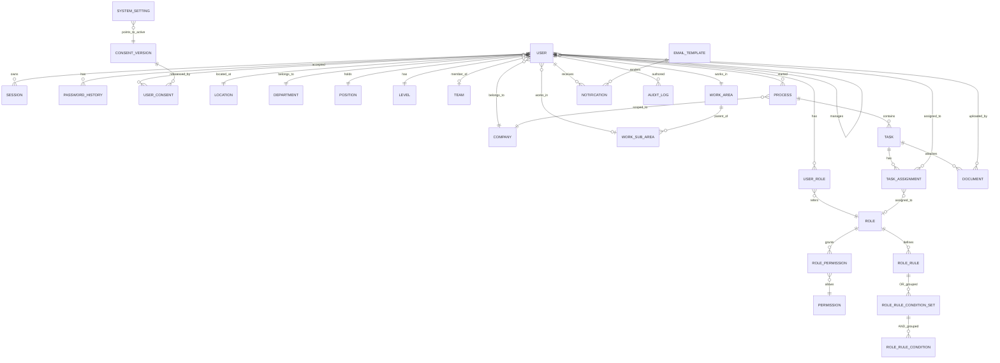
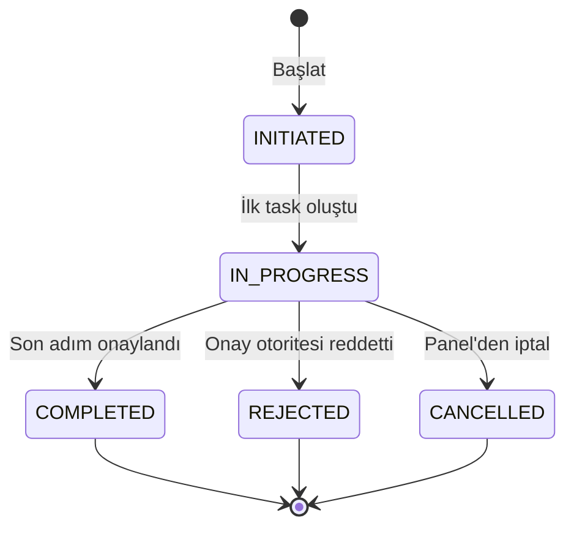
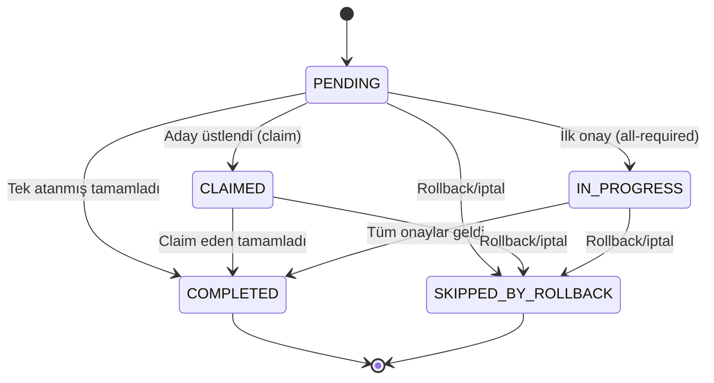
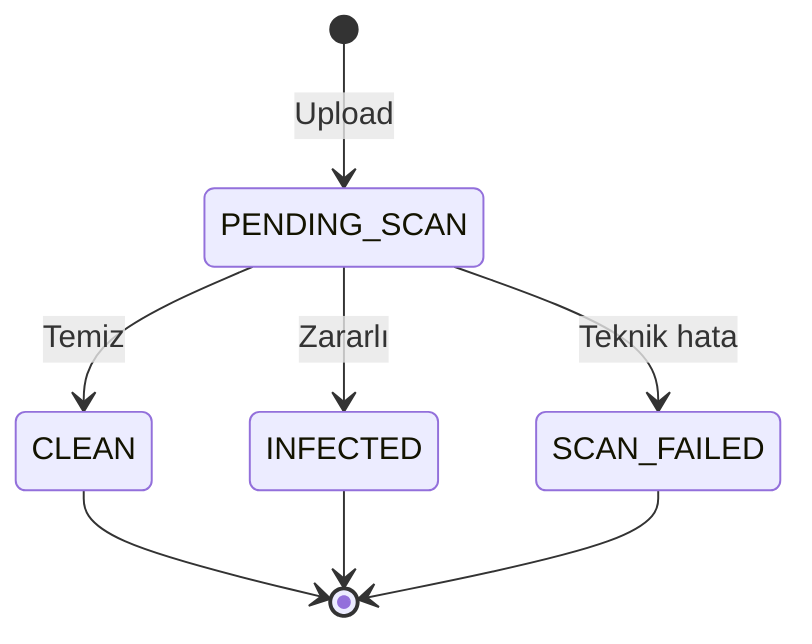
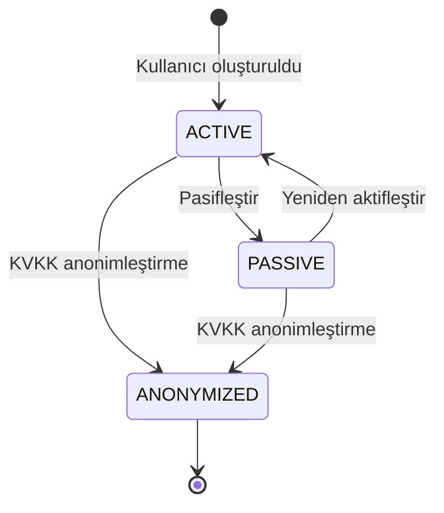
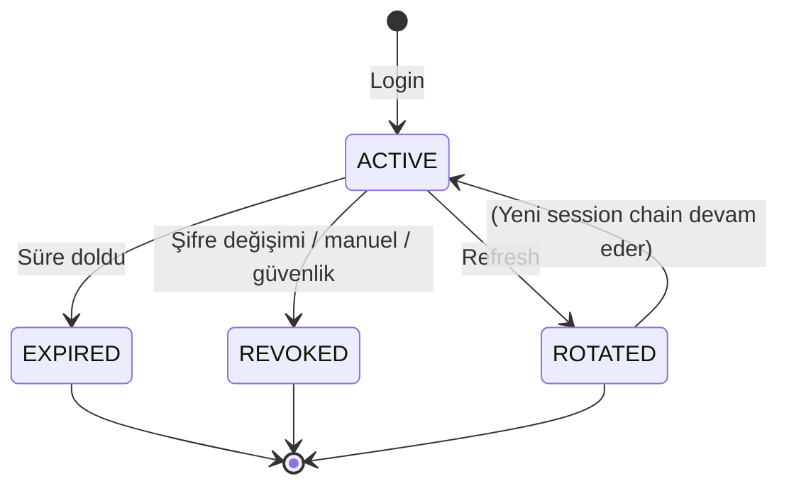
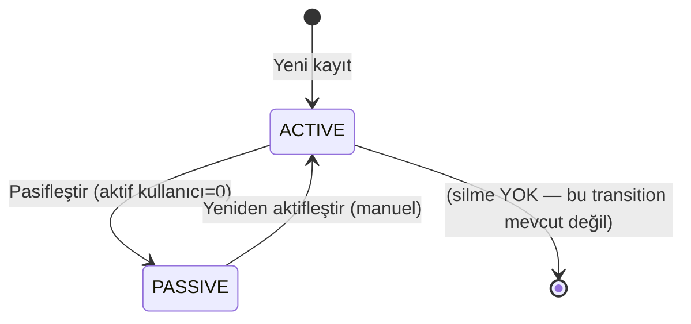
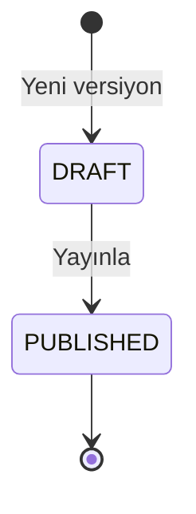

# Lean Management Platformu — Domain Modeli

> Bu doküman platformun iş-diline ait kavram haritasıdır: hangi nesneler var, birbirleriyle nasıl ilişkili, yaşam döngüleri nedir, hangi kurallar her zaman geçerli olmalıdır. Veritabanı şeması veya API'den önce okunur; kodu açmadan önce iş anlaşılmalıdır.

---

## 1. Domain'e Genel Bakış

Lean Management platformunun domain'i beş alt-domain'e gruplanır:

**Identity & Organization.** Kullanıcıları ve onların bağlı olduğu organizasyonel referansları (şirket, lokasyon, pozisyon, kademe, departman, ekip, çalışma alanı) tutar. Kullanıcı attribute'ları kullanıcı üzerinde denormalized tutulmaz — ayrı master data tablolarına foreign key ile bağlanır; bu sayede listelerin tekilliği ve attribute-based yetki kurallarının çalışması garanti edilir.

**Authorization.** Rol-yetki modelini, kullanıcıya rol atamasını (doğrudan veya attribute-based kurallarla) ve runtime yetki çözümlemesini taşır. RBAC ve ABAC birlikte çalışır: yetkiler enum olarak koda sabitlidir, roller DB'de dinamik tutulur, kullanıcıya rol atama iki yolla yapılır (doğrudan atama veya attribute koşul setleriyle otomatik eşleşme).

**Workflow & Task.** Süreç (Process), süreç adımlarından doğan görev (Task), görev atamaları ve süreç tarihçesi. MVP'de yalnızca bir hard-coded süreç vardır — **KTİ (Before & After Kaizen)**. Altyapı birden fazla sürece genişlemeye hazırdır ancak her süreç ayrı bir backend modülü + kendi süreç dokümanı olarak kodlanır.

**Document.** Süreçlerle ilişkili dosyaları, yükleme meta verilerini ve virüs tarama durumlarını tutar. Dosyalar S3'te; meta veri DB'de. Erişim CloudFront üzerinden çok katmanlı koruma ile yapılır ancak bu güvenlik detayı domain'in konusu değildir.

**Observability & Communication.** Denetim kayıtları (append-only, chain hash ile tamper-evident), bildirimler (in-app + email), email şablonları, sistem ayarları ve KVKK rıza yönetimi. Bu alt-domain diğer dört alt-domain'den gelen event'leri dinler; bağımsız yazmaz.

Alt-domain'ler arası temel akış: **Kullanıcı** bir **Rol** üzerinden bir **Yetki** kazanır → yetkili kullanıcı bir **Süreç** başlatır → süreç **Görevler** üretir → görevlerde **Doküman** yüklenir ve form doldurulur → her aksiyon **AuditLog**'a yazılır, ilgili kullanıcılara **Notification** gönderilir.

---

## 2. Ana Entity'ler

### 2.1 User (Kullanıcı)

Platformu kullanan fiziksel kişi. Tek bir şirkete, tek bir lokasyona ve tek bir pozisyona bağlıdır. Kullanıcı ayrı bir organizasyon hiyerarşi tablosu üzerinden değil, doğrudan attribute'ları üzerinden organize olur.

**Sorumluluğu:**

- Kimliğini 8 haneli `sicil` ile taşır; sistem genelinde unique.
- Organizasyonel konumunu (şirket, lokasyon, departman, pozisyon, kademe, ekip, çalışma alanı) foreign key referanslarıyla taşır.
- Yönetici referansını (başka bir User) taşır — attribute-based rol kuralları ve dinamik görev ataması (örn. "başlatanın yöneticisi") bu referansa dayanır.
- Aktif/pasif durumda olabilir; silinmez.

**Ana attribute'lar (iş açısından):**

- `sicil` — 8 haneli numerik, unique, değiştirilemez
- Ad, soyad, email, telefon, işe giriş tarihi
- Yönetici sicili, yönetici ad-soyad, yönetici email (yönetici User referansı üzerinden çözülür)
- Şirket, lokasyon, departman, pozisyon, kademe, ekip, çalışma alanı, çalışma alt alanı (hepsi master data FK)
- Çalışan tipi (beyaz yaka / mavi yaka / stajyer)
- Aktiflik durumu

**İlişkiler:**

- → Company, Location, Department, Position, Level, Team, WorkArea, WorkSubArea (her biri N-1)
- → User (N-1, self-reference): Yönetici
- ← Role (N-N via direct role assignment) ve ← Role (attribute-based kurallarla dolaylı)
- ← Session (1-N): aktif oturumlar (maksimum 3)
- ← Process (1-N): başlatılan süreçler
- ← Task (1-N): atanan görevler (doğrudan veya rol bazlı)
- ← Document (1-N): yüklediği dokümanlar
- ← AuditLog (1-N)
- ← Notification (1-N)
- ← UserConsent (1-N, her rıza versiyonu için bir kayıt)

**Yaşam döngüsü:** `ACTIVE` → `PASSIVE` (reactivate edilebilir) → `ANONYMIZED` (tek yön, KVKK manuel süreç). Detay için [5.5 User lifecycle](#55-user-lifecycle).

**Değişmezler:**

- `sicil` bir kez atandıktan sonra asla değişmez; audit ve referans bütünlüğü buna bağlıdır.
- Kullanıcı kendi attribute'larını değiştiremez (sicil, şirket, lokasyon, pozisyon vb.) — bu ancak Kullanıcı Yöneticisi veya Superadmin tarafından yapılır.
- Bir kullanıcı kendi `manager`'ı olamaz (cycle yasaktır).
- `PASSIVE` kullanıcı login yapamaz, yeni görev atanamaz ve attribute-based rol eşleşmelerinde değerlendirilmez.
- `sicil`, `email`, `phone` ve `manager_email` C4 sınıfı hassas veridir; deterministic encryption ile saklanır (blind index + AES-256-GCM ciphertext) — bu detay `02_DATABASE_SCHEMA`'da açılır; domain açısından yalnız "bu alanlar hassas kabul edilir" kuralı geçerlidir.

### 2.2 Master Data Grubu

Kullanıcı attribute değerlerinin (şirket listesi, lokasyon listesi, vb.) tutulduğu, aynı şablonu paylaşan sekiz entity:

| Entity      | Türkçe Adı        | Kullanıcıdaki karşılığı |
| ----------- | ----------------- | ----------------------- |
| Company     | Şirket            | Şirket                  |
| Location    | Lokasyon          | Lokasyon                |
| Department  | Departman         | Departman               |
| Level       | Kademe            | Kademe                  |
| Position    | Pozisyon          | Pozisyon                |
| Team        | Ekip              | Ekip                    |
| WorkArea    | Çalışma Alanı     | Çalışma Alanı           |
| WorkSubArea | Çalışma Alt Alanı | Çalışma Alt Alanı       |

**Ortak şablon:**

**Sorumluluğu:**

- Kullanıcı attribute'larına tutarlı, tekil, referans edilebilir değer havuzu sağlar.
- "Aynı şirket için farklı yazımlar" (ABC A.Ş. / ABC AŞ / ABC) problemini DB seviyesinde önler.
- Attribute-based rol kurallarının (örn. "Şirket = ABC") stabil ID referansları üzerinden çalışmasını mümkün kılar.

**Ana attribute'lar:**

- `id` (PK, cuid veya uuid)
- `code` — unique, immutable (bir kez atandıktan sonra değiştirilemez — kullanıcılarla bağlı referansları kırmamak için)
- `name` — güncellenebilir (tüm kullanıcı görünümlerinde tek noktadan güncel kalır)
- `is_active` — soft-disable bayrağı; silme yoktur

**İlişkiler:**

- ← User (1-N): kendisine referans veren kullanıcılar

**Yaşam döngüsü:** `ACTIVE` ↔ `PASSIVE`. Silme yoktur. Pasifleştirme kuralı ve cascade davranışı [5.7 Master Data lifecycle](#57-master-data-lifecycle) bölümünde detaylanır.

**Değişmezler:**

- `code` bir kez atandıktan sonra değiştirilemez.
- Aktif kullanıcısı olan (kullanıcı sayısı > 0) master data pasifleştirilemez; önce ilgili kullanıcılar başka bir değere taşınmalıdır.
- Pasif master data yeni kullanıcı ataması için dropdown'larda görünmez ama mevcut kullanıcıların attribute referansı kırılmaz.
- Silme (hard delete) asla yoktur.

**WorkSubArea istisnası:**

- Ek attribute: `parent_work_area_code` (FK → `work_areas.code`).
- Hiyerarşik ilişki: bir WorkArea'nın altında birden fazla WorkSubArea bulunur.
- Cascade soft-disable: parent WorkArea pasifleştirilirse, altındaki aktif WorkSubArea'lar otomatik pasifleştirilir.
- Cascade reactivate **YOK**: parent WorkArea aktifleştirilirse, altındaki pasif WorkSubArea'lar otomatik aktifleşmez — manuel aktifleştirme gerekir. Bu bilinçli bir karardır; pasifleştirmenin yarattığı manuel kontrol noktasını koruyarak istenmeyen reaktivasyonları engeller.

### 2.3 Role (Rol)

Bir veya birden fazla yetkiyi gruplayan ve kullanıcılara atanabilen soyut konumlanma.

**Sorumluluğu:**

- Permission'ların yatay olarak gruplanmasını sağlar (kullanıcıya tek tek yetki atamak yerine rol atanır).
- İki tür vardır: **sistem rolleri** (kod enum'unda sabit, silinemez) ve **dinamik roller** (Rol-Yetki Tablosu ekranından oluşturulur).
- Rol, kullanıcıya iki yolla atanabilir: **doğrudan atama** (User-Role ilişki kaydı) veya **attribute-based kural eşleşmesi** (RoleRule/ConditionSet/Condition zinciri).

**Sistem rolleri (built-in, silinemez):**

- Superadmin — platformun tek süper kullanıcısı; env'den seed edilir.
- Rol ve Yetki Yöneticisi — rol tanımlarını yönetir, rollere yetki atar, kullanıcılara rol atar.
- Kullanıcı Yöneticisi — kullanıcıları CRUD eder, attribute güncellemesi yapar, Master Data yönetir.
- Süreç Yöneticisi — Süreç Yönetimi Paneli'ne erişir; süreç izleme, iptal ve rollback aksiyonlarını yapabilir.

**Ana attribute'lar:**

- `id`, `name`, `code` (sistem rolleri için enum değeri), `description`
- `is_system` (bool) — sistem rolü mü, dinamik mi
- `is_active`

**İlişkiler:**

- ← User (N-N via direct assignment veya RoleRule eşleşmesi)
- ← Permission (N-N)
- ← RoleRule (1-N): bu rolün attribute-based atama kuralları

**Değişmezler:**

- Sistem rolleri silinemez ve `code`'ları değiştirilemez; ancak üyeleri (atanan kullanıcılar) değiştirilebilir.
- Rol ve Yetki Yöneticisi rolüne sahip kullanıcı, kendi rolünü değiştiremez — self-lockout önlemi.
- Bir kullanıcı birden fazla role sahip olabilir; yetkiler **union** ile birleşir.

### 2.4 Permission (Yetki)

Sistemde gerçekleştirilebilecek bir aksiyon veya erişim hakkının kod enum değeri.

**Sorumluluğu:**

- Kod içinde sabit enum olarak tanımlanır; runtime'da eklenip çıkarılmaz.
- Rol-Yetki Tablosu ekranından yeni yetki **eklenemez**; yetki eklemek bir geliştirme işlemidir.
- Rol'e atanabilir (N-N).

**Naming convention:**

- Format: `SCOPE_RESOURCE_ACTION` (UPPER_SNAKE_CASE).
- Örnekler: `USER_CREATE`, `USER_UPDATE_ATTRIBUTE`, `ROLE_ASSIGN`, `PROCESS_KTI_START`, `PROCESS_CANCEL`, `PROCESS_ROLLBACK`, `MASTER_DATA_MANAGE`, `AUDIT_LOG_VIEW`, `SYSTEM_SETTINGS_EDIT`, `DOCUMENT_UPLOAD`.
- Somut tam liste API endpoint katalogundan türetilir; domain açısından burada naming kuralı ve kategori şablonu tanımlıdır.

**Dört kategori (yetki katmanı):**

- **Menu / page** — kullanıcı ekranı görebilir mi (örn. `AUDIT_LOG_VIEW`).
- **Action** — kullanıcı bu işlemi yapabilir mi (örn. `PROCESS_KTI_START`, `PROCESS_CANCEL`).
- **Data** — kullanıcı bu kaydı görebilir mi (genelde attribute bazlı filtreleme; doğrudan permission olarak değil, service layer'da şirket/lokasyon filtresi olarak enforce edilir).
- **Field** — kullanıcı bu alanı görebilir/düzenleyebilir mi (ileri iterasyon; MVP'de aktif kullanım yok).

**İlişkiler:**

- ← Role (N-N)

**Değişmezler:**

- Yetki silinemez — kodda tanımlı enum değeridir.
- Controller'da ilgili yetki kontrolü olmadan endpoint deploy edilemez (ya decorator ya module-level guard ile).

### 2.5 RoleRule + RoleRuleConditionSet + RoleRuleCondition

Bir rolün kullanıcıya attribute-based olarak otomatik atanması için tanımlanan kural ağacı.

**Yapı:**

```
Role
  └── RoleRule (1-N)          — rol başına birden fazla kural tanımlanabilir (sıralı)
        └── ConditionSet (1-N) — koşul setleri birbirine OR ile bağlıdır
              └── Condition (1-N) — bir set içindeki koşullar AND ile bağlıdır
```

**Mantıksal formül:**
`(Condition AND Condition AND ...) OR (Condition AND Condition AND ...) OR ...`

**Sorumluluğu:**

- Yetki çözümleme servisi her kullanıcı için: önce doğrudan atamaları, sonra her rolün kurallarını değerlendirir. Kurallardan bir koşul seti tamamen eşleşirse o rol kullanıcıya kazandırılır.
- Kullanıcı attribute'ı değiştiğinde rol eşleşmesi yeniden hesaplanır; cache invalidate edilir.

**Ana attribute'lar:**

- **RoleRule:** `id`, `role_id`, `order` (değerlendirme sırası)
- **RoleRuleConditionSet:** `id`, `role_rule_id`, `order`
- **RoleRuleCondition:** `id`, `condition_set_id`, `attribute_key` (enum: company_id, location_id, department_id, position_id, level_id, team_id, work_area_id, work_sub_area_id, employee_type), `operator` (equals, not_equals, in, not_in), `value` (string veya JSON array)

**Değişmezler:**

- `attribute_key` yalnızca kullanıcı tablosunda bulunan attribute'lardan biri olabilir (enum kısıtı).
- Koşul setinde en az bir koşul zorunludur (boş koşul seti geçersiz).
- Kural değişikliği toplu kullanıcı yeniden hesaplamayı tetikler (async job) — değişiklik UI'da kaydedildiği anda sonuç değil, yansıma süreli olabilir; bu ekranda kullanıcıya bildirilir.

### 2.6 Session (Oturum)

Kullanıcının access + refresh token çiftiyle tanımlanan aktif bir platform oturumu.

Oturum **email+şifre başarısı** veya **harici IdP OIDC assertion’ı** (geliştirme: Google; production hedef: Red Hat SSO / Keycloak) sonrası oluşturulur; kayıt yapısı ve token modeli her iki yol için aynıdır (`07_SECURITY_IMPLEMENTATION` Bölüm 2.0, ADR 0008).

**Sorumluluğu:**

- Access token (JWT, 15 dk, RS256) kimlik kanıtıdır.
- Refresh token (opaque, 7 gün, rotation'lı) token yenilemenin tek aracıdır.
- Her session bir cihaz/browser'a karşılık gelir; kullanıcı aynı anda birden fazla session'a sahip olabilir ama üst sınır vardır.
- Session bütünlüğü IP hash ve User-Agent fingerprint üzerinden doğrulanır.

**Ana attribute'lar:**

- `id` (JWT `sid` claim'i ile eşleşir)
- `user_id`
- `refresh_token_hash` (SHA-256, plain token hiç saklanmaz)
- `ip_hash` (session başlangıç IP'sinin SHA-256'sı — /24 subnet karşılaştırması için kısmen)
- `user_agent` (truncate 512 char)
- `created_at`, `last_active_at`, `expires_at`
- `revoked_at` (nullable)
- `status` (ACTIVE / EXPIRED / REVOKED / ROTATED — detay [5.6](#56-session-lifecycle))

**İlişkiler:**

- → User (N-1)

**Değişmezler:**

- Aynı refresh token ikinci kez kullanılırsa session chain tümüyle revoke edilir (replay attack tespiti).
- Bir kullanıcı maksimum 3 aktif session'a sahip olabilir; 4. login açıldığında en eski session otomatik REVOKED olur (LRU).
- Superadmin için session süresi maksimum 4 saat; normal kullanıcı için absolute timeout 12 saat.
- Şifre değişikliğinde kullanıcının diğer tüm session'ları REVOKED olur (şifreyi değiştiren session hayatta kalır).

### 2.7 PasswordHistory (Şifre Geçmişi)

Kullanıcının son 5 şifresinin bcrypt hash kaydı.

**Sorumluluğu:**

- Kullanıcının son 5 şifresini tekrar kullanmasını engeller (ring buffer).

**Ana attribute'lar:**

- `id`, `user_id`, `password_hash`, `created_at`

**Değişmezler:**

- Her şifre değişikliğinde yeni bir kayıt eklenir; en eski kayıt otomatik silinir (5 kayıt sabit tutulur).
- Kullanıcı anonimleştirildiğinde tüm history kayıtları silinir.
- Pepper'ın (environment secret) rotasyonu yoktur — history hash'leri bununla bağlıdır.

### 2.8 ConsentVersion + UserConsent (KVKK Rıza Yönetimi)

KVKK açık rıza metninin sürümleri ve her kullanıcının hangi sürümü onayladığının kaydı.

**ConsentVersion sorumluluğu:**

- Rıza metninin zaman içindeki sürümlerini tutar. Metin güncellendiğinde yeni bir versiyon üretilir.
- Geçmiş versiyonlar silinmez; kullanıcının hangi versiyonu hangi tarihte onayladığı her zaman geri çözülebilir olmalıdır.

**ConsentVersion attribute'ları:**

- `id`, `version` (incremental integer), `content` (AES-256-GCM ile şifreli)
- `effective_from`, `published_at`, `created_by_user_id`
- `status` (DRAFT / PUBLISHED — detay [5.8](#58-consentversion-lifecycle))

**UserConsent sorumluluğu:**

- Her kullanıcının hangi versiyonu onayladığını, ne zaman ve hangi IP'den onayladığını saklar.
- Rıza kaydı **tamper-evident**: `signature` alanında `HMAC-SHA256(user_id || consent_version_id || accepted_at, secret_key)` imzası tutulur.

**UserConsent attribute'ları:**

- `id`, `user_id`, `consent_version_id`
- `accepted_at`, `ip_hash` (SHA-256), `user_agent`
- `signature` (HMAC-SHA256 imzası)

**Değişmezler:**

- PUBLISHED bir ConsentVersion silinemez ve düzenlenemez.
- Kullanıcı geçerli en son versiyonu onaylamadan platformun hiçbir sayfasına erişemez.
- İlk login'de veya rıza metni güncellendikten sonraki ilk login'de kullanıcı zorunlu olarak onay verir.

### 2.9 Process (Süreç)

Platformda yürütülen bir iş akışı örneği; süreç tanımına göre üretilmiş, başlatıcıya ve duruma sahip entity.

**Sorumluluğu:**

- Sürecin yaşam döngüsünü tutar (başlatıldı, ilerliyor, tamamlandı, reddedildi, iptal).
- Başlatıcı kullanıcıyı, şirket bağlamını ve süreç tipini referans eder.
- Sürecin adımlarını (Task) sahiplenir; task tarihçesi süreç altında toplanır.
- Süreç tipi MVP'de tek değer: `BEFORE_AFTER_KAIZEN` (KTİ).

**Ana attribute'lar:**

- `id` (uygulama-genelinde incremental global processId; kullanıcıya numarayla gösterilir)
- `process_type` (enum — MVP'de tek değer)
- `started_by_user_id`
- `company_id` (default: başlatanın şirketi; form içinde override edilebilir)
- `status` (INITIATED / IN_PROGRESS / COMPLETED / REJECTED / CANCELLED — detay [5.1](#51-process-state-machine-jenerik))
- `started_at`, `completed_at`, `cancelled_at`
- `cancel_reason`, `rollback_history` (metadata)

**İlişkiler:**

- → User (N-1, started_by)
- → Company (N-1)
- ← Task (1-N)
- ← Document (1-N, Task üzerinden)
- ← AuditLog (1-N)

**Değişmezler:**

- Süreç silinemez — yalnız iptal edilebilir (soft, status değişikliği). Audit ve veri bütünlüğü için saklanır.
- Süreç başlatan kullanıcı kendi başlattığı sürecin her adımını (kendisine atanmamış olsa bile) görüntüleyebilir; bu görünürlük süreç-özel `.md` dosyasında aksi belirtilmediği sürece varsayılandır.
- Süreç başkası tarafından başlatılmış ve kullanıcının o süreçte atanmış bir task'ı yoksa, kullanıcı o süreci göremez.
- İptal edilen süreç, kullanıcıların "Başlattığım Süreçler" ve "Onayda Bekleyen" listelerinden düşer; sadece Süreç Yönetimi Paneli'nde görünür kalır. İptal gerekçesi kullanıcılara gösterilmez — yalnız panel ve audit'te görünür.

### 2.10 Task (Görev)

Sürecin tek bir adımı; bir veya birden fazla kullanıcıya atanmış, tamamlanması beklenen aksiyon.

**Sorumluluğu:**

- Süreç tanımındaki adımın runtime karşılığıdır.
- Atama modunu (claim veya all-required) taşır.
- SLA başlangıç-bitiş saatini ve eşik tetikleyicilerini tutar.
- Task'ı tamamlayan kullanıcının aksiyonunu (`completion_action`) ve gerekçesini saklar — bu alan süreç akışını belirler (özellikle KTİ'de yöneticinin Onay/Red/Revize seçimi).

**Ana attribute'lar:**

- `id`, `process_id`, `step_key` (süreç tanımındaki adım key'i — örn. `KTI_MANAGER_APPROVAL`)
- `step_order` (sürecin kaçıncı adımı)
- `assignment_mode` (SINGLE / CLAIM / ALL_REQUIRED)
- `status` (PENDING / CLAIMED / IN_PROGRESS / COMPLETED / SKIPPED_BY_PEER / SKIPPED_BY_ROLLBACK — detay [5.3](#53-task-state-machine-jenerik))
- `completion_action` (nullable enum — süreç-özel; KTİ'de APPROVE / REJECT / REQUEST_REVISION)
- `completion_reason` (nullable; Red veya Revize için zorunlu)
- `form_data` (JSONB — süreç-özel form içeriği)
- `sla_due_at`, `sla_warning_sent_at`, `sla_breach_sent_at`
- `completed_by_user_id`, `completed_at`

**İlişkiler:**

- → Process (N-1)
- ← TaskAssignment (1-N): atama kayıtları (claim/all-required durumlarında çoklu)
- ← Document (1-N): bu task'ta yüklenen dokümanlar

**Değişmezler:**

- Tamamlanmış bir task (`COMPLETED`) silinemez, düzenlenemez.
- `completion_action` enum değeri süreç tanımının sabitlediği değerler dışında alamaz; her süreç kendi action enum'unu tanımlar (jenerik bir "reddet" davranışı yoktur).
- Claim tipinde bir task'ın tamamlanması diğer adayların aynı task'ını `SKIPPED_BY_PEER` yapar; onların listesinden düşer.
- All-required tipinde tüm atanmış kullanıcılar tamamlamadan task `COMPLETED` olmaz.

### 2.11 TaskAssignment (Görev Ataması)

Bir task'ın bir kullanıcıya (veya role) atanmış olduğu gerçeğini temsil eden ilişki kaydı.

**Sorumluluğu:**

- Claim veya all-required modunda aynı task'a birden fazla atama kaydı olabilir.
- Her atamanın kendi tamamlanma durumu vardır (all-required için önemli).

**Ana attribute'lar:**

- `id`, `task_id`, `user_id` (nullable — rol ataması için null olabilir), `role_id` (nullable)
- `status` (PENDING / COMPLETED / SKIPPED)
- `completed_at`
- `resolved_by_rule` (bool — dinamik atama mı, statik mi — örn. "başlatanın yöneticisi" dinamik)

**İlişkiler:**

- → Task (N-1)
- → User (N-1, nullable)
- → Role (N-1, nullable)

**Değişmezler:**

- Dinamik atama (örn. "başlatanın yöneticisi") task oluşturulduğunda resolve edilir ve user_id set edilir; sonradan değişmez (bu gözlem tutarlılığı için önemlidir — yönetici değişse bile aktif task atanan kişidedir).

### 2.12 Document (Doküman)

Süreç/task bağlamında yüklenmiş bir dosya.

**Sorumluluğu:**

- S3'teki fiziksel dosyanın meta kaydını tutar; içeriği DB'de değil S3'te saklanır.
- Virüs tarama sonucu alınana kadar kullanıcıya sunulmaz (scan_status state machine).
- Süreç-seviyesi erişim kontrolü ile korunur — süreci görüntüleme yetkisi olan kullanıcı dokümanları da görebilir.

**Ana attribute'lar:**

- `id`, `process_id`, `task_id`, `uploaded_by_user_id`
- `s3_key` (format: `processes/{processId}/{taskId}/{documentId}-{filename}` — tarama temiz sonrası)
- `filename`, `file_size`, `content_type`
- `scan_status` (PENDING_SCAN / CLEAN / INFECTED / SCAN_FAILED — detay [5.4](#54-document-scan-state-machine))
- `thumbnail_s3_key` (nullable; sadece görseller için)
- `uploaded_at`

**İlişkiler:**

- → Process (N-1)
- → Task (N-1)
- → User (N-1, uploaded_by)

**Değişmezler:**

- `scan_status` yalnız `CLEAN` olduğunda kullanıcıya download/preview için CloudFront Signed URL üretilir.
- Doküman versiyonlama yoktur — aynı dosya tekrar yüklenirse ayrı bir Document olarak kaydedilir.
- Doküman silme MVP'de yoktur; süreç iptali veya retention job'u dışında silinmez.
- Maksimum dosya boyutu 10 MB; izin verilen formatlar: görsel (jpg/png/webp), PDF, Word (.docx), Excel (.xlsx). Eski formatlar (.doc, .xls, .ppt) desteklenmez.

### 2.13 Notification (Bildirim)

Bir kullanıcıya bir kanal üzerinden gönderilmiş/gönderilecek bir bildirim.

**Sorumluluğu:**

- Her event (görev atandı, SLA yaklaştı, süreç tamamlandı vb.) için ilgili kullanıcıya kanal başına bir kayıt tutulur.
- In-app ve email aynı event için iki ayrı kayıt olarak oluşturulur; birisi başarısız olursa diğerini etkilemez.

**Ana attribute'lar:**

- `id`, `user_id`
- `event_type` (enum — `TASK_ASSIGNED`, `SLA_WARNING`, `SLA_BREACH`, `PROCESS_COMPLETED`, `PROCESS_CANCELLED`, vb.)
- `channel` (IN_APP / EMAIL)
- `title`, `body`, `link_url`, `metadata` (JSONB)
- `read_at` (nullable; in-app için), `sent_at`
- `delivery_status` (PENDING / SENT / FAILED / BOUNCED)

**İlişkiler:**

- → User (N-1)

**İlişkili kavram — `notification_preferences`:** Kullanıcı başına `event_type` × kanal (`in_app` / `email` / `digest`) tercihleri; satır yoksa servis katmanında varsayılan (in-app ve e-posta açık, digest kapalı) uygulanır. Üretim öncesi `NotificationsService` tercihleri okur.

**Değişmezler:**

- In-app bildirimler 90 gün sonra otomatik silinir; email delivery kayıtları 2 yıl saklanır.
- Bildirim başarısız olursa BullMQ retry policy (3 deneme, exponential backoff) devreye girer; son başarısızlıkta DLQ'ya düşer.

### 2.14 EmailTemplate (Email Şablonu)

Sistem Ayarları ekranından Superadmin tarafından düzenlenebilen, event tipi başına HTML + text şablon.

**Sorumluluğu:**

- Her `event_type` için subject + HTML body + text fallback'ını saklar.
- Dinamik değişkenleri `{{variable}}` syntax'ıyla barındırır (örn. `{{processId}}`, `{{taskName}}`, `{{userName}}`).

**Ana attribute'lar:**

- `id`, `event_type` (unique)
- `subject_template`, `html_body_template`, `text_body_template`
- `required_variables` (JSONB array — kaydedilirken validate edilir)
- `updated_by_user_id`, `updated_at`

**Değişmezler:**

- Versiyonlama MVP'de yoktur — her düzenleme üzerine yazar (önceki versiyon kaybolur; tarihçe audit log'dan okunur).
- Şablon güncellemesi `UPDATE_EMAIL_TEMPLATE` audit aksiyonu üretir (`entity`=`email_template`).
- `required_variables` listesindeki her değişkenin template içinde kullanıldığı kayıt sırasında doğrulanır; eksik değişkenle kayıt reddedilir.

### 2.15 SystemSetting (Sistem Ayarı)

Runtime'da değiştirilebilen platform parametreleri.

**Sorumluluğu:**

- KVKK rıza metni, rate limit parametreleri, password expiry süresi gibi runtime değerleri tutar.
- Değişiklik audit log'a yazılır; bir sonraki ilgili operasyonda yeni değer aktif olur.

**Ana attribute'lar:**

- `key` (PK, enum — `LOGIN_ATTEMPT_THRESHOLD`, `LOCKOUT_DURATION_MINUTES`, `PASSWORD_EXPIRY_DAYS`, `ACTIVE_CONSENT_VERSION_ID`, vb.)
- `value` (JSONB — tip key'e göre enum'da tanımlı)
- `updated_by_user_id`, `updated_at`

**Değişmezler:**

- Sadece Superadmin okuyup/yazabilir.
- Her değişiklik audit'e yazılır.

### 2.16 AuditLog (Denetim Kaydı)

Sistemde gerçekleşen her admin ve kullanıcı aksiyonunun append-only kaydı.

**Sorumluluğu:**

- Tüm aksiyonların izlenebilir, inkâr edilemez kaydını tutar.
- Chain hash ile tamper-evidence sağlar; silinen veya değiştirilen kayıtlar gecelik bütünlük kontrol job'uyla tespit edilir.
- PII içeren alanlar (old_value, new_value) AES-256-GCM ile şifrelenir.

**Ana attribute'lar:**

- `id`, `user_id` (nullable — sistem aksiyonları için null)
- `timestamp`, `action` (enum), `entity` (enum), `entity_id`
- `old_value`, `new_value` (JSONB, PII içerirse şifreli)
- `metadata` (JSONB), `ip_hash` (SHA-256), `user_agent`
- `session_id`
- `chain_hash` (SHA-256: `prev_hash || current_row_json`)

**Değişmezler:**

- UPDATE ve DELETE yasaktır — DB trigger'ı ile exception fırlatılır.
- Retention job (1 yıl) hariç hiç kimse silme yetkisine sahip değildir.
- Superadmin dahil tüm kullanıcıların aksiyonları yazılır; muaf yoktur.
- Gecelik chain integrity job doğrulanan zincir başarısız olursa Superadmin ve güvenlik ekibine P1 alarm gider.

---

## 3. Entity İlişki Diyagramı



---

## 4. İş Kuralları (Domain Invariantları)

Bu kurallar platform boyunca her zaman geçerlidir. Her kuralın **enforce noktası** agent'a kuralı nerede zorlaması gerektiğini söyler.

### 4.1 Kullanıcı kuralları

1. **Sicil değişmezdir.** Bir kullanıcıya atanmış 8 haneli sicil, o kullanıcı var olduğu sürece değiştirilemez. _Enforce: service layer (update DTO'dan çıkarılır) + DB unique constraint._
2. **Kullanıcı kendi attribute'larını değiştiremez.** Sicil, şirket, lokasyon, pozisyon vb. tüm organizasyonel attribute'lar yalnız Kullanıcı Yöneticisi veya Superadmin tarafından değiştirilir. _Enforce: service layer + permission guard._
3. **Kendini yönetici olarak atama yasağı (self-reference cycle).** Bir kullanıcı kendi `manager_user_id`'si olamaz; dolaylı cycle'lar da (A→B→A) oluşturulamaz. _Enforce: service layer (update sırasında cycle check)._
4. **Pasif kullanıcı hareket edemez.** `PASSIVE` durumundaki kullanıcı login yapamaz, yeni görev atanamaz, attribute-based rol eşleşmelerinde değerlendirilmez. _Enforce: authentication layer + rol çözümleme servisi._

### 4.2 Master data kuralları

5. **Aktif kullanıcısı olan master data pasifleştirilemez.** Pasifleştirme girişimi UI'da bloklanır ve "kullanıcıları taşı" linkine yönlendirir. _Enforce: service layer + DB aggregate count kontrolü._
6. **Master data `code` değişmezdir.** Bir kez atanan kod referans bütünlüğünü kırmamak için hiçbir koşulda değiştirilemez. _Enforce: service layer (update DTO'dan çıkarılır) + DB unique constraint._
7. **Parent pasifleştirme → child cascade pasifleştirme.** Bir WorkArea pasifleştirilirse altındaki aktif WorkSubArea'lar otomatik pasifleştirilir. _Enforce: service layer (transactional cascade)._
8. **Parent aktivasyon → child cascade aktivasyon YOK.** WorkArea yeniden aktifleştirildiğinde altındaki pasif WorkSubArea'lar otomatik aktifleşmez; manuel aktivasyon gerekir. _Enforce: service layer (bilinçli cascade-off)._
9. **Master data silme yoktur.** Orphan (kullanıcısı olmayan) master data dahil hiçbir master data silinemez. _Enforce: hiçbir delete endpoint'i bulunmaz; pasifleştirme tek yol._

### 4.3 Yetki kuralları

10. **Yetki hiçbir endpoint'te atlanamaz.** Her controller method'u ya decorator (`@RequirePermission`) ya module-level guard ile yetki kontrolünden geçer. _Enforce: global guard + CI lint kuralı (controller yetki kontrolü olmadan merge edilemez)._
11. **Yetkiler union ile birleşir.** Bir kullanıcıya birden fazla rol atanmışsa, tüm rollerin yetkilerinin birleşimi kullanıcının sahip olduğu yetki kümesidir. _Enforce: yetki çözümleme servisi._
12. **Rol ve Yetki Yöneticisi kendi rolünü değiştiremez.** Self-lockout riskini önler; Superadmin her zaman kurtarıcı kalır. _Enforce: service layer (role assignment update'te kendi hedef değilse check)._
13. **Attribute değişimi → yetki cache invalidate.** Bir kullanıcının attribute'u değişirse yetki cache'i invalidate edilir; sonraki request'te yeni yetki seti yeniden hesaplanır. _Enforce: service layer + event listener._

### 4.4 Süreç ve görev kuralları

14. **Süreç silme yoktur.** Süreç yalnızca iptal edilebilir (`CANCELLED`); veri korunur, audit bütünlüğü kalır. _Enforce: hiçbir delete endpoint'i bulunmaz._
15. **Süreç başlatmamış kullanıcı başkasının sürecini göremez.** Görevi atanmamış veya süreç başlatmamış kullanıcı, diğer kullanıcıların süreçlerinin detayına erişemez. _Enforce: service layer filtering (ownership check)._
16. **Süreç başlatan kendi sürecinin her adımını görür.** Başlatan kullanıcı, süreç `.md` dosyasında aksi belirtilmedikçe, kendi başlattığı sürecin her task'ındaki form ve dokümanları (kendisine atanmamış olsa bile) görüntüleyebilir. _Enforce: service layer (process.started_by == currentUser ise bypass)._
17. **Claim → diğer adaylar düşer.** Claim tipi task bir kullanıcı tarafından tamamlandığında, aynı task'a aday diğer kullanıcıların atama kayıtları `SKIPPED_BY_PEER` olur ve "Onayda Bekleyen" listelerinden kaybolur. _Enforce: service layer (claim completion handler) + transactional update._
18. **All-required → hepsi tamamlanmadan süreç ilerlemez.** All-required tipi task'ta her atanmış kullanıcı kendi onayını/aksiyonunu vermeden task `COMPLETED` olmaz, süreç bir sonraki adıma geçmez. _Enforce: service layer (completion handler count check)._
19. **Jenerik red davranışı yoktur.** Her süreç kendi reddetme ve revize akışını kendi süreç tanımında (`docs/processes/{süreç}.md`) belirler; sistem seviyesinde "tüm süreçler için red = iptal" gibi jenerik davranış yoktur. _Enforce: her süreç kendi completion_action enum'unu ve handler'ını yazar._

### 4.5 Doküman kuralları

20. **Scan_status CLEAN olmadan download/preview yok.** Kullanıcıya CloudFront Signed URL ancak dosya `CLEAN` olarak işaretlendiğinde üretilir. _Enforce: URL üretim servisi._
21. **Doküman versiyonlama yoktur.** Aynı dosya yeniden yüklenirse ayrı bir Document olarak kaydedilir; aynı `s3_key` altında üzerine yazma olmaz. _Enforce: service layer (her upload yeni documentId üretir)._

### 4.6 Güvenlik ve denetim kuralları

22. **Audit log append-only.** `audit_logs` tablosunda UPDATE ve DELETE DB trigger'ı ile exception fırlatır; retention job dışında hiçbir kod yolu silme yapamaz. _Enforce: PostgreSQL trigger + IAM policy._
23. **Refresh token tek kullanımlık.** Aynı refresh token ikinci kez kullanılırsa session chain tümüyle revoke edilir. _Enforce: session service (refresh endpoint)._
24. **Rıza onayı olmadan erişim yok.** Geçerli en son ConsentVersion'ı onaylamamış kullanıcı login olsa bile hiçbir sayfaya erişemez — zorunlu rıza onay ekranına yönlendirilir. _Enforce: frontend guard + backend middleware (API tarafı)._

---

## 5. Durum Makineleri

Bu bölüm state machine'i olan her entity için: (1) state listesi ve her state'in anlamı + backend etkisi + süreç/data etkisi + UI etkisi + amacı, (2) transition tablosu, (3) Mermaid diagram.

### 5.1 Process state machine (jenerik)

Tüm süreçler için geçerli jenerik durum modelidir. Süreç-özel aksiyonlar (KTİ için Onay/Red/Revize) Task seviyesinde tutulur; Process state'i bunlardan türetilir.

#### State'ler

**`INITIATED`** — Süreç başlatıldı, ilk task(lar) henüz oluşturulmadı veya atanmadı.

- **Backend etkisi:** Process record insert edildi; başlatma event'i emit edildi; sıradaki adıma transition edilmek üzere. Bu state çok kısa ömürlüdür (milisaniye-saniye mertebesi).
- **Süreç/Data etkisi:** `status = INITIATED`, `started_at = now`, ilk task henüz yok veya oluşturulmak üzere.
- **UI etkisi:** Kullanıcı süreç başlatma formunu submit etti, loading spinner görüyor; transition tamamlanınca `IN_PROGRESS`'e geçer.
- **Amaç:** Süreç kaydının yaratılması ile ilk task'ın atanması arasındaki atomik olmayan sürecin görünürlüğü. Transaction rollback gerekirse bu state'te temiz bir noktaya dönüş mümkündür.

**`IN_PROGRESS`** — Süreç aktif olarak ilerliyor; en az bir task `PENDING`, `CLAIMED` veya `IN_PROGRESS` durumunda.

- **Backend etkisi:** Task completion handler'ları bu state'te çalışır. SLA monitor job'u aktif task'ları tarar. Bildirim worker'ları bu sürece bağlı event'leri dinler.
- **Süreç/Data etkisi:** Sürecin tüm task tarihçesi erişilebilir; aktif task değişebilir (bir adım bitince sonraki aktifleşir).
- **UI etkisi:** Süreci başlatan kullanıcı "Başlattığım Süreçler"de süreci görür; aktif task'a atanmış kullanıcılar "Onayda Bekleyen"de görür. Kullanıcıya gösterilen etiket aktif task'ın adından türetilir — örn. KTİ'de aktif task "Yönetici Onay" ise kullanıcı ekranda **"Yönetici Onayında"** etiketini görür. Bu etiket dönüşümü tamamen UI katmanındadır; domain state'i `IN_PROGRESS` olarak kalır.
- **Amaç:** Aktif operasyonel durumu tek bir state altında toplamak; UI'daki zengin etiket ihtiyacını state sayısını şişirmeden karşılamak.

**`COMPLETED`** — Süreç başarılı olarak sonlandı; tüm task'lar tamamlandı, nihai onay alındı.

- **Backend etkisi:** Süreç read-only olur; yeni task oluşturulmaz, mevcut task'lar düzenlenmez. `PROCESS_COMPLETED` bildirim event'i başlatıcıya gönderilir.
- **Süreç/Data etkisi:** `completed_at = now`, `status = COMPLETED`. İlgili task'lar zaten `COMPLETED`.
- **UI etkisi:** Süreç başlatıcının "Tamamlanan Süreçler" sekmesine taşınır; başka kullanıcıların "Onayda Bekleyen" listelerinden düşer (varsa). Etiket: **"Tamamlandı"**.
- **Amaç:** Başarılı son; retention ve arşiv kuralları bu state'ten tetiklenir.

**`REJECTED`** — Süreç onay sürecinde reddedildi ve kapandı. Onay otoritesinin (örn. KTİ'de yönetici) kesin red aksiyonuyla ulaşılır.

- **Backend etkisi:** Süreç read-only. `PROCESS_REJECTED` bildirim event'i başlatıcıya gönderilir. Red gerekçesi ilgili Task kaydında (`completion_reason`) saklı.
- **Süreç/Data etkisi:** `status = REJECTED`, `completed_at = now` (end-of-life tarihi). Reddeden task `COMPLETED` ve `completion_action = REJECT`.
- **UI etkisi:** Başlatıcı ekranında "Tamamlanan Süreçler" sekmesinde **"Reddedildi"** etiketiyle görünür. Detay ekranında red gerekçesi (task'ın `completion_reason` alanı) başlatıcıya gösterilir — iptal aksiyonunun aksine, red gerekçesi başlatıcıya şeffaftır, çünkü aksiyon süreç akışının doğal parçasıdır.
- **Amaç:** Süreç akışının normal (yönetici tarafından gerekçeli) sonlanışı ile idari iptal (Süreç Yönetimi Paneli'nden cancel) arasındaki domain ayrımını tutmak. `REJECTED` = iş akışı içindeki red; `CANCELLED` = iş akışı dışından idari müdahale.

**`CANCELLED`** — Süreç Süreç Yönetimi Paneli'nden (Superadmin / Süreç Yöneticisi) idari olarak iptal edildi.

- **Backend etkisi:** Aktif task'ların tümü `SKIPPED_BY_ROLLBACK` yapılır (mekanik olarak görev artık alınamaz). `PROCESS_CANCELLED` bildirim event'i başlatıcı + aktif task sahiplerine gönderilir.
- **Süreç/Data etkisi:** `status = CANCELLED`, `cancelled_at = now`, `cancel_reason` alanı doldurulmuş (gerekçe zorunlu).
- **UI etkisi:** Süreç başlatıcının "Başlattığım Süreçler" listesinden **düşer** (görünmez); Onayda Bekleyen'den aktif sahiplerin de düşer. Kullanıcıya iptal gerekçesi gösterilmez; yalnız Süreç Yönetimi Paneli ve audit log'ta görünür. Panel'de süreç "İptal" etiketiyle erişilebilir kalır.
- **Amaç:** Süreç verisini koruyarak (audit + retention) süreci operasyonel akıştan çıkarmak. Kullanıcıya bilinçli olarak iptal gerekçesini gizlemek — idari kararın iç detayları kullanıcıyla paylaşılmaz.

#### Transition tablosu

| From        | To          | Trigger                                                                          | Koşul                                              |
| ----------- | ----------- | -------------------------------------------------------------------------------- | -------------------------------------------------- |
| (yok)       | INITIATED   | Kullanıcı "Süreç Başlat" butonuna tıkladı, form submit etti                      | Kullanıcının ilgili `PROCESS_*_START` yetkisi var  |
| INITIATED   | IN_PROGRESS | İlk task başarıyla oluşturuldu ve atandı                                         | Task create transaction'ı commit oldu              |
| INITIATED   | (rollback)  | Task oluşturulurken hata                                                         | Transaction rollback; Process kaydı da geri alınır |
| IN_PROGRESS | COMPLETED   | Son task `COMPLETED` olup `completion_action` süreci tamamlıyor (KTİ'de APPROVE) | Süreç tanımındaki son adım                         |
| IN_PROGRESS | REJECTED    | Onay otoritesinin kesin red aksiyonu (KTİ'de yönetici `REJECT`)                  | Süreç tanımı red aksiyonuna izin veriyor           |
| IN_PROGRESS | CANCELLED   | Superadmin veya Süreç Yöneticisi panel'den iptal aksiyonu aldı                   | `PROCESS_CANCEL` yetkisi + gerekçe girildi         |
| COMPLETED   | —           | Final state                                                                      | —                                                  |
| REJECTED    | —           | Final state                                                                      | —                                                  |
| CANCELLED   | —           | Final state                                                                      | —                                                  |

#### Diagram



### 5.2 KTİ Süreci Task Akışı

KTİ (Before & After Kaizen) sürecinin task akışı, Process state machine'ini nasıl örneklediğini gösterir. Bu bir state diyagramı değil **task-transition diyagramıdır** — her node bir task, her kenar bir task completion aksiyonudur.

**Süreç özeti:**

- **Adım 1 — Başlatma Task'ı (başlatana):** KTİ sürecini başlatma yetkisi olan kullanıcı formu doldurur (before fotoğrafları, after fotoğrafları, kazanç tutarı, açıklama). Submit ile task `COMPLETED` olur.
- **Adım 2 — Yönetici Onay Task'ı (başlatanın yöneticisine):** Dinamik atama — başlatanın `manager_user_id` attribute'uyla resolve edilir. SLA: 72 saat. Yönetici üç aksiyondan birini alır: `APPROVE`, `REJECT`, `REQUEST_REVISION`.
- **Adım 3 (yalnız REQUEST_REVISION durumunda) — Revize Task'ı (başlatana):** Başlatan revize notunu okur, formu günceller, yeniden submit eder. Submit sonrası Adım 2 yeniden açılır (yöneticiye tekrar düşer).

**Task completion aksiyonlarının süreç state'ine etkisi:**

| Adım                                          | Completion Action                        | Sonuç                                                                              |
| --------------------------------------------- | ---------------------------------------- | ---------------------------------------------------------------------------------- |
| Adım 1 submit                                 | (implicit: FORM_SUBMITTED)               | Adım 2 açılır, Process `IN_PROGRESS`                                               |
| Adım 2 — `APPROVE`                            | Task COMPLETED                           | Process → `COMPLETED`                                                              |
| Adım 2 — `REJECT` (gerekçe zorunlu)           | Task COMPLETED, `completion_reason` dolu | Process → `REJECTED`; başlatıcıya bildirim + gerekçe detayda gösterilir            |
| Adım 2 — `REQUEST_REVISION` (gerekçe zorunlu) | Task COMPLETED, `completion_reason` dolu | Adım 3 açılır; Process `IN_PROGRESS`'te kalır                                      |
| Adım 3 submit                                 | (implicit: REVISED_AND_RESUBMITTED)      | Adım 2 yeniden açılır (yeni bir Task kaydı olarak); Process `IN_PROGRESS`'te kalır |

**UI etiket dönüşümü:**

- Process `IN_PROGRESS` + aktif task step_key = `KTI_INITIATION` → "Başlatılıyor" (çok kısa ömürlü)
- Process `IN_PROGRESS` + aktif task step_key = `KTI_MANAGER_APPROVAL` → **"Yönetici Onayında"**
- Process `IN_PROGRESS` + aktif task step_key = `KTI_REVISION` → **"Revizyonda (Başlatıcıda)"**
- Process `COMPLETED` → **"Tamamlandı"**
- Process `REJECTED` → **"Reddedildi"**
- Process `CANCELLED` → **"İptal Edildi"** (yalnız panel'de görünür)

**Diagram:**

```mermaid
stateDiagram-v2
    [*] --> InitTask : Kullanıcı başlattı
    InitTask --> ManagerApprovalTask : Form submit
    ManagerApprovalTask --> ProcessCompleted : APPROVE
    ManagerApprovalTask --> ProcessRejected : REJECT (gerekçe)
    ManagerApprovalTask --> RevisionTask : REQUEST_REVISION (gerekçe)
    RevisionTask --> ManagerApprovalTask : Revize submit
    ProcessCompleted --> [*]
    ProcessRejected --> [*]

    state InitTask { [*] --> Pending : Başlatma formu }
    state ManagerApprovalTask { [*] --> Pending : Yönetici onayı (SLA 72sa) }
    state RevisionTask { [*] --> Pending : Başlatıcı revize }
```

**Süreç-özel implementasyon notu:**
Bu akışın tam detayı (form alanları, validation kuralları, dosya tipi kısıtları, email şablonu içeriği, exact SLA tetikleme eşiği) `docs/processes/before-after-kaizen-process.md` süreç dokümanında yaşar — bu dokümantasyon setinin kapsamında değildir. Burada gösterilen yalnız domain-seviyesi task akışıdır.

### 5.3 Task state machine (jenerik)

Tüm görevler için ortak yaşam döngüsü.

#### State'ler

**`PENDING`** — Task oluşturuldu ve atandı, henüz kimse üzerinde çalışmaya başlamadı.

- **Backend etkisi:** SLA timer başlatıldı. Atanmış kullanıcı(lara) `TASK_ASSIGNED` bildirimi gönderildi. Task endpoint'leri read + claim/start aksiyonlarına açık.
- **Süreç/Data etkisi:** `status = PENDING`, `sla_due_at` set edildi. Bildirim kayıtları oluşturuldu.
- **UI etkisi:** Atanmış kullanıcının "Onayda Bekleyen" sekmesinde görünür. Claim tipinde "Üstlen" butonu aktif; SINGLE veya ALL_REQUIRED'da direkt form açılır.
- **Amaç:** Task'ın atanmış ama henüz başlamamış ilk durumu; SLA hesabının başlangıcı.

**`CLAIMED`** — Claim tipi bir task bir kullanıcı tarafından üstlenildi; diğer adayların elinden gitti.

- **Backend etkisi:** Claim eden kullanıcı `completed_by_user_id` alanına önceden yazılır; o kullanıcının atama kaydı aktif, diğer adayların kayıtları `SKIPPED_BY_PEER` yapılır. Diğer adaylara `TASK_CLAIMED_BY_PEER` bildirimi gönderilir.
- **Süreç/Data etkisi:** `status = CLAIMED`, claim eden kullanıcının assignment kaydı `PENDING` kalır; diğerleri `SKIPPED`.
- **UI etkisi:** Claim eden için task detay ekranı aktif (form doldurma moduna geçti). Diğer adayların "Onayda Bekleyen"inden bu task düşer; "Tamamlanan" yerine görünmez (hiç aktif olarak başlamadıkları için).
- **Amaç:** Yarışlı atama (birden fazla aday) modelinde tek bir üstlenme noktası; race condition'ı net şekilde kapatır.

**`IN_PROGRESS`** — All-required tipi task'ta bazı atanmış kullanıcılar kendi onayını verdi, bazıları henüz vermedi.

- **Backend etkisi:** Tamamlayan her atanmış kullanıcı kendi TaskAssignment kaydını `COMPLETED` yapar; task ana `status` alanı tümü tamamlanana kadar `IN_PROGRESS` kalır.
- **Süreç/Data etkisi:** En az bir TaskAssignment `COMPLETED`, en az bir `PENDING` durumunda.
- **UI etkisi:** Henüz onay vermemiş atanmışlar için "Onayda Bekleyen"de görünür; onay vermişler için task kendi sekmelerinden "Onay verdim, diğerlerini bekliyor" gibi durumla görünür (opsiyonel — MVP'de basitçe kişi kendi onay verdi tarafta görünmez).
- **Amaç:** Çoklu onaycı gerektiren adımlarda kısmi durumu temsil etmek.

**`COMPLETED`** — Task tamamlandı; `completion_action` ve (varsa) `completion_reason` kaydedildi.

- **Backend etkisi:** Task read-only oldu. Süreç akışı bu task'ın `completion_action`'ına göre ilerler (örn. KTİ Yönetici Onay'da APPROVE/REJECT/REQUEST_REVISION). `TaskCompleted` event'i emit edilir.
- **Süreç/Data etkisi:** `status = COMPLETED`, `completed_at = now`, `completion_action` ve varsa `completion_reason` dolu.
- **UI etkisi:** Task'ı tamamlayan kullanıcının "Tamamlanan Süreçler"de ilgili süreçte görüntülenir. Diğer atanmışların listesinden düşer (tümü tamamlandıysa).
- **Amaç:** Task'ın happy-path sonlanışı; süreç tanımının bir sonraki adıma geçişini tetikler.

**`SKIPPED_BY_PEER`** — Claim tipi task'ta başka bir aday claim edip tamamlamış olduğu için kullanıcının bu task atama kaydı aktif değil.

- **Backend etkisi:** Bu kullanıcı için task üzerinde hiçbir aksiyon mümkün değil. Bildirim (`TASK_CLAIMED_BY_PEER`) gönderildi.
- **Süreç/Data etkisi:** Kullanıcının TaskAssignment kaydı `SKIPPED`, task ana status'ü `CLAIMED` veya `COMPLETED`.
- **UI etkisi:** Kullanıcının "Onayda Bekleyen"inde görünmez. Süreç detayına girerse (süreç görüntüleme yetkisi varsa) task adımı "başkası tarafından tamamlandı" olarak işaretli görünür.
- **Amaç:** Claim yarışında kaybedenin deneyimini net ve ayrı ele almak; data tarafta kimin aday olduğunun tarihçesi kaybolmasın.

**`SKIPPED_BY_ROLLBACK`** — Rollback aksiyonu veya süreç iptali nedeniyle task atlandı.

- **Backend etkisi:** Task artık aksiyon alınabilir değil. İlgili bildirimler (`TASK_CANCELLED`) gönderilir.
- **Süreç/Data etkisi:** `status = SKIPPED_BY_ROLLBACK`; task kaydı saklanır (audit için silinmez).
- **UI etkisi:** Kullanıcının "Onayda Bekleyen"inden düşer. Süreç Yönetimi Paneli'nde tarihçede görünür; kullanıcı ekranında "eski akış" satırları gösterilmez.
- **Amaç:** Rollback ve iptal gibi idari müdahalelerden kaynaklanan atlanmaları, claim-peer'den ayrı tutmak — tarihçede farklı anlam taşır.

#### Transition tablosu

| From        | To                  | Trigger                                                                                      |
| ----------- | ------------------- | -------------------------------------------------------------------------------------------- |
| (yok)       | PENDING             | Task oluşturuldu, atama yapıldı                                                              |
| PENDING     | CLAIMED             | Claim tipinde bir aday task'ı üstlendi                                                       |
| PENDING     | IN_PROGRESS         | All-required tipinde ilk atanmış onay verdi                                                  |
| PENDING     | COMPLETED           | SINGLE tipinde atanmış task'ı tamamladı                                                      |
| PENDING     | SKIPPED_BY_ROLLBACK | Süreç iptal veya rollback edildi                                                             |
| CLAIMED     | COMPLETED           | Claim eden kullanıcı task'ı tamamladı                                                        |
| CLAIMED     | SKIPPED_BY_ROLLBACK | Süreç iptal veya rollback                                                                    |
| IN_PROGRESS | COMPLETED           | Tüm atanmışlar onay verdi                                                                    |
| IN_PROGRESS | SKIPPED_BY_ROLLBACK | Süreç iptal veya rollback                                                                    |
| PENDING     | SKIPPED_BY_PEER     | (bu transition kullanıcının TaskAssignment kaydında olur; task ana status'ü CLAIMED'e geçer) |

#### Diagram



### 5.4 Document scan state machine

#### State'ler

**`PENDING_SCAN`** — Dosya S3 staging'e yüklendi, ClamAV Lambda tarama kuyruğuna alındı.

- **Backend etkisi:** Document kaydı DB'de oluşturuldu (`scan_status = PENDING_SCAN`); Scan Lambda EventBridge üzerinden tetiklendi. Dosya `staging/{processId}/{taskId}/{documentId}-{filename}` key'inde.
- **Süreç/Data etkisi:** Document record aktif ama kullanıcıya kullanılır değil.
- **UI etkisi:** Kullanıcı ekranında dosya "Taranıyor..." rozeti ile görünür. Download ve preview **blocked**; butonlar disabled. TanStack Query 5sn interval'de refetch ederek status'ü takip eder (max 60sn).
- **Amaç:** Senkron taramanın yaratacağı UX gecikmesini önlemek; kullanıcıyı ara durumdan açıkça haberdar etmek.

**`CLEAN`** — Tarama temiz, dosya `processes/{...}` kalıcı key'e taşındı, kullanıcıya açıldı.

- **Backend etkisi:** Lambda dosyayı `processes/` prefix'ine taşıdı, DB `scan_status = CLEAN`. Thumbnail (görsellerse) oluşturuldu.
- **Süreç/Data etkisi:** `s3_key` güncellendi (staging → processes yolu).
- **UI etkisi:** Dosya listede normal ikonla görünür. Preview ve İndir butonları aktif; tıklamayla CloudFront Signed URL üretilir ve dosya açılır.
- **Amaç:** Güvenli erişim için tek meşru gate; hiçbir dosya taranmadan kullanıcıya ulaşmaz.

**`INFECTED`** — Tarama zararlı tespit etti, dosya S3'ten silindi.

- **Backend etkisi:** Lambda dosyayı S3'ten sildi, DB `scan_status = INFECTED`. Yükleyen kullanıcıya `DOCUMENT_INFECTED` bildirimi (in-app + email) gönderildi. Audit log'a `DOCUMENT_SCAN_RESULT=INFECTED` yazıldı.
- **Süreç/Data etkisi:** Document record **saklanır** (audit için silinmez); yalnız fiziksel dosya S3'ten yok.
- **UI etkisi:** Kullanıcı listede dosyayı "⚠ Güvenlik taramasında zararlı tespit edildi" etiketiyle görür. Download/preview butonları yok. Gerekirse kullanıcı yeni bir dosya yükleyebilir.
- **Amaç:** Zararlı içeriğin platforma girmesini engellemek ve kullanıcıyı şeffaf bilgilendirmek; audit iz bıraktığı için incident forensics mümkün.

**`SCAN_FAILED`** — Tarama teknik hata veya timeout ile başarısız oldu.

- **Backend etkisi:** DLQ (SQS) üzerinden manuel inceleme kuyruğuna düştü; Superadmin alarmı gider. DB `scan_status = SCAN_FAILED`.
- **Süreç/Data etkisi:** Dosya staging'de kaldı (silinmedi); Document record aktif ama kullanıcıya açık değil.
- **UI etkisi:** Kullanıcıya "Teknik hata oluştu, tekrar yükleyin" mesajı; dosya listesinde görünmez (veya gri error ikonuyla). Yükleyen yeni yüklemeyi başlatabilir.
- **Amaç:** Geçici teknik hatayı tehlikeden (INFECTED) ayırmak; kullanıcı deneyimini bloke etmeden manuel inceleme hattı açmak.

#### Transition tablosu

| From         | To           | Trigger                                   |
| ------------ | ------------ | ----------------------------------------- |
| (yok)        | PENDING_SCAN | Dosya staging'e yüklendi, DB kaydı oluştu |
| PENDING_SCAN | CLEAN        | ClamAV temiz sonuç verdi, dosya taşındı   |
| PENDING_SCAN | INFECTED     | ClamAV zararlı tespit etti                |
| PENDING_SCAN | SCAN_FAILED  | Lambda timeout veya hata                  |

#### Diagram



### 5.5 User lifecycle

#### State'ler

**`ACTIVE`** — Kullanıcı platformu kullanır durumda; login yapabilir, görev alabilir, süreç başlatabilir.

- **Backend etkisi:** Authentication servisine "aktif" olarak bilinir; yetki çözümleme servisi bu kullanıcı için rol ve yetki hesaplaması yapar.
- **Süreç/Data etkisi:** `is_active = true`, `anonymized_at = null`. Master data kullanıcı sayımlarında bu kullanıcı sayılır.
- **UI etkisi:** Kullanıcı görünür listede aktif rozetiyle. Login ekranı bu kullanıcı için normal akış.
- **Amaç:** Kullanıcının çalışma durumunun normal hâli.

**`PASSIVE`** — Kullanıcı pasifleştirildi; platformu kullanamaz ancak verisi bütünüyle korunur.

- **Backend etkisi:** Login denemesi 401 ile reddedilir ("hesap pasif"). Yetki çözümlemesi yapılmaz (boş yetki seti). Atanmış aktif task'lar bu kullanıcıdan düşer (süreç tanımına göre başkasına yeniden atanır veya rollback gerekir). Attribute-based rol eşleşmesinde hariç tutulur.
- **Süreç/Data etkisi:** `is_active = false`, `deactivated_at` set. Kullanıcının aktif session'ları tümden revoke edilir.
- **UI etkisi:** Kullanıcı yönetim ekranında pasif rozetiyle görünür; dropdown'larda yeni görev/atama için görünmez. Kullanıcı login yapmaya kalkarsa "Hesabınız pasif durumdadır, sistem yöneticinize başvurun" mesajı alır.
- **Amaç:** Kurumsal ayrılma, izin, hesap donduruma gibi durumları silme olmadan yönetmek. Reactive yapılabilir — kullanıcı geri dönerse `ACTIVE`'e alınır.

**`ANONYMIZED`** — Kullanıcı KVKK talebi veya iç politika gereği anonimleştirildi; tek yönlü terminal durum.

- **Backend etkisi:** Kullanıcı kaydı bütünüyle anonimleştirildi: `email = 'deleted_<uuid>@anonymized.local'`, `phone = null`, ad-soyad `'Silindi'`, `sicil = 'DEL' + random`. Password history tümü silindi. Session'lar revoke. Geri dönüş yok.
- **Süreç/Data etkisi:** `is_active = false`, `anonymized_at = now`, `anonymization_reason` dolu. Geçmiş süreç/task kayıtları kullanıcıya bağlı kalır ama PII çözülemez.
- **UI etkisi:** Kullanıcı listede "Silindi Silindi" olarak görünür (görüntü sebebiyle kaldırılmadı — referansiyel bütünlük için). Geçmiş süreçlerde "başlatan: Silindi Silindi" olarak görünür.
- **Amaç:** KVKK "silinme hakkı" ve audit bütünlüğü arasındaki dengeyi kurmak. Silme yerine anonimleştirme: geçmiş süreç/audit kayıtlarının referansı kırılmaz, ama kişisel veri dolaylı olarak da çözülemez.

#### Transition tablosu

| From             | To         | Trigger                                                            |
| ---------------- | ---------- | ------------------------------------------------------------------ |
| (yok)            | ACTIVE     | Kullanıcı Yöneticisi yeni kullanıcı ekledi                         |
| ACTIVE           | PASSIVE    | Kullanıcı Yöneticisi pasifleştirdi                                 |
| PASSIVE          | ACTIVE     | Kullanıcı Yöneticisi yeniden aktifleştirdi                         |
| ACTIVE / PASSIVE | ANONYMIZED | KVKK manuel anonimleştirme süreci Superadmin tarafından tamamlandı |

#### Diagram



### 5.6 Session lifecycle

#### State'ler

**`ACTIVE`** — Oturum açık; access token canlı veya refresh ile yenilenebilir.

- **Backend etkisi:** API request'leri bu session üzerinden doğrulanır. Refresh endpoint bu session'a ait refresh token ile çağrılabilir.
- **Süreç/Data etkisi:** `revoked_at = null`, `expires_at > now`, son aktivite `last_active_at` ile güncellenir.
- **UI etkisi:** Kullanıcı uygulama içinde normal kullanır; her 4dk'da sessiz refresh. Profil ekranındaki "Aktif Oturumlar" listesinde görünür.
- **Amaç:** Normal çalışma durumu.

**`ROTATED`** — Refresh ile yeni bir session üretildi; eski session artık tekrar kullanılamaz, ama geçmiş için saklı.

- **Backend etkisi:** Eski session'ın refresh token'ı tek kullanımlık olduğu için refresh sonrası `ROTATED`; aynı token ikinci kez kullanılırsa replay attack tespit edilip chain revoke edilir.
- **Süreç/Data etkisi:** Eski session kaydı `status = ROTATED`, `rotated_to_session_id` yeni session'a işaret eder.
- **UI etkisi:** Kullanıcıya görünmez — seamless; tek bir sürekli oturum deneyimi.
- **Amaç:** Sliding window refresh modelinin chain'ini takip etmek; replay attack durumunda hangi oturumun ait olduğunu belirlemek.

**`REVOKED`** — Oturum manuel veya güvenlik tetiklemesiyle sonlandırıldı; kullanıcı yeniden login etmeli.

- **Backend etkisi:** Session'a ait access token JWT blacklist'e eklenir (Redis). Refresh endpoint 401 döner.
- **Süreç/Data etkisi:** `revoked_at = now`, `revocation_reason` dolu (örn. `PASSWORD_CHANGED`, `USER_INITIATED`, `CONCURRENT_LIMIT`, `SUSPICIOUS_IP`).
- **UI etkisi:** Kullanıcı bir sonraki request'te login ekranına atılır. Mesaj: "Oturumunuz kapatıldı, lütfen yeniden giriş yapın."
- **Amaç:** Şifre değişimi, anormal davranış, manuel "bu cihazdan çıkış yap" gibi güvenlik olaylarına net son.

**`EXPIRED`** — Oturum doğal süresi (12 saat absolute timeout veya 30dk idle) dolduğu için bitti.

- **Backend etkisi:** Refresh endpoint 401. Cleanup cron job expired session'ları periyodik olarak arşivler.
- **Süreç/Data etkisi:** `expires_at < now` olduğu ilk kontrol/refresh'te `status = EXPIRED`.
- **UI etkisi:** Revoked ile aynı UX; login ekranına yönlendirilir.
- **Amaç:** Zaman-tabanlı doğal sonlanışı, güvenlik tetiklemeli revoke'tan ayrı ele almak (alarm ve log farklı).

#### Transition tablosu

| From   | To      | Trigger                                                           |
| ------ | ------- | ----------------------------------------------------------------- |
| (yok)  | ACTIVE  | Başarılı login                                                    |
| ACTIVE | ROTATED | Refresh token kullanıldı                                          |
| ACTIVE | EXPIRED | Doğal süre doldu (idle veya absolute)                             |
| ACTIVE | REVOKED | Manuel çıkış, şifre değişimi, IP değişimi, concurrent limit aşımı |

#### Diagram



### 5.7 Master Data lifecycle

#### State'ler

**`ACTIVE`** — Master data değeri platformda kullanılabilir durumda.

- **Backend etkisi:** Kullanıcı attribute update endpoint'lerinde seçilebilir; attribute-based rol kurallarında değerlendirilir.
- **Süreç/Data etkisi:** `is_active = true`. Kullanıcılar bu master data'yı FK olarak referans edebilir.
- **UI etkisi:** Tüm kullanıcı yönetimi form'larında dropdown'da görünür. Master Data Yönetimi ekranında aktif rozetiyle listelenir.
- **Amaç:** Normal kullanım durumu.

**`PASSIVE`** — Master data soft-disable edildi; yeni atamalarda görünmez ama mevcut referanslar kırılmaz.

- **Backend etkisi:** Yeni kullanıcı/attribute ataması form'larında filtrelenir (dropdown'da görünmez). Attribute-based rol kurallarında değerlendirme devam eder — eski tanımlanmış kurallar çalışmaya devam eder, ama yeni eşleşen kullanıcı gelmez.
- **Süreç/Data etkisi:** `is_active = false`. Bu master data'ya FK veren kullanıcıların kayıtları bozulmaz; kullanıcı listesi ve raporlamada isim okunabilir kalır.
- **UI etkisi:** Master Data Yönetimi ekranında pasif rozetiyle ve "Kullanılmıyor" veya "N aktif kullanıcı" notuyla listelenir. Kullanıcı kayıt formlarında dropdown'da görünmez.
- **Amaç:** Organizasyonel değişim (şirket kapandı, pozisyon kaldırıldı) sonrası geçmişi bozmadan yeni atamaları engellemek. Silme'nin alternatifi.

#### Transition tablosu ve kısıtlar

| From            | To      | Trigger                                                | Koşul                                                                                              |
| --------------- | ------- | ------------------------------------------------------ | -------------------------------------------------------------------------------------------------- |
| (yok)           | ACTIVE  | Superadmin/Kullanıcı Yöneticisi yeni değer ekledi      | —                                                                                                  |
| ACTIVE          | PASSIVE | Superadmin/Kullanıcı Yöneticisi pasifleştirme aksiyonu | **Aktif kullanıcı sayısı = 0** (varsa bloklanır; "kullanıcıları taşı" mesajı)                      |
| ACTIVE (parent) | PASSIVE | Cascade: parent WorkArea pasifleşti                    | Altındaki aktif WorkSubArea'lar otomatik PASSIVE (yine `aktif kullanıcı = 0` koşulu her biri için) |
| PASSIVE         | ACTIVE  | Manual reactivate                                      | Cascade YOK — parent reactivate edilse bile child'lar manuel aktifleşir                            |

#### Diagram



### 5.8 ConsentVersion lifecycle

#### State'ler

**`DRAFT`** — Superadmin rıza metni taslağını düzenliyor; henüz kullanıcılara sunulmadı.

- **Backend etkisi:** Bu versiyon hiçbir kullanıcının onayına gönderilmez; yalnız Superadmin Sistem Ayarları ekranında düzenler.
- **Süreç/Data etkisi:** `status = DRAFT`, `published_at = null`. İçerik AES-256-GCM ile şifreli saklanır.
- **UI etkisi:** Kullanıcılara görünmez. Sistem Ayarları ekranında "Taslak" rozetiyle Superadmin'e görünür.
- **Amaç:** Hukuk/compliance ekibinin metni inceleme aşamasını versiyon yayınlanmadan tutmak.

**`PUBLISHED`** — Versiyon yayınlandı; kullanıcıların zorunlu onayı aktif.

- **Backend etkisi:** Bu versiyonun yayınlandığı andan itibaren tüm kullanıcıların ilk sonraki login'de bu versiyonu onaylaması zorunlu. Onay vermeyen kullanıcı API erişimi alamaz (zorunlu rıza middleware'i); frontend'de rıza modal'ına redirect edilir.
- **Süreç/Data etkisi:** `status = PUBLISHED`, `published_at = now`. SystemSetting `ACTIVE_CONSENT_VERSION_ID` bu versiyonun ID'sine ayarlanır.
- **UI etkisi:** Kullanıcı ilk ekranda "KVKK Rıza Metni" modal'ıyla karşılaşır; onaylamadan uygulamaya girişi kapatılır. Onay sonrası UserConsent kaydı oluşur.
- **Amaç:** Rıza metni güncellemelerinde kullanıcıdan yeniden onay alma zorunluluğunu yasal kanıt altına almak.

#### Transition tablosu

| From      | To        | Trigger                                                                     |
| --------- | --------- | --------------------------------------------------------------------------- |
| (yok)     | DRAFT     | Superadmin yeni metin düzenlemeye başladı                                   |
| DRAFT     | PUBLISHED | Superadmin "Yayınla" aksiyonu                                               |
| PUBLISHED | —         | Terminal; PUBLISHED metin düzenlenemez — güncellemek için yeni DRAFT açılır |

#### Diagram



---

## 6. Kardinalite Özet Tablosu

Hızlı referans — ilişki türleri ve önemli notlar.

| Entity A             | Entity B             | İlişki                 | Not                                                        |
| -------------------- | -------------------- | ---------------------- | ---------------------------------------------------------- |
| User                 | Company              | N-1                    | Kullanıcı tek şirkete bağlı                                |
| User                 | Location             | N-1                    | —                                                          |
| User                 | Department           | N-1                    | —                                                          |
| User                 | Position             | N-1                    | —                                                          |
| User                 | Level                | N-1                    | —                                                          |
| User                 | Team                 | N-1 (opsiyonel)        | —                                                          |
| User                 | WorkArea             | N-1                    | —                                                          |
| User                 | WorkSubArea          | N-1 (opsiyonel)        | WorkArea child'ı                                           |
| User                 | User (manager)       | N-1 (self, opsiyonel)  | Cycle yasaktır                                             |
| User                 | Session              | 1-N                    | Maksimum 3 aktif session                                   |
| User                 | PasswordHistory      | 1-N                    | Son 5 kayıt tutulur                                        |
| User                 | UserConsent          | 1-N                    | Her consent versiyonu için 1 kayıt                         |
| User                 | Role                 | N-N (direct)           | User_Role junction table                                   |
| User                 | Process              | 1-N                    | `started_by`                                               |
| User                 | Task (assignment)    | N-N via TaskAssignment | Claim/all-required için çoklu                              |
| User                 | Document             | 1-N                    | `uploaded_by`                                              |
| User                 | Notification         | 1-N                    | —                                                          |
| User                 | AuditLog             | 1-N                    | `user_id` nullable (sistem aksiyonu için null)             |
| Role                 | Permission           | N-N                    | role_permissions junction table                            |
| Role                 | RoleRule             | 1-N                    | Attribute-based atama kuralları                            |
| RoleRule             | RoleRuleConditionSet | 1-N                    | OR ile bağlı setler                                        |
| RoleRuleConditionSet | RoleRuleCondition    | 1-N                    | AND ile bağlı koşullar                                     |
| WorkArea             | WorkSubArea          | 1-N                    | `parent_work_area_code` FK; cascade soft-disable           |
| ConsentVersion       | UserConsent          | 1-N                    | Her kullanıcı için 1 kayıt (versiyon × kullanıcı)          |
| Process              | Task                 | 1-N                    | Süreç adımları                                             |
| Process              | Company              | N-1                    | Bağlam şirketi                                             |
| Task                 | TaskAssignment       | 1-N                    | Çoklu aday için birden fazla kayıt                         |
| Task                 | Document             | 1-N                    | Task'ta yüklenen dosyalar                                  |
| TaskAssignment       | User                 | N-1 (opsiyonel)        | Doğrudan atama                                             |
| TaskAssignment       | Role                 | N-1 (opsiyonel)        | Rol ataması (runtime'da kullanıcıya resolve olur)          |
| SystemSetting        | ConsentVersion       | 1-1 (pointer)          | `ACTIVE_CONSENT_VERSION_ID` key'i aktif versiyonu gösterir |
| EmailTemplate        | Notification         | 1-N                    | Şablon her bildirimde render edilir                        |

---

Bu domain modeli iş-diliyle platformun çerçevesini kurar. Veritabanı ve API katmanlarına inerken bu modelin entity adları, kardinalite ilişkileri ve değişmez kuralları sabit referanstır — kod değişikliklerinde önce bu dokümanın ilgili bölümü okunur, sonra implementasyon yapılır.
