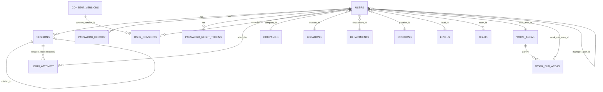
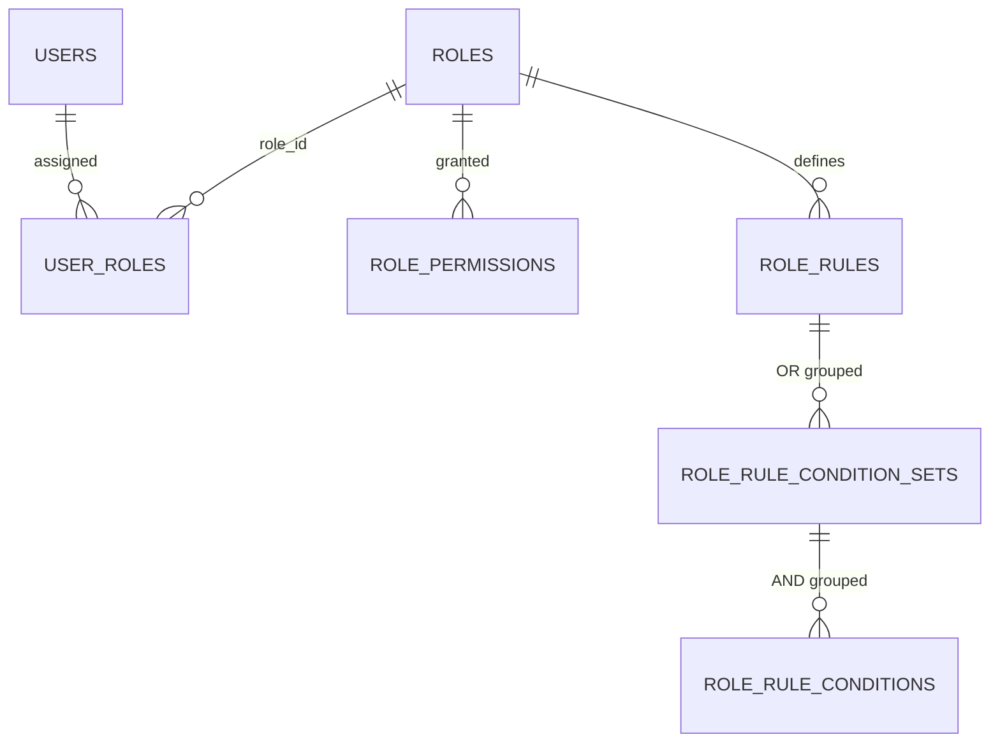
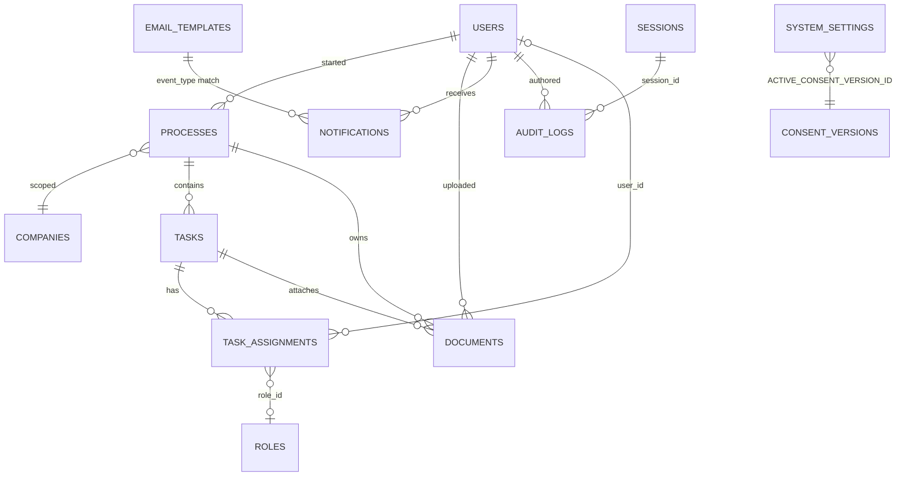

# Lean Management Platformu — Veritabanı Şeması

> Bu doküman domain modelinin implementation-level çevirisidir. Agent bu dokümanla migration ve Prisma schema üretebilir; başka referansa ihtiyaç duymaz.

---

## 1. DB Engine ve Versiyon

**Engine:** Amazon Aurora PostgreSQL 16 (veya AWS Aurora'nın sağladığı en güncel 16.x LTS sürümü).

**Hosting:** AWS Aurora managed service.

**Production konfigürasyonu:**

- **Multi-AZ:** Aktif (primary + replica, farklı AZ'lerde). Otomatik failover <60sn.
- **Storage encryption:** AWS KMS Customer Managed Key (CMK) ile at-rest şifreleme.
- **In-transit:** TLS 1.3 zorunlu (`rds.force_ssl=1` parameter group).
- **Point-in-Time Recovery:** Aktif. Minimum 7 gün retention baseline. **Final backup retention ve PITR parametreleri DevOps ekibi tarafından MVP sonunda belirlenir.**
- **Maintenance window:** Pazar 03:00 TRT.

**Seçim gerekçesi:** JSONB desteği (audit old/new_value, form_data, metadata alanları), Prisma ORM olgunluğu, pg_trgm extension (ileride full-text arama için), Row-Level Security opsiyonu (MVP sonrası aktivasyona aday), CTE ve window function gücü (raporlama sorgularında).

**Aktive edilecek extension'lar:**

- `pgcrypto` — SHA-256 hash ve random byte üretimi için (audit chain_hash, blind index).
- `uuid-ossp` — fallback UUID üretimi (Prisma default `cuid()` kullanır ama ham SQL senaryoları için).
- `pg_trgm` — (MVP sonrası) kullanıcı/süreç arama için trigram index opsiyonu.

---

## 2. Şemaya Genel Bakış

Şema yedi mantıksal gruba ayrılır; toplam 27 tablo. Gruplar domain alt-domain'lerine paraleldir. Aynı alt-domain içindeki tablolar aynı migration dosyalarında yönetilir; cross-grup migration'lar (örn. `user_consents` FK → `consent_versions`) açık olarak belgelenir.

| Grup                              | Tablolar                                                                                                                |
| --------------------------------- | ----------------------------------------------------------------------------------------------------------------------- |
| **Identity & Organization**       | `users`, `sessions`, `password_history`, `password_reset_tokens`, `login_attempts`, `consent_versions`, `user_consents` |
| **Master Data**                   | `companies`, `locations`, `departments`, `levels`, `positions`, `teams`, `work_areas`, `work_sub_areas`                 |
| **Authorization**                 | `roles`, `user_roles`, `role_permissions`, `role_rules`, `role_rule_condition_sets`, `role_rule_conditions`             |
| **Workflow**                      | `processes`, `tasks`, `task_assignments`                                                                                |
| **Documents**                     | `documents`                                                                                                             |
| **Notifications & Communication** | `notifications`, `email_templates`                                                                                      |
| **System & Audit**                | `system_settings`, `audit_logs`                                                                                         |

Şema, tek PostgreSQL database içinde tek schema (`public`) altında yaşar. Schema-per-tenant yoktur — platform multi-tenant değildir ([10. Multi-tenancy / RLS](#10-multi-tenancy--rls)).

---

## 3. Standart Alanlar

Aşağıdaki alanlar her tabloda zorunludur (istisnalar altta):

```sql
id                 TEXT           NOT NULL   PK    -- Prisma cuid(), uygulama tarafında üretilir
created_at         TIMESTAMPTZ    NOT NULL   DEFAULT now()
updated_at         TIMESTAMPTZ    NOT NULL   DEFAULT now()    -- BEFORE UPDATE trigger ile otomatik güncellenir
created_by_user_id TEXT           NULL       FK users(id) ON DELETE SET NULL  -- seed için null, sistem aksiyonları için null
```

`updated_at` için her tabloya şu trigger uygulanır (migration'da ortak fonksiyon):

```sql
CREATE OR REPLACE FUNCTION set_updated_at() RETURNS TRIGGER AS $$
BEGIN NEW.updated_at = now(); RETURN NEW; END;
$$ LANGUAGE plpgsql;

CREATE TRIGGER trg_<table>_updated_at BEFORE UPDATE ON <table>
FOR EACH ROW EXECUTE FUNCTION set_updated_at();
```

**İstisnalar:**

- `audit_logs` — `updated_at` **yoktur** (append-only; update yasak, chain integrity için immutable). `created_at` yerine `timestamp` kolonu kullanılır.
- `password_history` — yalnız `created_at` (ring buffer; update edilmez).
- `login_attempts` — yalnız `attempted_at` (append-only audit-like; update edilmez).
- `user_consents` — yalnız `accepted_at` (immutable kanıt kaydı).
- `role_permissions` — `granted_at` ve `granted_by_user_id` tutulur; update edilmez (permission değiştirilmez, silinir-yeniden eklenir).

---

## 4. Soft Delete Stratejisi

Hard delete neredeyse hiç yok. Silme ihtiyacı dört pattern ile karşılanır:

**Pattern 1 — `is_active` bayrağı (reversible soft-disable):**

- Uygulandığı tablolar: `companies`, `locations`, `departments`, `levels`, `positions`, `teams`, `work_areas`, `work_sub_areas`, `roles`.
- Default query filter: `WHERE is_active = true`. Prisma middleware'i her `findMany` / `findFirst` call'una bu filtreyi otomatik ekler; `.includeInactive()` helper ile istisna tutulur (sadece yönetim ekranları).

**Pattern 2 — `is_active` + `anonymized_at` (tri-state):**

- Uygulandığı tablo: `users`.
- Üç durum: `is_active=true AND anonymized_at=null` (ACTIVE), `is_active=false AND anonymized_at=null` (PASSIVE), `anonymized_at IS NOT NULL` (ANONYMIZED — PII bütünüyle anonim).

**Pattern 3 — `status` enum (business-level terminal durumlar):**

- Uygulandığı tablolar: `processes` (CANCELLED, COMPLETED, REJECTED terminal), `tasks` (COMPLETED, SKIPPED_BY_PEER, SKIPPED_BY_ROLLBACK terminal), `sessions` (REVOKED, EXPIRED, ROTATED terminal).
- Silme yerine status değişikliği. Kayıt veri olarak saklanır.

**Pattern 4 — Retention job ile hard delete:**

- Uygulandığı tablolar:
  - `notifications` — in-app kayıtları 90 gün sonra silinir; email kayıtları 2 yıl.
  - `password_reset_tokens` — kullanılmış veya expire olmuş token'lar günlük temizlenir.
  - `login_attempts` — 2 yıl sonra silinir ([SEC-053] Login log retention).
  - `audit_logs` — 1 yıl sonra silinir (dedicated IAM role ile).
  - `sessions` — EXPIRED/REVOKED kayıtları 30 gün sonra arşivlenir (audit'e özet çıktı; hard delete).
- Retention job'ları BullMQ cron üzerinden gecelik çalışır; her job audit'e `DATA_RETENTION_EXECUTED` yazar.

**Hiç silme olmayan tablolar:** `consent_versions`, `user_consents` (yasal kanıt), `audit_logs` (retention'a kadar append-only).

---

## 5. Encryption Stratejisi

**Envelope encryption pattern** — AWS KMS Customer Managed Key (CMK) üzerine kurulu:

1. Uygulama her şifreli kayıt için bir **Data Encryption Key (DEK)** üretir — 256-bit random key.
2. DEK ile kaydın hassas alanı AES-256-GCM modunda şifrelenir.
3. DEK, KMS üzerinden CMK ile wrap edilir (sarmalanır); wrap edilmiş DEK kaydın yanında saklanır.
4. Okuma sırasında uygulama wrap edilmiş DEK'i KMS'e unwrap için gönderir, elde ettiği plain DEK ile ciphertext'i çözer.

**Avantaj:** CMK asla DB'ye düşmez; CMK rotation sırasında tüm kayıtlar yeniden şifrelenmez — sadece DEK'ler yeniden wrap edilir.

### Deterministic vs probabilistic encryption

Hassas alanlar iki kategoriye ayrılır; her kategori farklı kolon modelini zorunlu kılar.

**Deterministic encryption** — aynı input her zaman aynı ciphertext üretir. Arama ve unique constraint için gereklidir.

- **Kolon modeli:** `<field>_encrypted BYTEA` (AES-256-GCM ciphertext — IV sabit per-field, tenant-wide) + `<field>_blind_index VARCHAR(64) NOT NULL` (HMAC-SHA256(pepper, plaintext); case-insensitive alanlar için önce lowercase).
- **Arama:** `WHERE email_blind_index = HMAC(input)` — eşitlik sorgularının index'i blind_index üzerinde çalışır.
- **UNIQUE constraint:** `blind_index` kolonunda tanımlanır.

**Probabilistic encryption** — aynı input farklı ciphertext üretir (IV her seferinde rastgele). Aranmayan sadece okunan alanlar için; daha yüksek güvenlik.

- **Kolon modeli:** `<field>_encrypted BYTEA` (AES-256-GCM ciphertext + IV gömülü) + `<field>_dek BYTEA NOT NULL` (wrap edilmiş DEK).

### Şifreli alan matrisi

| Tablo              | Alan          | Sınıf | Tip                       | Kolonlar                                                                                                       |
| ------------------ | ------------- | ----- | ------------------------- | -------------------------------------------------------------------------------------------------------------- |
| `users`            | sicil         | C4    | Deterministic             | `sicil_encrypted`, `sicil_blind_index` UNIQUE                                                                  |
| `users`            | email         | C4    | Deterministic             | `email_encrypted`, `email_blind_index` UNIQUE                                                                  |
| `users`            | phone         | C3    | Deterministic             | `phone_encrypted`, `phone_blind_index`                                                                         |
| `users`            | manager_email | C3    | Deterministic             | `manager_email_encrypted`, `manager_email_blind_index` — yalnız SAP senaryosunda user çözülememişse kullanılır |
| `users`            | password_hash | C4    | Bcrypt (tek yönlü)        | `password_hash TEXT` — bcrypt cost 12 + environment pepper                                                     |
| `audit_logs`       | old_value     | C3/C4 | Probabilistic (PII varsa) | `old_value_encrypted BYTEA`, `old_value_dek BYTEA`                                                             |
| `audit_logs`       | new_value     | C3/C4 | Probabilistic (PII varsa) | `new_value_encrypted BYTEA`, `new_value_dek BYTEA`                                                             |
| `consent_versions` | content       | C4    | Probabilistic             | `content_encrypted BYTEA`, `content_dek BYTEA`                                                                 |

**Not:** Repository layer'ı (doküman `04_BACKEND_SPEC`'te detaylı) insert/update sırasında otomatik encrypt, select sırasında otomatik decrypt eder. Şemada bu kolonlar ayrı görünür ama domain service'leri `user.email` gibi virtual field'lar üzerinden çalışır.

**Pepper:** HMAC blind index üretiminde kullanılan site-wide secret (32 byte). Secrets Manager'da saklı. Rotasyonu **yok** — pepper rotation tüm blind index'leri geçersiz kılar.

---

## 6. Tablo Tanımları

### 6.1 Identity & Organization

#### `users`

Platformun kullanıcılarını tutar. Sicil, email, phone ve manager_email C4 sınıfı hassas veri olup deterministic encryption ile saklanır.

**Kolonlar:**

| Kolon                     | Tip          | Null | Default | Kısıt                                    | Açıklama                                                                                                              |
| ------------------------- | ------------ | ---- | ------- | ---------------------------------------- | --------------------------------------------------------------------------------------------------------------------- |
| id                        | TEXT         | No   | cuid()  | PK                                       | —                                                                                                                     |
| sicil_encrypted           | BYTEA        | No   | —       | —                                        | AES-256-GCM şifreli                                                                                                   |
| sicil_blind_index         | VARCHAR(64)  | No   | —       | UNIQUE                                   | HMAC-SHA256; sicil lookup için                                                                                        |
| first_name                | VARCHAR(100) | No   | —       | —                                        | Düz metin (C2 sınıf)                                                                                                  |
| last_name                 | VARCHAR(100) | No   | —       | —                                        | Düz metin                                                                                                             |
| email_encrypted           | BYTEA        | No   | —       | —                                        | Deterministic şifreli                                                                                                 |
| email_blind_index         | VARCHAR(64)  | No   | —       | UNIQUE                                   | Email lookup için (lowercase normalized)                                                                              |
| phone_encrypted           | BYTEA        | Yes  | —       | —                                        | Deterministic şifreli                                                                                                 |
| phone_blind_index         | VARCHAR(64)  | Yes  | —       | —                                        | Phone lookup için                                                                                                     |
| password_hash             | VARCHAR(60)  | Yes  | —       | —                                        | bcrypt hash (cost 12 + pepper). Nullable — Superadmin haricinde henüz şifre atanmamış kullanıcılar için (SAP senaryo) |
| employee_type             | ENUM         | No   | —       | —                                        | `WHITE_COLLAR` / `BLUE_COLLAR` / `INTERN`                                                                             |
| company_id                | TEXT         | No   | —       | FK companies(id) ON DELETE RESTRICT      | Master data referansı                                                                                                 |
| location_id               | TEXT         | No   | —       | FK locations(id) ON DELETE RESTRICT      |                                                                                                                       |
| department_id             | TEXT         | No   | —       | FK departments(id) ON DELETE RESTRICT    |                                                                                                                       |
| position_id               | TEXT         | No   | —       | FK positions(id) ON DELETE RESTRICT      |                                                                                                                       |
| level_id                  | TEXT         | No   | —       | FK levels(id) ON DELETE RESTRICT         |                                                                                                                       |
| team_id                   | TEXT         | Yes  | —       | FK teams(id) ON DELETE SET NULL          | Opsiyonel — her kullanıcı takıma bağlı olmayabilir                                                                    |
| work_area_id              | TEXT         | No   | —       | FK work_areas(id) ON DELETE RESTRICT     |                                                                                                                       |
| work_sub_area_id          | TEXT         | Yes  | —       | FK work_sub_areas(id) ON DELETE SET NULL | Opsiyonel                                                                                                             |
| manager_user_id           | TEXT         | Yes  | —       | FK users(id) ON DELETE SET NULL          | Self-reference; cycle service layer'da                                                                                |
| manager_email_encrypted   | BYTEA        | Yes  | —       | —                                        | SAP senaryosunda manager user henüz yoksa fallback                                                                    |
| manager_email_blind_index | VARCHAR(64)  | Yes  | —       | —                                        |                                                                                                                       |
| hire_date                 | DATE         | Yes  | —       | —                                        |                                                                                                                       |
| is_active                 | BOOLEAN      | No   | true    | —                                        | Soft-disable bayrağı                                                                                                  |
| anonymized_at             | TIMESTAMPTZ  | Yes  | —       | —                                        | KVKK anonimleştirme tarihi                                                                                            |
| anonymization_reason      | TEXT         | Yes  | —       | —                                        | Anonimleştirme gerekçesi                                                                                              |
| password_changed_at       | TIMESTAMPTZ  | Yes  | —       | —                                        | Şifre expiry hesabı için                                                                                              |
| failed_login_count        | INTEGER      | No   | 0       | —                                        | Lockout tetikleyicisi                                                                                                 |
| locked_until              | TIMESTAMPTZ  | Yes  | —       | —                                        | Hesap kilitli olduğu süre                                                                                             |
| last_login_at             | TIMESTAMPTZ  | Yes  | —       | —                                        |                                                                                                                       |
| external_subject          | VARCHAR(255) | Yes  | —       | —                                        | OIDC `sub` (Google vs Keycloak farklıdır); platform birincil anahtar `id` kalır — ADR 0008                            |
| created_at                | TIMESTAMPTZ  | No   | now()   | —                                        |                                                                                                                       |
| updated_at                | TIMESTAMPTZ  | No   | now()   | —                                        | Trigger                                                                                                               |
| created_by_user_id        | TEXT         | Yes  | —       | FK users(id) ON DELETE SET NULL          |                                                                                                                       |

**Index'ler:**

- `users_sicil_blind_index_key` UNIQUE btree (sicil_blind_index)
- `users_email_blind_index_key` UNIQUE btree (email_blind_index)
- `users_phone_blind_index_idx` btree (phone_blind_index) — nullable, kullanım düşük
- `users_company_active_idx` btree (company_id, is_active) — master data pasifleştirme kontrolü ve şirket-bazlı listeleme
- `users_location_active_idx` btree (location_id, is_active)
- `users_department_active_idx` btree (department_id, is_active)
- `users_position_active_idx` btree (position_id, is_active)
- `users_manager_user_id_idx` btree (manager_user_id) — "yöneticinin astları" sorguları (dinamik görev ataması)
- `users_is_active_idx` btree (is_active) WHERE is_active = true — partial index, aktif kullanıcı listelerinde

**Business rule enforcement:**

- Sicil 8 haneli numerik: plain `sicil`'i uygulama tarafında `^\d{8}$` regex ile validate edilir (DB'de encrypted tutulduğu için CHECK yapılamaz).
- Email format: uygulama Zod schema ile validate eder; DB seviyesinde CHECK yok.
- Manager cycle: service-layer cycle detection (A→B→...→A); DB check yok.
- `anonymized_at NOT NULL` olduğunda `is_active = false` zorunlu: `CHECK (anonymized_at IS NULL OR is_active = false)`.
- `failed_login_count >= 0`: `CHECK (failed_login_count >= 0)`.

**Seed ihtiyacı:** **Var (production).** Superadmin kullanıcısı boot-time'da env'den (`SUPERADMIN_EMAIL`, `SUPERADMIN_PASSWORD_HASH`) seed edilir. `is_active=true`, şirket/lokasyon/departman olarak özel "SYSTEM" master data'sına bağlanır (seed script SYSTEM master data'sını ilk çalıştırmada yaratır).

---

#### `sessions`

Kullanıcının aktif oturumlarını tutar. Access token (JWT) blacklist ve refresh token hash yönetimi için.

**Kolonlar:**

| Kolon                 | Tip          | Null | Default  | Kısıt                              | Açıklama                                                                                                        |
| --------------------- | ------------ | ---- | -------- | ---------------------------------- | --------------------------------------------------------------------------------------------------------------- |
| id                    | TEXT         | No   | cuid()   | PK                                 | JWT `sid` claim ile eşleşir                                                                                     |
| user_id               | TEXT         | No   | —        | FK users(id) ON DELETE CASCADE     |                                                                                                                 |
| refresh_token_hash    | VARCHAR(64)  | No   | —        | UNIQUE                             | SHA-256(plain_refresh_token)                                                                                    |
| ip_hash               | VARCHAR(64)  | No   | —        | —                                  | Session başlangıç IP SHA-256                                                                                    |
| user_agent            | VARCHAR(512) | No   | —        | —                                  | Truncated ilk 512 char                                                                                          |
| status                | ENUM         | No   | 'ACTIVE' | —                                  | `ACTIVE` / `EXPIRED` / `REVOKED` / `ROTATED`                                                                    |
| revocation_reason     | ENUM         | Yes  | —        | —                                  | `PASSWORD_CHANGED` / `USER_INITIATED` / `CONCURRENT_LIMIT` / `SUSPICIOUS_IP` / `TOKEN_REPLAY` / `ADMIN_REVOKED` |
| rotated_to_session_id | TEXT         | Yes  | —        | FK sessions(id) ON DELETE SET NULL | Sliding refresh chain                                                                                           |
| created_at            | TIMESTAMPTZ  | No   | now()    | —                                  |                                                                                                                 |
| last_active_at        | TIMESTAMPTZ  | No   | now()    | —                                  | Her access token refresh'te güncellenir                                                                         |
| expires_at            | TIMESTAMPTZ  | No   | —        | —                                  | Absolute timeout (superadmin 4sa, normal 12sa)                                                                  |
| revoked_at            | TIMESTAMPTZ  | Yes  | —        | —                                  | REVOKED olduğu an                                                                                               |
| updated_at            | TIMESTAMPTZ  | No   | now()    | —                                  | Trigger                                                                                                         |

**Index'ler:**

- `sessions_refresh_token_hash_key` UNIQUE btree (refresh_token_hash)
- `sessions_user_status_idx` btree (user_id, status) — kullanıcının aktif session sayımı + concurrent limit kontrolü
- `sessions_expires_at_idx` btree (expires_at) WHERE status = 'ACTIVE' — cleanup job için

**Business rule enforcement:**

- Kullanıcı başına max 3 ACTIVE session: service-layer kontrol (yeni login'de count + LRU eviction).
- `revoked_at IS NOT NULL` ⇔ `status IN ('REVOKED', 'ROTATED')`: `CHECK`.
- Refresh token replay: service-layer (refresh endpoint'te eski token ikinci kez geldiğinde chain revoke).

**Seed ihtiyacı:** Yok.

---

#### `password_history`

Kullanıcının son 5 şifre hash'ini tutar. Yeniden kullanım engelleme için.

**Kolonlar:**

| Kolon         | Tip         | Null | Default | Kısıt                          | Açıklama                     |
| ------------- | ----------- | ---- | ------- | ------------------------------ | ---------------------------- |
| id            | TEXT        | No   | cuid()  | PK                             |                              |
| user_id       | TEXT        | No   | —       | FK users(id) ON DELETE CASCADE |                              |
| password_hash | VARCHAR(60) | No   | —       | —                              | bcrypt hash (tarihteki hash) |
| created_at    | TIMESTAMPTZ | No   | now()   | —                              | Şifrenin set edildiği an     |

**Index'ler:**

- `password_history_user_created_idx` btree (user_id, created_at DESC) — son 5'i çekme ve ring buffer silme

**Business rule enforcement:**

- Ring buffer (son 5): service-layer — yeni kayıt eklendiğinde `user_id` bazında 6. ve eski kayıtlar DELETE edilir.
- Yeni şifre karşılaştırma: service-layer — yeni hash bu tablodaki son 5 hash ile bcrypt compare edilir.

**Seed ihtiyacı:** Yok.

---

#### `password_reset_tokens`

Şifre sıfırlama akışı için kısa ömürlü single-use token'ları tutar.

**Kolonlar:**

| Kolon           | Tip         | Null | Default | Kısıt                          | Açıklama                                     |
| --------------- | ----------- | ---- | ------- | ------------------------------ | -------------------------------------------- |
| id              | TEXT        | No   | cuid()  | PK                             |                                              |
| user_id         | TEXT        | No   | —       | FK users(id) ON DELETE CASCADE |                                              |
| token_hash      | VARCHAR(64) | No   | —       | UNIQUE                         | SHA-256(plain_token_32bytes)                 |
| expires_at      | TIMESTAMPTZ | No   | —       | —                              | now() + 15 minutes                           |
| used_at         | TIMESTAMPTZ | Yes  | —       | —                              | Kullanım anı — sonrasında tekrar kullanılmaz |
| request_ip_hash | VARCHAR(64) | No   | —       | —                              | Talep IP'si SHA-256                          |
| created_at      | TIMESTAMPTZ | No   | now()   | —                              |                                              |

**Index'ler:**

- `password_reset_tokens_token_hash_key` UNIQUE btree (token_hash)
- `password_reset_tokens_expires_idx` btree (expires_at) — cleanup job

**Business rule enforcement:**

- Single-use: service-layer — `used_at IS NOT NULL` ise token reddedilir.
- Expire: service-layer — `expires_at < now()` ise reddedilir.
- Cleanup: günlük job `used_at IS NOT NULL OR expires_at < now()` olan kayıtları siler.

**Seed ihtiyacı:** Yok.

---

#### `login_attempts`

Her login denemesi (başarılı, başarısız, bloklanmış) bu tabloya yazılır. Forensics, raporlama ve güvenlik analizinin birincil kaynağıdır.

**Kolonlar:**

| Kolon             | Tip          | Null | Default | Kısıt                              | Açıklama                                                             |
| ----------------- | ------------ | ---- | ------- | ---------------------------------- | -------------------------------------------------------------------- |
| id                | TEXT         | No   | cuid()  | PK                                 |                                                                      |
| attempted_at      | TIMESTAMPTZ  | No   | now()   | —                                  | Denemenin zamanı                                                     |
| email_blind_index | VARCHAR(64)  | No   | —       | —                                  | Girilen email'in HMAC-SHA256'sı (plain email log'a sızmaz)           |
| user_id           | TEXT         | Yes  | —       | FK users(id) ON DELETE SET NULL    | Email resolve edildiyse; resolve edilemedi (USER_NOT_FOUND) ise null |
| ip_hash           | VARCHAR(64)  | No   | —       | —                                  | İstek IP SHA-256                                                     |
| user_agent        | VARCHAR(512) | No   | —       | —                                  | Truncated                                                            |
| outcome           | ENUM         | No   | —       | —                                  | `SUCCESS` / `FAILURE` / `BLOCKED`                                    |
| failure_reason    | ENUM         | Yes  | —       | —                                  | outcome=FAILURE ise zorunlu                                          |
| blocked_by        | ENUM         | Yes  | —       | —                                  | outcome=BLOCKED ise zorunlu                                          |
| lockout_triggered | BOOLEAN      | No   | false   | —                                  | Bu deneme hesabı kilitlediyse true                                   |
| session_id        | TEXT         | Yes  | —       | FK sessions(id) ON DELETE SET NULL | outcome=SUCCESS ise oluşan session                                   |
| country_code      | VARCHAR(2)   | Yes  | —       | —                                  | CloudFront `CF-IPCountry` header'ından                               |
| latency_ms        | INTEGER      | Yes  | —       | —                                  | Backend işlem süresi; anomaly analizi için                           |

**Enum tanımları:**

`outcome`:

- `SUCCESS` — kullanıcı şifre doğru girdi, session oluştu
- `FAILURE` — kimlik doğrulama başarısız (email veya şifre doğrulama geçemedi)
- `BLOCKED` — deneme backend'e ulaştı ama doğrulama yapılmadan reddedildi (önden engellendi)

`failure_reason` (outcome='FAILURE' ise):

- `INVALID_PASSWORD` — email sistemde var, şifre yanlış
- `USER_NOT_FOUND` — email sistemde yok (kullanıcıya aynı generic mesaj döner — enumeration önlemi; DB'de ayrıştırılır)
- `USER_PASSIVE` — kullanıcı var ama `is_active=false`
- `USER_ANONYMIZED` — kullanıcı anonimleştirilmiş

`blocked_by` (outcome='BLOCKED' ise):

- `ACCOUNT_LOCKED` — hesap kilitli (5 başarısız / 15dk tetikledi → 30dk lockout aktif)
- `IP_RATE_LIMIT` — aynı IP 20 başarısız / 15dk → 1 saat IP ban
- `USER_RATE_LIMIT` — progressive delay sınırı aşıldı
- `GEO_BLOCKED` — WAF GeoIP dışı (edge bypass durumunda)
- `WAF_BOT_CONTROL` — bot control engelledi
- `SUPERADMIN_IP_WHITELIST_VIOLATION` — Superadmin whitelist dışı IP'den

**Index'ler:**

- `login_attempts_email_attempted_idx` btree (email_blind_index, attempted_at DESC) — kullanıcı bazlı son denemeler
- `login_attempts_ip_attempted_idx` btree (ip_hash, attempted_at DESC) — IP bazlı denemeler
- `login_attempts_outcome_attempted_idx` btree (outcome, attempted_at DESC) — rapor sorguları
- `login_attempts_user_attempted_idx` btree (user_id, attempted_at DESC) WHERE user_id IS NOT NULL — kullanıcı profilinde geçmiş
- `login_attempts_lockout_idx` btree (attempted_at DESC) WHERE lockout_triggered = true — lockout event'leri hızlı erişim

**Business rule enforcement:**

- `outcome='FAILURE' ⇒ failure_reason IS NOT NULL`: `CHECK`.
- `outcome='BLOCKED' ⇒ blocked_by IS NOT NULL`: `CHECK`.
- `outcome='SUCCESS' ⇒ session_id IS NOT NULL`: service-layer.

**Raporlama örnekleri:**

- Son 24 saat sonuç dağılımı: `SELECT outcome, COUNT(*) FROM login_attempts WHERE attempted_at > now() - interval '24 hours' GROUP BY outcome`
- Kullanıcının başarısız sebep dağılımı: `SELECT failure_reason, COUNT(*) ... WHERE user_id=? AND outcome='FAILURE' GROUP BY failure_reason`
- Credential stuffing sinyali: aynı `ip_hash`'ten farklı `email_blind_index`'lere ardışık `USER_NOT_FOUND`
- Lockout tetikleyen denemeler: `WHERE lockout_triggered = true`

**Seed ihtiyacı:** Yok.

---

#### `consent_versions`

KVKK açık rıza metni sürümleri. Metin AES-256-GCM ile probabilistic şifreli.

**Kolonlar:**

| Kolon              | Tip         | Null | Default | Kısıt                           | Açıklama                      |
| ------------------ | ----------- | ---- | ------- | ------------------------------- | ----------------------------- |
| id                 | TEXT        | No   | cuid()  | PK                              |                               |
| version            | INTEGER     | No   | —       | UNIQUE                          | Incremental sayı (1, 2, 3...) |
| content_encrypted  | BYTEA       | No   | —       | —                               | Rıza metni (AES-256-GCM)      |
| content_dek        | BYTEA       | No   | —       | —                               | KMS-wrapped DEK               |
| status             | ENUM        | No   | 'DRAFT' | —                               | `DRAFT` / `PUBLISHED`         |
| effective_from     | TIMESTAMPTZ | Yes  | —       | —                               | Yayınlanma etki tarihi        |
| published_at       | TIMESTAMPTZ | Yes  | —       | —                               | PUBLISHED'a geçiş anı         |
| created_by_user_id | TEXT        | No   | —       | FK users(id) ON DELETE RESTRICT | Superadmin                    |
| created_at         | TIMESTAMPTZ | No   | now()   | —                               |                               |
| updated_at         | TIMESTAMPTZ | No   | now()   | —                               | Trigger                       |

**Index'ler:**

- `consent_versions_version_key` UNIQUE btree (version)
- `consent_versions_status_idx` btree (status) — aktif yayındaki versiyonu çekme

**Business rule enforcement:**

- PUBLISHED versiyon düzenlenemez: service-layer — update endpoint'te `status = 'PUBLISHED'` ise reddedilir.
- Aktif versiyon tek: service-layer — yeni PUBLISH yapılırken SystemSetting `ACTIVE_CONSENT_VERSION_ID` güncellenir (önceki aktif versiyon yine tabloda kalır, yalnız aktif işaretleme değişir).

**Seed ihtiyacı:** **Var (production).** İlk DRAFT versiyon boş içerikle seed edilir; Superadmin Sistem Ayarları ekranından metni yazar ve yayınlar.

---

#### `user_consents`

Her kullanıcının onayladığı her consent versiyonu için bir kayıt. Tamper-evident HMAC imzası ile.

**Kolonlar:**

| Kolon              | Tip          | Null | Default | Kısıt                                      | Açıklama                 |
| ------------------ | ------------ | ---- | ------- | ------------------------------------------ | ------------------------ | --- | ------------------ | --- | -------------------- |
| id                 | TEXT         | No   | cuid()  | PK                                         |                          |
| user_id            | TEXT         | No   | —       | FK users(id) ON DELETE CASCADE             |                          |
| consent_version_id | TEXT         | No   | —       | FK consent_versions(id) ON DELETE RESTRICT |                          |
| accepted_at        | TIMESTAMPTZ  | No   | now()   | —                                          | Onay anı                 |
| ip_hash            | VARCHAR(64)  | No   | —       | —                                          | Onay anındaki IP SHA-256 |
| user_agent         | VARCHAR(512) | No   | —       | —                                          | Truncated                |
| signature          | VARCHAR(64)  | No   | —       | —                                          | HMAC-SHA256(user_id      |     | consent_version_id |     | accepted_at, pepper) |

**Index'ler:**

- `user_consents_user_version_key` UNIQUE btree (user_id, consent_version_id) — her versiyon başına bir onay kaydı
- `user_consents_user_accepted_idx` btree (user_id, accepted_at DESC) — kullanıcının onay geçmişi

**Business rule enforcement:**

- `signature` integrity: nightly job HMAC'yi doğrular; uyumsuzluk P1 alarm.
- Immutable: update endpoint yok; yalnız INSERT.

**Seed ihtiyacı:** Yok.

---

### 6.2 Master Data

**Ortak şablon** — sekiz master data tablosu (`companies`, `locations`, `departments`, `levels`, `positions`, `teams`, `work_areas`, `work_sub_areas`) aynı iskelete sahiptir. Aşağıdaki kolonlar her tabloda aynıdır:

| Kolon              | Tip          | Null | Default | Kısıt                           | Açıklama                             |
| ------------------ | ------------ | ---- | ------- | ------------------------------- | ------------------------------------ |
| id                 | TEXT         | No   | cuid()  | PK                              |                                      |
| code               | VARCHAR(32)  | No   | —       | UNIQUE                          | Değişmez identifier (case-sensitive) |
| name               | VARCHAR(200) | No   | —       | —                               | Güncellenebilir görünen ad           |
| is_active          | BOOLEAN      | No   | true    | —                               | Soft-disable bayrağı                 |
| created_at         | TIMESTAMPTZ  | No   | now()   | —                               |                                      |
| updated_at         | TIMESTAMPTZ  | No   | now()   | —                               | Trigger                              |
| created_by_user_id | TEXT         | Yes  | —       | FK users(id) ON DELETE SET NULL |                                      |

**Ortak index'ler (her tabloda):**

- `<table>_code_key` UNIQUE btree (code)
- `<table>_is_active_idx` btree (is_active) WHERE is_active = true — partial

**Ortak business rule enforcement (her tabloda):**

- `code` değişmez: service-layer update DTO'dan çıkarılır.
- Aktif kullanıcısı olan pasifleştirilemez: service-layer — pasifleştirme öncesi `COUNT(users WHERE <this>_id = id AND is_active = true) = 0` kontrolü.
- Silme yok — DELETE endpoint bulunmaz.

**`work_sub_areas` istisnası — ek kolon:**

| Kolon                 | Tip         | Null | Default | Kısıt                                  | Açıklama                                                                |
| --------------------- | ----------- | ---- | ------- | -------------------------------------- | ----------------------------------------------------------------------- |
| parent_work_area_code | VARCHAR(32) | No   | —       | FK work_areas(code) ON DELETE RESTRICT | Parent hiyerarşisi (code-based FK — name değişebilir ama code değişmez) |

**`work_sub_areas` ek index:**

- `work_sub_areas_parent_idx` btree (parent_work_area_code, is_active)

**`work_sub_areas` ek business rule:**

- Cascade soft-disable: parent `work_area` pasifleştirilirse, `parent_work_area_code` ile bağlı aktif tüm `work_sub_area`'lar aynı transaction'da `is_active=false` yapılır.
- Cascade activate yok: parent yeniden aktifleştirildiğinde child'lar otomatik aktifleşmez.

**Seed ihtiyacı:**

- **Dev + Staging:** 3 şirket, 10 lokasyon, 15 departman, 5 kademe, 10 pozisyon, 5 ekip, 5 çalışma alanı, 15 çalışma alt alanı (Faker.js ile).
- **Production:** Her tablo için sadece **SYSTEM** rezerve kaydı (örn. `code='SYSTEM'`, `name='System'`). Superadmin bu kayda bağlanır; gerçek master data Kullanıcı Yöneticisi tarafından manuel eklenir.

---

### 6.3 Authorization

#### `roles`

Sistemdeki tüm rolleri tutar — hem sistem rolleri (built-in) hem dinamik roller.

**Kolonlar:**

| Kolon              | Tip          | Null | Default | Kısıt                           | Açıklama                                                                                                                 |
| ------------------ | ------------ | ---- | ------- | ------------------------------- | ------------------------------------------------------------------------------------------------------------------------ |
| id                 | TEXT         | No   | cuid()  | PK                              |                                                                                                                          |
| code               | VARCHAR(64)  | No   | —       | UNIQUE                          | Sistem rolü için enum (`SUPERADMIN`, `USER_MANAGER`, `ROLE_MANAGER`, `PROCESS_MANAGER`); dinamik rol için auto-generated |
| name               | VARCHAR(200) | No   | —       | —                               | Görünen ad                                                                                                               |
| description        | TEXT         | Yes  | —       | —                               | Rolün amacı                                                                                                              |
| is_system          | BOOLEAN      | No   | false   | —                               | Sistem rolü mü — silinemez                                                                                               |
| is_active          | BOOLEAN      | No   | true    | —                               |                                                                                                                          |
| created_at         | TIMESTAMPTZ  | No   | now()   | —                               |                                                                                                                          |
| updated_at         | TIMESTAMPTZ  | No   | now()   | —                               | Trigger                                                                                                                  |
| created_by_user_id | TEXT         | Yes  | —       | FK users(id) ON DELETE SET NULL |                                                                                                                          |

**Index'ler:**

- `roles_code_key` UNIQUE btree (code)
- `roles_is_active_idx` btree (is_active) WHERE is_active = true

**Business rule enforcement:**

- Sistem rolü silinemez: service-layer — `is_system = true` ise delete yok.
- Sistem rolü `code` değişmez: service-layer.

**Seed ihtiyacı:** **Var (production).** Dört sistem rolü seed edilir: `SUPERADMIN`, `USER_MANAGER`, `ROLE_MANAGER`, `PROCESS_MANAGER`. Her birinin initial permission setleri `role_permissions` tablosuna yazılır.

---

#### `user_roles`

Kullanıcıya doğrudan atanmış rollerin junction tablosu (attribute-based kurallarla gelen atamalar bu tabloda **değil** — runtime'da hesaplanır).

**Kolonlar:**

| Kolon               | Tip         | Null | Default | Kısıt                           | Açıklama      |
| ------------------- | ----------- | ---- | ------- | ------------------------------- | ------------- |
| id                  | TEXT        | No   | cuid()  | PK                              |               |
| user_id             | TEXT        | No   | —       | FK users(id) ON DELETE CASCADE  |               |
| role_id             | TEXT        | No   | —       | FK roles(id) ON DELETE CASCADE  |               |
| assigned_by_user_id | TEXT        | No   | —       | FK users(id) ON DELETE RESTRICT | Atamayı yapan |
| assigned_at         | TIMESTAMPTZ | No   | now()   | —                               |               |
| created_at          | TIMESTAMPTZ | No   | now()   | —                               |               |

**Index'ler:**

- `user_roles_user_role_key` UNIQUE btree (user_id, role_id) — çift atama engellenir
- `user_roles_role_idx` btree (role_id) — role bazlı kullanıcı listesi

**Seed ihtiyacı:** **Var (production).** Superadmin kullanıcısına `SUPERADMIN` rolü atanır.

---

#### `role_permissions`

Rollerin sahip olduğu permission'lar. **Ayrı `permissions` tablosu bilinçli olarak yoktur** — aşağıdaki "Permission metadata modeli" bölümünü okuyun.

**Kolonlar:**

| Kolon              | Tip         | Null | Default | Kısıt                                       | Açıklama                      |
| ------------------ | ----------- | ---- | ------- | ------------------------------------------- | ----------------------------- |
| role_id            | TEXT        | No   | —       | FK roles(id) ON DELETE CASCADE              |                               |
| permission_key     | VARCHAR(64) | No   | —       | CHECK (permission*key ~ '^[A-Z]A-Z0-9*]+$') | Permission enum string değeri |
| granted_at         | TIMESTAMPTZ | No   | now()   | —                                           |                               |
| granted_by_user_id | TEXT        | No   | —       | FK users(id) ON DELETE RESTRICT             |                               |

**PK:** Composite `(role_id, permission_key)` — her rol her permission'ı en fazla bir kez alır.

**Index'ler:**

- Composite PK btree index (otomatik)
- `role_permissions_permission_idx` btree (permission_key) — "bu yetkiyi hangi roller kullanıyor" raporu için

**Business rule enforcement:**

- `permission_key` geçerli bir enum değeri olmalı: service-layer (kod'daki Permission enum ile karşılaştırma).
- CHECK constraint pattern temel koruma (geçersiz format engellenir); enum değeri validasyonu service'te.

**Seed ihtiyacı:** **Var (production).** Her sistem rolünün default permission seti seed edilir:

- `SUPERADMIN` → tüm permission'lar (`*`)
- `ROLE_MANAGER` → `ROLE_*`, `USER_ROLE_ASSIGN`
- `USER_MANAGER` → `USER_*`, `MASTER_DATA_*`
- `PROCESS_MANAGER` → `PROCESS_VIEW_ALL`, `PROCESS_CANCEL`, `PROCESS_ROLLBACK`, `AUDIT_LOG_VIEW` (kısmi)

---

##### Permission metadata modeli (DB'de değil, kodda)

Permission listesi, açıklaması ve kategorisi DB'de değil **kod'da** yaşar. Ayrı `permissions` tablosu yoktur. Bu kararın nedeni: permission'lar kod içinde enum olarak hard-coded tanımlıdır; runtime'da oluşturulmaz. İki doğruluk kaynağı tutmak (kod + DB) sync yükü getirir ve hata yüzeyi yaratır.

**Metadata kaynağı:** `packages/shared-types/src/permissions.ts`

```typescript
export enum Permission {
  USER_CREATE = 'USER_CREATE',
  USER_UPDATE_ATTRIBUTE = 'USER_UPDATE_ATTRIBUTE',
  ROLE_CREATE = 'ROLE_CREATE',
  PROCESS_KTI_START = 'PROCESS_KTI_START',
  PROCESS_CANCEL = 'PROCESS_CANCEL',
  AUDIT_LOG_VIEW = 'AUDIT_LOG_VIEW',
  SYSTEM_SETTINGS_EDIT = 'SYSTEM_SETTINGS_EDIT',
  MASTER_DATA_MANAGE = 'MASTER_DATA_MANAGE',
  // ...
}

export type PermissionCategory = 'MENU' | 'ACTION' | 'DATA' | 'FIELD';

export interface PermissionMetadata {
  key: Permission;
  category: PermissionCategory;
  description: string; // Türkçe açıklama — Rol-Yetki Tablosu UI'ında tooltip/inline gösterilir
  isSensitive: boolean; // True ise UI'da rozetle işaretlenir (örn. AUDIT_LOG_VIEW)
}

export const PERMISSION_METADATA: Record<Permission, PermissionMetadata> = {
  [Permission.USER_CREATE]: {
    key: Permission.USER_CREATE,
    category: 'ACTION',
    description: 'Yeni kullanıcı oluşturma yetkisi.',
    isSensitive: false,
  },
  [Permission.AUDIT_LOG_VIEW]: {
    key: Permission.AUDIT_LOG_VIEW,
    category: 'MENU',
    description: 'Denetim kayıtlarını görüntüleme yetkisi — genellikle Superadmin.',
    isSensitive: true,
  },
  // ...
};
```

**Backend expose:** `GET /api/v1/permissions` endpoint'i bu `PERMISSION_METADATA` objesini array olarak döner. Frontend bu listeyi çeker, category'ye göre gruplar, Rol-Yetki Tablosu ekranında zengin görüntü yaratır. Endpoint sonucu uzun-ömürlü HTTP cache ile (1 saat) sunulur; kod değiştiğinde release ile cache doğal olarak yenilenir.

**Yeni permission ekleme akışı:**

1. `packages/shared-types/src/permissions.ts` içindeki `Permission` enum'una yeni değer eklenir.
2. Aynı dosyada `PERMISSION_METADATA` record'una yeni key + category + description + isSensitive eklenir.
3. Build — TypeScript tip güvenliği `PERMISSION_METADATA`'da eksik key'i derlemeyle tespit eder.
4. İlgili endpoint'e backend'de decorator (`@RequirePermission(Permission.X)`) eklenir.
5. Sistem rolleri seed'ine gerekiyorsa default atama eklenir (migration).

---

#### `role_rules`

Bir rolün attribute-based atama kurallarının kök kaydı. Bir rolün sıfır veya birden fazla kuralı olabilir.

**Kolonlar:**

| Kolon              | Tip         | Null | Default | Kısıt                           | Açıklama             |
| ------------------ | ----------- | ---- | ------- | ------------------------------- | -------------------- |
| id                 | TEXT        | No   | cuid()  | PK                              |                      |
| role_id            | TEXT        | No   | —       | FK roles(id) ON DELETE CASCADE  |                      |
| order              | INTEGER     | No   | 0       | —                               | Değerlendirme sırası |
| is_active          | BOOLEAN     | No   | true    | —                               | Devre dışı bırakma   |
| created_at         | TIMESTAMPTZ | No   | now()   | —                               |                      |
| updated_at         | TIMESTAMPTZ | No   | now()   | —                               | Trigger              |
| created_by_user_id | TEXT        | No   | —       | FK users(id) ON DELETE RESTRICT |                      |

**Index'ler:**

- `role_rules_role_order_idx` btree (role_id, order) — sıralı evaluation

**Seed ihtiyacı:** Yok.

---

#### `role_rule_condition_sets`

Bir rol kuralının OR ile birbirine bağlı koşul grupları.

**Kolonlar:**

| Kolon        | Tip         | Null | Default | Kısıt                               | Açıklama              |
| ------------ | ----------- | ---- | ------- | ----------------------------------- | --------------------- |
| id           | TEXT        | No   | cuid()  | PK                                  |                       |
| role_rule_id | TEXT        | No   | —       | FK role_rules(id) ON DELETE CASCADE |                       |
| order        | INTEGER     | No   | 0       | —                                   | UI'da gösterim sırası |
| created_at   | TIMESTAMPTZ | No   | now()   | —                                   |                       |

**Index'ler:**

- `role_rule_condition_sets_rule_order_idx` btree (role_rule_id, order)

---

#### `role_rule_conditions`

Bir condition_set içindeki AND ile birbirine bağlı atom koşullar.

**Kolonlar:**

| Kolon            | Tip         | Null | Default | Kısıt                                             | Açıklama                                                                                                                                        |
| ---------------- | ----------- | ---- | ------- | ------------------------------------------------- | ----------------------------------------------------------------------------------------------------------------------------------------------- |
| id               | TEXT        | No   | cuid()  | PK                                                |                                                                                                                                                 |
| condition_set_id | TEXT        | No   | —       | FK role_rule_condition_sets(id) ON DELETE CASCADE |                                                                                                                                                 |
| attribute_key    | ENUM        | No   | —       | —                                                 | `COMPANY_ID` / `LOCATION_ID` / `DEPARTMENT_ID` / `POSITION_ID` / `LEVEL_ID` / `TEAM_ID` / `WORK_AREA_ID` / `WORK_SUB_AREA_ID` / `EMPLOYEE_TYPE` |
| operator         | ENUM        | No   | —       | —                                                 | `EQUALS` / `NOT_EQUALS` / `IN` / `NOT_IN`                                                                                                       |
| value            | JSONB       | No   | —       | —                                                 | EQUALS/NOT_EQUALS: string; IN/NOT_IN: array of string                                                                                           |
| created_at       | TIMESTAMPTZ | No   | now()   | —                                                 |                                                                                                                                                 |

**Index'ler:**

- `role_rule_conditions_set_idx` btree (condition_set_id)

**Business rule enforcement:**

- `attribute_key` enum kısıtlı DB seviyesinde.
- `value` tipi `operator` ile uyumlu: service-layer Zod validation (`EQUALS` → string, `IN` → array).
- Bir condition_set içinde en az bir koşul zorunlu: service-layer (empty set reddedilir).

**Seed ihtiyacı:** Yok.

---

### 6.4 Workflow

#### `processes`

Başlatılmış süreç örnekleri. Numara her process_type için ayrı sequence üzerinden üretilir.

**Kolonlar:**

| Kolon                | Tip         | Null | Default     | Kısıt                               | Açıklama                                                               |
| -------------------- | ----------- | ---- | ----------- | ----------------------------------- | ---------------------------------------------------------------------- |
| id                   | TEXT        | No   | cuid()      | PK                                  | Internal referans ID                                                   |
| process_number       | BIGINT      | No   | —           | —                                   | Süreç tipi başına ayrı sequence'tan üretilir (bkz. aşağı)              |
| process_type         | ENUM        | No   | —           | —                                   | `BEFORE_AFTER_KAIZEN` (MVP'de tek değer)                               |
| display_id           | VARCHAR(32) | No   | —           | UNIQUE                              | Formatlı: `KTI-000001`, `KTI-000042`...                                |
| started_by_user_id   | TEXT        | No   | —           | FK users(id) ON DELETE RESTRICT     |                                                                        |
| company_id           | TEXT        | No   | —           | FK companies(id) ON DELETE RESTRICT | Süreç şirket bağlamı                                                   |
| status               | ENUM        | No   | 'INITIATED' | —                                   | `INITIATED` / `IN_PROGRESS` / `COMPLETED` / `REJECTED` / `CANCELLED`   |
| started_at           | TIMESTAMPTZ | No   | now()       | —                                   |                                                                        |
| completed_at         | TIMESTAMPTZ | Yes  | —           | —                                   | COMPLETED veya REJECTED zamanı                                         |
| cancelled_at         | TIMESTAMPTZ | Yes  | —           | —                                   | CANCELLED zamanı                                                       |
| cancel_reason        | TEXT        | Yes  | —           | —                                   | İptal gerekçesi (zorunlu, CANCELLED durumunda)                         |
| cancelled_by_user_id | TEXT        | Yes  | —           | FK users(id) ON DELETE SET NULL     | İptal eden                                                             |
| rollback_history     | JSONB       | Yes  | —           | —                                   | Rollback olayları: [{from_step, to_step, reason, by_user_id, at}, ...] |
| metadata             | JSONB       | Yes  | —           | —                                   | Süreç-özel ek alan                                                     |
| created_at           | TIMESTAMPTZ | No   | now()       | —                                   |                                                                        |
| updated_at           | TIMESTAMPTZ | No   | now()       | —                                   | Trigger                                                                |

**Sequence'lar:** Her `process_type` için ayrı PostgreSQL sequence migration'da yaratılır:

```sql
CREATE SEQUENCE process_seq_before_after_kaizen START 1;
-- Gelecek süreç tipleri için: CREATE SEQUENCE process_seq_<type>
```

Uygulama `nextval('process_seq_before_after_kaizen')` ile `process_number`'ı atomik alır; `display_id`'yi compute edip insert eder.

**`display_id` formatı:**

- `{PREFIX}-{NUMBER_6_DIGIT_PADDED}`
- Prefix `process_type` enum map'inden gelir: `BEFORE_AFTER_KAIZEN` → `KTI`
- Örnekler: `KTI-000001`, `KTI-000042`, `KTI-123456`

**Index'ler:**

- `processes_display_id_key` UNIQUE btree (display_id)
- `processes_type_number_key` UNIQUE btree (process_type, process_number)
- `processes_started_by_status_idx` btree (started_by_user_id, status) — "Başlattığım Süreçler" sorgusu
- `processes_company_status_started_idx` btree (company_id, status, started_at DESC) — şirket bazlı süreç listesi
- `processes_status_started_idx` btree (status, started_at DESC) — Süreç Yönetimi Paneli listesi
- `processes_started_at_idx` btree (started_at DESC) — tarih bazlı filtreleme

**Business rule enforcement:**

- `status='CANCELLED' ⇒ cancel_reason IS NOT NULL`: `CHECK`.
- `status='CANCELLED' ⇒ cancelled_at IS NOT NULL AND cancelled_by_user_id IS NOT NULL`: `CHECK`.
- `status IN ('COMPLETED','REJECTED') ⇒ completed_at IS NOT NULL`: `CHECK`.
- Silme yasak — delete endpoint yok.

**Seed ihtiyacı:**

- **Dev + Staging:** 100 süreç farklı statülerde, farklı başlatıcılarla.
- **Production:** Yok.

---

#### `tasks`

Süreç adımları. Her task bir sürecin bir adımıdır; atama modu ve completion aksiyonu burada tutulur.

**Kolonlar:**

| Kolon                | Tip         | Null | Default   | Kısıt                               | Açıklama                                                                                        |
| -------------------- | ----------- | ---- | --------- | ----------------------------------- | ----------------------------------------------------------------------------------------------- |
| id                   | TEXT        | No   | cuid()    | PK                                  |                                                                                                 |
| process_id           | TEXT        | No   | —         | FK processes(id) ON DELETE RESTRICT |                                                                                                 |
| step_key             | VARCHAR(64) | No   | —         | —                                   | Süreç tanımındaki adım key'i (örn. `KTI_INITIATION`, `KTI_MANAGER_APPROVAL`, `KTI_REVISION`)    |
| step_order           | INTEGER     | No   | —         | —                                   | Süreç içindeki sıra (1, 2, 3...)                                                                |
| assignment_mode      | ENUM        | No   | —         | —                                   | `SINGLE` / `CLAIM` / `ALL_REQUIRED`                                                             |
| status               | ENUM        | No   | 'PENDING' | —                                   | `PENDING` / `CLAIMED` / `IN_PROGRESS` / `COMPLETED` / `SKIPPED_BY_PEER` / `SKIPPED_BY_ROLLBACK` |
| completion_action    | VARCHAR(64) | Yes  | —         | —                                   | Süreç-özel enum (KTİ: `APPROVE` / `REJECT` / `REQUEST_REVISION`; diğer: kendi değerleri)        |
| completion_reason    | TEXT        | Yes  | —         | —                                   | Red veya Revize için zorunlu gerekçe                                                            |
| form_data            | JSONB       | Yes  | —         | —                                   | Süreç formu içeriği                                                                             |
| sla_due_at           | TIMESTAMPTZ | Yes  | —         | —                                   | SLA bitiş zamanı                                                                                |
| sla_warning_sent_at  | TIMESTAMPTZ | Yes  | —         | —                                   | %80 eşik bildirimi gönderildi                                                                   |
| sla_breach_sent_at   | TIMESTAMPTZ | Yes  | —         | —                                   | %100 eşik bildirimi gönderildi                                                                  |
| completed_by_user_id | TEXT        | Yes  | —         | FK users(id) ON DELETE SET NULL     |                                                                                                 |
| completed_at         | TIMESTAMPTZ | Yes  | —         | —                                   |                                                                                                 |
| created_at           | TIMESTAMPTZ | No   | now()     | —                                   |                                                                                                 |
| updated_at           | TIMESTAMPTZ | No   | now()     | —                                   | Trigger                                                                                         |

**Index'ler:**

- `tasks_process_order_idx` btree (process_id, step_order) — sürecin task'ları sıralı çekme
- `tasks_status_sla_idx` btree (status, sla_due_at) WHERE status IN ('PENDING', 'CLAIMED', 'IN_PROGRESS') — SLA monitor job
- `tasks_completed_by_idx` btree (completed_by_user_id, completed_at DESC) — "Tamamlanan Süreçler" sorgusu

**Business rule enforcement:**

- `status='COMPLETED' ⇒ completed_by_user_id IS NOT NULL AND completed_at IS NOT NULL`: `CHECK`.
- KTİ özel: `step_key='KTI_MANAGER_APPROVAL' AND completion_action IN ('REJECT','REQUEST_REVISION') ⇒ completion_reason IS NOT NULL`: service-layer.
- `completion_action` değeri `step_key`'in süreç tanımında izin verdiği enum içinde olmalı: service-layer (her süreç modülü kendi allowed_actions set'ini tanımlar).

**Seed ihtiyacı:**

- **Dev + Staging:** 100 süreç × ortalama 2-3 task (~300 task) karışık statüde.
- **Production:** Yok.

---

#### `task_assignments`

Bir task'ın bir veya birden fazla kullanıcıya/role atanmış olduğu ilişki kayıtları. Claim ve all-required modlarında aynı task için birden fazla kayıt.

**Kolonlar:**

| Kolon            | Tip         | Null | Default   | Kısıt                           | Açıklama                                          |
| ---------------- | ----------- | ---- | --------- | ------------------------------- | ------------------------------------------------- |
| id               | TEXT        | No   | cuid()    | PK                              |                                                   |
| task_id          | TEXT        | No   | —         | FK tasks(id) ON DELETE CASCADE  |                                                   |
| user_id          | TEXT        | Yes  | —         | FK users(id) ON DELETE SET NULL | Doğrudan kullanıcı ataması                        |
| role_id          | TEXT        | Yes  | —         | FK roles(id) ON DELETE SET NULL | Rol ataması (runtime'da kullanıcıya resolve olur) |
| status           | ENUM        | No   | 'PENDING' | —                               | `PENDING` / `COMPLETED` / `SKIPPED`               |
| resolved_by_rule | BOOLEAN     | No   | false     | —                               | Dinamik atama mı ("başlatanın yöneticisi" gibi)   |
| completed_at     | TIMESTAMPTZ | Yes  | —         | —                               |                                                   |
| created_at       | TIMESTAMPTZ | No   | now()     | —                               |                                                   |

**Index'ler:**

- `task_assignments_task_status_idx` btree (task_id, status) — task bazlı completion tracking (all-required)
- `task_assignments_user_status_idx` btree (user_id, status) WHERE status = 'PENDING' — "Onayda Bekleyen" sorgusu
- `task_assignments_role_idx` btree (role_id) WHERE role_id IS NOT NULL — rol bazlı atamalar

**Business rule enforcement:**

- `user_id` veya `role_id` en az biri dolu: `CHECK (user_id IS NOT NULL OR role_id IS NOT NULL)`.
- SINGLE mode'lu task'ta sadece bir assignment olur: service-layer.
- CLAIM mode'lu task: bir assignment `status='COMPLETED'` olduğunda diğerleri `SKIPPED` yapılır (transaction içinde).

**Seed ihtiyacı:** Task seed'iyle birlikte üretilir.

---

### 6.5 Documents

#### `documents`

S3'te fiziksel dosyaların meta kaydı.

**Kolonlar:**

| Kolon                  | Tip          | Null | Default        | Kısıt                               | Açıklama                                                                 |
| ---------------------- | ------------ | ---- | -------------- | ----------------------------------- | ------------------------------------------------------------------------ |
| id                     | TEXT         | No   | cuid()         | PK                                  |                                                                          |
| process_id             | TEXT         | No   | —              | FK processes(id) ON DELETE RESTRICT |                                                                          |
| task_id                | TEXT         | No   | —              | FK tasks(id) ON DELETE RESTRICT     |                                                                          |
| uploaded_by_user_id    | TEXT         | No   | —              | FK users(id) ON DELETE RESTRICT     |                                                                          |
| s3_key                 | VARCHAR(512) | No   | —              | —                                   | Tarama sonrası: `processes/{processId}/{taskId}/{documentId}-{filename}` |
| original_filename      | VARCHAR(255) | No   | —              | —                                   | Yükleme anındaki ad                                                      |
| file_size_bytes        | BIGINT       | No   | —              | —                                   | ≤10 MB = 10_485_760                                                      |
| content_type           | VARCHAR(100) | No   | —              | —                                   | MIME type (whitelist'ten)                                                |
| scan_status            | ENUM         | No   | 'PENDING_SCAN' | —                                   | `PENDING_SCAN` / `CLEAN` / `INFECTED` / `SCAN_FAILED`                    |
| scan_result_detail     | TEXT         | Yes  | —              | —                                   | INFECTED: virüs adı; SCAN_FAILED: hata mesajı                            |
| thumbnail_s3_key       | VARCHAR(512) | Yes  | —              | —                                   | Sadece görseller                                                         |
| thumbnail_generated_at | TIMESTAMPTZ  | Yes  | —              | —                                   |                                                                          |
| uploaded_at            | TIMESTAMPTZ  | No   | now()          | —                                   |                                                                          |
| created_at             | TIMESTAMPTZ  | No   | now()          | —                                   |                                                                          |
| updated_at             | TIMESTAMPTZ  | No   | now()          | —                                   | Trigger                                                                  |

**Index'ler:**

- `documents_process_idx` btree (process_id) — sürecin dokümanları
- `documents_task_idx` btree (task_id) — task'ın dokümanları
- `documents_scan_status_idx` btree (scan_status) — scan monitor job
- `documents_uploaded_at_idx` btree (uploaded_at DESC)

**Business rule enforcement:**

- `file_size_bytes <= 10_485_760`: `CHECK`.
- `content_type` whitelist: `CHECK (content_type IN ('image/jpeg', 'image/png', 'image/webp', 'application/pdf', 'application/vnd.openxmlformats-officedocument.wordprocessingml.document', 'application/vnd.openxmlformats-officedocument.spreadsheetml.sheet'))`.
- `scan_status='INFECTED' ⇒ scan_result_detail IS NOT NULL`: service-layer.
- CloudFront Signed URL üretimi `scan_status='CLEAN'` olmayan dokümanlar için reddedilir: service-layer.
- Silme yok.

**Seed ihtiyacı:**

- **Staging:** 200 fake doküman (farklı formatlarda, `scan_status='CLEAN'`, 1-500KB).
- **Production:** Yok.

---

### 6.6 Notifications & Communication

#### `notifications`

Kullanıcıya gönderilmiş/gönderilecek bildirim kayıtları. In-app ve email ayrı kayıtlar olarak tutulur.

**Kolonlar:**

| Kolon                   | Tip          | Null | Default   | Kısıt                          | Açıklama                                                                                                                                                                                                                                                                                                                                                                                                                                                                                       |
| ----------------------- | ------------ | ---- | --------- | ------------------------------ | ---------------------------------------------------------------------------------------------------------------------------------------------------------------------------------------------------------------------------------------------------------------------------------------------------------------------------------------------------------------------------------------------------------------------------------------------------------------------------------------------- |
| id                      | TEXT         | No   | cuid()    | PK                             |                                                                                                                                                                                                                                                                                                                                                                                                                                                                                                |
| user_id                 | TEXT         | No   | —         | FK users(id) ON DELETE CASCADE |                                                                                                                                                                                                                                                                                                                                                                                                                                                                                                |
| event_type              | ENUM         | No   | —         | —                              | Prisma `NotificationEventType` ile aynı küme: `TASK_ASSIGNED`, `TASK_CLAIMED_BY_PEER`, `SLA_WARNING`, `SLA_BREACH`, `PROCESS_COMPLETED`, `PROCESS_REJECTED`, `PROCESS_CANCELLED`, `ROLLBACK_PERFORMED`, `DOCUMENT_INFECTED`, `ACCOUNT_LOCKED`, `PASSWORD_RESET_REQUESTED`, `PASSWORD_CHANGED`, `PASSWORD_EXPIRY_WARNING`, `SUSPICIOUS_LOGIN`, `SUPERADMIN_LOGIN`, `SECURITY_ANOMALY`, `AUDIT_CHAIN_BROKEN`, `USER_LOGIN_WELCOME`, `DAILY_DIGEST`, `CONSENT_VERSION_PUBLISHED`, `ROLE_ASSIGNED` |
| channel                 | ENUM         | No   | —         | —                              | `IN_APP` / `EMAIL`                                                                                                                                                                                                                                                                                                                                                                                                                                                                             |
| title                   | VARCHAR(200) | No   | —         | —                              |                                                                                                                                                                                                                                                                                                                                                                                                                                                                                                |
| body                    | TEXT         | No   | —         | —                              |                                                                                                                                                                                                                                                                                                                                                                                                                                                                                                |
| link_url                | VARCHAR(500) | Yes  | —         | —                              | İlgili süreç/görev URL'i                                                                                                                                                                                                                                                                                                                                                                                                                                                                       |
| metadata                | JSONB        | Yes  | —         | —                              | processId, taskId vb.                                                                                                                                                                                                                                                                                                                                                                                                                                                                          |
| read_at                 | TIMESTAMPTZ  | Yes  | —         | —                              | In-app için okundu anı                                                                                                                                                                                                                                                                                                                                                                                                                                                                         |
| sent_at                 | TIMESTAMPTZ  | No   | now()     | —                              | In-app için created_at'e eşit; email için gönderim zamanı                                                                                                                                                                                                                                                                                                                                                                                                                                      |
| delivery_status         | ENUM         | No   | 'PENDING' | —                              | `PENDING` / `SENT` / `FAILED` / `BOUNCED`                                                                                                                                                                                                                                                                                                                                                                                                                                                      |
| delivery_failure_reason | TEXT         | Yes  | —         | —                              | FAILED/BOUNCED durumunda                                                                                                                                                                                                                                                                                                                                                                                                                                                                       |
| created_at              | TIMESTAMPTZ  | No   | now()     | —                              |                                                                                                                                                                                                                                                                                                                                                                                                                                                                                                |

**Index'ler:**

- `notifications_user_read_created_idx` btree (user_id, read_at, created_at DESC) — bildirim merkezi sorgusu (okunmamış öncelikli)
- `notifications_user_channel_idx` btree (user_id, channel) — in-app çan ikonu count
- `notifications_delivery_status_idx` btree (delivery_status) WHERE delivery_status IN ('PENDING', 'FAILED') — retry job
- `notifications_created_at_idx` btree (created_at) — retention job

**Business rule enforcement:**

- Retention: service-layer — `channel='IN_APP' AND created_at < now() - 90 days` kayıtları gecelik silinir; `channel='EMAIL' AND created_at < now() - 2 years` silinir.

**Seed ihtiyacı:** Yok.

---

#### `notification_preferences`

Kullanıcı başına `event_type` bazlı bildirim kanal tercihleri. Satır yoksa uygulama varsayılanı: in-app ve e-posta açık, günlük digest kapalı.

**Kolonlar:**

| Kolon          | Tip         | Null | Default | Kısıt                          | Açıklama                                 |
| -------------- | ----------- | ---- | ------- | ------------------------------ | ---------------------------------------- |
| id             | TEXT        | No   | cuid()  | PK                             |                                          |
| user_id        | TEXT        | No   | —       | FK users(id) ON DELETE CASCADE |                                          |
| event_type     | ENUM        | No   | —       | —                              | `notifications.event_type` ile aynı enum |
| in_app_enabled | BOOLEAN     | No   | true    | —                              | In-app bildirim                          |
| email_enabled  | BOOLEAN     | No   | true    | —                              | İşlem e-postası                          |
| digest_enabled | BOOLEAN     | No   | false   | —                              | Günlük özet (opt-in)                     |
| created_at     | TIMESTAMPTZ | No   | now()   | —                              |                                          |
| updated_at     | TIMESTAMPTZ | No   | now()   | —                              | Trigger                                  |

**Index'ler / kısıtlar:**

- `notification_preferences_user_event_key` UNIQUE (`user_id`, `event_type`)
- `notification_preferences_user_idx` btree (`user_id`)

**Business rule enforcement:** Upsert ve okuma: `NotificationPreferencesService` + `NotificationPreferencesPutSchema` (shared-schemas).

**Seed ihtiyacı:** Yok (varsayılanlar runtime çözümlemesi).

---

#### `email_templates`

Event tipi başına email şablonu. Sistem Ayarları ekranından Superadmin tarafından düzenlenir.

**Kolonlar:**

| Kolon              | Tip          | Null | Default     | Kısıt                           | Açıklama                                  |
| ------------------ | ------------ | ---- | ----------- | ------------------------------- | ----------------------------------------- |
| id                 | TEXT         | No   | cuid()      | PK                              |                                           |
| event_type         | ENUM         | No   | —           | UNIQUE                          | Notification `event_type` enum'u ile aynı |
| subject_template   | VARCHAR(300) | No   | —           | —                               | Dinamik değişkenli subject                |
| html_body_template | TEXT         | No   | —           | —                               | HTML body                                 |
| text_body_template | TEXT         | No   | —           | —                               | Text fallback                             |
| required_variables | JSONB        | No   | '[]'::jsonb | —                               | Array of string (`{{variable}}` isimleri) |
| updated_by_user_id | TEXT         | Yes  | —           | FK users(id) ON DELETE SET NULL |                                           |
| created_at         | TIMESTAMPTZ  | No   | now()       | —                               |                                           |
| updated_at         | TIMESTAMPTZ  | No   | now()       | —                               | Trigger                                   |

**Index'ler:**

- `email_templates_event_type_key` UNIQUE btree (event_type)

**Business rule enforcement:**

- `required_variables` içindeki her değişkenin template'te geçtiği save sırasında validate edilir: service-layer.
- Versiyonlama yok — update üzerine yazar; tarihçe audit'ten okunur.

**Seed ihtiyacı:** **Var (production).** Default şablonlar seed edilir (her MVP event_type için Türkçe default template).

---

### 6.7 System & Audit

#### `system_settings`

Runtime'da değişen platform parametreleri. Superadmin erişimli.

**Kolonlar:**

| Kolon              | Tip         | Null | Default | Kısıt                           | Açıklama                                                                                                                                                                                                |
| ------------------ | ----------- | ---- | ------- | ------------------------------- | ------------------------------------------------------------------------------------------------------------------------------------------------------------------------------------------------------- |
| key                | VARCHAR(64) | No   | —       | PK                              | Enum — `LOGIN_ATTEMPT_THRESHOLD` / `LOGIN_ATTEMPT_WINDOW_MINUTES` / `LOCKOUT_THRESHOLD` / `LOCKOUT_DURATION_MINUTES` / `PASSWORD_EXPIRY_DAYS` / `ACTIVE_CONSENT_VERSION_ID` / `SUPERADMIN_IP_WHITELIST` |
| value              | JSONB       | No   | —       | —                               | Tip key'e göre farklı (number, array, string)                                                                                                                                                           |
| description        | TEXT        | Yes  | —       | —                               | Ne işe yaradığı (UI'da tooltip)                                                                                                                                                                         |
| updated_by_user_id | TEXT        | Yes  | —       | FK users(id) ON DELETE SET NULL |                                                                                                                                                                                                         |
| created_at         | TIMESTAMPTZ | No   | now()   | —                               |                                                                                                                                                                                                         |
| updated_at         | TIMESTAMPTZ | No   | now()   | —                               | Trigger                                                                                                                                                                                                 |

**Index'ler:**

- PK btree (key) otomatik

**Business rule enforcement:**

- `value` tipi `key`'in izin verdiği JSON şemasına uyar: service-layer (Zod per-key discriminated union).
- Her update audit'e yazılır: service-layer interceptor.

**Seed ihtiyacı:** **Var (production).** Default değerlerle seed edilir:

- `LOGIN_ATTEMPT_THRESHOLD`: 5
- `LOGIN_ATTEMPT_WINDOW_MINUTES`: 15
- `LOCKOUT_THRESHOLD`: 5
- `LOCKOUT_DURATION_MINUTES`: 30
- `PASSWORD_EXPIRY_DAYS`: 180
- `SUPERADMIN_IP_WHITELIST`: `[]` (boş — Superadmin kurulumdan sonra kendi IP aralıklarını ekler)
- `ACTIVE_CONSENT_VERSION_ID`: null (ilk rıza yayınlanınca set edilir)

---

#### `audit_logs`

Append-only denetim kaydı. DB trigger ile UPDATE/DELETE yasak. Chain hash ile tamper-evident.

**Kolonlar:**

| Kolon               | Tip          | Null | Default | Kısıt                              | Açıklama                                                                                                                                                                                                                                                                                                                                                                                                     |
| ------------------- | ------------ | ---- | ------- | ---------------------------------- | ------------------------------------------------------------------------------------------------------------------------------------------------------------------------------------------------------------------------------------------------------------------------------------------------------------------------------------------------------------------------------------------------------------ | --- | ------------------ |
| id                  | TEXT         | No   | cuid()  | PK                                 |                                                                                                                                                                                                                                                                                                                                                                                                              |
| timestamp           | TIMESTAMPTZ  | No   | now()   | —                                  | ISO 8601 UTC                                                                                                                                                                                                                                                                                                                                                                                                 |
| user_id             | TEXT         | Yes  | —       | FK users(id) ON DELETE SET NULL    | Sistem aksiyonu için null                                                                                                                                                                                                                                                                                                                                                                                    |
| action              | VARCHAR(64)  | No   | —       | —                                  | Enum: `CREATE_USER`, `UPDATE_USER_ATTRIBUTE`, `ASSIGN_ROLE`, `REMOVE_ROLE`, `START_PROCESS`, `COMPLETE_TASK`, `CANCEL_PROCESS`, `ROLLBACK_PROCESS`, `UPLOAD_DOCUMENT`, `DOCUMENT_SCAN_RESULT`, `CREATE_MASTER_DATA`, `UPDATE_MASTER_DATA`, `DEACTIVATE_MASTER_DATA`, `MASTER_DATA_AUTO_CREATED`, `UPDATE_EMAIL_TEMPLATE`, `UPDATE_SYSTEM_SETTING`, `PUBLISH_CONSENT_VERSION`, `USER_ANONYMIZED` ve diğerleri |
| entity              | VARCHAR(64)  | No   | —       | —                                  | `user` / `role` / `process` / `task` / `document` / `master_data` / `consent_version` / `system_setting` / `email_template`                                                                                                                                                                                                                                                                                  |
| entity_id           | VARCHAR(64)  | Yes  | —       | —                                  | İlgili varlık ID'si                                                                                                                                                                                                                                                                                                                                                                                          |
| old_value_encrypted | BYTEA        | Yes  | —       | —                                  | Probabilistic şifreli (PII içerir)                                                                                                                                                                                                                                                                                                                                                                           |
| old_value_dek       | BYTEA        | Yes  | —       | —                                  | KMS-wrapped DEK                                                                                                                                                                                                                                                                                                                                                                                              |
| new_value_encrypted | BYTEA        | Yes  | —       | —                                  |                                                                                                                                                                                                                                                                                                                                                                                                              |
| new_value_dek       | BYTEA        | Yes  | —       | —                                  |                                                                                                                                                                                                                                                                                                                                                                                                              |
| metadata            | JSONB        | Yes  | —       | —                                  | Iptal gerekçesi, rollback hedef adımı vb.                                                                                                                                                                                                                                                                                                                                                                    |
| ip_hash             | VARCHAR(64)  | No   | —       | —                                  | SHA-256 hash                                                                                                                                                                                                                                                                                                                                                                                                 |
| user_agent          | VARCHAR(512) | Yes  | —       | —                                  | Truncated                                                                                                                                                                                                                                                                                                                                                                                                    |
| session_id          | TEXT         | Yes  | —       | FK sessions(id) ON DELETE SET NULL | Oturum izlenebilirliği                                                                                                                                                                                                                                                                                                                                                                                       |
| chain_hash          | VARCHAR(64)  | No   | —       | UNIQUE                             | `SHA-256(prev_chain_hash                                                                                                                                                                                                                                                                                                                                                                                     |     | current_row_json)` |

**Index'ler:**

- `audit_logs_chain_hash_key` UNIQUE btree (chain_hash)
- `audit_logs_user_timestamp_idx` btree (user_id, timestamp DESC) — kullanıcının aksiyon tarihçesi
- `audit_logs_entity_timestamp_idx` btree (entity, entity_id, timestamp DESC) — "bu varlık üzerinde neler yapılmış"
- `audit_logs_action_timestamp_idx` btree (action, timestamp DESC) — aksiyon tipi bazlı raporlama
- `audit_logs_timestamp_idx` btree (timestamp DESC) — global zaman serisi

**Business rule enforcement:**

- **UPDATE ve DELETE yasak** — PostgreSQL trigger:

```sql
CREATE OR REPLACE FUNCTION block_audit_modification() RETURNS TRIGGER AS $$
BEGIN
  RAISE EXCEPTION 'audit_logs is append-only; % is not allowed', TG_OP;
END;
$$ LANGUAGE plpgsql;

CREATE TRIGGER trg_audit_logs_no_update BEFORE UPDATE ON audit_logs
FOR EACH ROW EXECUTE FUNCTION block_audit_modification();

CREATE TRIGGER trg_audit_logs_no_delete BEFORE DELETE ON audit_logs
FOR EACH ROW EXECUTE FUNCTION block_audit_modification();
```

- Retention (1 yıl) için trigger **dedicated IAM role** bypass'ı ile çalışır (retention job role'ünün bypass yetkisi olur; diğer tüm application role'leri trigger'a takılır).
- Chain hash doğrulama: gecelik job — eğer integrity break tespit edilirse `audit_chain_break_detected` event → P1 alarm.

**Seed ihtiyacı:** Yok — ilk aksiyonlar boot'tan sonra otomatik düşer.

---

## 7. Entity-Relationship Diyagramları

Üç alt-ERD'ye bölünmüştür; tek büyük diyagram okunabilir olmaz.

### ERD-1 — Identity & Organization + Master Data



### ERD-2 — Authorization



### ERD-3 — Workflow + Documents + Communication + Audit



---

## 8. Index Stratejisi Özeti

Her index'in gerekçesi — hangi sorgu/rapor bu index'i gerektiriyor.

| Tablo                    | Index                                     | Tip                   | Gerekçe                                                            |
| ------------------------ | ----------------------------------------- | --------------------- | ------------------------------------------------------------------ |
| users                    | sicil_blind_index                         | UNIQUE                | Sicil ile kullanıcı lookup                                         |
| users                    | email_blind_index                         | UNIQUE                | Login + email arama                                                |
| users                    | (company_id, is_active)                   | Composite             | Şirket bazlı kullanıcı listesi, master data pasifleştirme kontrolü |
| users                    | (location_id, is_active)                  | Composite             | Lokasyon bazlı listeleme                                           |
| users                    | (department_id, is_active)                | Composite             | Departman bazlı listeleme                                          |
| users                    | (position_id, is_active)                  | Composite             | Pozisyon bazlı listeleme                                           |
| users                    | manager_user_id                           | Btree                 | "Yöneticinin astları" (dinamik görev ataması)                      |
| users                    | is_active partial                         | Btree                 | Aktif kullanıcı listesi                                            |
| sessions                 | refresh_token_hash                        | UNIQUE                | Refresh endpoint lookup                                            |
| sessions                 | (user_id, status)                         | Composite             | Concurrent session limit + aktif oturumlar                         |
| sessions                 | expires_at partial                        | Btree                 | Cleanup job                                                        |
| password_history         | (user_id, created_at DESC)                | Composite             | Son 5 şifre + ring buffer                                          |
| password_reset_tokens    | token_hash                                | UNIQUE                | Reset endpoint lookup                                              |
| password_reset_tokens    | expires_at                                | Btree                 | Cleanup                                                            |
| login_attempts           | (email_blind_index, attempted_at DESC)    | Composite             | Kullanıcı bazlı deneme tarihçesi                                   |
| login_attempts           | (ip_hash, attempted_at DESC)              | Composite             | IP rate limit + forensics                                          |
| login_attempts           | (outcome, attempted_at DESC)              | Composite             | Sonuç bazlı raporlama                                              |
| login_attempts           | (user_id, attempted_at DESC) partial      | Composite             | Kullanıcı profil güvenlik geçmişi                                  |
| login_attempts           | lockout_triggered partial                 | Btree                 | Lockout olayları                                                   |
| consent_versions         | version                                   | UNIQUE                | Versiyon numarası                                                  |
| consent_versions         | status                                    | Btree                 | Aktif yayın                                                        |
| user_consents            | (user_id, consent_version_id)             | UNIQUE Composite      | Her kullanıcı her versiyonu bir kez                                |
| <master_data>            | code                                      | UNIQUE                | Kod lookup                                                         |
| <master_data>            | is_active partial                         | Btree                 | Aktif liste                                                        |
| work_sub_areas           | (parent_work_area_code, is_active)        | Composite             | Parent altındaki alt alanlar                                       |
| roles                    | code                                      | UNIQUE                | Rol kod lookup                                                     |
| user_roles               | (user_id, role_id)                        | UNIQUE Composite      | Çift atama önleme                                                  |
| user_roles               | role_id                                   | Btree                 | Role bazlı kullanıcı listesi                                       |
| role_permissions         | (role_id, permission_key)                 | UNIQUE Composite (PK) | Yetki çözümleme                                                    |
| role_permissions         | permission_key                            | Btree                 | "Bu yetki hangi rollerde"                                          |
| role_rules               | (role_id, order)                          | Composite             | Sıralı evaluation                                                  |
| role_rule_condition_sets | (role_rule_id, order)                     | Composite             | Sıralı                                                             |
| role_rule_conditions     | condition_set_id                          | Btree                 | Set içi koşullar                                                   |
| processes                | display_id                                | UNIQUE                | "KTI-000042" arama                                                 |
| processes                | (process_type, process_number)            | UNIQUE Composite      | Sequence tekillik                                                  |
| processes                | (started_by_user_id, status)              | Composite             | "Başlattığım Süreçler"                                             |
| processes                | (company_id, status, started_at DESC)     | Composite             | Şirket bazlı panel listesi                                         |
| processes                | (status, started_at DESC)                 | Composite             | Süreç Yönetimi Paneli                                              |
| tasks                    | (process_id, step_order)                  | Composite             | Sürecin task'ları sıralı                                           |
| tasks                    | (status, sla_due_at) partial              | Composite             | SLA monitor job                                                    |
| tasks                    | (completed_by_user_id, completed_at DESC) | Composite             | "Tamamlanan Süreçler"                                              |
| task_assignments         | (task_id, status)                         | Composite             | Task completion tracking                                           |
| task_assignments         | (user_id, status) partial                 | Composite             | "Onayda Bekleyen"                                                  |
| documents                | process_id                                | Btree                 | Süreç dokümanları                                                  |
| documents                | task_id                                   | Btree                 | Task dokümanları                                                   |
| documents                | scan_status                               | Btree                 | Scan monitor                                                       |
| notifications            | (user_id, read_at, created_at DESC)       | Composite             | Bildirim merkezi                                                   |
| notifications            | (user_id, channel)                        | Composite             | In-app okunmamış count                                             |
| notifications            | delivery_status partial                   | Btree                 | Retry job                                                          |
| email_templates          | event_type                                | UNIQUE                | Event ile şablon eşleştirme                                        |
| audit_logs               | chain_hash                                | UNIQUE                | Integrity kontrolü                                                 |
| audit_logs               | (user_id, timestamp DESC)                 | Composite             | Kullanıcı aksiyon geçmişi                                          |
| audit_logs               | (entity, entity_id, timestamp DESC)       | Composite             | Varlık aksiyon geçmişi                                             |
| audit_logs               | (action, timestamp DESC)                  | Composite             | Aksiyon tipi raporu                                                |
| audit_logs               | timestamp DESC                            | Btree                 | Global zaman serisi                                                |

---

## 9. Migration Stratejisi

**Araç:** Prisma Migrate (`prisma migrate dev`, `prisma migrate deploy`).

**Naming convention:** Prisma default formatı — `YYYYMMDDHHMMSS_snake_case_description`. Örnekler:

- `20260501103000_initial_schema`
- `20260512141500_add_process_kti_type`
- `20260620083000_add_role_rule_condition_sets`

**Migration dosyaları:** `apps/api/prisma/migrations/` altında.

**Dev akışı:**

1. Developer Prisma schema'yı günceller.
2. `pnpm prisma migrate dev --name <description>` → migration SQL dosyası üretilir + local DB'ye uygulanır.
3. Migration dosyası commit'e dahil edilir.

**Staging akışı:**

1. PR merge sonrası main branch pipeline çalışır.
2. Staging deploy adımında `prisma migrate deploy` otomatik çalışır.
3. E2E testler staging'de çalışır.

**Production akışı:**

1. Main'deki artifact üretim pipeline'ına manuel trigger'la alınır (Superadmin onayı).
2. **Migration dry-run:** `prisma migrate diff --from-schema-datasource schema.prisma --to-migrations ./migrations --script` çıktısı PR comment'e yazılır ve Superadmin review eder.
3. Blue-green deployment başlar; yeni version pod'ları ayağa kalkar.
4. `prisma migrate deploy` otomatik çalışır (eski pod'lar hâlâ servis eder).
5. Health check yeşilse trafik yeni pod'lara kayar.
6. Rollback: son 10 deployment artifact'i saklı; 1 komutla önceki image'a dönülür (destructive olmayan migration'larda).

**Backward-compatible migrations — expand/contract pattern:**
Destructive migration (drop column, rename, non-null değişimi) iki deploy'a bölünür:

- **Expand phase:** Yeni kolon eklenir, kod hem eski hem yeniyi okur/yazar.
- **Backfill phase:** Data migration job eski değerleri yeniye taşır.
- **Contract phase:** Bir sonraki deploy eski kolonu drop eder.

Bu pattern database downtime'sız deploy sağlar ve rollback güvenli kalır.

**Production DB doğrudan erişim yasak.** Migration dışı DB değişiklikleri yasaktır — `psql` doğrudan yazma Session Manager üzerinden dahi kısıtlanır; her değişiklik migration dosyası olarak gider.

---

## 10. Seed Data

Seed script konumu: `apps/api/prisma/seed.ts` (Prisma'nın desteklediği standart konum).

**Environment-spesifik strateji:**

**Development (`NODE_ENV=development`):**
Tam seed çalışır:

- SYSTEM master data kayıtları (her tablo için code='SYSTEM').
- 3 test şirketi, 10 lokasyon, 15 departman, 5 kademe, 10 pozisyon, 5 ekip, 5 çalışma alanı, 15 çalışma alt alanı (Faker.js TR locale).
- 4 sistem rolü + default permission atamaları.
- **500 fake kullanıcı** (Faker.js TR — ad/soyad/sicil/email `<sicil>@staging.leanmgmt.local`).
- Her kullanıcıya rastgele 1-3 rol.
- 100 fake süreç (karışık statüde).
- Ortalama 2-3 task per süreç (~300 task).
- 200 fake doküman (1-500KB).
- İlk DRAFT + PUBLISHED consent versiyonu.
- Default email template'leri (6 event için Türkçe).
- Default system_settings.

**Staging (`NODE_ENV=staging`):**
Development ile aynı seed (gerçek production verisi **asla** kopyalanmaz). Seed manuel trigger ile çalışır; her staging deploy'da otomatik çalıştırılmaz (DB reset ihtiyacı olduğunda yeniden yüklenir).

**Production (`NODE_ENV=production`):**
Sadece **zorunlu sistem seed'i**:

- SYSTEM master data rezerve kayıtları (her master data tablosunda `code='SYSTEM'`, `name='System'`, `is_active=true`).
- 4 sistem rolü (`SUPERADMIN`, `USER_MANAGER`, `ROLE_MANAGER`, `PROCESS_MANAGER`).
- Sistem rollerinin default permission atamaları.
- Default email template'leri (6 event için).
- Default `system_settings` (login policy, password expiry vb.).
- İlk boş DRAFT `consent_version` (Superadmin metni yazar ve yayınlar).

**Superadmin kullanıcısı production seed'inin parçası değildir.** Boot-time'da `apps/api/src/bootstrap/superadmin.ts` modülü env değişkenlerini (`SUPERADMIN_EMAIL`, `SUPERADMIN_PASSWORD_HASH`) okur ve DB'de superadmin yoksa seed eder; varsa güncellemez (env'den şifre değişse dahi DB'deki hash değiştirilmez — bu bilinçli; superadmin env bootstrap'ten sonra koda immutable). Superadmin SYSTEM master data'larına bağlanır.

**Kritik kural:** Production seed script'i, dev seed'in "500 fake user" ve "100 fake process" kısımlarını **asla** çalıştırmaz. Seed fonksiyonları `if (process.env.NODE_ENV === 'production')` guard'ıyla ayrılır; fake data üretimi yalnız dev/staging branch'inde.

---

## 11. Multi-tenancy / RLS

**Platform multi-tenant değildir.** Tek tenant (tek holding) içinde birden fazla şirket barındırır. Şirket-bazlı veri izolasyonu **schema-per-tenant** veya **tenant_id column + RLS** ile değil, **service layer filtering** ile sağlanır:

- Her repository metodunda `company_id` filter'ı zorunlu (kullanıcının şirket bağlamı veya erişebildiği şirket listesi).
- Süreç Yönetimi Paneli ve cross-company sorgular yalnız uygun permission'a sahip kullanıcılar için açık (`PROCESS_VIEW_ALL` yetkisi).
- Kullanıcı kendi şirketi dışındaki süreçleri görmez ([W-006] + service layer filter).

**PostgreSQL Row-Level Security (RLS) MVP'de aktif değil.** RLS DB seviyesinde ek bir savunma katmanı olarak değerlendirilmiştir ancak MVP'de service layer filtering + test coverage %85+ yeterli bulunmuştur. RLS aktivasyonu MVP sonrası güvenlik iterasyonunda değerlendirilir — o zaman her tablodaki `company_id` kolonları üzerinde policy tanımlanır ve uygulama connection'ı `SET app.current_user_company_id = ?` ile her request başında context set eder.

**AWS hesap izolasyonu:** dev, staging, production üç ayrı AWS hesabında; her hesap kendi Aurora cluster'ı, KMS key'i ve Secrets Manager'ı ile fully izole. Cross-account veri akışı yoktur; staging seed data dev'den değil Faker.js ile üretilir.

---

Bu şema domain modelinin implementation-level karşılığıdır. Agent yeni bir feature yazarken önce ilgili tabloların kolonlarını ve index'lerini kontrol eder, gerekirse bu dokümanı güncelleyen migration'ı üretir.
