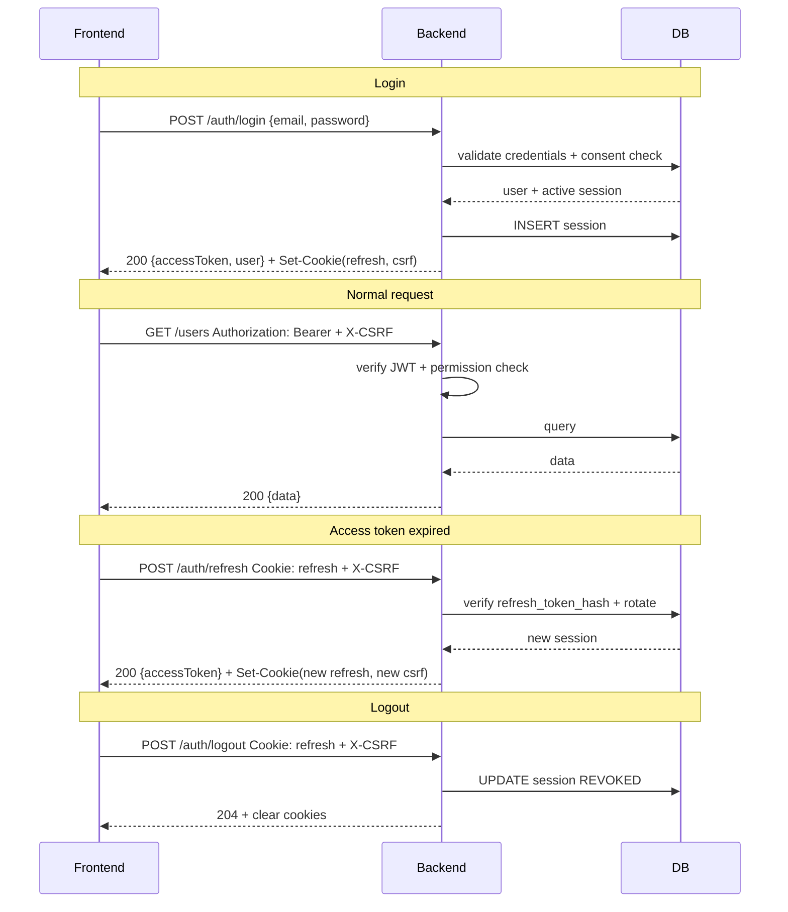

# Lean Management Platformu — API Kontratları

> Bu doküman frontend ile backend arasındaki tam kontratı tanımlar. Frontend agent'ı bu dokümanla her UI etkileşimini kurar; backend agent'ı her endpoint'i bu şartnameye göre implement eder.

---

## 1. Genel Prensipler

**Base URL:**

| Ortam | Base URL |
|---|---|
| Development | `http://localhost:3001` |
| Staging | `https://api-staging.leanmgmt.<domain>` |
| Production | `https://api.leanmgmt.<domain>` |

**Versiyonlama:** URL path üzerinden — tüm endpoint'ler `/api/v1/...` ile başlar. Major değişikliklerde yeni sürüm path'i açılır (`/api/v2/`); minor değişiklikler backward-compatible kalır.

**Content-Type:** `application/json; charset=utf-8`. Dosya yükleme hariç tüm request ve response body'ler JSON.

**Date format:** Tüm tarih alanları ISO 8601 UTC (`2026-04-23T14:32:00.000Z`). Sunucu saat dilimi kabul etmez; client her tarihi UTC'ye çevirip gönderir.

**URL naming:** `kebab-case` — örn. `/api/v1/master-data/companies`, `/api/v1/auth/password-reset-request`.

**JSON field naming:** `camelCase` — örn. `firstName`, `companyId`, `createdAt`.

**HTTP methods:**
- `GET` — okuma (idempotent, cache'lenebilir)
- `POST` — yaratma veya non-idempotent aksiyonlar (claim, complete, cancel, logout vb.)
- `PATCH` — kısmi güncelleme
- `DELETE` — kayıt silme (yalnız dinamik rol silme gibi hard delete olan birkaç yerde)

`PUT` **kullanılmaz** — REST tasarım kararı. Tam değiştirme yerine `PATCH` ile kısmi güncelleme; silme-oluşturma yerine doğrudan `PATCH`.

**Request correlation:** Her request'e sunucu bir `X-Request-Id` header'ı ekler (UUID). Client de gönderebilir; gönderdiyse sunucu onu kullanır. Error response'larının `requestId` alanı bu değerdir — destek talebinde tek referans.

**Trailing slash:** Yok. `/api/v1/users` çağrılır, `/api/v1/users/` reject edilir (404).

---

## 2. Standart Response Zarfı

Tüm JSON response'lar üç formattan birindedir:

**Success (tekil kayıt):**

```json
{
  "data": {
    "id": "clx1a2b3c4d5e6f7g8h9",
    "firstName": "Ali",
    "lastName": "Yılmaz",
    "createdAt": "2026-04-23T14:32:00.000Z"
  }
}
```

**Success (koleksiyon — sayfalama olmadan):**

```json
{
  "data": [
    { "id": "...", "name": "ABC Şirketi" },
    { "id": "...", "name": "XYZ Şirketi" }
  ]
}
```

**Success (paginated):**

```json
{
  "data": [
    { "id": "...", "displayId": "KTI-000001" },
    { "id": "...", "displayId": "KTI-000002" }
  ],
  "pagination": {
    "nextCursor": "eyJpZCI6ImNseDFhMmIzYzRkNWU2ZjcifQ==",
    "hasMore": true,
    "total": 1234
  }
}
```

`total` yalnız ucuz hesaplanabildiği listelerde döner (kullanıcı listesi, master data, notifications); audit log ve süreç listesi gibi büyük tablolarda atlanır.

**Error:**

```json
{
  "error": {
    "code": "USER_SICIL_DUPLICATE",
    "message": "Bu sicil numarası sistemde zaten kayıtlı.",
    "requestId": "550e8400-e29b-41d4-a716-446655440000",
    "timestamp": "2026-04-23T14:32:00.000Z",
    "details": {
      "field": "sicil"
    }
  }
}
```

`details` opsiyonel; teknik bağlam taşır (örn. validation hatalarında hangi field'ın hangi kurala takıldığı). User-facing mesaj her zaman `message` alanında Türkçe.

**2xx response'larında `error` alanı yoktur; non-2xx response'larında `data` alanı yoktur.** İstemci iki alanın varlığına göre success/error ayrıştırması yapabilir — HTTP status ile uyumlu.

---

## 3. Error Taxonomy

**Error code formatı:** `DOMAIN_ENTITY_CONDITION` — UPPER_SNAKE_CASE. Tüm error code'lar sabit enum'dur; yeni kod eklemek bir geliştirme işlemidir.

### Tam Error Code Listesi

| Code | HTTP | Koşul | User message |
|---|---|---|---|
| **AUTH** | | | |
| `AUTH_INVALID_CREDENTIALS` | 401 | Login'de yanlış email/şifre veya kullanıcı yok (enumeration önlemi — aynı mesaj) | "Email veya şifre hatalı." |
| `AUTH_TOKEN_EXPIRED` | 401 | Access token süresi dolmuş | "Oturumunuz sona erdi, lütfen yeniden giriş yapın." |
| `AUTH_TOKEN_INVALID` | 401 | Geçersiz, bozuk veya imzası yanlış JWT | "Oturumunuz geçersiz, lütfen yeniden giriş yapın." |
| `AUTH_SESSION_REVOKED` | 401 | Session blacklist'te veya REVOKED | "Oturumunuz kapatıldı, lütfen yeniden giriş yapın." |
| `AUTH_ACCOUNT_LOCKED` | 423 | Hesap başarısız giriş nedeniyle kilitli | "Çok fazla başarısız deneme. Hesabınız X dakika kilitli." |
| `AUTH_ACCOUNT_PASSIVE` | 403 | Kullanıcı `is_active=false` | "Hesabınız pasif durumdadır, sistem yöneticinize başvurun." |
| `AUTH_CONSENT_REQUIRED` | 403 | Aktif rıza versiyonu onaylanmamış | "Devam etmek için KVKK rıza metnini onaylamanız gerekmektedir." |
| `AUTH_PASSWORD_EXPIRED` | 403 | Şifre süresi dolmuş, değiştirmek zorunlu | "Şifrenizin süresi doldu, yeni şifre belirleyin." |
| `AUTH_IP_NOT_WHITELISTED` | 403 | Superadmin whitelist dışı IP'den login | "Bu IP adresinden Superadmin girişi yetkisiz." |
| **CSRF** | | | |
| `CSRF_TOKEN_INVALID` | 403 | X-CSRF-Token header eksik veya eşleşmiyor | "Güvenlik doğrulaması başarısız, sayfayı yenileyip tekrar deneyin." |
| **VALIDATION** | | | |
| `VALIDATION_FAILED` | 400 | Zod input validation başarısız | "Formu kontrol edin." (details: alan bazlı hata listesi) |
| `VALIDATION_UNSUPPORTED_FORMAT` | 400 | Content-Type veya body formatı geçersiz | "İstek formatı geçersiz." |
| **PERMISSION** | | | |
| `PERMISSION_DENIED` | 403 | Yetki yok | "Bu işlem için yetkiniz bulunmuyor." |
| **USER** | | | |
| `USER_NOT_FOUND` | 404 | Kullanıcı bulunamadı | "Kullanıcı bulunamadı." |
| `USER_SICIL_DUPLICATE` | 409 | Sicil çakışması | "Bu sicil numarası zaten kayıtlı." |
| `USER_EMAIL_DUPLICATE` | 409 | Email çakışması | "Bu email adresi zaten kayıtlı." |
| `USER_SELF_EDIT_FORBIDDEN` | 403 | Kullanıcı kendi attribute'unu düzenlemeye kalkıştı | "Kendi bilgilerinizi düzenleme yetkiniz bulunmuyor." |
| `USER_MANAGER_CYCLE` | 422 | Yönetici atamasında cycle | "Bu atama yönetici zincirinde döngü oluşturur." |
| `USER_ALREADY_PASSIVE` | 409 | Zaten pasif kullanıcıyı pasifleştirme girişimi | "Kullanıcı zaten pasif durumda." |
| `USER_ALREADY_ACTIVE` | 409 | Zaten aktif kullanıcıyı aktifleştirme girişimi | "Kullanıcı zaten aktif durumda." |
| `USER_ANONYMIZED` | 403 | Anonimleştirilmiş kullanıcı login denemesi | "Bu hesaba erişim kapatılmıştır." |
| **ROLE** | | | |
| `ROLE_NOT_FOUND` | 404 | Rol bulunamadı | "Rol bulunamadı." |
| `ROLE_CODE_DUPLICATE` | 409 | Rol kodu çakışması | "Bu rol kodu zaten kullanımda." |
| `ROLE_SYSTEM_CANNOT_DELETE` | 403 | Sistem rolünü silme girişimi | "Sistem rolleri silinemez." |
| `ROLE_SYSTEM_CANNOT_EDIT_CODE` | 403 | Sistem rolü `code` değiştirme girişimi | "Sistem rolü kodu değiştirilemez." |
| `ROLE_SELF_EDIT_FORBIDDEN` | 403 | Rol ve Yetki Yöneticisi kendi rolünü değiştirmeye kalkıştı | "Kendi rolünüzü değiştirme yetkiniz bulunmuyor." |
| `ROLE_RULE_INVALID_STRUCTURE` | 422 | Boş condition set veya geçersiz kural yapısı | "Kural yapısı geçersiz — en az bir koşul zorunlu." |
| **MASTER_DATA** | | | |
| `MASTER_DATA_NOT_FOUND` | 404 | Master data kaydı yok | "Kayıt bulunamadı." |
| `MASTER_DATA_CODE_DUPLICATE` | 409 | Kod çakışması | "Bu kod zaten kullanımda." |
| `MASTER_DATA_CODE_IMMUTABLE` | 403 | `code` değiştirme girişimi | "Kod değiştirilemez." |
| `MASTER_DATA_IN_USE` | 422 | Aktif kullanıcısı olan master data'yı pasifleştirme | "Bu kayıt aktif kullanıcılar tarafından kullanılıyor, önce kullanıcıları taşıyın." |
| `MASTER_DATA_PARENT_INACTIVE` | 422 | Pasif parent altına child ekleme | "Üst kayıt pasif durumda, önce aktifleştirin." |
| **PROCESS** | | | |
| `PROCESS_NOT_FOUND` | 404 | Süreç bulunamadı | "Süreç bulunamadı." |
| `PROCESS_ACCESS_DENIED` | 403 | Süreç kullanıcının değil + yetki yok | "Bu sürece erişim yetkiniz bulunmuyor." |
| `PROCESS_INVALID_STATE` | 409 | Geçersiz state transition (örn. tamamlanmış süreci iptal) | "Bu işlem mevcut süreç durumunda yapılamaz." |
| `PROCESS_CANCEL_REASON_REQUIRED` | 400 | İptal gerekçesi eksik | "İptal gerekçesi zorunludur." |
| `PROCESS_ROLLBACK_INVALID_TARGET` | 422 | Geçersiz rollback hedef adımı | "Bu adıma geri dönüş mümkün değil." |
| `PROCESS_TYPE_UNKNOWN` | 400 | Bilinmeyen süreç tipi | "Bu süreç tipi desteklenmiyor." |
| `PROCESS_START_FORBIDDEN` | 403 | Başlatma yetkisi yok | "Bu süreci başlatma yetkiniz bulunmuyor." |
| **TASK** | | | |
| `TASK_NOT_FOUND` | 404 | Görev bulunamadı | "Görev bulunamadı." |
| `TASK_ACCESS_DENIED` | 403 | Görev kullanıcıya atanmamış | "Bu göreve erişim yetkiniz bulunmuyor." |
| `TASK_ALREADY_COMPLETED` | 409 | Tamamlanmış görevde aksiyon | "Bu görev zaten tamamlanmış." |
| `TASK_CLAIM_LOST` | 409 | Başka bir aday claim etti | "Bu görev başka bir kullanıcı tarafından üstlenildi." |
| `TASK_COMPLETION_ACTION_INVALID` | 422 | Süreç tanımının izin vermediği action | "Bu aksiyon bu adım için geçersiz." |
| `TASK_REASON_REQUIRED` | 400 | Red veya Revize için gerekçe eksik | "Gerekçe alanı zorunludur." |
| `TASK_NOT_CLAIMABLE` | 422 | SINGLE veya ALL_REQUIRED mode'da claim girişimi | "Bu görev üstlenme modunda değil." |
| **DOCUMENT** | | | |
| `DOCUMENT_NOT_FOUND` | 404 | Doküman bulunamadı | "Doküman bulunamadı." |
| `DOCUMENT_SCAN_PENDING` | 409 | Tarama devam ediyor, erişilemez | "Doküman hâlâ güvenlik taramasından geçiyor." |
| `DOCUMENT_INFECTED` | 403 | Enfekte doküman erişim girişimi | "Doküman güvenlik taramasında zararlı tespit edildiği için erişilemiyor." |
| `DOCUMENT_SIZE_EXCEEDED` | 413 | Dosya boyutu limiti aşıldı | "Dosya boyutu 10 MB'ı aşamaz." |
| `DOCUMENT_CONTENT_TYPE_INVALID` | 415 | İzin verilmeyen format | "Bu dosya formatı desteklenmiyor." |
| `DOCUMENT_URL_EXPIRED` | 410 | Signed URL süresi doldu | "Erişim bağlantısının süresi doldu, yeniden yükleyin." |
| `DOCUMENT_UPLOAD_FORBIDDEN` | 403 | Upload yetkisi yok (sürece bağlı değil) | "Dosya yükleme yetkiniz bulunmuyor." |
| **CONSENT** | | | |
| `CONSENT_VERSION_NOT_FOUND` | 404 | Rıza versiyonu yok | "Rıza versiyonu bulunamadı." |
| `CONSENT_ALREADY_PUBLISHED` | 409 | PUBLISHED versiyon düzenleme | "Yayınlanmış rıza metni düzenlenemez." |
| **RATE_LIMIT** | | | |
| `RATE_LIMIT_IP` | 429 | IP rate limit aşımı | "Çok fazla istek. Lütfen bir süre sonra tekrar deneyin." |
| `RATE_LIMIT_USER` | 429 | Kullanıcı rate limit aşımı | "Çok fazla istek. Lütfen biraz bekleyin." |
| `RATE_LIMIT_LOGIN` | 429 | Login progressive delay / lockout | "Çok fazla başarısız deneme. X saniye sonra tekrar deneyin." |
| **SYSTEM** | | | |
| `SYSTEM_MAINTENANCE` | 503 | Planlı bakım | "Sistem bakımda, lütfen daha sonra tekrar deneyin." |
| `SYSTEM_INTERNAL_ERROR` | 500 | Unhandled exception | "Beklenmeyen bir hata oluştu, ekibimize bildirildi." |
| `SYSTEM_DEPENDENCY_DOWN` | 503 | DB/Redis/KMS erişilemez | "Sistem geçici olarak erişilemiyor." |
| `SYSTEM_SETTING_INVALID` | 400 | System setting value şema uyumsuz | "Ayar değeri geçersiz." |

### HTTP Status Mapping Özeti

| Status | Anlamı | Ne zaman |
|---|---|---|
| `200 OK` | Başarılı okuma veya idempotent aksiyon | GET, mark-read, re-publish |
| `201 Created` | Yeni kayıt oluşturuldu | POST /users, POST /processes/kti/start |
| `204 No Content` | Başarılı, dönecek içerik yok | DELETE rol, logout |
| `400 Bad Request` | Validation veya format hatası | VALIDATION_FAILED, eksik zorunlu alan |
| `401 Unauthorized` | Auth başarısız | AUTH_* kodları |
| `403 Forbidden` | Yetki yok veya durumsal yasak | PERMISSION_DENIED, ROLE_SYSTEM_*, DOCUMENT_INFECTED |
| `404 Not Found` | Kaynak yok | *_NOT_FOUND |
| `409 Conflict` | State conflict, duplicate | *_DUPLICATE, *_ALREADY_* |
| `410 Gone` | Kaynak vardı, artık yok | DOCUMENT_URL_EXPIRED |
| `413 Payload Too Large` | Dosya/body boyutu aşımı | DOCUMENT_SIZE_EXCEEDED |
| `415 Unsupported Media Type` | Content-Type izin verilmiyor | DOCUMENT_CONTENT_TYPE_INVALID |
| `422 Unprocessable Entity` | Syntax doğru ama business rule fail | USER_MANAGER_CYCLE, MASTER_DATA_IN_USE |
| `423 Locked` | Kaynak geçici kilitli | AUTH_ACCOUNT_LOCKED |
| `429 Too Many Requests` | Rate limit | RATE_LIMIT_* (Retry-After header) |
| `500 Internal Server Error` | Unhandled | SYSTEM_INTERNAL_ERROR |
| `503 Service Unavailable` | Dependency/maintenance | SYSTEM_MAINTENANCE, SYSTEM_DEPENDENCY_DOWN (Retry-After header) |

### Frontend Davranış Matrisi

| Error kategori | Frontend davranışı |
|---|---|
| `AUTH_TOKEN_*`, `AUTH_SESSION_REVOKED` | Toast + otomatik login sayfasına redirect |
| `AUTH_CONSENT_REQUIRED` | Rıza modal'ına redirect (diğer sayfaları açmaz) |
| `AUTH_PASSWORD_EXPIRED` | Zorunlu şifre değiştirme ekranına redirect |
| `AUTH_ACCOUNT_LOCKED`, `AUTH_ACCOUNT_PASSIVE` | Login ekranında inline mesaj; retry devre dışı |
| `VALIDATION_FAILED` | Form alanlarında inline error (details.fields üzerinden) |
| `PERMISSION_DENIED` | Toast + route guard ile dashboard'a redirect |
| `*_NOT_FOUND` | Sayfa-level empty state veya 404 sayfası |
| `*_DUPLICATE`, `*_ALREADY_*`, `*_IN_USE` | Modal/form içinde inline error mesajı |
| `RATE_LIMIT_*` | Toast + Retry-After'a göre countdown |
| `DOCUMENT_SCAN_PENDING` | Dosya UI'da "Taranıyor..." rozeti; polling devam |
| `DOCUMENT_INFECTED` | Dosya yerine kırmızı etiket + mesaj |
| `SYSTEM_MAINTENANCE`, `SYSTEM_DEPENDENCY_DOWN` | Full-page maintenance ekranı |
| `SYSTEM_INTERNAL_ERROR` | Toast: "Beklenmeyen hata" + Sentry'ye yakala (frontend side) |

---

## 4. Rate Limiting

Rate limit iki katmanda uygulanır: **WAF (CloudFront)** tarafında edge-level, **backend (API gateway tier)** tarafında application-level. Aşağıdaki tablo backend limitlerini gösterir; WAF limitleri `07_SECURITY_IMPLEMENTATION`'da.

| Kapsam | Endpoint grubu | Limit | Pencere |
|---|---|---|---|
| **Anonim (auth'suz)** | Global | 100 | 1 dakika |
| **Authenticated kullanıcı** | Global | 300 | 1 dakika |
| **Login endpoint** | `POST /api/v1/auth/login` | 5 başarısız | 15 dakika (email + IP bazlı) |
| **Password reset request** | `POST /api/v1/auth/password-reset-request` | 3 | 1 saat (email bazlı) |
| **Document download URL** | `GET /api/v1/documents/:id/download-url` | 50 | 5 dakika (kullanıcı bazlı) |
| **Data export endpoint'leri** | `GET /api/v1/admin/audit-logs/export` | 10 | 1 saat (kullanıcı bazlı) |

**429 response örneği:**

```http
HTTP/1.1 429 Too Many Requests
Retry-After: 60
Content-Type: application/json
```

```json
{
  "error": {
    "code": "RATE_LIMIT_USER",
    "message": "Çok fazla istek. Lütfen biraz bekleyin.",
    "requestId": "...",
    "timestamp": "...",
    "details": {
      "retryAfterSeconds": 60
    }
  }
}
```

**Login progressive delay:** Her başarısız login'den sonra response gecikmesi artar (1s → 2s → 4s → 8s). 5 deneme aşıldığında hesap 30 dakika kilitlenir; IP bazlı 20 başarısız / 15dk → 1 saat IP ban.

**Rate limit parametreleri** (login, lockout) `system_settings` tablosundan runtime'da okunur; Superadmin Sistem Ayarları ekranından değiştirebilir.

---

## 5. Pagination

**Strateji:** Cursor-based pagination. Offset-based kullanılmaz — audit log ve süreç listesi append-heavy; offset gecikmeli sonuç verir ve performansı düşürür.

**Cursor:** Opaque base64 string. Client cursor'ın içeriğini parse etmeye çalışmaz; sadece bir sonraki çağrıda aynen gönderir.

**Query parametreleri:**
- `limit` — 1-200 arası integer, default 50
- `cursor` — opsiyonel; ilk sayfada boş, sonraki sayfalarda önceki response'tan alınan `nextCursor`

**Örnek:**

```http
GET /api/v1/processes?limit=50&cursor=eyJpZCI6ImNseDFhMmIzIn0%3D
```

```json
{
  "data": [ ... 50 items ... ],
  "pagination": {
    "nextCursor": "eyJpZCI6ImNseDFhMmI0In0=",
    "hasMore": true,
    "total": 1234
  }
}
```

**Son sayfa:** `hasMore: false` ve `nextCursor: null`.

**`total` dönüşü:** Yalnız backend'in ucuz hesaplayabildiği listelerde. Audit log, süreç listesi (büyük tablolar) `total` döndürmez; kullanıcılara sayfalama "sayfa 3 / 100" yerine "daha fazla" butonu ile sunulur.

**Sıralama:** Her liste endpoint'i varsayılan bir sıralamaya sahiptir (örn. `created_at DESC`). Farklı sıralama gereken listeler `sort` query param'ı ile kontrol edilir (whitelist değerler; arbitrary sort yasak).

---

## 6. Authentication

**Token modeli:**
- **Access token (JWT, 15 dk, RS256):** Her authenticated request'e `Authorization: Bearer <jwt>` header'ı ile eklenir. Client memory'sinde tutulur (localStorage yasak).
- **Refresh token (opaque, 7 gün, single-use):** `refresh_token` adlı `HttpOnly + Secure + SameSite=Strict` cookie olarak set edilir. JavaScript erişimi yoktur; sadece tarayıcı otomatik iliştirir.

**CSRF koruması (double-submit cookie pattern):**
- Login sonrası backend iki değer set eder: `csrf_token` (cookie) + response body'deki `csrfToken` (frontend memory).
- Her mutating request'te (`POST`, `PATCH`, `DELETE`) frontend `X-CSRF-Token` header'ı gönderir; backend header değeri ile cookie değerini karşılaştırır. Uyumsuz → `403 CSRF_TOKEN_INVALID`.
- `GET` istekleri CSRF kontrolünden muaf (idempotent, body mutation yok).

### Login Akışı

**1. Login isteği:**

```http
POST /api/v1/auth/login
Content-Type: application/json

{
  "email": "ali.yilmaz@holding.com",
  "password": "S3cure!Passw0rd1234"
}
```

**Başarılı 200 response:**

```http
Set-Cookie: refresh_token=<opaque>; HttpOnly; Secure; SameSite=Strict; Path=/api/v1/auth
Set-Cookie: csrf_token=<random>; Secure; SameSite=Strict; Path=/
```

```json
{
  "data": {
    "accessToken": "eyJhbGc...",
    "accessTokenExpiresAt": "2026-04-23T14:47:00.000Z",
    "csrfToken": "<random>",
    "user": {
      "id": "clx...",
      "sicil": "12345678",
      "firstName": "Ali",
      "lastName": "Yılmaz",
      "email": "ali.yilmaz@holding.com",
      "permissions": ["USER_CREATE", "PROCESS_KTI_START", "..."],
      "activeConsentVersionId": "clx...",
      "consentAccepted": true
    }
  }
}
```

Eğer `consentAccepted: false` dönerse frontend tüm sayfaları kilitler, rıza modal'ını açar; kullanıcı onay vermeden hiçbir endpoint'e erişim olmaz (middleware 403 + `AUTH_CONSENT_REQUIRED`).

### Request Gönderme

```http
GET /api/v1/users
Authorization: Bearer eyJhbGc...
Cookie: refresh_token=...; csrf_token=...
X-CSRF-Token: <random>            # yalnız POST/PATCH/DELETE için
X-Request-Id: <uuid>               # opsiyonel; sunucu üretir yoksa
```

### Access Token Yenileme

Frontend access token'ın `expiresAt`'ine 1 dakika kala (veya `AUTH_TOKEN_EXPIRED` response aldığında) sessiz yenileme yapar:

```http
POST /api/v1/auth/refresh
Cookie: refresh_token=...
X-CSRF-Token: <random>
```

**200 response:**
- Yeni `accessToken` body'de
- Yeni `refresh_token` cookie'de (rotation — eski token tek kullanımlık, bir daha geçerli değil)
- Yeni `csrf_token` cookie + body

Aynı refresh token ikinci kez kullanılırsa → session chain revoke, `401 AUTH_SESSION_REVOKED`.

### Logout

```http
POST /api/v1/auth/logout
Cookie: refresh_token=...
X-CSRF-Token: <random>
```

**204 response:**
- `refresh_token` cookie silinir (`Max-Age=0`)
- `csrf_token` cookie silinir
- Backend session kaydını `REVOKED` yapar, access token JWT'yi blacklist'e ekler (TTL=15dk — token doğal expire'ına kadar)

### Auth Sequence Diagram



**Güvenlik detayları** (IP hash, User-Agent fingerprint, concurrent session limit, superadmin IP whitelist, progressive delay) `07_SECURITY_IMPLEMENTATION`'da detaylanır.

---

## 7. Audit Annotation Disiplini

Her mutating endpoint'in (POST, PATCH, DELETE) şablonunda zorunlu `**Audit:**` satırı vardır. Bu satır:
- Hangi `action` enum değerinin audit_logs'a yazılacağı
- Hangi `entity` ve `entity_id` bağlanacağı
- `old_value` ve `new_value`'nun hangi alanları içereceği (hassas field maskelemesi notuyla)

Örnek: `**Audit:** `CREATE_USER` — entity=`user`, entity_id=yeni user.id, new_value=yeni user snapshot (sicil/email/phone masked).`

Endpoint implementasyonu `AuditInterceptor` ile otomatik audit yazar; interceptor'ın hangi payload'ı yazacağı bu satıra göre koda işlenir.

---

## 8. Webhooks

MVP'de webhook yoktur — dışa giden veya dıştan gelen webhook akışı kapsam dışıdır. Altyapı (event-driven notification sistemi) ileride webhook kanalının eklenmesini destekleyecek şekilde tasarlanmıştır ([I-004]).

---

## 9. Endpoint'ler — Modül Bazlı

Bu bölüm platformdaki tüm endpoint'leri modül bazlı gruplayarak detaylandırır. Her endpoint için sabit şablon uygulanır:

- **Purpose** — 1 cümlelik amaç
- **Auth** — gerekli yetki(ler)
- **Rate limit** — özel limit varsa
- **Request** — HTTP method, path, path/query params, body
- **Field kuralları** — validation, business rules
- **Response 2xx** — body örneği
- **Errors** — endpoint'e özel error code listesi
- **Audit** — mutating endpoint'lerde zorunlu

### 9.1 Auth Modülü

#### `POST /api/v1/auth/login`

**Purpose:** Email + şifre ile oturum açma.
**Auth:** Public (hiçbir auth header gerekmez).
**Rate limit:** 5 başarısız deneme / 15 dk (email + IP bazlı); progressive delay (1-2-4-8 sn); 30 dk lockout.

**Request body:**
```json
{
  "email": "ali.yilmaz@holding.com",
  "password": "S3cure!Passw0rd1234"
}
```

**Field kuralları:**
- `email`: RFC 5322, lowercase'e normalize edilir, max 254 karakter
- `password`: min 1 karakter (doğrulama için — ama backend policy min 12)

**Response 200:**
```json
{
  "data": {
    "accessToken": "eyJhbGc...",
    "accessTokenExpiresAt": "2026-04-23T14:47:00.000Z",
    "csrfToken": "<random>",
    "user": {
      "id": "clx...",
      "sicil": "12345678",
      "firstName": "Ali",
      "lastName": "Yılmaz",
      "email": "ali.yilmaz@holding.com",
      "permissions": ["USER_CREATE", "PROCESS_KTI_START"],
      "activeConsentVersionId": "clx...",
      "consentAccepted": true,
      "passwordExpiresAt": "2026-10-23T00:00:00.000Z"
    }
  }
}
```

Cookie'ler: `refresh_token` (HttpOnly, Secure, SameSite=Strict, Path=/api/v1/auth), `csrf_token` (Secure, SameSite=Strict, Path=/).

**Errors:**
| Code | HTTP | Koşul |
|---|---|---|
| `AUTH_INVALID_CREDENTIALS` | 401 | Email/şifre yanlış veya kullanıcı yok |
| `AUTH_ACCOUNT_LOCKED` | 423 | Hesap kilitli (details.unlocksAt döner) |
| `AUTH_ACCOUNT_PASSIVE` | 403 | Kullanıcı pasif |
| `USER_ANONYMIZED` | 403 | Kullanıcı anonimleştirilmiş |
| `AUTH_IP_NOT_WHITELISTED` | 403 | Superadmin whitelist dışı IP |
| `VALIDATION_FAILED` | 400 | Email format |
| `RATE_LIMIT_LOGIN` | 429 | Progressive delay aktif |

**Audit:** `login_attempts` tablosuna her deneme yazılır (outcome + failure_reason + blocked_by). Başarılı login ek olarak `audit_logs`'a `USER_LOGIN` entity=`user`, entity_id=user.id.

---

#### `POST /api/v1/auth/refresh`

**Purpose:** Access token yenileme — refresh token rotation.
**Auth:** `refresh_token` cookie + `X-CSRF-Token` header.
**Rate limit:** Global authenticated limit.

**Request:** Body yok; cookie ve header ile.

**Response 200:**
```json
{
  "data": {
    "accessToken": "eyJhbGc...",
    "accessTokenExpiresAt": "2026-04-23T15:02:00.000Z",
    "csrfToken": "<new-random>"
  }
}
```

Yeni `refresh_token` ve `csrf_token` cookie'leri set edilir (rotation).

**Errors:**
| Code | HTTP | Koşul |
|---|---|---|
| `AUTH_TOKEN_INVALID` | 401 | refresh_token cookie yok / geçersiz |
| `AUTH_SESSION_REVOKED` | 401 | Session REVOKED (replay attack, manual logout) |
| `CSRF_TOKEN_INVALID` | 403 | CSRF header eksik/yanlış |
| `AUTH_ACCOUNT_PASSIVE` | 403 | Refresh sırasında kullanıcı pasifleştirilmiş |

**Audit:** Session kaydı `ROTATED` status'e geçer; yeni session INSERT. Audit log'a yazılmaz (yüksek frekans).

---

#### `POST /api/v1/auth/logout`

**Purpose:** Mevcut oturumu sonlandırma.
**Auth:** Access token + `X-CSRF-Token`.

**Request:** Body yok.

**Response 204:** No content. `refresh_token` ve `csrf_token` cookie'leri `Max-Age=0` ile silinir.

**Errors:**
| Code | HTTP | Koşul |
|---|---|---|
| `CSRF_TOKEN_INVALID` | 403 | CSRF eşleşmiyor |

**Audit:** `USER_LOGOUT` entity=`user`, entity_id=user.id, metadata={sessionId, revocationReason: `USER_INITIATED`}. Session status → `REVOKED`.

---

#### `POST /api/v1/auth/logout-all`

**Purpose:** Kullanıcının tüm aktif oturumlarını sonlandırma.
**Auth:** Access token + `X-CSRF-Token`.

**Request:** Body yok.

**Response 204:** No content. Mevcut request'in cookie'leri de silinir.

**Audit:** `USER_LOGOUT_ALL` entity=`user`, metadata={revokedSessionCount: N, revocationReason: `USER_INITIATED`}. Tüm ACTIVE session'lar REVOKED.

---

#### `POST /api/v1/auth/password-reset-request`

**Purpose:** Şifre sıfırlama linki email'e gönderme.
**Auth:** Public.
**Rate limit:** 3 / saat / email (+ 10 / saat / IP).

**Request body:**
```json
{
  "email": "ali.yilmaz@holding.com"
}
```

**Response 200:**
```json
{
  "data": {
    "message": "Eğer bu email sistemde kayıtlıysa, şifre sıfırlama bağlantısı gönderildi."
  }
}
```

Enumeration önlemi — email var veya yok her ikisinde aynı 200 + aynı mesaj.

**Errors:**
| Code | HTTP | Koşul |
|---|---|---|
| `VALIDATION_FAILED` | 400 | Email format |
| `RATE_LIMIT_IP` | 429 | IP rate limit |

**Audit:** `PASSWORD_RESET_REQUESTED` entity=`user` (email resolve edildiyse entity_id dolu; yoksa null), metadata={emailBlindIndex, ipHash}.

---

#### `POST /api/v1/auth/password-reset-confirm`

**Purpose:** Reset token ile yeni şifre belirleme.
**Auth:** Public (token ile).
**Rate limit:** 10 / saat / IP.

**Request body:**
```json
{
  "token": "<32-byte base64url>",
  "newPassword": "NewS3cure!Passw0rd2026"
}
```

**Field kuralları:**
- `token`: 32 byte base64url (43 karakter)
- `newPassword`: min 12 karakter, şifre policy (uppercase/lowercase/digit/special), HIBP k-anonymity kontrolü, platform-specific yasak kelimeler, son 5 şifreden farklı

**Response 200:**
```json
{
  "data": {
    "message": "Şifreniz başarıyla güncellendi. Lütfen yeni şifrenizle giriş yapın."
  }
}
```

**Errors:**
| Code | HTTP | Koşul |
|---|---|---|
| `VALIDATION_FAILED` | 400 | Şifre policy ihlali (details'ta ihlal edilen kural) |
| `AUTH_TOKEN_INVALID` | 401 | Token yok, expired, veya kullanılmış |

**Audit:** `PASSWORD_CHANGED` entity=`user`, entity_id=user.id, metadata={source: `RESET_TOKEN`}. Tüm ACTIVE session'lar REVOKED. PasswordHistory'ye yeni hash eklenir; ring buffer uygulanır.

---

#### `POST /api/v1/auth/change-password`

**Purpose:** Oturum açmış kullanıcının kendi şifresini değiştirmesi.
**Auth:** Access token + `X-CSRF-Token`.
**Rate limit:** 5 / saat / kullanıcı.

**Request body:**
```json
{
  "currentPassword": "S3cure!Passw0rd1234",
  "newPassword": "NewS3cure!Passw0rd2026"
}
```

**Field kuralları:**
- `currentPassword`: mevcut şifre doğrulaması için; bcrypt compare
- `newPassword`: reset akışıyla aynı policy

**Response 204:** No content. Kullanıcının **diğer** tüm session'ları REVOKED; mevcut session yenilenir (yeni refresh + csrf cookie).

**Errors:**
| Code | HTTP | Koşul |
|---|---|---|
| `VALIDATION_FAILED` | 400 | Yeni şifre policy |
| `AUTH_INVALID_CREDENTIALS` | 401 | currentPassword yanlış |
| `CSRF_TOKEN_INVALID` | 403 | CSRF |

**Audit:** `PASSWORD_CHANGED` entity=`user`, metadata={source: `SELF_SERVICE`, revokedSessionCount: N}.

---

#### `GET /api/v1/auth/me`

**Purpose:** Mevcut kullanıcı bilgisi ve permission seti.
**Auth:** Access token.

**Response 200:**
```json
{
  "data": {
    "id": "clx...",
    "sicil": "12345678",
    "firstName": "Ali",
    "lastName": "Yılmaz",
    "email": "ali.yilmaz@holding.com",
    "phone": "+905551234567",
    "employeeType": "WHITE_COLLAR",
    "company": { "id": "...", "code": "ABC", "name": "ABC Şirketi" },
    "location": { "id": "...", "code": "IST", "name": "İstanbul" },
    "department": { "id": "...", "code": "PROD", "name": "Üretim" },
    "position": { "id": "...", "code": "MGR", "name": "Müdür" },
    "level": { "id": "...", "code": "L5", "name": "L5" },
    "team": null,
    "workArea": { "id": "...", "code": "ASSEMBLY", "name": "Montaj" },
    "workSubArea": { "id": "...", "code": "LINE_1", "name": "Hat 1" },
    "manager": { "id": "...", "sicil": "87654321", "firstName": "Ayşe", "lastName": "Kaya" },
    "roles": [
      { "id": "...", "code": "USER_MANAGER", "name": "Kullanıcı Yöneticisi", "source": "DIRECT" },
      { "id": "...", "code": "KTI_INITIATOR", "name": "KTİ Başlatıcı", "source": "ATTRIBUTE_RULE" }
    ],
    "permissions": ["USER_CREATE", "USER_UPDATE_ATTRIBUTE", "PROCESS_KTI_START", "..."],
    "activeConsentVersionId": "clx...",
    "consentAccepted": true,
    "passwordExpiresAt": "2026-10-23T00:00:00.000Z"
  }
}
```

**Errors:** Standart auth error'ları.

**Audit:** Yok (read-only, yüksek frekans).

---

#### `GET /api/v1/auth/sessions`

**Purpose:** Kullanıcının aktif oturumlarını listeleme (profil ekranı için).
**Auth:** Access token.

**Response 200:**
```json
{
  "data": [
    {
      "id": "clx...",
      "createdAt": "2026-04-23T08:00:00.000Z",
      "lastActiveAt": "2026-04-23T14:30:00.000Z",
      "expiresAt": "2026-04-23T20:00:00.000Z",
      "userAgent": "Mozilla/5.0 ... Chrome/120",
      "ipCity": "İstanbul",
      "isCurrent": true
    }
  ]
}
```

`ipCity` MaxMind GeoIP ile çözülür; IP hash'ten geri çözülmez, session oluşturulurken yazılır.

---

#### `DELETE /api/v1/auth/sessions/:sessionId`

**Purpose:** Spesifik bir oturumu uzaktan sonlandırma.
**Auth:** Access token + `X-CSRF-Token`.

**Request:** Body yok; path param `sessionId`.

**Response 204:** No content.

**Errors:**
| Code | HTTP | Koşul |
|---|---|---|
| `AUTH_TOKEN_INVALID` | 401 | Session kullanıcıya ait değil (404 değil — bilgi sızdırmamak için) |

**Audit:** `USER_LOGOUT` entity=`user`, metadata={sessionId, revocationReason: `ADMIN_REVOKED`}.

---

#### `POST /api/v1/auth/consent/accept`

**Purpose:** Aktif KVKK rıza versiyonunu onaylama.
**Auth:** Access token + `X-CSRF-Token`. Kullanıcı oturum açmış olmalı ama `consentAccepted:false` durumunda bile bu endpoint erişilebilir (diğerleri 403 dönerken bu çalışır).

**Request body:**
```json
{
  "consentVersionId": "clx..."
}
```

**Field kuralları:**
- `consentVersionId`: Sistem'in aktif versiyonuyla eşleşmeli; farklıysa `VALIDATION_FAILED`

**Response 200:**
```json
{
  "data": {
    "acceptedAt": "2026-04-23T14:32:00.000Z",
    "consentVersionId": "clx..."
  }
}
```

**Errors:**
| Code | HTTP | Koşul |
|---|---|---|
| `CONSENT_VERSION_NOT_FOUND` | 404 | Versiyon yok |
| `VALIDATION_FAILED` | 400 | Gönderilen versiyon aktif değil |

**Audit:** `CONSENT_ACCEPTED` entity=`user_consent`, entity_id=user_consent.id, metadata={userId, consentVersionId, version}. `user_consents` tablosuna HMAC imzalı kayıt düşer.

### 9.2 Users Modülü

#### `GET /api/v1/users`

**Purpose:** Kullanıcı listesi (filtre + pagination).
**Auth:** `USER_LIST_VIEW` yetkisi (Superadmin, Kullanıcı Yöneticisi).

**Query params:**
- `limit`, `cursor` (pagination)
- `search` — sicil, ad, soyad, email üzerinde arama (email → blind index lookup)
- `companyId`, `locationId`, `departmentId`, `positionId`, `levelId`, `employeeType` — filtreler
- `isActive` — `true` / `false` / `all` (default `true`)
- `sort` — whitelist: `sicil_asc`, `last_name_asc`, `created_at_desc` (default `last_name_asc`)

**Response 200:**
```json
{
  "data": [
    {
      "id": "clx...",
      "sicil": "12345678",
      "firstName": "Ali",
      "lastName": "Yılmaz",
      "email": "ali.yilmaz@holding.com",
      "company": { "id": "...", "code": "ABC", "name": "ABC Şirketi" },
      "position": { "id": "...", "code": "MGR", "name": "Müdür" },
      "isActive": true,
      "createdAt": "2026-01-15T10:00:00.000Z"
    }
  ],
  "pagination": { "nextCursor": "...", "hasMore": true, "total": 523 }
}
```

**Errors:** `PERMISSION_DENIED` (403).

**Audit:** Yok.

---

#### `POST /api/v1/users`

**Purpose:** Yeni kullanıcı oluşturma.
**Auth:** `USER_CREATE` (Superadmin, Kullanıcı Yöneticisi).
**Rate limit:** 20 / dakika / kullanıcı.

**Request body:**
```json
{
  "sicil": "12345678",
  "firstName": "Ali",
  "lastName": "Yılmaz",
  "email": "ali.yilmaz@holding.com",
  "phone": "+905551234567",
  "employeeType": "WHITE_COLLAR",
  "companyId": "clx...",
  "locationId": "clx...",
  "departmentId": "clx...",
  "positionId": "clx...",
  "levelId": "clx...",
  "teamId": null,
  "workAreaId": "clx...",
  "workSubAreaId": "clx...",
  "managerUserId": "clx...",
  "hireDate": "2026-01-15"
}
```

**Field kuralları:**
- `sicil`: 8 haneli numerik (`^\d{8}$`), unique
- `email`: RFC 5322, max 254 karakter, unique (lowercase normalized)
- `phone`: TR mobil format (`^(\+90|0)?5\d{9}$`), opsiyonel
- `employeeType`: enum `WHITE_COLLAR` / `BLUE_COLLAR` / `INTERN`
- Tüm `*Id` FK'ları aktif master data'ya referans vermeli (`is_active=true`)
- `managerUserId`: aktif kullanıcı; cycle kontrolü (yeni user'ın manager'ı değil — create'te cycle mümkün değil; update'te kritik)
- Şifre **atanmaz** — kullanıcı ilk login'inde "şifre belirle" akışı kullanır (reset token)

**Response 201:**
```json
{
  "data": {
    "id": "clx...",
    "sicil": "12345678",
    "firstName": "Ali",
    "lastName": "Yılmaz",
    "email": "ali.yilmaz@holding.com",
    "isActive": true,
    "createdAt": "2026-04-23T14:32:00.000Z"
  }
}
```

**Errors:**
| Code | HTTP | Koşul |
|---|---|---|
| `VALIDATION_FAILED` | 400 | Field validation |
| `USER_SICIL_DUPLICATE` | 409 | Sicil var |
| `USER_EMAIL_DUPLICATE` | 409 | Email var |
| `MASTER_DATA_NOT_FOUND` | 404 | Referans verilen master data yok |
| `MASTER_DATA_IN_USE` | 422 | Referans verilen master data pasif (`is_active=false`) |
| `PERMISSION_DENIED` | 403 | Yetki yok |

**Audit:** `CREATE_USER` entity=`user`, entity_id=yeni user.id, new_value=snapshot (sicil/email/phone → encrypted value'lar masked, yalnız blind_index görünür).

---

#### `GET /api/v1/users/:id`

**Purpose:** Tek kullanıcı detayı.
**Auth:** `USER_LIST_VIEW` (Superadmin, Kullanıcı Yöneticisi) veya kullanıcının kendisi (`id = currentUser.id`).

**Response 200:** `GET /auth/me` ile aynı zengin format (detaylı kullanıcı objesi). Kendisi ise tüm alanlar; admin ise tüm alanlar.

**Errors:**
| Code | HTTP | Koşul |
|---|---|---|
| `USER_NOT_FOUND` | 404 | |
| `PERMISSION_DENIED` | 403 | Başkasının detayını admin olmadan görmek |

---

#### `PATCH /api/v1/users/:id`

**Purpose:** Kullanıcı attribute güncelleme.
**Auth:** `USER_UPDATE_ATTRIBUTE` (Superadmin, Kullanıcı Yöneticisi). **Kullanıcı kendi kendini düzenleyemez.**
**Rate limit:** 30 / dakika / kullanıcı.

**Request body:** Güncellenecek alanlar (partial — sadece değişenler). `sicil` **hariç** tüm create body alanları güncellenebilir.

```json
{
  "firstName": "Ali",
  "lastName": "Yılmaz",
  "phone": "+905559876543",
  "positionId": "clx-new-position",
  "managerUserId": "clx-new-manager"
}
```

**Field kuralları:**
- `sicil` güncellenemez — request body'de gönderilirse `VALIDATION_FAILED`
- Cycle check: `managerUserId` güncellenirse A → ... → :id zincirinde :id'nin kendisi olmamalı

**Response 200:** Güncellenmiş kullanıcı objesi.

**Errors:**
| Code | HTTP | Koşul |
|---|---|---|
| `VALIDATION_FAILED` | 400 | `sicil` değiştirme dahil |
| `USER_NOT_FOUND` | 404 | |
| `USER_SELF_EDIT_FORBIDDEN` | 403 | :id === currentUser.id |
| `USER_EMAIL_DUPLICATE` | 409 | Email değişiminde çakışma |
| `USER_MANAGER_CYCLE` | 422 | |
| `MASTER_DATA_NOT_FOUND` | 404 | |
| `MASTER_DATA_IN_USE` | 422 | Pasif master data referansı |

**Audit:** `UPDATE_USER_ATTRIBUTE` entity=`user`, entity_id=:id, old_value + new_value (değişen alanlar için delta, PII masked). Attribute değişimi → yetki cache invalidate (Redis `permissions:{userId}` key silinir).

---

#### `POST /api/v1/users/:id/deactivate`

**Purpose:** Kullanıcıyı pasifleştirme.
**Auth:** `USER_DEACTIVATE` (Superadmin, Kullanıcı Yöneticisi).

**Request body:**
```json
{
  "reason": "İşten ayrılış — 2026-04-30"
}
```

**Response 204:** No content.

**Errors:**
| Code | HTTP | Koşul |
|---|---|---|
| `USER_NOT_FOUND` | 404 | |
| `USER_ALREADY_PASSIVE` | 409 | Zaten pasif |
| `USER_SELF_EDIT_FORBIDDEN` | 403 | Kendini pasifleştirme |

**Audit:** `DEACTIVATE_USER` entity=`user`, entity_id=:id, metadata={reason}. Yan etkiler: tüm ACTIVE session'lar REVOKED; aktif task_assignments → süreç tanımına göre re-assign veya rollback (service-layer handler).

---

#### `POST /api/v1/users/:id/reactivate`

**Purpose:** Pasif kullanıcıyı yeniden aktifleştirme.
**Auth:** `USER_REACTIVATE` (Superadmin, Kullanıcı Yöneticisi).

**Request body:**
```json
{
  "reason": "Yeniden işe alım — 2026-06-01"
}
```

**Response 204:** No content.

**Errors:**
| Code | HTTP | Koşul |
|---|---|---|
| `USER_NOT_FOUND` | 404 | |
| `USER_ALREADY_ACTIVE` | 409 | Zaten aktif |
| `USER_ANONYMIZED` | 403 | Anonimleştirilmiş — reaktive edilemez |

**Audit:** `REACTIVATE_USER` entity=`user`, entity_id=:id, metadata={reason}.

---

#### `GET /api/v1/users/me/data`

**Purpose:** Kullanıcının kendi verilerini görüntülemesi (profil "Verilerim" sekmesi).
**Auth:** Access token (kendi verisine erişim).

**Response 200:**
```json
{
  "data": {
    "profile": { "...": "tüm kullanıcı attribute'ları — /auth/me benzeri" },
    "roles": [ { "id": "...", "name": "...", "source": "DIRECT | ATTRIBUTE_RULE" } ],
    "sessionHistory": [
      { "createdAt": "...", "lastActiveAt": "...", "ipCity": "...", "userAgent": "..." }
    ],
    "consentHistory": [
      { "consentVersionId": "...", "version": 2, "acceptedAt": "..." }
    ],
    "processCounts": {
      "initiated": 12,
      "pendingApproval": 3,
      "completed": 8,
      "cancelled": 1
    }
  }
}
```

Kullanıcıya kendi verilerini şeffaf olarak sunar. Export/indirme özelliği MVP kapsamında değildir — yalnız görüntüleme.

**Errors:** Standart auth.

**Audit:** `USER_DATA_VIEWED` entity=`user`, entity_id=currentUser.id (düşük öncelik; opsiyonel).

---

#### `GET /api/v1/users/:id/roles`

**Purpose:** Kullanıcının atanmış rolleri (doğrudan + attribute-based resolved).
**Auth:** `USER_LIST_VIEW`.

**Response 200:**
```json
{
  "data": [
    {
      "id": "clx...",
      "code": "USER_MANAGER",
      "name": "Kullanıcı Yöneticisi",
      "source": "DIRECT",
      "assignedAt": "2026-01-15T10:00:00.000Z",
      "assignedByUserId": "clx-admin"
    },
    {
      "id": "clx...",
      "code": "KTI_INITIATOR",
      "name": "KTİ Başlatıcı",
      "source": "ATTRIBUTE_RULE",
      "matchedRuleId": "clx-rule",
      "matchedConditionSet": { "conditions": [ ... ] }
    }
  ]
}
```

`source=DIRECT` → user_roles tablosundan; `source=ATTRIBUTE_RULE` → runtime evaluation.

**Errors:** `USER_NOT_FOUND`, `PERMISSION_DENIED`.

---

#### `GET /api/v1/users/:id/sessions`

**Purpose:** Admin için kullanıcının aktif oturumları.
**Auth:** `USER_SESSION_VIEW` (yalnız Superadmin).

**Response 200:** `/auth/sessions` ile aynı format.

**Errors:** `USER_NOT_FOUND`, `PERMISSION_DENIED`.

**Audit:** Yok.

### 9.3 Master Data Modülü

Master data endpoint'leri 8 type için aynı iskelete sahiptir. Path parametresi `{type}`, 8 değerden biri olabilir:

| Type value | Tablo | Türkçe ad |
|---|---|---|
| `companies` | companies | Şirketler |
| `locations` | locations | Lokasyonlar |
| `departments` | departments | Departmanlar |
| `levels` | levels | Kademeler |
| `positions` | positions | Pozisyonlar |
| `teams` | teams | Ekipler |
| `work-areas` | work_areas | Çalışma Alanları |
| `work-sub-areas` | work_sub_areas | Çalışma Alt Alanları (parent FK istisnası) |

Bilinmeyen `{type}` değeri → 404 `MASTER_DATA_NOT_FOUND`.

Tüm master data endpoint'leri `MASTER_DATA_MANAGE` yetkisi gerektirir (Superadmin ve Kullanıcı Yöneticisi).

---

#### `GET /api/v1/master-data/{type}`

**Purpose:** Master data listesi (sayfasız — tipik olarak <500 kayıt).

**Query params:**
- `isActive` — `true` / `false` / `all` (default `all` — yönetim ekranı için)
- `usageFilter` — `all` / `in-use` / `unused` (unused = `users_count = 0`)
- `search` — code veya name üzerinde

**Response 200:**
```json
{
  "data": [
    {
      "id": "clx...",
      "code": "ABC",
      "name": "ABC Şirketi",
      "isActive": true,
      "usersCount": 142,
      "createdAt": "2026-01-15T10:00:00.000Z"
    }
  ]
}
```

`usersCount` runtime hesaplanır: `COUNT(users WHERE <type>_id = id AND is_active = true)`.

`work-sub-areas` için ek alan: `parentWorkAreaCode`, `parentWorkAreaName`.

---

#### `POST /api/v1/master-data/{type}`

**Purpose:** Yeni master data kaydı oluşturma.

**Request body:**
```json
{
  "code": "XYZ",
  "name": "XYZ Şirketi"
}
```

`work-sub-areas` için:
```json
{
  "code": "LINE_3",
  "name": "Hat 3",
  "parentWorkAreaCode": "ASSEMBLY"
}
```

**Field kuralları:**
- `code`: 2-32 karakter, UPPER_SNAKE_CASE önerisi ama kısıt yok (`^[A-Z0-9_]+$` recommended; regex zorlanmaz — escape için yine de alphanumeric + underscore önerilir)
- `name`: 1-200 karakter
- `work-sub-areas.parentWorkAreaCode`: aktif bir `work_areas.code`'a referans

**Response 201:**
```json
{
  "data": {
    "id": "clx...",
    "code": "XYZ",
    "name": "XYZ Şirketi",
    "isActive": true,
    "usersCount": 0,
    "createdAt": "2026-04-23T14:32:00.000Z"
  }
}
```

**Errors:**
| Code | HTTP | Koşul |
|---|---|---|
| `VALIDATION_FAILED` | 400 | Field validation |
| `MASTER_DATA_CODE_DUPLICATE` | 409 | `code` zaten var |
| `MASTER_DATA_NOT_FOUND` | 404 | (work-sub-areas) parent code yok |
| `MASTER_DATA_PARENT_INACTIVE` | 422 | (work-sub-areas) parent pasif |

**Audit:** `CREATE_MASTER_DATA` entity=`<type singular>` (örn. `company`, `location`, `work_sub_area`), entity_id=id, new_value snapshot.

---

#### `GET /api/v1/master-data/{type}/:id`

**Purpose:** Tek master data detayı.

**Response 200:** list item ile aynı format.

**Errors:** `MASTER_DATA_NOT_FOUND` (404).

---

#### `PATCH /api/v1/master-data/{type}/:id`

**Purpose:** Master data güncelleme.

**Request body:**
```json
{
  "name": "ABC Holding (güncel)"
}
```

**Field kuralları:**
- Yalnız `name` güncellenebilir. `code` request body'de gelirse `MASTER_DATA_CODE_IMMUTABLE`.
- `is_active` doğrudan PATCH ile değiştirilemez — `/deactivate` ve `/reactivate` endpoint'leri kullanılır.

**Response 200:** Güncellenmiş kayıt.

**Errors:**
| Code | HTTP | Koşul |
|---|---|---|
| `MASTER_DATA_NOT_FOUND` | 404 | |
| `MASTER_DATA_CODE_IMMUTABLE` | 403 | Request'te `code` var |
| `VALIDATION_FAILED` | 400 | `name` format |

**Audit:** `UPDATE_MASTER_DATA` entity=`<type singular>`, entity_id=:id, old_value + new_value delta.

---

#### `POST /api/v1/master-data/{type}/:id/deactivate`

**Purpose:** Master data'yı pasifleştirme.

**Request body:** Boş veya `{}`.

**Response 204:** No content.

Yan etki: `work-areas` pasifleştirilirse altındaki aktif `work-sub-areas` cascade pasifleştirilir (her biri için ayrı `DEACTIVATE_MASTER_DATA` audit kaydı).

**Errors:**
| Code | HTTP | Koşul |
|---|---|---|
| `MASTER_DATA_NOT_FOUND` | 404 | |
| `MASTER_DATA_IN_USE` | 422 | `users_count > 0` (details: `{ activeUsersCount: N }`) — frontend "Kullanıcıları Görüntüle" linki sunar |

**Audit:** `DEACTIVATE_MASTER_DATA` entity=`<type singular>`, entity_id=:id, metadata={cascaded: true/false, cascadedChildrenIds: [...]}.

---

#### `POST /api/v1/master-data/{type}/:id/reactivate`

**Purpose:** Pasif master data'yı yeniden aktifleştirme. Cascade reactivate **yoktur** — child master data'lar manuel aktifleştirilmelidir.

**Response 204:** No content.

**Errors:**
| Code | HTTP | Koşul |
|---|---|---|
| `MASTER_DATA_NOT_FOUND` | 404 | |
| `MASTER_DATA_PARENT_INACTIVE` | 422 | (work-sub-areas) parent pasif |

**Audit:** `REACTIVATE_MASTER_DATA` entity=`<type singular>`, entity_id=:id.

---

#### `GET /api/v1/master-data/{type}/:id/users`

**Purpose:** Master data'yı kullanan aktif kullanıcıları listeleme (pasifleştirme öncesi "kullanıcıları taşı" akışı için).

**Query params:** `limit`, `cursor` (pagination).

**Response 200:**
```json
{
  "data": [
    {
      "id": "clx...",
      "sicil": "12345678",
      "firstName": "Ali",
      "lastName": "Yılmaz",
      "email": "ali.yilmaz@holding.com",
      "position": { "code": "MGR", "name": "Müdür" }
    }
  ],
  "pagination": { "nextCursor": "...", "hasMore": false, "total": 142 }
}
```

**Errors:** `MASTER_DATA_NOT_FOUND` (404).

### 9.4 Roles & Permissions Modülü

#### `GET /api/v1/roles`

**Purpose:** Rol listesi.
**Auth:** `ROLE_VIEW` (Superadmin, Rol ve Yetki Yöneticisi).

**Query params:** `isActive`, `isSystem`, `search`.

**Response 200:**
```json
{
  "data": [
    {
      "id": "clx...",
      "code": "SUPERADMIN",
      "name": "Superadmin",
      "description": "Platformun süper kullanıcısı",
      "isSystem": true,
      "isActive": true,
      "permissionCount": 58,
      "userCount": 1,
      "createdAt": "2026-01-01T00:00:00.000Z"
    }
  ]
}
```

`userCount` = direct assignment count; attribute-rule tabanlı userCount hesaplaması expensive olduğu için burada yok (rol detayında hesaplanır).

---

#### `POST /api/v1/roles`

**Purpose:** Yeni dinamik rol oluşturma.
**Auth:** `ROLE_CREATE` (Superadmin, Rol ve Yetki Yöneticisi).

**Request body:**
```json
{
  "code": "KTI_INITIATOR",
  "name": "KTİ Başlatıcı",
  "description": "Before & After Kaizen süreci başlatma yetkisi"
}
```

**Field kuralları:**
- `code`: 2-64 karakter, `^[A-Z][A-Z0-9_]+$`, unique (sistem rolü code'ları da dahil rezerve edilir)
- `name`: 1-200 karakter

**Response 201:**
```json
{
  "data": {
    "id": "clx...",
    "code": "KTI_INITIATOR",
    "name": "KTİ Başlatıcı",
    "description": "...",
    "isSystem": false,
    "isActive": true,
    "permissionCount": 0,
    "userCount": 0,
    "createdAt": "2026-04-23T14:32:00.000Z"
  }
}
```

**Errors:**
| Code | HTTP | Koşul |
|---|---|---|
| `VALIDATION_FAILED` | 400 | |
| `ROLE_CODE_DUPLICATE` | 409 | |

**Audit:** `CREATE_ROLE` entity=`role`, entity_id=yeni role.id, new_value snapshot.

---

#### `GET /api/v1/roles/:id`

**Purpose:** Tek rol detayı.
**Auth:** `ROLE_VIEW`.

**Response 200:** List item + `permissions` array (permission_key'ler) + `ruleCount`.

**Errors:** `ROLE_NOT_FOUND` (404).

---

#### `PATCH /api/v1/roles/:id`

**Purpose:** Rol güncelleme (`name`, `description`).
**Auth:** `ROLE_UPDATE`.

**Request body:**
```json
{
  "name": "KTİ Başlatıcı (Güncel)",
  "description": "Güncellenmiş açıklama"
}
```

**Field kuralları:**
- Sistem rolünün `code`'u, `isSystem` flag'i, direkt `isActive` değiştirilmez.
- `code` güncellenemez.

**Response 200:** Güncellenmiş rol.

**Errors:**
| Code | HTTP | Koşul |
|---|---|---|
| `ROLE_NOT_FOUND` | 404 | |
| `ROLE_SYSTEM_CANNOT_EDIT_CODE` | 403 | `code` alanı request'te var |
| `VALIDATION_FAILED` | 400 | |

**Audit:** `UPDATE_ROLE` entity=`role`, entity_id=:id, old_value + new_value.

---

#### `DELETE /api/v1/roles/:id`

**Purpose:** Dinamik rol silme. Sistem rolleri silinemez.
**Auth:** `ROLE_DELETE`.

**Response 204:** No content. Cascade: `user_roles`, `role_permissions`, `role_rules` (ve altındakiler) silinir.

**Errors:**
| Code | HTTP | Koşul |
|---|---|---|
| `ROLE_NOT_FOUND` | 404 | |
| `ROLE_SYSTEM_CANNOT_DELETE` | 403 | Sistem rolü (`isSystem=true`) |
| `ROLE_SELF_EDIT_FORBIDDEN` | 403 | Silmeye çalışılan rol kullanıcının rollerinden biri |

**Audit:** `DELETE_ROLE` entity=`role`, entity_id=:id, old_value snapshot.

---

#### `GET /api/v1/roles/:id/permissions`

**Purpose:** Rol'e atanmış permission'ların listesi.
**Auth:** `ROLE_VIEW`.

**Response 200:**
```json
{
  "data": [
    { "key": "USER_CREATE", "grantedAt": "2026-01-15T10:00:00.000Z" },
    { "key": "USER_UPDATE_ATTRIBUTE", "grantedAt": "2026-01-15T10:00:00.000Z" }
  ]
}
```

**Errors:** `ROLE_NOT_FOUND` (404).

---

#### `PUT /api/v1/roles/:id/permissions`

**Purpose:** Rol permission setini bulk güncelleme (tam set — mevcut permissions replace edilir).
**Auth:** `ROLE_PERMISSION_MANAGE`.

> Not: PUT burada bilinçli bir istisnadır — "tam set replace" semantiği PATCH'in kısmi güncelleme semantiğiyle karışır, bu yüzden REST disiplin dışı istisnai kullanım.

**Request body:**
```json
{
  "permissionKeys": ["USER_CREATE", "USER_UPDATE_ATTRIBUTE", "USER_DEACTIVATE"]
}
```

**Field kuralları:**
- `permissionKeys`: array; her değer backend Permission enum'unda geçerli olmalı (bilinmeyen key → `VALIDATION_FAILED`)
- Transaction: mevcut role_permissions silinir, yeni set INSERT edilir.

**Response 200:** Güncel permission listesi.

**Errors:**
| Code | HTTP | Koşul |
|---|---|---|
| `ROLE_NOT_FOUND` | 404 | |
| `VALIDATION_FAILED` | 400 | Bilinmeyen permission key |
| `ROLE_SELF_EDIT_FORBIDDEN` | 403 | Kullanıcı bu role atanmış ve permission set değişikliği kendi yetkisini düşürüyor |

**Audit:** `UPDATE_ROLE_PERMISSIONS` entity=`role`, entity_id=:id, old_value=eski permission array, new_value=yeni permission array. Yan etki: bu role atanmış tüm kullanıcıların yetki cache'i invalidate edilir.

---

#### `GET /api/v1/roles/:id/users`

**Purpose:** Role atanmış kullanıcılar (direct + attribute-based resolved).
**Auth:** `ROLE_VIEW`.

**Query params:** `source` — `direct` / `attribute_rule` / `all` (default `all`).

**Response 200:**
```json
{
  "data": [
    {
      "user": {
        "id": "clx...",
        "sicil": "12345678",
        "firstName": "Ali",
        "lastName": "Yılmaz"
      },
      "source": "DIRECT",
      "assignedAt": "2026-01-15T10:00:00.000Z",
      "assignedByUserId": "clx..."
    },
    {
      "user": { "...": "..." },
      "source": "ATTRIBUTE_RULE",
      "matchedRuleId": "clx-rule",
      "matchedConditionSetOrder": 1
    }
  ],
  "pagination": { "nextCursor": "...", "hasMore": true }
}
```

---

#### `POST /api/v1/roles/:id/users`

**Purpose:** Kullanıcıya doğrudan rol atama.
**Auth:** `ROLE_ASSIGN`.

**Request body:**
```json
{
  "userId": "clx..."
}
```

**Response 201:**
```json
{
  "data": {
    "userRoleId": "clx...",
    "assignedAt": "2026-04-23T14:32:00.000Z"
  }
}
```

**Errors:**
| Code | HTTP | Koşul |
|---|---|---|
| `USER_NOT_FOUND` | 404 | |
| `ROLE_NOT_FOUND` | 404 | |
| `VALIDATION_FAILED` | 409 | Zaten atanmış (details: `{ existing: true }`) |

**Audit:** `ASSIGN_ROLE` entity=`user_role`, entity_id=userRole.id, metadata={userId, roleId, roleCode}. Kullanıcının yetki cache'i invalidate.

---

#### `DELETE /api/v1/roles/:id/users/:userId`

**Purpose:** Doğrudan rol atamasını kaldırma.
**Auth:** `ROLE_ASSIGN`.

**Response 204:** No content.

**Errors:**
| Code | HTTP | Koşul |
|---|---|---|
| `USER_NOT_FOUND` | 404 | |
| `ROLE_NOT_FOUND` | 404 | |
| `ROLE_SELF_EDIT_FORBIDDEN` | 403 | :userId === currentUser.id AND :id === ROLE_MANAGER (kendi ROLE_MANAGER rolünü kaldırma) |

**Audit:** `REMOVE_ROLE` entity=`user_role`, metadata={userId, roleId, roleCode}. Cache invalidate.

---

#### `GET /api/v1/roles/:id/rules`

**Purpose:** Rol'ün attribute-based atama kuralları.
**Auth:** `ROLE_VIEW`.

**Response 200:**
```json
{
  "data": [
    {
      "id": "clx-rule",
      "order": 1,
      "isActive": true,
      "conditionSets": [
        {
          "id": "clx-set",
          "order": 1,
          "conditions": [
            { "id": "clx-cond", "attributeKey": "COMPANY_ID", "operator": "EQUALS", "value": "clx-abc" },
            { "id": "clx-cond", "attributeKey": "POSITION_ID", "operator": "EQUALS", "value": "clx-mgr" }
          ]
        },
        {
          "id": "clx-set-2",
          "order": 2,
          "conditions": [
            { "attributeKey": "LOCATION_ID", "operator": "IN", "value": ["clx-ist", "clx-ank"] }
          ]
        }
      ],
      "matchingUserCount": 42
    }
  ]
}
```

`matchingUserCount` — kurala şu an eşleşen aktif kullanıcı sayısı (runtime hesaplanır, cache 1 dakika).

---

#### `POST /api/v1/roles/:id/rules`

**Purpose:** Yeni attribute-based rol kuralı oluşturma.
**Auth:** `ROLE_RULE_MANAGE`.

**Request body:**
```json
{
  "order": 1,
  "conditionSets": [
    {
      "order": 1,
      "conditions": [
        { "attributeKey": "COMPANY_ID", "operator": "EQUALS", "value": "clx-abc" },
        { "attributeKey": "POSITION_ID", "operator": "EQUALS", "value": "clx-mgr" }
      ]
    }
  ]
}
```

**Field kuralları:**
- `conditionSets`: en az 1 set
- Her set: en az 1 condition
- `attributeKey` enum: `COMPANY_ID`, `LOCATION_ID`, `DEPARTMENT_ID`, `POSITION_ID`, `LEVEL_ID`, `TEAM_ID`, `WORK_AREA_ID`, `WORK_SUB_AREA_ID`, `EMPLOYEE_TYPE`
- `operator` enum: `EQUALS`, `NOT_EQUALS`, `IN`, `NOT_IN`
- `value` tip uyumu: `EQUALS`/`NOT_EQUALS` için string; `IN`/`NOT_IN` için array

**Response 201:** Yeni rule objesi.

**Errors:**
| Code | HTTP | Koşul |
|---|---|---|
| `VALIDATION_FAILED` | 400 | |
| `ROLE_NOT_FOUND` | 404 | |
| `ROLE_RULE_INVALID_STRUCTURE` | 422 | Boş condition set |

**Audit:** `CREATE_ROLE_RULE` entity=`role_rule`, entity_id=rule.id, new_value snapshot. Yan etki: `role_recomputation` BullMQ job tetiklenir; tüm etkilenen kullanıcıların rolleri yeniden hesaplanır (async).

---

#### `PATCH /api/v1/roles/:id/rules/:ruleId`

**Purpose:** Kural güncelleme — condition set'leri ve condition'ları atomik değiştirir.
**Auth:** `ROLE_RULE_MANAGE`.

**Request body:** Yeni `conditionSets` yapısı tam olarak gönderilir (internal replace — eski sets/conditions silinir, yeniler INSERT).

**Response 200:** Güncel rule.

**Errors:** `ROLE_NOT_FOUND` (404), `ROLE_RULE_INVALID_STRUCTURE` (422), `VALIDATION_FAILED`.

**Audit:** `UPDATE_ROLE_RULE`, old_value + new_value. Recomputation tetiklenir.

---

#### `DELETE /api/v1/roles/:id/rules/:ruleId`

**Purpose:** Kural silme.
**Auth:** `ROLE_RULE_MANAGE`.

**Response 204:** No content.

**Audit:** `DELETE_ROLE_RULE`, old_value snapshot. Recomputation tetiklenir.

---

#### `POST /api/v1/roles/:id/rules/test`

**Purpose:** Kural taslağını gerçek uygulamadan önce test — kaç kullanıcı eşleşir + örnek 10 kullanıcı.
**Auth:** `ROLE_RULE_MANAGE`.

**Request body:** Bir kuralın `conditionSets` yapısı (henüz kaydedilmemiş taslak).

**Response 200:**
```json
{
  "data": {
    "matchingUserCount": 42,
    "sampleUsers": [
      { "id": "clx...", "sicil": "...", "firstName": "...", "lastName": "...", "company": {}, "position": {} }
    ]
  }
}
```

`sampleUsers` ilk 10 eşleşen kullanıcı (random sampled).

**Errors:** `ROLE_RULE_INVALID_STRUCTURE` (422), `VALIDATION_FAILED`.

**Audit:** Yok (read-only simulation).

---

#### `GET /api/v1/permissions`

**Purpose:** Tüm permission'ların metadata'sı — Rol-Yetki Tablosu UI'ı bu endpoint'ten listeyi çeker, category'ye göre gruplar.
**Auth:** Access token (detaylı permission gerektirmez — sistem-level metadata).
**Cache:** HTTP response `Cache-Control: public, max-age=3600` (1 saat); release ile cache doğal yenilenir.

**Response 200:**
```json
{
  "data": [
    {
      "key": "USER_CREATE",
      "category": "ACTION",
      "description": "Yeni kullanıcı oluşturma yetkisi.",
      "isSensitive": false
    },
    {
      "key": "AUDIT_LOG_VIEW",
      "category": "MENU",
      "description": "Denetim kayıtlarını görüntüleme yetkisi — genellikle Superadmin.",
      "isSensitive": true
    }
  ]
}
```

Kaynak: `packages/shared-types/src/permissions.ts` içindeki `PERMISSION_METADATA` objesi. Yeni permission eklendiğinde bu dosya değişir, build sonrası bu endpoint'in response'u otomatik güncellenir.

**Errors:** Standart auth.

**Audit:** Yok.

### 9.5 Processes Modülü

#### `GET /api/v1/processes`

**Purpose:** Süreç listesi. İki ana mod: `scope=my-started` (kullanıcının kendi başlattıkları) ve `scope=admin` (tüm süreçler — admin paneli).
**Auth:**
- `scope=my-started` — access token yeterli
- `scope=admin` — `PROCESS_VIEW_ALL` yetkisi (Superadmin, Süreç Yöneticisi)

**Query params:**
- `scope` — `my-started` (default) / `admin`
- `status` — filtre: `INITIATED` / `IN_PROGRESS` / `COMPLETED` / `REJECTED` / `CANCELLED` / `all` (default `all`)
- `processType` — filtre (MVP'de sadece `BEFORE_AFTER_KAIZEN`)
- `displayId` — `KTI-000042` ile tekil arama
- `startedAtFrom`, `startedAtTo` — ISO 8601 UTC tarih aralığı
- `startedByUserId` — (yalnız admin scope'ta) belirli kullanıcının başlattıkları
- `companyId` — (yalnız admin scope'ta)
- `limit`, `cursor` (pagination)
- `sort` — `started_at_desc` (default) / `started_at_asc`

**Response 200:**
```json
{
  "data": [
    {
      "id": "clx...",
      "displayId": "KTI-000042",
      "processType": "BEFORE_AFTER_KAIZEN",
      "status": "IN_PROGRESS",
      "startedBy": { "id": "...", "sicil": "12345678", "firstName": "Ali", "lastName": "Yılmaz" },
      "company": { "id": "...", "code": "ABC", "name": "ABC Şirketi" },
      "activeTaskLabel": "Yönetici Onayında",
      "startedAt": "2026-04-23T10:00:00.000Z",
      "completedAt": null,
      "cancelledAt": null
    }
  ],
  "pagination": { "nextCursor": "...", "hasMore": true }
}
```

`activeTaskLabel` — Process `IN_PROGRESS` durumunda aktif Task'ın `step_key`'inden UI etiketi türetilir (backend çözer): "Yönetici Onayında" / "Revizyonda (Başlatıcıda)" gibi. Process terminal durumlarda: "Tamamlandı" / "Reddedildi" / "İptal Edildi". `CANCELLED` süreçler yalnız admin scope'ta döner.

---

#### `POST /api/v1/processes/kti/start`

**Purpose:** KTİ (Before & After Kaizen) süreci başlatma.
**Auth:** `PROCESS_KTI_START` yetkisi.
**Rate limit:** 10 / dakika / kullanıcı.

**Request body:**
```json
{
  "companyId": "clx-abc",
  "beforePhotoDocumentIds": ["clx-doc-1", "clx-doc-2"],
  "afterPhotoDocumentIds": ["clx-doc-3", "clx-doc-4"],
  "savingAmount": 15000,
  "description": "Montaj hattı 3'te Poka-Yoke uygulaması ile fire oranı düşürüldü."
}
```

**Field kuralları:**
- `companyId`: kullanıcının şirketi veya form tanımının izin verdiği şirket listesi içinde
- `beforePhotoDocumentIds`, `afterPhotoDocumentIds`: en az 1'er tane; Document'ler `scan_status='CLEAN'` olmalı, `content_type` image/*, upload eden kullanıcı === currentUser
- `savingAmount`: number, ≥ 0, TL birimi (uygulama tarafında integer TL cent'e çevirebilir; MVP'de düz integer)
- `description`: 10-5000 karakter

**Response 201:**
```json
{
  "data": {
    "id": "clx...",
    "displayId": "KTI-000043",
    "processType": "BEFORE_AFTER_KAIZEN",
    "status": "IN_PROGRESS",
    "firstTaskId": "clx-task-1",
    "startedAt": "2026-04-23T14:32:00.000Z"
  }
}
```

Backend transaction: Process INSERT → Task (Yönetici Onay) INSERT (atanan: currentUser.manager_user_id, dinamik resolve) → TaskAssignment INSERT → Bildirim event emit (`TASK_ASSIGNED` → manager). Tek atomik commit.

**Errors:**
| Code | HTTP | Koşul |
|---|---|---|
| `VALIDATION_FAILED` | 400 | Form validation |
| `PROCESS_START_FORBIDDEN` | 403 | `PROCESS_KTI_START` yok |
| `DOCUMENT_NOT_FOUND` | 404 | Referans verilen döküman yok |
| `DOCUMENT_SCAN_PENDING` | 409 | Döküman hâlâ taramada |
| `DOCUMENT_INFECTED` | 403 | Döküman zararlı |
| `USER_NOT_FOUND` | 422 | Kullanıcının manager'ı yok (manager_user_id null) — KTİ sürecinde manager şart |

**Audit:** `START_PROCESS` entity=`process`, entity_id=process.id, metadata={processType: `BEFORE_AFTER_KAIZEN`, displayId, companyId, savingAmount, documentCount}. Opens `CREATE_TASK` audit for the first task.

---

#### `GET /api/v1/processes/:displayId`

**Purpose:** Süreç detayı — tüm task'lar, form verileri, dokümanlar.
**Auth:** Görünürlük kuralı:
- Kullanıcı sürecin başlatıcısı ise — tüm detaylar
- Kullanıcı bu sürecin herhangi bir task'ına atanmış ise — atandığı task'ın detayları + önceki tamamlanmış task'ların özet bilgileri
- `PROCESS_VIEW_ALL` yetkisi varsa — tüm detaylar
- Aksi halde → `PROCESS_ACCESS_DENIED`

**Path param:** `:displayId` — örn. `KTI-000042`.

**Response 200:**
```json
{
  "data": {
    "id": "clx...",
    "displayId": "KTI-000042",
    "processType": "BEFORE_AFTER_KAIZEN",
    "status": "IN_PROGRESS",
    "activeTaskLabel": "Yönetici Onayında",
    "startedBy": { "id": "...", "sicil": "...", "firstName": "...", "lastName": "..." },
    "company": { "...": "..." },
    "startedAt": "...",
    "completedAt": null,
    "cancelledAt": null,
    "cancelReason": null,
    "tasks": [
      {
        "id": "clx-task-1",
        "stepKey": "KTI_INITIATION",
        "stepOrder": 1,
        "status": "COMPLETED",
        "completedBy": { "...": "..." },
        "completedAt": "...",
        "completionAction": null,
        "formData": {
          "beforePhotoDocumentIds": ["..."],
          "afterPhotoDocumentIds": ["..."],
          "savingAmount": 15000,
          "description": "..."
        }
      },
      {
        "id": "clx-task-2",
        "stepKey": "KTI_MANAGER_APPROVAL",
        "stepOrder": 2,
        "status": "PENDING",
        "assignedTo": { "id": "...", "firstName": "Ayşe", "lastName": "Kaya" },
        "slaDueAt": "2026-04-26T10:00:00.000Z"
      }
    ],
    "documents": [ { "id": "...", "filename": "...", "scanStatus": "CLEAN", "thumbnailUrl": "..." } ]
  }
}
```

Görünürlük kısıtı atanmış task'ları olan ama başlatıcı olmayan kullanıcılar için uygulanır: kendi atandığı task'ın full detayı + diğer tamamlanmış task'ların yalnızca özet bilgileri (`stepKey`, `status`, `completedAt` — form_data ve dokümanlar gizli).

**Errors:**
| Code | HTTP | Koşul |
|---|---|---|
| `PROCESS_NOT_FOUND` | 404 | |
| `PROCESS_ACCESS_DENIED` | 403 | |

---

#### `POST /api/v1/processes/:displayId/cancel`

**Purpose:** Süreci iptal etme (idari aksiyon).
**Auth:** `PROCESS_CANCEL` (Superadmin, Süreç Yöneticisi).

**Request body:**
```json
{
  "reason": "Yanlış süreç tipi başlatıldı, doğru süreç açılacak."
}
```

**Field kuralları:**
- `reason`: 10-1000 karakter, zorunlu

**Response 204:** No content.

Backend yan etkileri:
- Process `status = CANCELLED`, `cancelled_at = now`, `cancel_reason` dolu, `cancelled_by_user_id = currentUser.id`
- Tüm aktif task'lar `status = SKIPPED_BY_ROLLBACK`
- Bildirim: başlatıcı + aktif task sahiplerine `PROCESS_CANCELLED` (kullanıcıya **gerekçe gösterilmez**)

**Errors:**
| Code | HTTP | Koşul |
|---|---|---|
| `PROCESS_NOT_FOUND` | 404 | |
| `PROCESS_INVALID_STATE` | 409 | Zaten terminal durumda (COMPLETED / REJECTED / CANCELLED) |
| `PROCESS_CANCEL_REASON_REQUIRED` | 400 | Boş reason |

**Audit:** `CANCEL_PROCESS` entity=`process`, entity_id=process.id, metadata={reason, affectedTaskIds: [...], notifiedUserIds: [...]}.

---

#### `POST /api/v1/processes/:displayId/rollback`

**Purpose:** Süreci önceki bir adıma geri götürme.
**Auth:** `PROCESS_ROLLBACK` (Superadmin, Süreç Yöneticisi).

**Request body:**
```json
{
  "targetStepOrder": 1,
  "reason": "Başlatma formunda eksik doküman tespit edildi."
}
```

**Field kuralları:**
- `targetStepOrder`: mevcut adımdan küçük bir pozitif integer (geri gitmek — ileri atlatma yasak)
- `reason`: 10-1000 karakter, zorunlu

**Response 200:**
```json
{
  "data": {
    "newActiveTaskId": "clx...",
    "newActiveTaskStepKey": "KTI_INITIATION",
    "rolledBackFromStepOrder": 2
  }
}
```

Backend yan etkileri:
- Mevcut aktif task(lar) `SKIPPED_BY_ROLLBACK`
- Hedef adım task'ı yeniden oluşturulur (süreç tanımının atama kuralı uygulanır — eski sahibine otomatik dönmez)
- `process.rollback_history` JSONB'sine kayıt eklenir
- Bildirim: başlatıcı + yeni task sahipleri

**Errors:**
| Code | HTTP | Koşul |
|---|---|---|
| `PROCESS_NOT_FOUND` | 404 | |
| `PROCESS_INVALID_STATE` | 409 | Terminal durumdaki süreç |
| `PROCESS_ROLLBACK_INVALID_TARGET` | 422 | Geçersiz hedef adım (>= mevcut veya negatif) |
| `VALIDATION_FAILED` | 400 | |

**Audit:** `ROLLBACK_PROCESS` entity=`process`, entity_id=process.id, metadata={fromStepOrder, toStepOrder, reason, newTaskId}.

---

#### `GET /api/v1/processes/:displayId/history`

**Purpose:** Sürecin tam tarihçesi (rollback dahil eski adımlar, task completion history).
**Auth:** `PROCESS_VIEW_ALL` (yalnız Superadmin, Süreç Yöneticisi). Başlatıcıya bile açık değil — idari detay.

**Response 200:**
```json
{
  "data": {
    "processId": "clx...",
    "displayId": "KTI-000042",
    "timeline": [
      { "type": "PROCESS_STARTED", "at": "...", "userId": "...", "metadata": {} },
      { "type": "TASK_CREATED", "at": "...", "taskId": "...", "stepKey": "KTI_INITIATION", "assignedTo": [] },
      { "type": "TASK_COMPLETED", "at": "...", "taskId": "...", "stepKey": "KTI_INITIATION", "completedBy": "...", "action": null },
      { "type": "ROLLBACK", "at": "...", "byUserId": "...", "fromStepOrder": 2, "toStepOrder": 1, "reason": "..." },
      { "type": "TASK_COMPLETED", "at": "...", "taskId": "...", "stepKey": "KTI_MANAGER_APPROVAL", "action": "REJECT", "reason": "..." }
    ]
  }
}
```

**Errors:** `PROCESS_NOT_FOUND` (404), `PERMISSION_DENIED` (403).

---

#### `GET /api/v1/processes/:displayId/documents`

**Purpose:** Sürecin tüm dokümanları (task'lardan birleşik liste).
**Auth:** Süreç detayı ile aynı görünürlük kuralı (başlatıcı / atanmış / admin).

**Response 200:**
```json
{
  "data": [
    {
      "id": "clx-doc",
      "taskId": "clx-task",
      "taskStepKey": "KTI_INITIATION",
      "filename": "before-foto-1.jpg",
      "fileSizeBytes": 524288,
      "contentType": "image/jpeg",
      "scanStatus": "CLEAN",
      "uploadedBy": { "id": "...", "firstName": "...", "lastName": "..." },
      "uploadedAt": "...",
      "thumbnailUrl": null
    }
  ]
}
```

`thumbnailUrl` görseller için CloudFront Signed URL (5dk TTL). Dosyanın kendisine erişim için ayrı `/download-url` çağrısı.

**Errors:** `PROCESS_NOT_FOUND` (404), `PROCESS_ACCESS_DENIED` (403).

### 9.6 Tasks Modülü

#### `GET /api/v1/tasks`

**Purpose:** Kullanıcının görev listesi — üç sekme modunda.
**Auth:** Access token.

**Query params:**
- `tab` — `started` / `pending` / `completed` (default `pending`)
  - `started` → kullanıcının başlattığı süreçlerdeki **aktif** task'lar (aslında süreç bazlı; döndüğü şey "Başlattığım Süreçler" listesi için aktif task özetleri)
  - `pending` → kullanıcıya atanmış PENDING / CLAIMED / IN_PROGRESS durumundaki task'lar (bkz. "Onayda Bekleyen")
  - `completed` → kullanıcının tamamladığı task'lar (bkz. "Tamamlanan Süreçler")
- `processType` — filtre
- `startedAtFrom`, `startedAtTo` — süreç başlangıç tarih aralığı
- `search` — `displayId` substring
- `limit`, `cursor`

**Response 200:**
```json
{
  "data": [
    {
      "taskId": "clx-task",
      "stepKey": "KTI_MANAGER_APPROVAL",
      "stepLabel": "Yönetici Onay",
      "status": "PENDING",
      "slaDueAt": "2026-04-26T10:00:00.000Z",
      "assignmentMode": "SINGLE",
      "process": {
        "id": "clx-process",
        "displayId": "KTI-000042",
        "processType": "BEFORE_AFTER_KAIZEN",
        "status": "IN_PROGRESS",
        "startedBy": { "id": "...", "firstName": "Ali", "lastName": "Yılmaz" },
        "startedAt": "..."
      }
    }
  ],
  "pagination": { "nextCursor": "...", "hasMore": true }
}
```

`stepLabel` süreç modülünden türetilir (her süreç kendi step_key → label map'ini tanımlar; endpoint bunu resolve eder).

**Errors:** Standart auth.

---

#### `GET /api/v1/tasks/:id`

**Purpose:** Görev detayı — form data + süreç bağlamı + sürecin önceki task'larından görünür bilgileri.
**Auth:** Görev'e atanmış kullanıcı **veya** sürecin başlatıcısı **veya** `PROCESS_VIEW_ALL`.

**Response 200:**
```json
{
  "data": {
    "id": "clx-task",
    "stepKey": "KTI_MANAGER_APPROVAL",
    "stepLabel": "Yönetici Onay",
    "status": "PENDING",
    "assignmentMode": "SINGLE",
    "slaDueAt": "2026-04-26T10:00:00.000Z",
    "allowedActions": ["APPROVE", "REJECT", "REQUEST_REVISION"],
    "reasonRequiredFor": ["REJECT", "REQUEST_REVISION"],
    "process": {
      "id": "clx-process",
      "displayId": "KTI-000042",
      "processType": "BEFORE_AFTER_KAIZEN",
      "status": "IN_PROGRESS",
      "startedBy": { "...": "..." },
      "company": { "...": "..." }
    },
    "previousTasks": [
      {
        "stepKey": "KTI_INITIATION",
        "stepLabel": "Başlatma",
        "completedBy": { "...": "..." },
        "completedAt": "...",
        "formData": { "beforePhotoDocumentIds": [...], "afterPhotoDocumentIds": [...], "savingAmount": 15000, "description": "..." }
      }
    ],
    "documents": [ { "id": "...", "filename": "...", "scanStatus": "CLEAN" } ],
    "formSchema": {
      "fields": [
        { "name": "comment", "type": "textarea", "label": "Notunuz (opsiyonel)", "maxLength": 1000, "required": false }
      ]
    }
  }
}
```

`allowedActions` task'ın `step_key`'ine bağlı; her süreç modülü kendi action listesini definer (KTİ Yönetici Onay için 3 aksiyon).
`formSchema` süreç modülünün sağladığı dinamik form tanımı — frontend bunu render eder.

**Errors:** `TASK_NOT_FOUND` (404), `TASK_ACCESS_DENIED` (403).

---

#### `POST /api/v1/tasks/:id/claim`

**Purpose:** Claim tipi bir görevi üstlenme.
**Auth:** Kullanıcı task'a aday olmalı (TaskAssignment kaydı PENDING).

**Request:** Body yok.

**Response 200:**
```json
{
  "data": {
    "taskId": "clx-task",
    "claimedAt": "2026-04-23T14:32:00.000Z"
  }
}
```

Backend yan etkileri (transaction):
- Task `status = CLAIMED`; `completed_by_user_id` önceden atanır (completion'da aynı kullanıcı olmalı)
- Claim eden kullanıcının TaskAssignment kaydı aktif kalır
- Diğer adayların TaskAssignment kayıtları `status = SKIPPED`
- Diğer adaylara `TASK_CLAIMED_BY_PEER` bildirimi

**Errors:**
| Code | HTTP | Koşul |
|---|---|---|
| `TASK_NOT_FOUND` | 404 | |
| `TASK_ACCESS_DENIED` | 403 | Kullanıcı aday değil |
| `TASK_NOT_CLAIMABLE` | 422 | `assignment_mode != CLAIM` |
| `TASK_CLAIM_LOST` | 409 | Başkası daha önce claim etti (race condition) |
| `TASK_ALREADY_COMPLETED` | 409 | Task zaten tamamlanmış |

**Audit:** `CLAIM_TASK` entity=`task`, entity_id=:id, metadata={claimedByUserId, skippedUserIds: [...]}.

---

#### `POST /api/v1/tasks/:id/complete`

**Purpose:** Task tamamlama — form data submit + completion action.
**Auth:** Task'a atanmış kullanıcı (claim tipinde: claim eden; all-required tipinde: atanmış kullanıcılardan biri; single: atanmış kullanıcı).

**Request body (KTİ_MANAGER_APPROVAL örnek):**
```json
{
  "action": "REJECT",
  "reason": "Kazanç tutarı hesaplaması belge ile desteklenmemiş; maliyet analizi eklenmeli.",
  "formData": {
    "comment": "Opsiyonel not"
  }
}
```

**Request body (KTİ_INITIATION örnek — action'sız):**
```json
{
  "formData": {
    "companyId": "clx-abc",
    "beforePhotoDocumentIds": ["..."],
    "afterPhotoDocumentIds": ["..."],
    "savingAmount": 15000,
    "description": "..."
  }
}
```

**Field kuralları:**
- `action`: süreç tanımının izin verdiği enum içinde (`allowedActions` — önceki detay endpoint'inden alınır). Null ise adım "submit-only" (action'sız, Başlatma ve Revize gibi).
- `reason`: süreç tanımı bu action için `reasonRequiredFor` listesinde ise zorunlu (KTİ: REJECT + REQUEST_REVISION → reason zorunlu, min 10 karakter)
- `formData`: süreç modülünün Zod şemasına uymalı

**Response 200:**
```json
{
  "data": {
    "taskId": "clx-task",
    "status": "COMPLETED",
    "completedAt": "2026-04-23T14:32:00.000Z",
    "nextTaskId": "clx-next-task",
    "processStatus": "IN_PROGRESS"
  }
}
```

`nextTaskId` null ise süreç terminal duruma geçti (COMPLETED / REJECTED). `processStatus` güncel süreç durumunu verir.

**KTİ özel davranışlar (action bazlı):**
- `APPROVE` → Process COMPLETED, `nextTaskId: null`
- `REJECT` → Process REJECTED, `nextTaskId: null`
- `REQUEST_REVISION` → Başlatıcıya yeni "Revize Task" açılır, `nextTaskId` o task'ın id'si, Process IN_PROGRESS kalır

**Errors:**
| Code | HTTP | Koşul |
|---|---|---|
| `TASK_NOT_FOUND` | 404 | |
| `TASK_ACCESS_DENIED` | 403 | Atanmış değil |
| `TASK_ALREADY_COMPLETED` | 409 | Zaten tamamlanmış |
| `TASK_COMPLETION_ACTION_INVALID` | 422 | Action izin verilmeyen değer |
| `TASK_REASON_REQUIRED` | 400 | Reason zorunluyken boş |
| `VALIDATION_FAILED` | 400 | formData schema |
| `DOCUMENT_NOT_FOUND` | 404 | FormData'daki document ID geçersiz |
| `DOCUMENT_SCAN_PENDING` | 409 | |
| `DOCUMENT_INFECTED` | 403 | |

**Audit:** `COMPLETE_TASK` entity=`task`, entity_id=:id, metadata={stepKey, action, reason, processId, processNewStatus}. Süreç state değişirse `UPDATE_PROCESS_STATUS` ayrı audit kaydı.

### 9.7 Documents Modülü

#### `POST /api/v1/documents/upload-initiate`

**Purpose:** Upload için CloudFront Signed URL üretme — client bu URL'e dosyayı direkt PUT eder.
**Auth:** Kullanıcı sürece doküman yükleyebilen bir bağlamda olmalı (süreç başlatma formu veya kendi atandığı task). `DOCUMENT_UPLOAD` yetkisi + context check.

**Request body:**
```json
{
  "filename": "before-foto-1.jpg",
  "contentType": "image/jpeg",
  "fileSizeBytes": 524288,
  "contextType": "PROCESS_START",
  "contextData": {
    "processType": "BEFORE_AFTER_KAIZEN"
  }
}
```

veya mevcut task'a ek:
```json
{
  "filename": "revised.pdf",
  "contentType": "application/pdf",
  "fileSizeBytes": 1048576,
  "contextType": "TASK_ATTACHMENT",
  "contextData": {
    "taskId": "clx-task"
  }
}
```

**Field kuralları:**
- `filename`: 1-255 karakter; path traversal karakterleri reddedilir (`/`, `\`, `..`, null byte)
- `contentType`: whitelist — `image/jpeg`, `image/png`, `image/webp`, `application/pdf`, `application/vnd.openxmlformats-officedocument.wordprocessingml.document`, `application/vnd.openxmlformats-officedocument.spreadsheetml.sheet`
- `fileSizeBytes`: ≤ 10_485_760 (10 MB)
- `contextType`: `PROCESS_START` / `TASK_ATTACHMENT`

**Response 200:**
```json
{
  "data": {
    "documentId": "clx-doc",
    "uploadUrl": "https://cdn.leanmgmt.<domain>/staging/<processId-pending>/<taskId-null>/clx-doc-<filename>?Policy=...&Signature=...&Key-Pair-Id=...",
    "uploadMethod": "PUT",
    "uploadHeaders": {
      "Content-Type": "image/jpeg"
    },
    "expiresAt": "2026-04-23T14:37:00.000Z"
  }
}
```

`uploadUrl` IP-bound CloudFront Signed URL, 5dk TTL. Client bu URL'e binary PUT eder; backend işin içinde değildir. Upload başarılı ise client `POST /api/v1/documents` çağırır.

**Errors:**
| Code | HTTP | Koşul |
|---|---|---|
| `DOCUMENT_SIZE_EXCEEDED` | 413 | |
| `DOCUMENT_CONTENT_TYPE_INVALID` | 415 | |
| `VALIDATION_FAILED` | 400 | Filename path traversal |
| `DOCUMENT_UPLOAD_FORBIDDEN` | 403 | Context yetkisi yok |

**Audit:** Yok (meta kaydı henüz oluşmadı; `/documents` çağrısında yazılır).

---

#### `POST /api/v1/documents`

**Purpose:** Upload tamamlandıktan sonra document meta kaydı + virüs tarama kuyruğuna ekleme.
**Auth:** `DOCUMENT_UPLOAD`.
**Rate limit:** 30 / dakika / kullanıcı.

**Request body:**
```json
{
  "documentId": "clx-doc",
  "filename": "before-foto-1.jpg",
  "contentType": "image/jpeg",
  "fileSizeBytes": 524288,
  "contextType": "PROCESS_START",
  "contextData": {
    "processType": "BEFORE_AFTER_KAIZEN"
  }
}
```

`documentId` upload-initiate'den dönen değer — backend staging S3 key'i bu ID ile oluşturmuştur.

Backend adımları:
- S3'te `staging/{documentId}-<filename>` key'inin varlığını doğrular (HEAD object)
- File size ve content type reported vs actual uyumu kontrolü
- `documents` INSERT — `scan_status = PENDING_SCAN`, `process_id` null (context=PROCESS_START için — process henüz yok; context=TASK_ATTACHMENT için task'ın process_id'si)
- EventBridge → Scan Lambda tetiklenir

**Response 201:**
```json
{
  "data": {
    "id": "clx-doc",
    "filename": "before-foto-1.jpg",
    "contentType": "image/jpeg",
    "fileSizeBytes": 524288,
    "scanStatus": "PENDING_SCAN",
    "uploadedAt": "2026-04-23T14:32:00.000Z"
  }
}
```

**Errors:**
| Code | HTTP | Koşul |
|---|---|---|
| `DOCUMENT_NOT_FOUND` | 404 | S3 staging'de yok |
| `VALIDATION_FAILED` | 400 | Meta ile S3 object uyuşmazlığı |

**Audit:** `UPLOAD_DOCUMENT` entity=`document`, entity_id=documentId, metadata={filename, fileSizeBytes, contentType, contextType, processId?, taskId?}.

---

#### `GET /api/v1/documents/:id`

**Purpose:** Doküman meta bilgisi (indirme URL'i ayrı endpoint).
**Auth:** Dokümanın ilişkili olduğu süreç/görev'e erişim yetkisi (sürecin başlatıcısı, task atanmışı, veya `PROCESS_VIEW_ALL`).

**Response 200:**
```json
{
  "data": {
    "id": "clx-doc",
    "processId": "clx-process",
    "taskId": "clx-task",
    "filename": "before-foto-1.jpg",
    "contentType": "image/jpeg",
    "fileSizeBytes": 524288,
    "scanStatus": "CLEAN",
    "scanResultDetail": null,
    "uploadedBy": { "id": "...", "firstName": "Ali", "lastName": "Yılmaz" },
    "uploadedAt": "2026-04-23T14:32:00.000Z",
    "thumbnailAvailable": true
  }
}
```

**Errors:** `DOCUMENT_NOT_FOUND` (404), `PROCESS_ACCESS_DENIED` (403).

---

#### `GET /api/v1/documents/:id/download-url`

**Purpose:** Fresh CloudFront Signed URL + Signed Cookie üretme (download veya preview için).
**Auth:** Document meta erişimi ile aynı kural.
**Rate limit:** 50 / 5 dakika / kullanıcı (anomaly önleme).

**Response 200:**
```http
Set-Cookie: CloudFront-Policy=...; HttpOnly; Secure; SameSite=Strict; Path=/processes
Set-Cookie: CloudFront-Signature=...; HttpOnly; Secure; SameSite=Strict; Path=/processes
Set-Cookie: CloudFront-Key-Pair-Id=...; HttpOnly; Secure; SameSite=Strict; Path=/processes
```

```json
{
  "data": {
    "downloadUrl": "https://cdn.leanmgmt.<domain>/processes/clx-process/clx-task/clx-doc-before-foto-1.jpg?Policy=...&Signature=...&Key-Pair-Id=...",
    "expiresAt": "2026-04-23T14:37:00.000Z"
  }
}
```

URL IP-bound, 5dk TTL. Signed Cookie parallel doğrulama katmanı — tam URL başka tarayıcıya kopyalansa bile çalışmaz.

**Errors:**
| Code | HTTP | Koşul |
|---|---|---|
| `DOCUMENT_NOT_FOUND` | 404 | |
| `DOCUMENT_SCAN_PENDING` | 409 | `scan_status != CLEAN` |
| `DOCUMENT_INFECTED` | 403 | |
| `PROCESS_ACCESS_DENIED` | 403 | |

**Audit:** Yok (yüksek frekans — CloudFront access log'ları zaten var).

---

#### `GET /api/v1/documents/:id/scan-status`

**Purpose:** Tarama durumu polling endpoint'i (upload sonrası frontend 5sn interval ile çağırır, max 60sn).
**Auth:** Doküman erişim yetkisi.
**Cache:** `Cache-Control: no-store`.

**Response 200:**
```json
{
  "data": {
    "id": "clx-doc",
    "scanStatus": "PENDING_SCAN",
    "scanResultDetail": null
  }
}
```

veya:
```json
{
  "data": {
    "id": "clx-doc",
    "scanStatus": "INFECTED",
    "scanResultDetail": "Virus.GenericKD.54321"
  }
}
```

**Errors:** `DOCUMENT_NOT_FOUND` (404).

**Audit:** Yok.

### 9.8 Notifications Modülü

#### `GET /api/v1/notifications`

**Purpose:** Kullanıcının bildirim listesi (çan ikonu dropdown + tam sayfa).
**Auth:** Access token (kendi bildirimleri).

**Query params:**
- `channel` — `IN_APP` (default; çan ikonu sadece bunu gösterir) / `EMAIL` / `all`
- `isRead` — `true` / `false` / `all` (default `all`)
- `eventType` — filtre
- `limit`, `cursor`

**Response 200:**
```json
{
  "data": [
    {
      "id": "clx-notif",
      "eventType": "TASK_ASSIGNED",
      "channel": "IN_APP",
      "title": "Yeni görev atandı",
      "body": "Size [KTI-000042] sürecinde [Yönetici Onay] görevi atandı.",
      "linkUrl": "/tasks/clx-task",
      "metadata": { "processId": "...", "taskId": "..." },
      "readAt": null,
      "sentAt": "2026-04-23T10:00:00.000Z",
      "deliveryStatus": "SENT"
    }
  ],
  "pagination": { "nextCursor": "...", "hasMore": true, "total": 42 }
}
```

---

#### `GET /api/v1/notifications/unread-count`

**Purpose:** Çan ikonundaki okunmamış sayısı (frontend 30 saniye polling).
**Auth:** Access token.
**Cache:** `Cache-Control: no-store`.

**Response 200:**
```json
{
  "data": {
    "inAppUnreadCount": 5
  }
}
```

Yalnız `channel=IN_APP AND read_at IS NULL` sayımı. Email için bu endpoint anlamlı değil.

---

#### `POST /api/v1/notifications/:id/mark-read`

**Purpose:** Tek bir bildirimi okundu işaretleme.
**Auth:** Access token + `X-CSRF-Token`.

**Response 204:** No content. Idempotent — zaten okunmuş bildirim üzerinde 204 döner.

**Errors:**
| Code | HTTP | Koşul |
|---|---|---|
| `VALIDATION_FAILED` | 404 | Bildirim yok veya kullanıcının değil (bilgi sızdırmamak için 404) |

**Audit:** Yok (yüksek frekans).

---

#### `POST /api/v1/notifications/mark-all-read`

**Purpose:** Kullanıcının tüm okunmamış IN_APP bildirimlerini okundu işaretleme.
**Auth:** Access token + `X-CSRF-Token`.

**Response 200:**
```json
{
  "data": {
    "markedCount": 5
  }
}
```

**Audit:** Yok.

### 9.9 Admin — Audit Log Modülü

Bu modül yalnız Superadmin'e açıktır (`AUDIT_LOG_VIEW` yetkisi sistem rolü `SUPERADMIN`'e bağlı; diğer sistem rolleri dahil hiç kimsede bulunmaz).

---

#### `GET /api/v1/admin/audit-logs`

**Purpose:** Audit log kayıtlarını listeleme (filtre + sayfalama).
**Auth:** `AUDIT_LOG_VIEW` (yalnız Superadmin).

**Query params:**
- `userId` — belirli kullanıcının aksiyonları
- `action` — enum filter (örn. `CREATE_USER`, `DELETE_ROLE`)
- `entity` — enum filter (`user`, `role`, `process`, vb.)
- `entityId` — belirli varlık üzerindeki tüm aksiyonlar
- `timestampFrom`, `timestampTo` — ISO 8601 UTC tarih aralığı
- `ipHash` — IP bazlı arama (kullanıcı plain IP bilmez; forensics için ip_hash doğrudan arama)
- `limit`, `cursor`

**Response 200:**
```json
{
  "data": [
    {
      "id": "clx-audit",
      "timestamp": "2026-04-23T14:32:00.000Z",
      "userId": "clx-admin",
      "user": { "sicil": "12345678", "firstName": "Admin", "lastName": "User" },
      "action": "UPDATE_USER_ATTRIBUTE",
      "entity": "user",
      "entityId": "clx-target-user",
      "oldValue": { "positionId": "clx-old-position" },
      "newValue": { "positionId": "clx-new-position" },
      "metadata": {},
      "ipHash": "abc123...",
      "userAgent": "Mozilla/5.0 ...",
      "sessionId": "clx-session",
      "chainHash": "def456..."
    }
  ],
  "pagination": { "nextCursor": "...", "hasMore": true }
}
```

`oldValue` ve `newValue` DB'de AES-256-GCM şifreli; endpoint runtime'da decrypt eder ve Superadmin'e döner. PII alanları (sicil, email, phone) runtime'da decrypt edilir ama response'da `***` ile maskelenir (sadece karşılaştırma için "farklı" bilgisi gösterilir — `{ "email": "*** (changed)" }`).

**Errors:** `PERMISSION_DENIED` (403).

**Audit:** Yok (audit log'a audit yazılmaz — recursion).

---

#### `GET /api/v1/admin/audit-logs/export`

**Purpose:** Audit log CSV export.
**Auth:** `AUDIT_LOG_VIEW`.
**Rate limit:** 10 / saat / kullanıcı.

**Query params:** `GET /audit-logs` ile aynı filtreler (pagination hariç; tüm eşleşen kayıtlar export edilir, max 100.000 satır).

**Response 200:**
```http
Content-Type: text/csv; charset=utf-8
Content-Disposition: attachment; filename="audit-logs-2026-04-01-to-2026-04-30.csv"
```

CSV içerik sütunları: `timestamp`, `userId`, `userSicil`, `action`, `entity`, `entityId`, `oldValue` (JSON-stringified, masked), `newValue` (masked), `ipHash`, `userAgent`, `sessionId`, `chainHash`.

**Errors:**
| Code | HTTP | Koşul |
|---|---|---|
| `PERMISSION_DENIED` | 403 | |
| `VALIDATION_FAILED` | 400 | Eşleşme > 100.000 (details: daha dar filtre öner) |

**Audit:** `EXPORT_AUDIT_LOG` entity=`audit_log`, metadata={filters: {...}, rowCount: N} — idari aksiyon olduğu için audit'e yazılır (recursion sorun değil; export event kaydedilir).

---

#### `GET /api/v1/admin/audit-logs/chain-integrity`

**Purpose:** Son chain integrity check raporu — audit log tamper-evidence durumu.
**Auth:** `AUDIT_LOG_VIEW`.

**Response 200:**
```json
{
  "data": {
    "lastCheckAt": "2026-04-23T03:00:00.000Z",
    "totalRecordsChecked": 1234567,
    "chainIntact": true,
    "firstBrokenAt": null,
    "firstBrokenRecordId": null,
    "nextScheduledCheckAt": "2026-04-24T03:00:00.000Z"
  }
}
```

Zincir bozulmuşsa:
```json
{
  "data": {
    "lastCheckAt": "...",
    "totalRecordsChecked": 1234567,
    "chainIntact": false,
    "firstBrokenAt": "2026-04-22T18:45:00.000Z",
    "firstBrokenRecordId": "clx-broken",
    "nextScheduledCheckAt": "..."
  }
}
```

Chain break tespit edildiğinde otomatik P1 alarm tetiklenir (Slack + email + SMS); bu endpoint Superadmin'in durum görüntüleyebilmesi için.

**Errors:** `PERMISSION_DENIED` (403).

**Audit:** Yok.

### 9.10 Admin — System Modülü

Sistem Ayarları, Email Şablonları ve Rıza Metni Versiyonları. Yalnız Superadmin erişimli.

---

#### `GET /api/v1/admin/system-settings`

**Purpose:** Tüm sistem ayarları listesi.
**Auth:** `SYSTEM_SETTINGS_VIEW` (yalnız Superadmin).

**Response 200:**
```json
{
  "data": [
    {
      "key": "LOGIN_ATTEMPT_THRESHOLD",
      "value": 5,
      "description": "Başarısız login eşiği (deneme sayısı)",
      "updatedAt": "2026-04-20T10:00:00.000Z",
      "updatedByUserId": "clx-superadmin"
    },
    {
      "key": "LOCKOUT_DURATION_MINUTES",
      "value": 30,
      "description": "Hesap kilitli kalma süresi (dakika)"
    },
    {
      "key": "PASSWORD_EXPIRY_DAYS",
      "value": 180
    },
    {
      "key": "SUPERADMIN_IP_WHITELIST",
      "value": ["203.0.113.0/24", "198.51.100.0/28"]
    },
    {
      "key": "ACTIVE_CONSENT_VERSION_ID",
      "value": "clx-consent-v2"
    }
  ]
}
```

---

#### `PUT /api/v1/admin/system-settings/:key`

**Purpose:** Tek bir sistem ayarını güncelleme.
**Auth:** `SYSTEM_SETTINGS_EDIT`.

**Request body:**
```json
{
  "value": 10
}
```

`value` tipi `key`'e göre farklı (number / array / string); backend Zod discriminated union ile validate eder.

**Response 200:** Güncel ayar objesi.

**Errors:**
| Code | HTTP | Koşul |
|---|---|---|
| `SYSTEM_SETTING_INVALID` | 400 | Value schema ihlali |
| `VALIDATION_FAILED` | 400 | Bilinmeyen key |

**Audit:** `UPDATE_SYSTEM_SETTING` entity=`system_setting`, entity_id=key, old_value + new_value.

---

#### `GET /api/v1/admin/email-templates`

**Purpose:** Tüm email şablonlarını listeleme.
**Auth:** `EMAIL_TEMPLATE_VIEW`.

**Response 200:**
```json
{
  "data": [
    {
      "id": "clx-tpl",
      "eventType": "TASK_ASSIGNED",
      "subjectTemplate": "Size yeni bir görev atandı: {{taskName}}",
      "updatedAt": "...",
      "updatedByUserId": "..."
    }
  ]
}
```

Body kısaltılmış döner; full template için `GET /:eventType`.

---

#### `GET /api/v1/admin/email-templates/:eventType`

**Purpose:** Tek email şablonunun full içeriği.
**Auth:** `EMAIL_TEMPLATE_VIEW`.

**Response 200:**
```json
{
  "data": {
    "id": "clx-tpl",
    "eventType": "TASK_ASSIGNED",
    "subjectTemplate": "Size yeni bir görev atandı: {{taskName}}",
    "htmlBodyTemplate": "<html>...</html>",
    "textBodyTemplate": "Plain text fallback ...",
    "requiredVariables": ["taskName", "processId", "userName"],
    "updatedAt": "...",
    "updatedByUserId": "..."
  }
}
```

**Errors:** `VALIDATION_FAILED` (404 eşdeğeri — bilinmeyen eventType).

---

#### `PUT /api/v1/admin/email-templates/:eventType`

**Purpose:** Email şablonunu güncelleme (versiyonlama yok — üzerine yazar).
**Auth:** `EMAIL_TEMPLATE_EDIT`.

**Request body:** Full template içeriği (tüm alanlar).

**Field kuralları:**
- `requiredVariables` listesindeki her değişkenin `subjectTemplate`, `htmlBodyTemplate` ve `textBodyTemplate` içinde `{{variable}}` formatında en az bir kez geçtiği validate edilir
- `htmlBodyTemplate` DOMPurify ile sanitize edilir (script tag, event handler'lar reddedilir)

**Response 200:** Güncel şablon.

**Errors:**
| Code | HTTP | Koşul |
|---|---|---|
| `VALIDATION_FAILED` | 400 | Required variable eksik veya XSS |

**Audit:** `UPDATE_EMAIL_TEMPLATE` entity=`email_template`, entity_id=eventType, old_value + new_value (büyük olabilir; metadata'ya `fieldsChanged: [...]` özeti).

---

#### `POST /api/v1/admin/email-templates/:eventType/preview`

**Purpose:** Şablonu verilen değişken değerleriyle render edip test etme.
**Auth:** `EMAIL_TEMPLATE_EDIT`.

**Request body:**
```json
{
  "subjectTemplate": "Size yeni bir görev atandı: {{taskName}}",
  "htmlBodyTemplate": "<html>...</html>",
  "textBodyTemplate": "...",
  "variables": {
    "taskName": "Yönetici Onay",
    "processId": "KTI-000042",
    "userName": "Ali Yılmaz"
  }
}
```

Request body'de henüz kaydedilmemiş taslak template de gönderilebilir (preview-only).

**Response 200:**
```json
{
  "data": {
    "subjectRendered": "Size yeni bir görev atandı: Yönetici Onay",
    "htmlBodyRendered": "<html>... Ali Yılmaz ...</html>",
    "textBodyRendered": "... Ali Yılmaz ...",
    "unresolvedVariables": []
  }
}
```

`unresolvedVariables` template'te olup `variables` map'inde olmayan değişkenler (warning).

**Errors:** `VALIDATION_FAILED` (400).

**Audit:** Yok.

---

#### `GET /api/v1/admin/consent-versions`

**Purpose:** Tüm rıza metni versiyonları.
**Auth:** `CONSENT_VERSION_VIEW` (Superadmin).

**Response 200:**
```json
{
  "data": [
    {
      "id": "clx-v2",
      "version": 2,
      "status": "PUBLISHED",
      "effectiveFrom": "2026-04-15T00:00:00.000Z",
      "publishedAt": "2026-04-14T10:00:00.000Z",
      "createdByUserId": "clx-superadmin",
      "isActive": true
    },
    {
      "id": "clx-v1",
      "version": 1,
      "status": "PUBLISHED",
      "effectiveFrom": "2026-01-01T00:00:00.000Z",
      "publishedAt": "2025-12-20T10:00:00.000Z",
      "isActive": false
    }
  ]
}
```

`isActive` = bu versiyon `SystemSetting.ACTIVE_CONSENT_VERSION_ID`'ye eşit mi. Content burada dönmez (hacim büyük); detay için `/:id`.

---

#### `POST /api/v1/admin/consent-versions`

**Purpose:** Yeni DRAFT rıza versiyonu oluşturma.
**Auth:** `CONSENT_VERSION_EDIT`.

**Request body:**
```json
{
  "content": "KVKK aydınlatma metni tam içerik (markdown desteklenir) ..."
}
```

**Field kuralları:**
- `content`: 100-50000 karakter
- Sistem otomatik olarak `version = max(version) + 1` atar
- AES-256-GCM ile şifreli saklanır

**Response 201:** Yeni version objesi (status=`DRAFT`).

**Audit:** `CREATE_CONSENT_VERSION` entity=`consent_version`, entity_id=id, metadata={version}. `old_value`/`new_value` içerik dahil edilmez (hacim + zaten DB'de şifreli saklı).

---

#### `PATCH /api/v1/admin/consent-versions/:id`

**Purpose:** DRAFT versiyonun içeriğini güncelleme. PUBLISHED versiyon düzenlenemez.
**Auth:** `CONSENT_VERSION_EDIT`.

**Request body:**
```json
{
  "content": "Güncellenmiş içerik ..."
}
```

**Response 200:** Güncel version objesi.

**Errors:**
| Code | HTTP | Koşul |
|---|---|---|
| `CONSENT_VERSION_NOT_FOUND` | 404 | |
| `CONSENT_ALREADY_PUBLISHED` | 409 | PUBLISHED versiyon |

**Audit:** `UPDATE_CONSENT_VERSION` entity=`consent_version`, entity_id=id.

---

#### `POST /api/v1/admin/consent-versions/:id/publish`

**Purpose:** DRAFT versiyonu yayınlama — etki: **tüm kullanıcıların bir sonraki login'de yeni rızayı onaylaması zorunlu hale gelir.**
**Auth:** `CONSENT_VERSION_PUBLISH`.

**Request body:**
```json
{
  "effectiveFrom": "2026-05-01T00:00:00.000Z"
}
```

`effectiveFrom` geçmişte olamaz (min: now + 1 dakika).

**Response 200:**
```json
{
  "data": {
    "id": "clx-v3",
    "version": 3,
    "status": "PUBLISHED",
    "publishedAt": "2026-04-23T14:32:00.000Z",
    "effectiveFrom": "2026-05-01T00:00:00.000Z",
    "affectedActiveUserCount": 18742
  }
}
```

Yan etki: `SystemSetting.ACTIVE_CONSENT_VERSION_ID = :id` olarak güncellenir (transaction). `effectiveFrom` geldiğinde middleware tüm `user_consents` tablosundaki eski versiyon onaylarını effective olarak geçersiz sayar; kullanıcılar rıza modal'ını görür.

**Errors:**
| Code | HTTP | Koşul |
|---|---|---|
| `CONSENT_VERSION_NOT_FOUND` | 404 | |
| `CONSENT_ALREADY_PUBLISHED` | 409 | |
| `VALIDATION_FAILED` | 400 | effectiveFrom geçmişte |

**Audit:** `PUBLISH_CONSENT_VERSION` entity=`consent_version`, entity_id=id, metadata={version, effectiveFrom, previousActiveVersionId}.

### 9.11 CSP Report + Health Modülü

#### `POST /api/v1/csp-report`

**Purpose:** Browser'ın CSP violation raporunu alma. CSP header'ın `report-uri` direktifi bu endpoint'e işaret eder.
**Auth:** Public (tarayıcı otomatik POST eder).
**Rate limit:** 100 / dakika / IP (spam önlemi; WAF tarafında daha sıkı).

**Request body (CSP spec standart format):**
```json
{
  "csp-report": {
    "document-uri": "https://app.leanmgmt.<domain>/dashboard",
    "referrer": "",
    "blocked-uri": "inline",
    "violated-directive": "script-src-elem",
    "original-policy": "default-src 'self'; script-src 'self' 'nonce-...'; ..."
  }
}
```

**Response 204:** No content.

**Errors:** Yok — violation kaydı bile invalid JSON gelirse sessizce işlenir (browser retry yapmaz).

**Audit:** Yok, ancak rapor CloudWatch Logs'a yazılır; anomaly artışı alarm tetikler.

---

#### `GET /health`

**Purpose:** Load balancer için basit liveness check.
**Auth:** Public.
**Cache:** `Cache-Control: no-store`.

**Response 200:**
```json
{
  "status": "ok",
  "timestamp": "2026-04-23T14:32:00.000Z",
  "version": "1.0.42"
}
```

`version` CI pipeline'da build-time env değişkeninden gelir (git SHA veya semver).

Backend ayakta ama DB/Redis down ise yine 200 döner (liveness != readiness) — pod restart edilmez, yalnız readiness endpoint 503 döner ve trafik kesilir.

---

#### `GET /health/ready`

**Purpose:** Deep readiness check — DB + Redis + KMS erişimi.
**Auth:** Public (AWS load balancer tarafından çağrılır).
**Cache:** `Cache-Control: no-store`.

**Response 200 (sağlıklı):**
```json
{
  "status": "ready",
  "timestamp": "2026-04-23T14:32:00.000Z",
  "checks": {
    "database": { "status": "ok", "latencyMs": 12 },
    "redis": { "status": "ok", "latencyMs": 3 },
    "kms": { "status": "ok", "latencyMs": 45 }
  }
}
```

**Response 503 (herhangi bir dependency down):**
```json
{
  "error": {
    "code": "SYSTEM_DEPENDENCY_DOWN",
    "message": "Sistem geçici olarak erişilemiyor.",
    "requestId": "...",
    "timestamp": "...",
    "details": {
      "checks": {
        "database": { "status": "ok", "latencyMs": 12 },
        "redis": { "status": "down", "error": "connection timeout" },
        "kms": { "status": "ok", "latencyMs": 45 }
      }
    }
  }
}
```

Load balancer 503 alır → trafik bu pod'dan kesilir. 3 ardışık başarısız check → pod restart.

---

## 10. SLA Hedefleri

Endpoint kategorisi bazında latency hedefleri (CloudWatch custom metric ile ölçülür; p95 ihlali P2 alarm tetikler).

| Kategori | p50 | p95 | p99 | Not |
|---|---|---|---|---|
| Auth (login, refresh) | 80 ms | 200 ms | 500 ms | bcrypt + DB + session create |
| Auth (me, logout) | 30 ms | 100 ms | 250 ms | Redis-hit yetki + JWT verify |
| List (paginated) | 100 ms | 300 ms | 800 ms | DB indexed query + permission filter |
| Single get | 60 ms | 150 ms | 400 ms | DB single-row |
| Write (create/update) | 80 ms | 250 ms | 600 ms | DB + cache invalidate + audit |
| File URL (upload-initiate, download-url) | 40 ms | 120 ms | 300 ms | JWT sign + DB check |
| Admin (audit export) | 500 ms | 2 sn | 5 sn | CSV streaming, büyük sorgular |
| Health (liveness) | 5 ms | 20 ms | 50 ms | Statik response |
| Health (readiness) | 30 ms | 100 ms | 300 ms | DB + Redis + KMS ping |

**Budget:** API p95 genel hedefi **< 300 ms**; p99 **< 800 ms**. Üç haftalık trend üzerinde rolling average. İhlaller `07_SECURITY_IMPLEMENTATION` monitoring tier'ında P2 alarm olarak belirir.

---

Bu doküman canlı bir kontrattır. Yeni endpoint eklendiğinde veya mevcut endpoint değiştiğinde bu doküman migration ile birlikte güncellenir; OpenAPI spec (`/api/docs`) bu dokümandan türetilir ve CI pipeline her commit'te senkron kontrolü yapar.
