# Lean Management Platformu — Ekran Kataloğu

> Bu doküman platformdaki her ekranı spesifiye eder. Bir frontend agent tek bir ekran girişini okuyup o ekranı baştan sona oluşturabilir; soru sormaz. İki seviyeli yapı: **Kritik** ekranlar tam şablon ile; **ikincil** ekranlar kompakt şablon ile. Doküman seti içinde tüm ekran-bazlı detay burada; teknik kural kitabı `05_FRONTEND_SPEC`'te.

---

## 1. Ekran Haritası

Platformda toplam **43 ekran** vardır — 29 kritik, 14 ikincil.

| Ekran ID                                  | Route                                          | Layout            | Erişim                              | Seviye  |
| ----------------------------------------- | ---------------------------------------------- | ----------------- | ----------------------------------- | ------- |
| **Grup 1 — Auth**                         |                                                |                   |                                     |         |
| S-AUTH-LOGIN                              | `/login`                                       | AuthLayout        | Public                              | Kritik  |
| S-AUTH-FORGOT                             | `/forgot-password`                             | AuthLayout        | Public                              | Kritik  |
| S-AUTH-RESET                              | `/reset-password?token=...`                    | AuthLayout        | Public                              | Kritik  |
| S-AUTH-CONSENT                            | (blocking modal — route yok)                   | AppLayout overlay | Auth (consent onaysız)              | Kritik  |
| S-AUTH-CHANGE-PWD                         | `/profile/change-password`                     | AppLayout         | Auth                                | Kritik  |
| **Grup 2 — Dashboard ve Error Sayfaları** |                                                |                   |                                     |         |
| S-DASH-HOME                               | `/dashboard`                                   | AppLayout         | Auth                                | Kritik  |
| S-ERROR-403                               | `/403`                                         | PublicLayout      | Any                                 | İkincil |
| S-ERROR-404                               | `/404` (catch-all)                             | PublicLayout      | Any                                 | İkincil |
| S-ERROR-500                               | `error.tsx` render-time                        | PublicLayout      | Any                                 | İkincil |
| S-ERROR-MAINT                             | `/maintenance`                                 | PublicLayout      | Any                                 | İkincil |
| **Grup 3 — Kullanıcı Yönetimi**           |                                                |                   |                                     |         |
| S-USER-LIST                               | `/users`                                       | AppLayout         | USER_LIST_VIEW                      | Kritik  |
| S-USER-NEW                                | `/users/new`                                   | AppLayout         | USER_CREATE                         | Kritik  |
| S-USER-DETAIL                             | `/users/:id`                                   | AppLayout         | USER_LIST_VIEW veya kendisi         | Kritik  |
| S-USER-EDIT                               | `/users/:id/edit`                              | AppLayout         | USER_UPDATE_ATTRIBUTE               | Kritik  |
| S-USER-ROLES                              | `/users/:id/roles`                             | AppLayout         | USER_LIST_VIEW                      | Kritik  |
| S-USER-SESSIONS                           | `/users/:id/sessions`                          | AppLayout         | USER_SESSION_VIEW                   | İkincil |
| **Grup 4 — Rol ve Yetki Yönetimi**        |                                                |                   |                                     |         |
| S-ROLE-LIST                               | `/roles`                                       | AppLayout         | ROLE_VIEW                           | Kritik  |
| S-ROLE-NEW                                | `/roles/new`                                   | AppLayout         | ROLE_CREATE                         | İkincil |
| S-ROLE-DETAIL                             | `/roles/:id`                                   | AppLayout         | ROLE_VIEW                           | Kritik  |
| S-ROLE-PERMISSIONS                        | `/roles/:id/permissions`                       | AppLayout         | ROLE_PERMISSION_MANAGE              | Kritik  |
| S-ROLE-RULES                              | `/roles/:id/rules`                             | AppLayout         | ROLE_RULE_MANAGE                    | Kritik  |
| S-ROLE-USERS                              | `/roles/:id/users`                             | AppLayout         | ROLE_VIEW                           | Kritik  |
| **Grup 5 — Master Data Yönetimi**         |                                                |                   |                                     |         |
| S-MD-LIST                                 | `/master-data/:type`                           | AppLayout         | MASTER_DATA_MANAGE                  | Kritik  |
| S-MD-DETAIL                               | `/master-data/:type/:id`                       | AppLayout         | MASTER_DATA_MANAGE                  | İkincil |
| S-MD-USERS                                | `/master-data/:type/:id/users`                 | AppLayout         | MASTER_DATA_MANAGE                  | İkincil |
| **Grup 6 — Süreçler ve KTİ**              |                                                |                   |                                     |         |
| S-PROC-LIST-MY                            | `/processes?scope=my-started`                  | AppLayout         | Auth                                | Kritik  |
| S-PROC-LIST-ADMIN                         | `/processes?scope=admin`                       | AppLayout         | PROCESS_VIEW_ALL                    | Kritik  |
| S-PROC-DETAIL                             | `/processes/:displayId`                        | AppLayout         | Owner / Assignee / PROCESS_VIEW_ALL | Kritik  |
| S-PROC-HISTORY                            | `/processes/:displayId/history`                | AppLayout         | PROCESS_VIEW_ALL                    | İkincil |
| S-KTI-START                               | `/processes/kti/start`                         | AppLayout         | PROCESS_KTI_START                   | Kritik  |
| S-PROC-CANCEL                             | (modal on detail)                              | Modal             | PROCESS_CANCEL                      | İkincil |
| S-PROC-ROLLBACK                           | (modal on detail)                              | Modal             | PROCESS_ROLLBACK                    | İkincil |
| **Grup 7 — Görevler**                     |                                                |                   |                                     |         |
| S-TASK-LIST                               | `/tasks` (tabs: pending/started/completed)     | AppLayout         | Auth                                | Kritik  |
| S-TASK-DETAIL                             | `/tasks/:id`                                   | AppLayout         | Assignee / Owner / PROCESS_VIEW_ALL | Kritik  |
| **Grup 8 — Bildirimler ve Profil**        |                                                |                   |                                     |         |
| S-NOTIF-LIST                              | `/notifications`                               | AppLayout         | Auth                                | Kritik  |
| S-PROFILE                                 | `/profile`                                     | AppLayout         | Auth                                | Kritik  |
| **Grup 9 — Admin**                        |                                                |                   |                                     |         |
| S-ADMIN-AUDIT                             | `/admin/audit-logs`                            | AdminLayout       | AUDIT_LOG_VIEW                      | Kritik  |
| S-ADMIN-AUDIT-CHAIN                       | `/admin/audit-logs/chain-integrity`            | AdminLayout       | AUDIT_LOG_VIEW                      | İkincil |
| S-ADMIN-SETTINGS                          | `/admin/system-settings`                       | AdminLayout       | SYSTEM_SETTINGS_EDIT                | Kritik  |
| S-ADMIN-EMAIL-LIST                        | `/admin/email-templates`                       | AdminLayout       | EMAIL_TEMPLATE_VIEW                 | İkincil |
| S-ADMIN-EMAIL-EDIT                        | `/admin/email-templates/:eventType`            | AdminLayout       | EMAIL_TEMPLATE_EDIT                 | Kritik  |
| S-ADMIN-CONSENT-LIST                      | `/admin/consent-versions`                      | AdminLayout       | CONSENT_VERSION_VIEW                | İkincil |
| S-ADMIN-CONSENT-EDIT                      | `/admin/consent-versions/:id/edit` (ve `/new`) | AdminLayout       | CONSENT_VERSION_EDIT                | Kritik  |

---

## 2. Ekran Akış Diyagramı

Aşağıdaki Mermaid flowchart ekranlar arasındaki ana kullanıcı akışlarını gösterir. Her ok bir user action veya redirect davranışıdır.

```mermaid
flowchart TD
    LOGIN[S-AUTH-LOGIN]
    FORGOT[S-AUTH-FORGOT]
    RESET[S-AUTH-RESET]
    CONSENT[S-AUTH-CONSENT]
    CHGPWD[S-AUTH-CHANGE-PWD]
    DASH[S-DASH-HOME]

    USERLIST[S-USER-LIST]
    USERNEW[S-USER-NEW]
    USERDETAIL[S-USER-DETAIL]
    USEREDIT[S-USER-EDIT]
    USERROLES[S-USER-ROLES]

    ROLELIST[S-ROLE-LIST]
    ROLEDETAIL[S-ROLE-DETAIL]
    ROLEPERMS[S-ROLE-PERMISSIONS]
    ROLERULES[S-ROLE-RULES]
    ROLEUSERS[S-ROLE-USERS]

    MDLIST[S-MD-LIST]

    PROCMY[S-PROC-LIST-MY]
    PROCADMIN[S-PROC-LIST-ADMIN]
    PROCDETAIL[S-PROC-DETAIL]
    KTISTART[S-KTI-START]
    PROCCANCEL[S-PROC-CANCEL modal]
    PROCROLLBACK[S-PROC-ROLLBACK modal]

    TASKLIST[S-TASK-LIST]
    TASKDETAIL[S-TASK-DETAIL]

    NOTIFLIST[S-NOTIF-LIST]
    PROFILE[S-PROFILE]

    ADMINAUDIT[S-ADMIN-AUDIT]
    ADMINSETTINGS[S-ADMIN-SETTINGS]
    ADMINEMAIL[S-ADMIN-EMAIL-EDIT]
    ADMINCONSENT[S-ADMIN-CONSENT-EDIT]

    LOGIN -->|Başarılı + consent ✓| DASH
    LOGIN -->|Başarılı + consent ✗| CONSENT
    LOGIN -->|Şifremi unuttum| FORGOT
    LOGIN -->|Password expired| CHGPWD
    FORGOT -->|Email gönderildi| LOGIN
    RESET -->|Şifre kuruldu| LOGIN
    CONSENT -->|Onayladım| DASH
    CONSENT -->|Çıkış| LOGIN
    CHGPWD -->|Değiştirildi| LOGIN

    DASH --> USERLIST
    DASH --> ROLELIST
    DASH --> PROCMY
    DASH --> TASKLIST
    DASH --> KTISTART
    DASH --> NOTIFLIST
    DASH --> PROFILE

    USERLIST -->|Yeni Kullanıcı| USERNEW
    USERLIST -->|Satır tıkla| USERDETAIL
    USERNEW -->|Oluşturuldu| USERDETAIL
    USERDETAIL -->|Düzenle| USEREDIT
    USERDETAIL -->|Roller sekmesi| USERROLES
    USEREDIT -->|Kaydet| USERDETAIL

    ROLELIST -->|Satır tıkla| ROLEDETAIL
    ROLEDETAIL -->|Yetki sekmesi| ROLEPERMS
    ROLEDETAIL -->|Kural sekmesi| ROLERULES
    ROLEDETAIL -->|Kullanıcı sekmesi| ROLEUSERS

    PROCMY -->|Satır tıkla| PROCDETAIL
    PROCADMIN -->|Satır tıkla| PROCDETAIL
    KTISTART -->|Gönder| PROCDETAIL
    PROCDETAIL -->|İptal butonu| PROCCANCEL
    PROCDETAIL -->|Rollback butonu| PROCROLLBACK
    PROCCANCEL -->|Onay| PROCDETAIL
    PROCROLLBACK -->|Onay| PROCDETAIL

    TASKLIST -->|Satır tıkla| TASKDETAIL
    TASKDETAIL -->|Tamamla / Onayla / Reddet| PROCDETAIL
    TASKDETAIL -->|Claim| TASKDETAIL

    NOTIFLIST -->|Bildirim tıkla| TASKDETAIL
    NOTIFLIST -->|Bildirim tıkla| PROCDETAIL

    PROFILE -->|Şifre değiştir| CHGPWD

    DASH -.->|Superadmin| ADMINAUDIT
    DASH -.->|Superadmin| ADMINSETTINGS
    DASH -.->|Superadmin| ADMINEMAIL
    DASH -.->|Superadmin| ADMINCONSENT

    classDef auth fill:#fef3c7,stroke:#d97706
    classDef app fill:#dbeafe,stroke:#2563eb
    classDef admin fill:#fce7f3,stroke:#be185d
    classDef modal fill:#f3f4f6,stroke:#6b7280,stroke-dasharray:4

    class LOGIN,FORGOT,RESET,CONSENT,CHGPWD auth
    class DASH,USERLIST,USERNEW,USERDETAIL,USEREDIT,USERROLES,ROLELIST,ROLEDETAIL,ROLEPERMS,ROLERULES,ROLEUSERS,MDLIST,PROCMY,PROCADMIN,PROCDETAIL,KTISTART,TASKLIST,TASKDETAIL,NOTIFLIST,PROFILE app
    class ADMINAUDIT,ADMINSETTINGS,ADMINEMAIL,ADMINCONSENT admin
    class PROCCANCEL,PROCROLLBACK modal
```



---

## 3. Global Navigasyon

### 3.1 Sidebar Menüsü

Solda sabit sidebar — AppLayout ve AdminLayout'ta kullanılır. Menü öğeleri permission-gated; kullanıcının yetkisinin olmadığı öğe görünmez (`<PermissionGate>` wrapper — `05_FRONTEND_SPEC` Bölüm 15).

**AppLayout sidebar hiyerarşisi:**

```
🏠 Dashboard                            (herkes)
📋 Görevlerim                           (herkes)
🔄 Süreçler
   ├─ Süreçlerim                        (herkes)
   ├─ Yeni KTİ Başlat                   (PROCESS_KTI_START)
   └─ Tüm Süreçler                      (PROCESS_VIEW_ALL)
👥 Kullanıcılar                         (USER_LIST_VIEW)
🔐 Roller                               (ROLE_VIEW)
🗂️ Master Data
   ├─ Şirketler                         (MASTER_DATA_MANAGE)
   ├─ Lokasyonlar
   ├─ Departmanlar
   ├─ Pozisyonlar
   ├─ Kademeler
   ├─ Ekipler
   ├─ Çalışma Alanları
   └─ Çalışma Alt Alanları
⚙️ Yönetim                              (Superadmin only — farklı renk)
   ├─ Denetim Kayıtları                 (AUDIT_LOG_VIEW)
   ├─ Sistem Ayarları                   (SYSTEM_SETTINGS_EDIT)
   ├─ Email Şablonları                  (EMAIL_TEMPLATE_VIEW)
   └─ Rıza Metinleri                    (CONSENT_VERSION_VIEW)
```

Davranış:

- Sidebar collapsed/expanded state Zustand `useUIStore`'da; kullanıcı tercihi localStorage'da değil, session başına reset
- Collapsed görünümde yalnız ikonlar; hover'da tooltip ile isim
- Aktif route highlight (Tailwind `bg-accent text-accent-foreground`)
- Alt menüler expanded/collapsed — aktif route alt menüsü otomatik açık
- Mobile (md altı): sidebar drawer modunda; hamburger menüsü ile aç/kapa

### 3.2 Topbar

Sabit üst çubuk — AppLayout ve AdminLayout'ta kullanılır. Sol-sağ yerleşim:

**Sol:**

- Hamburger (mobile) veya sidebar collapse toggle
- Logo + platform adı — tıklanınca `/dashboard`
- Breadcrumb (sayfa başlığı + parent route)

**Orta:** (boş — arama MVP'de yok, ileride eklenebilir)

**Sağ:**

- **Password expiry banner** — yalnız 14 günden az kaldıysa görünür (tam genişlikte üst banner; bölüm 1.3 not)
- **NotificationBell** — çan ikonu + badge + dropdown
- **UserMenu** — avatar + ad kısaltması; dropdown: "Profilim", "Çıkış Yap"

### 3.3 Breadcrumb Kuralı

Topbar'da sayfa başlığının yanında kısa breadcrumb. Format:

```
Kullanıcılar › Ali Yılmaz › Düzenle
```

- Ana bölüm başlığı clickable — parent route'a götürür
- Son segment aktif sayfa — clickable değil
- Dinamik segmentler kullanıcı adı gibi anlamlı değeri gösterir (ID göstermez)
- Breadcrumb 3 seviyeyi geçmez — derinleşen yerlerde en anlamlı 3 seviye seçilir

---

## 4. Layout Bileşenleri

### 4.1 AuthLayout

**Kullanılan ekranlar:** S-AUTH-LOGIN, S-AUTH-FORGOT, S-AUTH-RESET

**Yapı:**

```
[Full-screen centered container]
  ├─ Logo (üstte, ortalanmış)
  ├─ <Card> (max-w-md, mx-auto)
  │   ├─ CardHeader (sayfa başlığı)
  │   └─ CardContent (form)
  └─ Footer (versiyon, yıl — küçük ve muted)
```

**Auth guard davranışı:** Middleware cookie kontrolü yapılır. Zaten authenticated kullanıcı `/login`'e gelirse → `/dashboard` redirect.

### 4.2 AppLayout

**Kullanılan ekranlar:** Grup 2-8 tüm authenticated ekranlar

**Yapı:**

```
[Full-screen flex container]
  ├─ Sidebar (left, 240px expanded / 64px collapsed)
  ├─ Flex-col container
  │   ├─ PasswordExpiryBanner (koşullu — yalnız 14 gün altı)
  │   ├─ Topbar (sticky, 56px height)
  │   ├─ Main (scrollable, padding 24px)
  │   └─ [Consent modal — blocking overlay, layout içinde mount edilir]
```

**Auth guard davranışı:** `useCurrentUser()` mount'ta çağrılır. `/auth/me` 401 → interceptor clear + login redirect. `consentAccepted: false` → ConsentModal render (main gizlenir). `passwordExpiresAt` son 14 gün → banner gösterilir. Boot sırasında full-page skeleton.

### 4.3 AdminLayout

**Kullanılan ekranlar:** Grup 9 — tüm admin ekranları

**Yapı:** AppLayout'un aynısı ama farklı sidebar içeriği (yalnız Yönetim grubu öne çıkarılmış, diğer menüler alta itilmiş) ve hafif renk tonu farkı (arkaplan çok hafif mor tonda — yönetim modunda olduğun görsel ipucu).

**Auth guard davranışı:** AppLayout'un tüm kontrolleri + ek kontrol: kullanıcının admin layout ekranlarına erişim yetkisi olmalı (örn. `AUDIT_LOG_VIEW` olmayan kullanıcı `/admin/audit-logs` URL'ini direkt girerse route guard 403'e yönlendirir).

### 4.4 PublicLayout

**Kullanılan ekranlar:** S-ERROR-403, S-ERROR-404, S-ERROR-500, S-ERROR-MAINT

**Yapı:**

```
[Full-screen centered container]
  ├─ Logo (küçük, üstte)
  ├─ İkon (lucide, 96px, muted)
  ├─ Büyük başlık (durum kodu veya ad)
  ├─ Açıklama paragrafı
  ├─ Aksiyon butonları (2-3 adet — "Ana sayfaya dön", "Tekrar dene")
  └─ Footer (destek email linki)
```

**Auth guard davranışı:** Yok — public. Authenticated kullanıcıya da aynı görünür.

---

## 5. Kritik Ekranlar

Bu bölüm 29 kritik ekranın tam şablonunu içerir. Her ekran için sabit yapı: Görsel Yapı → Veri Kaynağı → State → Durum Ekranları → Etkileşimler → Edge Cases → Form Alanları (varsa).

### Grup 1 — Auth (Kimlik Doğrulama)

#### S-AUTH-LOGIN — Giriş Yap

**Route:** `/login`
**Erişim:** Public — authenticated kullanıcı gelirse `/dashboard` redirect
**Layout:** AuthLayout
**Seviye:** Kritik

##### Görsel Yapı

Yukarıdan aşağıya:

1. **Logo** — AuthLayout'un üstünde ortalı
2. **Card** (max-w-md) — içinde:
   - **Başlık:** "Giriş Yap"
   - **Açıklama:** "Platforma erişmek için hesabınızla giriş yapın"
   - **Form:**
     - Email input (email type, autocomplete="username")
     - Şifre input (password type, autocomplete="current-password", sağda göster/gizle toggle)
     - "Şifremi unuttum" linki (sağa yaslı, altında)
     - **Submit butonu** — "Giriş Yap", full-width
3. **Footer notu** — "Hesabınız yoksa sistem yöneticinizle iletişime geçin" — küçük muted metin

##### Veri Kaynağı

- **API:** `POST /api/v1/auth/login`
- **Query key:** Mutation, query değil
- **Invalidation:** Başarılı login sonrası `queryKeys.me` cache'i set edilir (manual — ilk mount'ta fetch tekrarı yapılmaz)

##### State Yönetimi

- **Server state:** Yok (mutation only)
- **Local state:** `useForm` form state; şifre göster/gizle toggle için `useState<boolean>`
- **URL state:** `returnTo` query param — başarılı login sonrası yönlendirme
- **Form state:** RHF + Zod — `LoginFormSchema` (`packages/shared-schemas/src/auth.ts`)

##### Durum Ekranları

- **Loading (submit):** Button içinde `<Loader2 />` spinner; submit button disabled
- **Success:**
  - `consentAccepted: true` ve `passwordExpiresAt` normal → `returnTo` veya `/dashboard` redirect
  - `consentAccepted: false` → `/dashboard` redirect (layout ConsentModal açar)
  - Password expired response (403 `AUTH_PASSWORD_EXPIRED`) → `/profile/change-password?required=true` redirect
- **Error:**
  - `AUTH_INVALID_CREDENTIALS` → form altında kırmızı banner "Email veya şifre hatalı"
  - `AUTH_ACCOUNT_LOCKED` → form altında kırmızı banner + "Hesap kilitli — X dakika" countdown (details.unlocksAt'ten)
  - `AUTH_ACCOUNT_PASSIVE` → form altında banner "Hesabınız pasif durumda, sistem yöneticinizle iletişime geçin"
  - `AUTH_IP_NOT_WHITELISTED` → banner "Bu IP'den Superadmin girişi yetkisiz"
  - `RATE_LIMIT_LOGIN` → banner "Çok fazla deneme. X saniye sonra tekrar deneyin" countdown
  - Ağ hatası → toast

##### Etkileşimler

- **Submit butonu** → `POST /auth/login` → success/error handling (yukarıda)
- **Şifremi unuttum linki** → `/forgot-password` route
- **Göster/gizle toggle** → password input type toggle (`text` ↔ `password`)
- **Enter tuşu** → form submit

##### Edge Cases ve Kısıtlar

- Zaten authenticated kullanıcı `/login`'e gelirse `/dashboard` redirect (middleware.ts değil — AuthLayout içinde useCurrentUser query; çünkü middleware sadece cookie varlığını bilir)
- Progressive delay backend'de uygulanır — frontend ek delay eklemez
- Form submit sırasında ikinci submit engelli (`isSubmitting` ile button disable)
- `returnTo` query param XSS engeli için whitelist kontrolü: yalnız `/` ile başlayan internal path'ler kabul edilir

##### Form Alanları

| Alan     | Tip            | Zorunlu | Validation                               | Default | Not                                                  |
| -------- | -------------- | ------- | ---------------------------------------- | ------- | ---------------------------------------------------- |
| email    | email input    | Evet    | RFC 5322, max 254, lowercase'e transform | ''      | autocomplete="username"                              |
| password | password input | Evet    | min 1 karakter (backend min 12 zorlar)   | ''      | autocomplete="current-password"; göster/gizle toggle |

---

#### S-AUTH-FORGOT — Şifremi Unuttum

**Route:** `/forgot-password`
**Erişim:** Public
**Layout:** AuthLayout
**Seviye:** Kritik

##### Görsel Yapı

1. **Logo** (AuthLayout)
2. **Card** (max-w-md):
   - **Başlık:** "Şifremi Unuttum"
   - **Açıklama:** "Email adresinizi girin, şifre sıfırlama bağlantısı gönderelim"
   - **Form:**
     - Email input
     - **Submit butonu** — "Bağlantı Gönder", full-width
   - **Geri linki:** "← Giriş ekranına dön"
3. **Başarılı gönderim sonrası Card içeriği değişir:**
   - İkon (Mail, yeşil)
   - Başlık: "Bağlantı Gönderildi"
   - Açıklama: "Eğer bu email sistemde kayıtlıysa, şifre sıfırlama bağlantısı gönderildi. Email'inizi kontrol edin."
   - Not: Gelen kutunuzda yoksa spam klasörünü kontrol edin
   - "Giriş ekranına dön" butonu

##### Veri Kaynağı

- **API:** `POST /api/v1/auth/password-reset-request`
- **Rate limit:** 3 / saat / email — backend enforce
- **Invalidation:** Yok

##### State Yönetimi

- **Form state:** RHF + Zod — email validation
- **Local state:** `isSubmitted: boolean` — başarılı submit sonrası Card içeriği değiştirmek için

##### Durum Ekranları

- **Loading:** Submit button spinner + disabled
- **Success:** Response 200 döner → `isSubmitted = true`, success view render. **Enumeration önlemi:** Email sistemde var veya yok her durumda aynı success mesajı — frontend farkı bilmez
- **Error:**
  - `VALIDATION_FAILED` → inline field error
  - `RATE_LIMIT_IP` → banner "Çok fazla istek. Lütfen sonra tekrar deneyin"
  - Ağ hatası → toast

##### Etkileşimler

- **Submit** → `POST /auth/password-reset-request`
- **"Giriş ekranına dön"** → `/login`
- **Enter tuşu** → submit

##### Edge Cases ve Kısıtlar

- Aynı email ile 3 request/saat'ten sonra backend 429 döner; frontend tekrar dene butonu pasifleştirir
- Email input lowercase'e transform edilir (frontend Zod)
- Success ekranında "yeni istek" butonu yok — kullanıcı geri dönüp tekrar form kullanmalı (spam önlemi)

##### Form Alanları

| Alan  | Tip         | Zorunlu | Validation                   | Default | Not                  |
| ----- | ----------- | ------- | ---------------------------- | ------- | -------------------- |
| email | email input | Evet    | RFC 5322, max 254, lowercase | ''      | autocomplete="email" |

---

#### S-AUTH-RESET — Şifre Sıfırla

**Route:** `/reset-password?token=<base64>`
**Erişim:** Public — token ile
**Layout:** AuthLayout
**Seviye:** Kritik

##### Görsel Yapı

1. **Logo** (AuthLayout)
2. **Card** (max-w-md):
   - **Başlık:** "Yeni Şifre Oluştur"
   - **Açıklama:** "Hesabınız için güvenli bir şifre belirleyin"
   - **Şifre politikası kartı:** (açık, tikli liste)
     - ✓ En az 12 karakter
     - ✓ Büyük harf, küçük harf, sayı, özel karakter
     - ✓ Yaygın şifrelerden farklı
     - ✓ Son 5 şifreden farklı
   - **Form:**
     - Yeni şifre input (göster/gizle toggle)
     - Şifre tekrar input (göster/gizle toggle)
     - **Gerçek zamanlı güç göstergesi** — bar (kırmızı → sarı → yeşil)
     - **Submit butonu** — "Şifreyi Belirle", full-width
3. **Başarılı sonrası Card içeriği:**
   - İkon (CheckCircle, yeşil)
   - "Şifreniz güncellendi"
   - "Giriş ekranına git" butonu

##### Veri Kaynağı

- **API:** `POST /api/v1/auth/password-reset-confirm`
- **Invalidation:** Yok

##### State Yönetimi

- **URL state:** `token` query param (zorunlu — yoksa `/403` redirect)
- **Form state:** RHF + Zod — `PasswordResetConfirmFormSchema`; client-side `newPassword === confirmPassword` kontrolü
- **Local state:** Şifre güç skoru (zxcvbn), göster/gizle toggle, submitted bayrağı

##### Durum Ekranları

- **Loading:** Submit spinner
- **Success:** Response 200 → success view
- **Error:**
  - `VALIDATION_FAILED` → inline field error (backend policy ihlali: hangi kural ihlal edildi details'te)
  - `AUTH_TOKEN_INVALID` → full-page error: "Bağlantı geçersiz veya süresi dolmuş" + "Yeni bağlantı talep et" butonu → `/forgot-password`
  - `RATE_LIMIT_IP` → banner countdown

##### Etkileşimler

- **Submit** → `POST /auth/password-reset-confirm`
- **Göster/gizle toggle** → her iki input için ayrı
- **"Giriş ekranına git"** → `/login`
- **Enter tuşu** → submit

##### Edge Cases ve Kısıtlar

- URL'de token yoksa `/403` redirect
- Frontend password güç bar'ı (zxcvbn) **UX'tir, güvenlik değildir** — backend validation authoritative
- Her iki input match olmazsa submit button disabled
- Submit sonrası sayfaya dönülmez (token single-use — kullanılmış token tekrar reddedilir)

##### Form Alanları

| Alan            | Tip            | Zorunlu | Validation                                            | Default | Not                         |
| --------------- | -------------- | ------- | ----------------------------------------------------- | ------- | --------------------------- |
| newPassword     | password input | Evet    | min 12, uppercase/lowercase/digit/special, HIBP check | ''      | autocomplete="new-password" |
| confirmPassword | password input | Evet    | === newPassword                                       | ''      | Client-side match check     |

---

#### S-AUTH-CONSENT — KVKK Rıza Metni Onayı

**Route:** Yok — blocking modal, `consentAccepted: false` olan kullanıcıya AppLayout içinde render edilir
**Erişim:** Authenticated kullanıcı, consent onaysız
**Layout:** AppLayout içinde blocking overlay
**Seviye:** Kritik

##### Görsel Yapı

**Blocking modal** (Dialog primitive ile, ESC + outside click disabled):

1. **Modal başlığı:** "Aydınlatma ve Açık Rıza"
2. **Açıklama:** "Platformu kullanmak için aşağıdaki rıza metnini onaylamanız gerekmektedir."
3. **Scrollable content alanı** (max-h 400px):
   - Rıza metni içeriği (`GET /consent-versions/:id` response'undan — markdown veya düz metin)
4. **Onay checkbox:** "☐ Rıza metnini okudum ve onaylıyorum"
5. **Alt bar — iki buton:**
   - Sol: "Çıkış Yap" (outline variant)
   - Sağ: "Onaylıyorum" (primary — checkbox onaylanmadan disabled)

Background blur + opaque overlay; arkadaki layout gizlenir. Modal dışına tıklama çalışmaz.

##### Veri Kaynağı

- **API (rıza içeriği):** `GET /api/v1/consent-versions/:id` (publicly readable için active version)
- **API (onay):** `POST /api/v1/auth/consent/accept`
- **Query key:** `['consent-version', activeVersionId]`
- **Stale time:** 5 dakika
- **Invalidation:** Onay sonrası `queryKeys.me` invalidate → layout yeniden render (modal kapanır)

##### State Yönetimi

- **Server state:** Rıza içeriği query
- **Local state:** `agreed: boolean` (checkbox)
- **URL state:** Yok
- **Form state:** Yok — tek checkbox

##### Durum Ekranları

- **Loading:** İçerik yüklenene kadar skeleton (içerik alanında)
- **Success:** `POST /consent/accept` 200 → `window.location.reload()` (en temiz yaklaşım; state reset + layout yeniden mount)
- **Error:**
  - `CONSENT_VERSION_NOT_FOUND` (nadir — race condition) → toast + modal'ı kapatmaz
  - Ağ hatası → toast

##### Etkileşimler

- **Checkbox tıkla** → `agreed` toggle; Onaylıyorum butonu enable/disable
- **Onaylıyorum butonu** → `POST /auth/consent/accept` → window reload
- **Çıkış Yap butonu** → `POST /auth/logout` → login redirect

##### Edge Cases ve Kısıtlar

- **ESC tuşu çalışmaz** (Radix'in `onEscapeKeyDown={(e) => e.preventDefault()}`)
- **Outside click çalışmaz** (`onPointerDownOutside={(e) => e.preventDefault()}`)
- **X butonu yok** (`hideCloseButton` prop veya DialogClose render edilmez)
- Focus trap: modal içinde focus kısıtlanır (Radix default)
- A11y: `role="alertdialog"` + `aria-describedby` scroll içeriğine bağlı
- Kullanıcı logout'tan sonra yeniden login olursa ve aktif versiyon değişmemişse consent kalıcı kalır (hala gerekli); değiştiyse yeni versiyon için tekrar onay istenir
- Backend'de yeni versiyon yayınlandıysa kullanıcının aktif session'ı ile bir sonraki API çağrısı 403 `AUTH_CONSENT_REQUIRED` döner → frontend layout consent modal'ı yeniden açar (runtime onay değişikliği)

---

#### S-AUTH-CHANGE-PWD — Şifre Değiştir

**Route:** `/profile/change-password` (veya `/profile/change-password?required=true` — zorunlu mod)
**Erişim:** Authenticated
**Layout:** AppLayout
**Seviye:** Kritik

##### Görsel Yapı

1. **Breadcrumb:** Profil › Şifre Değiştir (zorunlu modda breadcrumb yok)
2. **Sayfa başlığı:** "Şifre Değiştir"
3. **Zorunlu mod uyarısı** (yalnız `required=true`):
   - Kırmızı banner: "Şifrenizin süresi dolmuştur. Devam etmek için yeni bir şifre belirleyin."
4. **`<FormLayout>` card:**
   - Mevcut şifre input
   - Yeni şifre input (+ şifre güç göstergesi + policy kartı — S-AUTH-RESET ile aynı)
   - Yeni şifre tekrar input
5. **Alt bar:**
   - Normal mod: "İptal" + "Şifreyi Değiştir"
   - Zorunlu mod: Yalnız "Şifreyi Değiştir" (İptal yok — kullanıcı ne geri dönebilir ne menüyü kullanabilir)

##### Veri Kaynağı

- **API:** `POST /api/v1/auth/change-password`
- **Query key:** Mutation
- **Invalidation:** Başarı sonrası `queryKeys.me` invalidate + diğer sessionları REVOKED olduğu için özel davranış yok (mevcut session korunur — backend garanti)

##### State Yönetimi

- **URL state:** `required` query param — `true` ise zorunlu mod
- **Form state:** RHF + Zod — `ChangePasswordFormSchema`
- **Local state:** Göster/gizle toggle'lar, güç skoru

##### Durum Ekranları

- **Loading:** Submit spinner + disable
- **Success:** Toast "Şifreniz güncellendi." → 2 saniye sonra `/profile` veya `/dashboard` redirect (zorunlu modda daima `/dashboard`)
- **Error:**
  - `AUTH_INVALID_CREDENTIALS` → mevcut şifre field'ına inline error "Mevcut şifre hatalı"
  - `VALIDATION_FAILED` → yeni şifre field'ına inline error
  - `RATE_LIMIT_USER` → banner countdown

##### Etkileşimler

- **Submit** → `POST /auth/change-password`
- **İptal butonu** (yalnız normal mod) → `/profile` redirect; form dirty ise unsaved changes warning
- Navigation attempt (zorunlu mod): sidebar menü item'ları disabled; logo tıklaması `/dashboard`'a giderken `AUTH_PASSWORD_EXPIRED` response döner → layout tekrar buraya redirect eder — pratikte kullanıcı kilitli

##### Edge Cases ve Kısıtlar

- Yeni şifre mevcut şifrenin aynısı → backend reject ederek VALIDATION_FAILED döner; frontend inline error
- Yeni şifre son 5 şifre ile match → backend `VALIDATION_FAILED` details.reason: `PASSWORD_REUSED`; frontend mesaj: "Son 5 şifreden birini kullanamazsınız"
- Submit sonrası **diğer** session'lar REVOKED; kullanıcı mevcut session'da kalır (toast mesajında "Diğer cihazlarınızdaki oturumlar kapatıldı" bilgilendirme)

##### Form Alanları

| Alan            | Tip            | Zorunlu | Validation                          | Default | Not                             |
| --------------- | -------------- | ------- | ----------------------------------- | ------- | ------------------------------- |
| currentPassword | password input | Evet    | min 1                               | ''      | autocomplete="current-password" |
| newPassword     | password input | Evet    | Aynı policy (S-AUTH-RESET ile aynı) | ''      | autocomplete="new-password"     |
| confirmPassword | password input | Evet    | === newPassword                     | ''      | Client-side match               |

---

### Grup 2 — Dashboard ve Ortak Alanlar

#### S-DASH-HOME — Ana Sayfa

**Route:** `/dashboard`
**Erişim:** Auth (tüm authenticated kullanıcılar)
**Layout:** AppLayout
**Seviye:** Kritik

##### Görsel Yapı

1. **Hoşgeldin başlığı** — "Günaydın/İyi günler/İyi akşamlar, {firstName}" (saat dilimine göre)
2. **Widget grid** (Tailwind grid, 12 kolon, responsive — md:col-span-6, lg:col-span-4):
   - **W1 — Bekleyen Görevlerim** (tüm kullanıcılar):
     - Başlık + sayı rozeti ("5 bekleyen görev")
     - İlk 3 task kart (displayId, stepLabel, SLA badge)
     - "Tümünü Gör" → `/tasks?tab=pending` linki
     - Boşsa: "Bekleyen göreviniz yok" + sessiz empty state
   - **W2 — Başlattığım Aktif Süreçlerim** (tüm kullanıcılar):
     - Başlık + sayı ("3 aktif süreç")
     - İlk 3 süreç kart (displayId, activeTaskLabel, başlangıç tarihi)
     - "Tümünü Gör" → `/processes?scope=my-started&status=IN_PROGRESS` linki
     - Boşsa: "Aktif süreciniz yok" + "Yeni KTİ Başlat" CTA (permission varsa)
   - **W3 — SLA Uyarıları** (pending görevi olanlar):
     - Başlık + "kritik" rozeti
     - SLA'sı %20'nin altında kalan veya aşılmış task listesi (max 5)
     - Yoksa gösterilmez (hiç rozet yok, widget render edilmez)
   - **W4 — Son Bildirimler** (tüm kullanıcılar):
     - Başlık + okunmamış rozeti
     - İlk 5 bildirim (okunmamış öncelikli)
     - "Tümünü Gör" → `/notifications`
   - **W5 — Organizasyon Özeti** (PROCESS_VIEW_ALL yetkisi olanlar — Superadmin, Süreç Yöneticisi):
     - KPI kartları: aktif kullanıcı sayısı, aktif süreç sayısı, 30 günlük tamamlanan süreç, 30 günlük reddedilen süreç
     - Statik sayılar; tıklanamaz (MVP'de drill-down yok)
   - **W6 — Denetim Chain Sağlığı** (AUDIT_LOG_VIEW — yalnız Superadmin):
     - "Son kontrol: 2026-04-23 03:00"
     - Durum: ✓ Sağlam / ⚠ Bozuk (kırmızı)
     - "Detay" → `/admin/audit-logs/chain-integrity`
3. **Alt bar — Hızlı Aksiyonlar:**
   - "Yeni KTİ Başlat" butonu (permission-gated)
   - "Kullanıcı Ekle" butonu (permission-gated)
   - "Denetim Kayıtları" butonu (permission-gated)

##### Veri Kaynağı

- **API:**
  - `GET /api/v1/tasks?tab=pending&limit=3` (W1)
  - `GET /api/v1/processes?scope=my-started&status=IN_PROGRESS&limit=3` (W2)
  - `GET /api/v1/tasks?tab=pending&sla=critical&limit=5` (W3 — backend ayrı query'de SLA filter)
  - `GET /api/v1/notifications?limit=5` (W4)
  - `GET /api/v1/admin/organization-summary` (W5 — custom endpoint, MVP'de basit aggregation)
  - `GET /api/v1/admin/audit-logs/chain-integrity` (W6)
- **Query key:**
  - `queryKeys.tasks.list('pending', { limit: 3 })` vs
  - `queryKeys.processes.list({ scope: 'my-started', status: 'IN_PROGRESS', limit: 3 })` vs
  - `queryKeys.notifications.list({ limit: 5 })`
  - `queryKeys.admin.auditChainIntegrity`
- **Stale time:**
  - W1, W2, W3: 15 sn
  - W4: 30 sn
  - W5: 5 dakika
  - W6: 1 dakika
- **Invalidation:** Mutation'lar kendi invalidation'larını tetikler; dashboard passive listener

##### State Yönetimi

- **Server state:** 6 ayrı query
- **Local state:** Yok — tüm veri server-driven
- **URL state:** Yok — sadece dashboard
- **Form state:** Yok

##### Durum Ekranları

- **Loading:** Her widget kendi skeleton'ını gösterir; widget'lar bağımsız yüklenir (biri yüklenmese diğerleri görünür)
- **Empty (kullanıcı özel):** Her widget kendi empty state'ini yönetir
- **Error (widget bazlı):** Widget içinde `<ErrorBoundary>` feature-level — tek widget hatası tüm dashboard'u düşürmez; "Bu bölüm yüklenemedi" + retry butonu

##### Etkileşimler

- **Widget "Tümünü Gör" linkleri** → ilgili liste sayfası (filter query param'lar ile)
- **Widget içi task/süreç kartına tıklama** → ilgili detay sayfası
- **Hızlı aksiyon butonları** → ilgili route
- **Hoşgeldin başlığındaki "firstName"** — update olmadan statik render (useCurrentUser hook'u)

##### Edge Cases ve Kısıtlar

- Permission'a göre widget gösterimi (`<PermissionGate>` wrapper)
- W5 ve W6 sadece belirli rollere görünür; yoksa grid otomatik yeniden dizilir (missing widget yerini diğer widget'lar alır)
- Widget layout'u responsive: mobile tek kolon, tablet 2 kolon, desktop 3 kolon
- Real-time güncelleme yok — kullanıcı sayfaya geri dönünce stale-while-revalidate

##### Form Alanları

Yok.

---

### Grup 3 — Kullanıcı Yönetimi

#### S-USER-LIST — Kullanıcı Listesi

**Route:** `/users`
**Erişim:** `USER_LIST_VIEW` (Superadmin, Kullanıcı Yöneticisi)
**Layout:** AppLayout
**Seviye:** Kritik

##### Görsel Yapı

1. **Breadcrumb:** Kullanıcılar
2. **Sayfa başlığı satırı:**
   - Sol: "Kullanıcılar" başlığı + toplam sayaç rozeti ("523 kullanıcı")
   - Sağ: `<PermissionGate requires={USER_CREATE}>` **"Yeni Kullanıcı"** butonu (Plus ikonu, primary)
3. **Filtre paneli** (Card içinde, üst):
   - Arama input (sicil/ad/soyad/email, debounced 300ms) — geniş, sola
   - Şirket select (MasterDataSelect — includeInactive=true)
   - Lokasyon select
   - Departman select
   - Pozisyon select
   - Kademe select
   - Çalışan tipi select (WHITE_COLLAR / BLUE_COLLAR / INTERN / Tümü)
   - Aktiflik toggle (Aktif / Pasif / Tümü — default Aktif)
   - "Filtreleri Temizle" linki (sağ alt)
4. **DataTable:**
   - Kolonlar: Sicil, Ad Soyad, Email, Şirket, Pozisyon, Durum (aktif/pasif rozeti), Oluşturulma tarihi
   - Satır aksiyonu (sağ kolon): `...` menü → "Detay", "Düzenle", "Pasifleştir/Reaktif Et" (permission-gated, duruma göre)
   - Satır tıklama → `/users/:id` detay
5. **Pagination:** "Daha Fazla Yükle" butonu (cursor-based) + toplam sayaç

##### Veri Kaynağı

- **API:** `GET /api/v1/users` — query params'dan filtre + cursor
- **Query key:** `queryKeys.users.list({ search, companyId, locationId, departmentId, positionId, levelId, employeeType, isActive, cursor, sort })`
- **Stale time:** 10 sn
- **Invalidation tetikleyicileri:**
  - `useCreateUserMutation` success → `queryKeys.users.lists()`
  - `useUpdateUserMutation` success
  - `useDeactivateUserMutation` / `useReactivateUserMutation` success

##### State Yönetimi

- **Server state:** User list query
- **Local state:** Yok
- **URL state:** Tüm filtreler + cursor + sort URL query param'da (linklenebilir, geri butonu çalışır)
- **Form state:** Yok

##### Durum Ekranları

- **Loading:** DataTable skeleton (5 satır)
- **Empty (ilk):** EmptyState — UserPlus ikonu + "Henüz kullanıcı eklenmedi" + "Yeni Kullanıcı Ekle" CTA
- **Empty (filter):** EmptyState — Search ikonu + "Filtreye uyan kullanıcı bulunamadı" + "Filtreleri Temizle" linki
- **Error:** Inline error + retry butonu
- **Mutation success:**
  - Create → toast "Kullanıcı oluşturuldu" + detay sayfasına redirect
  - Deactivate → toast "Kullanıcı pasifleştirildi" + liste refetch
  - Reactivate → toast "Kullanıcı aktifleştirildi" + liste refetch

##### Etkileşimler

- **Filtre değişimi** → URL query param update + query key değişir + otomatik refetch
- **Arama input** → debounced (300ms), URL'de `search` param
- **Sort kolon başlığı** → asc/desc/none döngü, URL'de `sort` param
- **Satır tıklama** → `/users/:id`
- **Satır aksiyon menüsü:**
  - "Detay" → `/users/:id`
  - "Düzenle" → `/users/:id/edit`
  - "Pasifleştir" → ConfirmDialog → mutation
  - "Reaktif Et" → ConfirmDialog → mutation
- **"Daha Fazla Yükle"** → cursor ile yeni sayfa fetch, mevcut liste'ye append
- **"Yeni Kullanıcı" butonu** → `/users/new`

##### Edge Cases ve Kısıtlar

- Kullanıcı kendi satırında "Pasifleştir" butonu gizli (`USER_SELF_EDIT_FORBIDDEN` backend)
- Anonimleştirilmiş kullanıcılar farklı rozet ("Anonim") ile gösterilir; sicil/email gibi değerler `***` ile
- Pasif kullanıcıların satırı gri tonda (muted) — görsel ayrım
- Mobile: kolon sayısı azalır (Sicil, Ad Soyad, Durum, Aksiyon); diğer alanlar expandable satırda
- 10.000+ kullanıcılı şirketlerde büyük veri: `total` alanı backend'ten ucuz geliyorsa döner; yoksa yalnız "Daha Fazla Yükle"

##### Form Alanları

Yok — filtreler sayfa içi URL state, form değil.

---

#### S-USER-NEW — Yeni Kullanıcı Oluştur

**Route:** `/users/new`
**Erişim:** `USER_CREATE`
**Layout:** AppLayout
**Seviye:** Kritik

##### Görsel Yapı

1. **Breadcrumb:** Kullanıcılar › Yeni Kullanıcı
2. **`<FormLayout>`** (maxWidth 2xl):
   - **Başlık:** "Yeni Kullanıcı Oluştur"
   - **Açıklama:** "Kullanıcı bilgilerini girin. Şifre belirleme bağlantısı kullanıcıya email ile gönderilecektir."
   - **Form grid (2 kolon):**
     - **Kimlik bölümü:**
       - Sicil Numarası (zorunlu)
       - Ad (zorunlu)
       - Soyad (zorunlu)
       - Email (zorunlu)
       - Telefon (opsiyonel)
       - Çalışan Tipi (zorunlu)
     - **Organizasyon bölümü:**
       - Şirket (zorunlu)
       - Lokasyon (zorunlu)
       - Departman (zorunlu)
       - Pozisyon (zorunlu)
       - Kademe (zorunlu)
       - Ekip (opsiyonel)
       - Çalışma Alanı (zorunlu)
       - Çalışma Alt Alanı (opsiyonel — parent work-area'ya göre filtrelenir)
     - **Yönetim bölümü:**
       - Yönetici (opsiyonel — UserSelect)
       - İşe Başlama Tarihi (opsiyonel — date picker)
   - **Alt bar:** "İptal" + "Kullanıcı Oluştur"

##### Veri Kaynağı

- **API:** `POST /api/v1/users`
- **Query key:** Mutation
- **Invalidation:** Başarı sonrası `queryKeys.users.lists()` invalidate + `queryKeys.users.detail(newUserId)` prefetch

##### State Yönetimi

- **Server state:** Dropdown'lar için master data list query'leri (`useMasterDataList('companies')` vb.)
- **Local state:** UserSelect için search debounce
- **URL state:** Yok
- **Form state:** RHF + Zod — `CreateUserSchema` (`packages/shared-schemas/src/users.ts`)

##### Durum Ekranları

- **Loading (submit):** Submit button spinner
- **Success:** Toast "Kullanıcı oluşturuldu" + `/users/:newId` redirect
- **Error:**
  - `VALIDATION_FAILED` → field-level inline error (Zod client-side zaten yakalar; backend ek kurallar için `setError`)
  - `USER_SICIL_DUPLICATE` → sicil field inline error "Bu sicil zaten kayıtlı"
  - `USER_EMAIL_DUPLICATE` → email field inline error "Bu email zaten kayıtlı"
  - `MASTER_DATA_IN_USE` → details.field'a göre ilgili select'e inline error "Bu kayıt pasif"
  - `PERMISSION_DENIED` → toast + `/dashboard` redirect

##### Etkileşimler

- **Sicil input blur** → client-side validation (8 hane numerik); backend-side uniqueness submit'te doğrulanır (async validation yok — submit sonrası hata)
- **Email input blur** → client-side RFC 5322 + lowercase transform; uniqueness submit'te
- **Şirket değişimi** → Lokasyon/Departman filtresi yok (MVP'de hiyerarşi zayıf); tüm master data bağımsız
- **Çalışma Alanı değişimi** → Çalışma Alt Alanı seçeneklerini parent'a göre filtrele (MasterDataSelect `parentId` prop ile)
- **Yönetici seçimi** → UserSelect — arama ile kullanıcı bul
- **"Kullanıcı Oluştur" submit** → mutation
- **"İptal"** → `/users` redirect (form dirty ise unsaved warning)

##### Edge Cases ve Kısıtlar

- Şifre input'u **yok** — backend kullanıcıya password-reset akışıyla link gönderir (welcome email)
- Sicil 8 haneli numerik zorunluluğu: client regex + backend regex double-check
- Manager cycle: create'te cycle oluşmaz çünkü yeni kullanıcı, manager hiyerarşisinde yok — kontrol yalnız edit'te
- Unsaved changes warning: `useUnsavedChangesWarning(form.formState.isDirty)`
- Form alanları fetch sırasında (master data yükleniyor) skeleton gösterir

##### Form Alanları

| Alan          | Tip              | Zorunlu | Validation                           | Default        | Not                                     |
| ------------- | ---------------- | ------- | ------------------------------------ | -------------- | --------------------------------------- |
| sicil         | text input       | Evet    | `^\d{8}$`, unique                    | ''             | maxLength=8, numeric keyboard on mobile |
| firstName     | text input       | Evet    | 1-100 char                           | ''             |                                         |
| lastName      | text input       | Evet    | 1-100 char                           | ''             |                                         |
| email         | email input      | Evet    | RFC 5322, max 254, lowercase, unique | ''             |                                         |
| phone         | tel input        | Hayır   | TR mobil regex                       | ''             |                                         |
| employeeType  | select           | Evet    | enum                                 | 'WHITE_COLLAR' |                                         |
| companyId     | MasterDataSelect | Evet    | Aktif ID                             | null           |                                         |
| locationId    | MasterDataSelect | Evet    | Aktif ID                             | null           |                                         |
| departmentId  | MasterDataSelect | Evet    | Aktif ID                             | null           |                                         |
| positionId    | MasterDataSelect | Evet    | Aktif ID                             | null           |                                         |
| levelId       | MasterDataSelect | Evet    | Aktif ID                             | null           |                                         |
| teamId        | MasterDataSelect | Hayır   | Aktif ID veya null                   | null           |                                         |
| workAreaId    | MasterDataSelect | Evet    | Aktif ID                             | null           |                                         |
| workSubAreaId | MasterDataSelect | Hayır   | Parent-filtered                      | null           | workAreaId bağımlı                      |
| managerUserId | UserSelect       | Hayır   | Aktif user                           | null           |                                         |
| hireDate      | date input       | Hayır   | ISO date                             | null           | max=today                               |

---

#### S-USER-DETAIL — Kullanıcı Detayı

**Route:** `/users/:id`
**Erişim:** `USER_LIST_VIEW` **veya** kullanıcının kendisi (`:id === currentUser.id`)
**Layout:** AppLayout
**Seviye:** Kritik

##### Görsel Yapı

1. **Breadcrumb:** Kullanıcılar › {Ad Soyad}
2. **Sayfa başlığı satırı:**
   - Sol: Avatar (baş harfleri) + "Ad Soyad" + sicil ("12345678") + durum rozeti
   - Sağ: Aksiyon butonları
     - `<PermissionGate USER_UPDATE_ATTRIBUTE>` **"Düzenle"** (edit ikonu)
     - `<PermissionGate USER_DEACTIVATE>` **"Pasifleştir"** (user kendisi değilse, aktifse) — destructive variant confirm dialog
     - `<PermissionGate USER_REACTIVATE>` **"Aktifleştir"** (pasifse)
3. **Tab navigasyonu:**
   - **Bilgiler** (default)
   - **Roller** → `/users/:id/roles` (URL değişmez, tab state)
   - **Süreçler** (kullanıcının başlattığı son süreçler özet)
   - **Oturumlar** → PermissionGate `USER_SESSION_VIEW` ile gated
4. **"Bilgiler" tab içeriği:**
   - **Kimlik bilgileri kartı:**
     - Sicil, Ad Soyad, Email, Telefon, Çalışan Tipi, İşe Başlama Tarihi
   - **Organizasyon kartı:**
     - Şirket, Lokasyon, Departman, Pozisyon, Kademe, Ekip, Çalışma Alanı, Çalışma Alt Alanı
   - **Yönetim kartı:**
     - Yönetici (tıklanabilir link → o kullanıcının detayı)
     - Astları (ilk 5 — tıklanınca full liste modal'ı)
   - **Sistem bilgileri kartı:**
     - Oluşturulma tarihi + oluşturan kullanıcı
     - Son güncelleme + güncelleyen
     - Son giriş (last_login_at)
     - Şifre son değişim (password_changed_at) + expiry uyarısı varsa
     - Başarısız giriş sayaç (0'dan büyükse göster)
     - Hesap kilitli mi (locked_until doluysa banner)
5. **"Süreçler" tab içeriği:**
   - "Başlattığı son 10 süreç" tablosu (displayId, tip, durum, tarih) → link
   - "Tümünü Gör" → `/processes?scope=admin&startedByUserId=:id` linki

##### Veri Kaynağı

- **API:** `GET /api/v1/users/:id` — detaylı user + relations
- **Query key:** `queryKeys.users.detail(id)`
- **Stale time:** 30 sn
- **Invalidation:**
  - `useUpdateUserMutation(id)` → `queryKeys.users.detail(id)` + `queryKeys.users.lists()`
  - `useDeactivateUser` / `useReactivateUser`
- **Süreçler tab:** ayrı query `queryKeys.processes.list({ startedByUserId: id, limit: 10 })`

##### State Yönetimi

- **Server state:** User detail query; opsiyonel süreçler query (tab aktifken)
- **Local state:** Aktif tab (useState, URL state değil — sayfa içi)
- **URL state:** `:id` path param
- **Form state:** Yok (read-only view)

##### Durum Ekranları

- **Loading:** Card skeleton'ları
- **Not found:** `USER_NOT_FOUND` → `/404` redirect veya inline "Kullanıcı bulunamadı" empty state + "Listeye Dön" butonu
- **Permission denied:** `/403` redirect
- **Error:** Full-page error + retry

##### Etkileşimler

- **"Düzenle" butonu** → `/users/:id/edit`
- **"Pasifleştir" butonu** → ConfirmDialog (reason textarea) → `POST /users/:id/deactivate` → success toast + detay refetch
- **"Aktifleştir" butonu** → ConfirmDialog (reason textarea) → `POST /users/:id/reactivate` → success toast + detay refetch
- **Yönetici linki** → `/users/:managerId`
- **Astlar modal** → tam astlar listesi
- **Tab değişimi** → ilgili içeriği göster (lazy load — "Süreçler" tab'ı aktifken query başlar)
- **Kendi sayfasında** (id === currentUser.id): "Düzenle" ve "Pasifleştir" butonları gizli; "Profilim" sayfasına git linki görünür

##### Edge Cases ve Kısıtlar

- Anonimleştirilmiş kullanıcı: PII alanları `***`, rozet "Anonimleştirilmiş", aksiyon butonları gizli
- Pasif kullanıcı: durum rozeti "Pasif" (sarı), "Aktifleştir" butonu görünür
- Kilitli hesap: üst bar'da kırmızı banner "Hesap kilitli — Kilit kalkış: 14:32"
- Superadmin: "Oturumlar" tab'ı görünür; diğer kullanıcılar için gizli
- Kullanıcı kendini görüntülüyorsa sistem bilgileri kartında "Bu hesap sizsiniz" rozeti
- Dışarıdan direkt link ile gelince (başka tab'a hazır link yok; tab state sayfa içi)

##### Form Alanları

Yok — read-only detail sayfası.

---

#### S-USER-EDIT — Kullanıcı Düzenle

**Route:** `/users/:id/edit`
**Erişim:** `USER_UPDATE_ATTRIBUTE` (Superadmin, Kullanıcı Yöneticisi) — **kendisi düzenleyemez**
**Layout:** AppLayout
**Seviye:** Kritik

##### Görsel Yapı

1. **Breadcrumb:** Kullanıcılar › {Ad Soyad} › Düzenle
2. **`<FormLayout>`** (S-USER-NEW ile aynı yapı, şu farklarla):
   - **Başlık:** "Kullanıcı Düzenle — {Ad Soyad}"
   - **Sicil field'ı disabled** (değiştirilemez — backend `MASTER_DATA_CODE_IMMUTABLE` eşdeğeri `VALIDATION_FAILED` döner)
   - Email ve diğer tüm alanlar düzenlenebilir
   - "Son Güncelleme: {tarih} — {kullanıcı}" küçük not
3. **Alt bar:** "İptal" (→ detay sayfası, dirty warning) + "Değişiklikleri Kaydet"

##### Veri Kaynağı

- **API (initial data):** `GET /api/v1/users/:id`
- **API (submit):** `PATCH /api/v1/users/:id`
- **Query key (initial):** `queryKeys.users.detail(id)`
- **Invalidation:** Success sonrası `queryKeys.users.detail(id)` + `queryKeys.users.lists()` + `queryKeys.users.roles(id)` (attribute değişimi role ataması etkiler)

##### State Yönetimi

- **Server state:** User detail query (initial fill için) + master data list'ler
- **URL state:** `:id` path param
- **Form state:** RHF + Zod — `UpdateUserSchema` (CreateUserSchema'dan türetilmiş, sicil excluded)
- **`defaultValues`:** User detail response'u

##### Durum Ekranları

- **Loading (initial):** Full-page skeleton
- **Loading (submit):** Submit button spinner
- **Success:** Toast "Değişiklikler kaydedildi" + `/users/:id` redirect
- **Error:**
  - `VALIDATION_FAILED` → inline field error
  - `USER_EMAIL_DUPLICATE` → email inline error
  - `USER_MANAGER_CYCLE` → managerUserId inline error "Yönetici zincirinde döngü oluşur"
  - `USER_SELF_EDIT_FORBIDDEN` → toast + redirect (user own ID'sini URL'e yazdı)
  - `MASTER_DATA_IN_USE` → ilgili select inline error

##### Etkileşimler

- **Sicil field** disabled — gösterilir ama input pasif, altında "Sicil değiştirilemez" tooltip
- **Submit** → `PATCH /users/:id`
- **"İptal"** → detay sayfası, unsaved warning
- **Alan değişikliği** → form dirty işaretlenir, `useUnsavedChangesWarning` devreye girer
- Geri butonu (tarayıcı) → dirty ise warning; onay sonrası geri git

##### Edge Cases ve Kısıtlar

- `:id === currentUser.id` → sayfa mount olur ama submit `USER_SELF_EDIT_FORBIDDEN` döner; proaktif olarak frontend mount'ta `/403` redirect yapabilir (backend fail-safe)
- Anonimleştirilmiş kullanıcı: sayfa mount olmaz, `/404` redirect
- Yönetici değişimi cycle oluşturursa backend reject eder, form inline error
- Şirket değişimi: attribute-based rol atamaları etkilenir; kullanıcı değiştiren "bu değişiklik X rolünü etkileyebilir" uyarı modalı görmez (MVP'de preview yok, audit log'dan sonradan takip)
- Manager seçim ekranında kullanıcının kendisi listeden hariç (UserSelect `excludeUserIds={[userId]}`)

##### Form Alanları

S-USER-NEW ile aynı liste, şu farklarla:

- `sicil`: disabled, edit yok
- Tüm field'lar `defaultValues`'dan gelen mevcut değerle başlar

---

#### S-USER-ROLES — Kullanıcı Rolleri

**Route:** `/users/:id/roles`
**Erişim:** `USER_LIST_VIEW`
**Layout:** AppLayout
**Seviye:** Kritik

##### Görsel Yapı

1. **Breadcrumb:** Kullanıcılar › {Ad Soyad} › Roller
2. **Sayfa başlığı:**
   - "Kullanıcının Rolleri — {Ad Soyad}"
   - `<PermissionGate ROLE_ASSIGN>` **"Yeni Rol Ata"** butonu
3. **Doğrudan Atanan Roller bölümü:**
   - Alt başlık: "Doğrudan Atanan Roller" + rozet ("2 rol")
   - Rol kartları (grid 2 kolon):
     - Her kart: rol kodu + rol adı + description + atanma tarihi + atayan kullanıcı
     - Sağ üst: `<PermissionGate ROLE_ASSIGN>` "Kaldır" butonu (X ikonu, destructive)
   - Boşsa: "Doğrudan atanmış rol yok" empty state
4. **Attribute Kuralıyla Gelen Roller bölümü:**
   - Alt başlık: "Attribute Kuralıyla Gelen Roller" + info tooltip ("Bu roller kullanıcının niteliklerine göre otomatik atanır")
   - Rol kartları (aynı yapı, fakat fark:)
     - Rol bilgisi + "Hangi kural eşleşti" özeti (condition set içeriği human-readable format)
     - "Bu rol kaldırılamaz" notu — "Kullanıcının nitelikleri değişirse rol otomatik güncellenir"
   - Boşsa: "Attribute kuralıyla atanmış rol yok"

##### Veri Kaynağı

- **API:** `GET /api/v1/users/:id/roles`
- **Query key:** `queryKeys.users.roles(id)`
- **Stale time:** 30 sn
- **Invalidation:**
  - `useAssignRoleMutation` → bu query + `queryKeys.users.detail(id)`
  - `useRemoveRoleMutation` → aynı

##### State Yönetimi

- **Server state:** User roles query
- **Local state:** "Yeni Rol Ata" modal state
- **URL state:** `:id` path
- **Form state:** "Yeni Rol Ata" modal içinde rol seçim combobox

##### Durum Ekranları

- **Loading:** Rol kartı skeleton'ları
- **Empty (her iki bölüm de boş):** EmptyState — Shield ikonu + "Bu kullanıcıya henüz rol atanmadı" + CTA
- **Error:** Inline retry
- **Mutation success:**
  - Atama → toast "Rol atandı" + refetch
  - Kaldırma → toast "Rol kaldırıldı" + refetch

##### Etkileşimler

- **"Yeni Rol Ata" butonu** → Modal açar; içinde rol combobox (rol listesinden, zaten atanmış roller filter-out) → seçim + "Ata" butonu → mutation
- **"Kaldır" butonu** → ConfirmDialog "Bu rol kullanıcıdan kaldırılacak, onaylıyor musunuz?" → mutation
- **Rol kartına tıklama** → `/roles/:roleId` rol detayına git

##### Edge Cases ve Kısıtlar

- Attribute kuralıyla gelen rol doğrudan atanırsa: karışık durum — backend bu kombinasyonu kabul eder (source=DIRECT ayrı kayıt), UI'da iki bölümde ayrı görünür
- Kullanıcının kendi rollerinde ROLE_MANAGER olduğu rolü kaldırma girişimi → `ROLE_SELF_EDIT_FORBIDDEN` backend, inline error
- Süperadmin rolünü kendisinden çıkaramaz (tek superadmin kuralı — backend kontrolü)
- Mobile: rol kartları tek kolon
- Atama sonrası kullanıcının yetki cache'i invalidate olur (backend); frontend useAuthStore güncellemez — kullanıcı kendi yetkilerini kontrol ediyorsa `/auth/me` refetch gerekir (başka bir kullanıcı düzenliyor, kendisi değil — frontend impact'i yok)

##### Form Alanları

Yalnız modal içi:

| Alan   | Tip                   | Zorunlu | Validation                 | Default | Not                     |
| ------ | --------------------- | ------- | -------------------------- | ------- | ----------------------- |
| roleId | Combobox (rol seçimi) | Evet    | Aktif rol, henüz atanmamış | null    | Arama destekli dropdown |

---

### Grup 4 — Rol ve Yetki Yönetimi

#### S-ROLE-LIST — Rol Listesi

**Route:** `/roles`
**Erişim:** `ROLE_VIEW` (Superadmin, Rol ve Yetki Yöneticisi)
**Layout:** AppLayout
**Seviye:** Kritik

##### Görsel Yapı

1. **Breadcrumb:** Roller
2. **Sayfa başlığı satırı:**
   - Sol: "Roller" başlığı + sayaç ("12 rol — 4 sistem + 8 özel")
   - Sağ: `<PermissionGate ROLE_CREATE>` **"Yeni Rol"** butonu
3. **Filtre paneli:**
   - Arama input (kod / ad / açıklama içinde)
   - Tip select: Sistem / Özel / Tümü
   - Aktiflik toggle: Aktif / Pasif / Tümü
4. **DataTable:**
   - Kolonlar: Kod (monospace font), Ad, Tip (Sistem/Özel rozeti — sistem için kilit ikonu), Yetki Sayısı, Kullanıcı Sayısı (direct), Oluşturulma
   - Satır tıklama → `/roles/:id`
   - Satır aksiyon menüsü (sağ kolon): "Detay", "Düzenle" (PermissionGate ROLE_UPDATE), "Sil" (sadece özel roller + ROLE_DELETE — destructive)

##### Veri Kaynağı

- **API:** `GET /api/v1/roles`
- **Query key:** `queryKeys.roles.list(filters)`
- **Stale time:** 30 sn
- **Invalidation:**
  - `useCreateRoleMutation` → `queryKeys.roles.lists()`
  - `useDeleteRoleMutation`
  - `useUpdateRoleMutation`

##### State Yönetimi

- **Server state:** Role list
- **URL state:** Filtreler URL'de
- **Form state:** Yok

##### Durum Ekranları

- **Loading:** Table skeleton
- **Empty (ilk):** EmptyState — Shield ikonu + "Sistem rolleri yüklendi" + CTA "Yeni Rol Oluştur"
- **Empty (filter):** "Uyan rol yok" + temizle linki
- **Error:** Inline retry

##### Etkileşimler

- **Satır tıklama** → `/roles/:id` (rol detayı)
- **"Yeni Rol"** → `/roles/new`
- **Sil aksiyonu:**
  - Sistem rolü: buton gizli (`isSystem=true`)
  - Özel rol: destructive ConfirmDialog → `DELETE /api/v1/roles/:id`
- **Düzenle** → `/roles/:id` (detay — kod + ad + description'ı orada düzenlenir; ayrı edit ekranı yok)

##### Edge Cases ve Kısıtlar

- Sistem rolleri silinemez; satırda kilit ikonu, "Sil" menüsü disabled
- Superadmin rolü daima sistem (code=`SUPERADMIN`); UI hiçbir pasifleştirme seçeneği sunmaz
- Kullanıcı sayısı `direct` assignment'ları gösterir; attribute-rule tabanlı sayım expensive, detay sayfasında alınır
- Mobile: Kolon sayısı azalır (Kod, Ad, Aksiyon)

##### Form Alanları

Yok.

---

#### S-ROLE-DETAIL — Rol Detayı

**Route:** `/roles/:id`
**Erişim:** `ROLE_VIEW`
**Layout:** AppLayout
**Seviye:** Kritik

##### Görsel Yapı

1. **Breadcrumb:** Roller › {Rol Adı}
2. **Sayfa başlığı satırı:**
   - Sol: Kod (monospace) + Ad + Sistem/Özel rozeti
   - Sağ: `<PermissionGate ROLE_DELETE>` "Sil" (yalnız özel roller)
3. **Özet kart (üst):**
   - Kod, Ad, Description (inline edit — PermissionGate ROLE_UPDATE ile aktif: hover'da edit ikonu, tıklanınca input; sistem rolü için `code` disabled)
   - Yetki sayısı rozeti
   - Kullanıcı sayısı rozeti (direct + attribute-rule toplam)
   - Oluşturulma tarihi + oluşturan
4. **Tab navigasyonu:**
   - **Yetkiler** → `/roles/:id/permissions` (URL değişir; bkz. S-ROLE-PERMISSIONS)
   - **Kurallar** → `/roles/:id/rules` (bkz. S-ROLE-RULES)
   - **Kullanıcılar** → `/roles/:id/users` (bkz. S-ROLE-USERS)

##### Veri Kaynağı

- **API:** `GET /api/v1/roles/:id`
- **Query key:** `queryKeys.roles.detail(id)`
- **Stale time:** 60 sn
- **Invalidation:** Inline edit sonrası (`useUpdateRoleMutation`) bu query + liste

##### State Yönetimi

- **Server state:** Role detail
- **Local state:** Inline edit: `editingField: 'name' | 'description' | null`
- **URL state:** `:id`

##### Durum Ekranları

- **Loading:** Card skeleton
- **Not found:** `/404` redirect
- **Error:** Inline retry

##### Etkileşimler

- **Tab tıklama** → ilgili sub-route'a git
- **Inline edit:** Ad veya description field'ının üzerine hover → kalem ikonu görünür → tıklanınca input → değişiklik + Enter veya blur → `PATCH /roles/:id` mutation (optimistic değil, stale-and-refetch)
- **"Sil"** → destructive ConfirmDialog ("Bu rol silinecek ve bu role atanmış tüm kullanıcılardan kaldırılacak") → `DELETE /roles/:id` → success → `/roles` redirect

##### Edge Cases ve Kısıtlar

- Sistem rolü: kod field'ı her durumda disabled; ad + description edit edilebilir (ROLE_UPDATE varsa)
- Kullanıcı kendi rol grubundan rol detayı görüntülüyorsa (örn. kendisi ROLE_MANAGER, SUPERADMIN rolünü görüyor): detay görünür ama düzenleme yetkisi `PermissionGate` gerektirir
- Mobile: Tab'lar scrollable horizontal

##### Form Alanları

Sadece inline edit için name + description — tek alanlık inline formlar.

---

#### S-ROLE-PERMISSIONS — Rol-Yetki Tablosu

**Route:** `/roles/:id/permissions`
**Erişim:** `ROLE_PERMISSION_MANAGE`
**Layout:** AppLayout
**Seviye:** Kritik

##### Görsel Yapı

1. **Breadcrumb:** Roller › {Rol Adı} › Yetkiler
2. **Rol özet bandı** (sticky top):
   - Kod + Ad + rozetler
   - Sağ: "Yetki sayısı: 15 / 42" (atanmış / toplam)
3. **Arama input:** Permission key veya description içinde filtre
4. **Kategori sekmeleri:** MENU / ACTION / DATA / FIELD — her birinde atanma sayısı rozeti (örn. "ACTION 8/18")
5. **Kategori içeriği (seçili sekmenin içeriği):**
   - "Kategoride tümünü seç" toplu checkbox (kategori başlığı yanında)
   - Permission satırları:
     - Checkbox (atanmış/atanmamış)
     - Permission key (monospace, copy to clipboard butonu)
     - Description (inline, truncate sonrası tooltip ile tam metin)
     - `isSensitive` true ise "Hassas" rozeti (kırmızı Lock ikonu)
6. **Alt sticky bar — Diff özeti (yalnız değişiklik varsa görünür):**
   - "Kaydedilmemiş değişiklikler: +3 yetki eklenecek, -1 yetki kaldırılacak"
   - Değişen permission'lar küçük chip'ler halinde listelenir (+ yeşil, - kırmızı)
   - Sağ: "Vazgeç" (değişikliği sıfırla) + **"Değişiklikleri Kaydet"** butonu

##### Veri Kaynağı

- **API (metadata):** `GET /api/v1/permissions` (1 saat cache)
- **API (rol yetkileri):** `GET /api/v1/roles/:id/permissions`
- **API (submit):** `PUT /api/v1/roles/:id/permissions` (bulk replace)
- **Query key:**
  - `queryKeys.permissions.metadata`
  - `queryKeys.roles.permissions(id)`
- **Stale time:** Metadata 1 saat; rol yetkileri 30 sn
- **Invalidation:** Submit success → `queryKeys.roles.permissions(id)` + `queryKeys.roles.detail(id)` (yetki sayısı değişir)

##### State Yönetimi

- **Server state:** İki query (metadata + rol yetkileri)
- **Local state:**
  - `selectedPermissions: Set<Permission>` — kullanıcının güncel seçimi (mutation öncesi tutulur)
  - Aktif kategori sekmesi (`useState`)
  - Arama query (`useState`)
- **URL state:** `:id`
- **Form state:** `useUnsavedChangesWarning(hasDirtyChanges)` — değişiklik varsa uyarı

##### Durum Ekranları

- **Loading:** Kategori sekmeleri + satır skeleton'ları
- **Success (save):**
  - Confirmation dialog (diff özet listelenir, destructive hassas permission varsa uyarı rengi)
  - Onay sonrası `PUT` mutation → toast "Rol yetkileri güncellendi" + `selectedPermissions = yeni set` (server'dan)
- **Error:**
  - `ROLE_SELF_EDIT_FORBIDDEN` → toast "Kendi rolünüzün yetkilerini düşüremezsiniz" + destructive modal kapanır
  - `VALIDATION_FAILED` (bilinmeyen key) → toast
  - `PERMISSION_DENIED` → toast + `/403`

##### Etkileşimler

- **Checkbox tıklama** → `selectedPermissions` güncellenir
- **"Kategoride tümünü seç"** → kategori altındaki tüm permission'ları toggle
- **Arama input** → satırları filtreler (kategoriler arasında)
- **"Vazgeç" (diff bar)** → `selectedPermissions` initial değere döner
- **"Değişiklikleri Kaydet"** → diff preview dialog → "Onayla" → `PUT` mutation
- **Kategori sekme değişimi** → sadece görünüm değişir, state korunur
- **Permission key copy** → clipboard'a key kopyalar + küçük toast

##### Edge Cases ve Kısıtlar

- Sistem rolü (ROLE_MANAGER kendisi kendi rolünü düzenliyorsa): backend `ROLE_SELF_EDIT_FORBIDDEN` döner; frontend proaktif olarak yetkiyi düşürüp düşürmediğini saptayamaz (bu backend semantic'i)
- Superadmin rolü yetki düzenleme: teknik olarak mümkün ama UI uyarı "Superadmin rolünün yetkisini düşürmek yönetimsel risk taşır"
- `isSensitive: true` permission ekleme: onay modalında kırmızı uyarı
- 100+ permission'da performans: virtual scroll gerekmez (total ~50 permission), ama future-proofing için TanStack Table virtualizer hazır
- Unsaved changes warning: kategori sekmesi değiştiğinde temiz değil — aynı sayfada; route değişiminde (başka bir tab'a tıklama) aktif

##### Form Alanları

Yok — checkbox state local.

---

#### S-ROLE-RULES — Attribute-Based Kurallar

**Route:** `/roles/:id/rules`
**Erişim:** `ROLE_RULE_MANAGE`
**Layout:** AppLayout
**Seviye:** Kritik

##### Görsel Yapı

1. **Breadcrumb:** Roller › {Rol Adı} › Kurallar
2. **Rol özet bandı** (sticky top) — S-ROLE-PERMISSIONS ile aynı
3. **Açıklama kartı (üst):**
   - Info: "Bu rol attribute kuralları ile dinamik olarak kullanıcılara atanır. Her kural OR ile birbirine bağlı grup'lardan, her grup AND ile birbirine bağlı koşullardan oluşur."
4. **"Yeni Kural Ekle"** butonu (sağ üst)
5. **Kural kartları listesi (her kural bir Card):**
   - Sol üst: "Kural #1" + drag handle (sıralama — MVP'de ileri opsiyon, şimdilik sadece order numarası)
   - Aktiflik toggle (is_active)
   - "Eşleşen kullanıcı: 42" (canlı hesaplanmış)
   - "Bu kuralla atanan kullanıcıları gör" linki → `/roles/:id/users?source=rule&ruleId=:ruleId`
   - **Condition set'ler (OR ile bağlı):**
     - Her set bir alt-card: "Grup A" başlık + "VEYA" ayırıcı (her set arasında)
     - Set içinde condition'lar (AND ile bağlı):
       - Her condition bir satır: Attribute key dropdown + Operator dropdown + Value input (type-aware)
       - "Koşul Sil" X butonu
     - "Koşul Ekle" butonu (alt-card içinde)
   - **"Grup Ekle"** butonu (kart altında)
   - **Kart aksiyonları (sağ üst ...menü):** "Test Et" (preview modal), "Kopyala", "Sil"
   - **Kaydet/Vazgeç bar** (yalnız bu kart dirty ise)

##### Veri Kaynağı

- **API (rules list):** `GET /api/v1/roles/:id/rules`
- **API (create):** `POST /api/v1/roles/:id/rules`
- **API (update):** `PATCH /api/v1/roles/:id/rules/:ruleId`
- **API (delete):** `DELETE /api/v1/roles/:id/rules/:ruleId`
- **API (test):** `POST /api/v1/roles/:id/rules/test`
- **Query key:** `queryKeys.roles.rules(id)`
- **Stale time:** 60 sn (canlı eşleşme sayısı için revalidate yavaş — kullanıcı başlatırsa `refetch`)
- **Invalidation:** Create/update/delete → bu query + `queryKeys.users.all()` (rol değişir, kullanıcının rolü değişir)

##### State Yönetimi

- **Server state:** Rules list + metadata (attribute key enum'ları, operator'ler)
- **Local state:**
  - Her kural kartı kendi dirty state'ini tutar (RHF per card)
  - Aktif "Test Et" modal state
- **URL state:** `:id`
- **Form state:** RHF per-card — `RoleRuleSchema`

##### Durum Ekranları

- **Loading:** Kart skeleton'ları
- **Empty:** EmptyState — "Henüz kural eklenmedi, ilk kuralı ekleyerek attribute-based atama başlatın" + "Kural Ekle" CTA
- **Success (save):** Toast + refetch + kural kartı kapatılır (view moduna döner)
- **Error:**
  - `ROLE_RULE_INVALID_STRUCTURE` → inline error kartta "En az bir koşul zorunlu"
  - `VALIDATION_FAILED` → field-level error (value tip uyumsuzluğu)

##### Etkileşimler

- **"Yeni Kural Ekle"** → boş kart render + edit mode aktif
- **Koşul Ekle** → yeni condition row kartta belirir
- **Grup Ekle** → yeni condition set kartta belirir
- **Attribute key değişimi** → value input tipi değişir (örn. EMPLOYEE_TYPE için enum select; COMPANY_ID için MasterDataSelect)
- **Operator değişimi:** `EQUALS`/`NOT_EQUALS` → single value input; `IN`/`NOT_IN` → multi-select
- **"Test Et" (...menüden)** → modal açar: aktif kart içeriğini `POST /rules/test`'e gönderir → "42 kullanıcı eşleşiyor" + ilk 10 kullanıcı listesi
- **Kart "Kaydet"** → dirty kart için `POST` veya `PATCH`
- **Kart "Vazgeç"** → initial değere döner
- **Kart "Sil"** → ConfirmDialog → `DELETE`
- **Aktiflik toggle** → `PATCH /rules/:id` (is_active)

##### Edge Cases ve Kısıtlar

- **Attribute key enum'ları:** `COMPANY_ID`, `LOCATION_ID`, `DEPARTMENT_ID`, `POSITION_ID`, `LEVEL_ID`, `TEAM_ID`, `WORK_AREA_ID`, `WORK_SUB_AREA_ID`, `EMPLOYEE_TYPE`
- **Value input tip eşleme (critical):**
  - `COMPANY_ID` / `LOCATION_ID` / ... → MasterDataSelect (ilgili type)
  - `EMPLOYEE_TYPE` → enum select (WHITE_COLLAR / BLUE_COLLAR / INTERN)
  - `IN`/`NOT_IN` operatörü → aynı type ama multi-select
- Kart içinde drag-drop sıralama: MVP'de yok (önce order numarası üzerinden manual arrow'larla taşıma — up/down butonları)
- Matching user count expensive: 60 sn stale time; manuel "Yenile" butonu opsiyonel (kartta)
- "Test Et" modal confirmation rolü değil, preview rolü — değişiklikler kaydedilmez; test sonrası kart dirty kalır
- Sistem rolü (ROLE_MANAGER, USER_MANAGER, vs.) için kural eklenebilir mi? Evet — sistem rolü de kural alabilir; yalnız code ve isSystem flag'i korumalı

##### Form Alanları

Kural başına RHF:

| Alan                       | Tip         | Zorunlu | Validation | Default         | Not                          |
| -------------------------- | ----------- | ------- | ---------- | --------------- | ---------------------------- |
| order                      | number      | Evet    | int ≥ 0    | max+1           | Otomatik, manuel override    |
| isActive                   | toggle      | Evet    | bool       | true            |                              |
| conditionSets              | array       | Evet    | min 1      | [boş set]       | Nested                       |
| conditionSets[].conditions | array       | Evet    | min 1      | [boş condition] | Nested                       |
| conditions[].attributeKey  | select      | Evet    | enum       | null            |                              |
| conditions[].operator      | select      | Evet    | enum       | 'EQUALS'        |                              |
| conditions[].value         | polymorphic | Evet    | type match | null            | attributeKey+operator'a göre |

---

#### S-ROLE-USERS — Rol'e Atanmış Kullanıcılar

**Route:** `/roles/:id/users`
**Erişim:** `ROLE_VIEW`
**Layout:** AppLayout
**Seviye:** Kritik

##### Görsel Yapı

1. **Breadcrumb:** Roller › {Rol Adı} › Kullanıcılar
2. **Rol özet bandı** (sticky)
3. **Filtre:**
   - Source select: "Tümü" / "Doğrudan" / "Kural ile"
   - Arama (kullanıcı sicil/ad)
4. **DataTable:**
   - Kolonlar: Sicil, Ad Soyad, Email, Pozisyon, Şirket, Kaynak (Doğrudan rozeti / Kural # rozeti), Atanma Tarihi
   - Doğrudan kullanıcılar için sağ kolonda `<PermissionGate ROLE_ASSIGN>` "Kaldır" butonu
   - Kural ile gelenler için "Kaldır" yok (rule-based — kural değişmeden kaldırılamaz)
   - Satır tıklama → `/users/:userId`

##### Veri Kaynağı

- **API:** `GET /api/v1/roles/:id/users?source=all&limit=50&cursor=...`
- **Query key:** `queryKeys.roles.users(id)`
- **Stale time:** 30 sn
- **Invalidation:**
  - Kullanıcıdan role kaldırma → `queryKeys.roles.users(id)` + `queryKeys.users.roles(userId)`
  - Attribute rule değişimi (farklı ekrandan) → ilgili rol kullanıcı listesi otomatik güncellenir (invalidation trigger: `queryKeys.roles.all`)

##### State Yönetimi

- **Server state:** Query
- **URL state:** `source` filter + search + cursor

##### Durum Ekranları

- **Loading:** Table skeleton
- **Empty:** "Bu role kullanıcı atanmamış" + (source=direct için) "Yeni Kullanıcı Ata" CTA → modal açar
- **Error:** Inline retry

##### Etkileşimler

- **Satır tıklama** → user detay
- **"Kaldır" (direct)** → ConfirmDialog → `DELETE /api/v1/roles/:id/users/:userId`
- **Source filtre** → query key değişir
- **Yeni Kullanıcı Ata** (source=direct): modal → UserSelect → `POST /api/v1/roles/:id/users`

##### Edge Cases ve Kısıtlar

- Aynı kullanıcı hem doğrudan hem kural ile atanmışsa: kural ile atanma doğrudanı geçersiz kılmaz (backend iki kaynak yan yana tutar); UI'da iki satır olarak değil, tek satırda "Doğrudan + Kural #1" rozetleri
- Kural ile gelen kullanıcıya "Kaldırılamaz — kullanıcının nitelikleri değiştiğinde otomatik güncellenir" tooltip
- 1000+ kullanıcılı rollerde pagination: cursor-based, `total` döner mi? — backend implementasyonuna bağlı (`03_API_CONTRACTS` endpoint tanımına göre döner)
- Mobile: Kolon sayısı azalır

##### Form Alanları

Modal içi:

| Alan   | Tip        | Zorunlu | Validation                                | Default | Not              |
| ------ | ---------- | ------- | ----------------------------------------- | ------- | ---------------- |
| userId | UserSelect | Evet    | Aktif kullanıcı, henüz doğrudan atanmamış | null    | search ile bulma |

---

### Grup 5 — Master Data Yönetimi

#### S-MD-LIST — Master Data Listesi (Generic)

**Route:** `/master-data/:type`
**Erişim:** `MASTER_DATA_MANAGE` (Superadmin, Kullanıcı Yöneticisi)
**Layout:** AppLayout
**Seviye:** Kritik

Bu ekran tek bir generic pattern'dir — 8 master data tipi için aynı yapı çalışır. Yalnız `work-sub-areas` için ek field (parent work area) farklılık gösterir.

##### Desteklenen Type Değerleri

| URL value        | Tablo          | Türkçe ad            | Ek field           |
| ---------------- | -------------- | -------------------- | ------------------ |
| `companies`      | companies      | Şirketler            | —                  |
| `locations`      | locations      | Lokasyonlar          | —                  |
| `departments`    | departments    | Departmanlar         | —                  |
| `levels`         | levels         | Kademeler            | —                  |
| `positions`      | positions      | Pozisyonlar          | —                  |
| `teams`          | teams          | Ekipler              | —                  |
| `work-areas`     | work_areas     | Çalışma Alanları     | —                  |
| `work-sub-areas` | work_sub_areas | Çalışma Alt Alanları | parentWorkAreaCode |

Bilinmeyen `type` → `/404` redirect.

##### Görsel Yapı

1. **Breadcrumb:** Master Data › {Turkce ad}
2. **Sayfa başlığı satırı:**
   - Sol: "{Türkçe ad}" başlığı + sayaç ("42 kayıt — 38 aktif")
   - Sağ: **"Yeni {Türkçe ad}"** butonu (Plus ikonu, primary)
3. **Filtre paneli:**
   - Arama (code / name içinde)
   - Aktiflik: Aktif / Pasif / Tümü (default Tümü)
   - Kullanım: Tümü / Kullanımda / Kullanımsız (default Tümü)
4. **DataTable:**
   - Kolonlar: Kod (monospace), Ad, Parent (yalnız work-sub-areas için), Durum (aktif/pasif rozeti), Kullanıcı Sayısı (aktif bağlı kullanıcı), Oluşturulma
   - Satır aksiyon menüsü:
     - "Düzenle" → inline edit modal
     - "Pasifleştir" (aktifse) → ConfirmDialog
     - "Aktifleştir" (pasifse) → ConfirmDialog (work-sub-area için parent pasifse disabled)
     - "Kullanıcıları Görüntüle" → `/master-data/:type/:id/users`
   - Satır tıklama → `/master-data/:type/:id` (ikincil ekran)
5. **"Yeni X" modal (dialog):**
   - Başlık: "Yeni {Türkçe ad}"
   - Form: Kod + Ad + (work-sub-areas için: Parent Çalışma Alanı select)
   - Alt bar: "İptal" + "Oluştur"
6. **"Düzenle" modal:**
   - Aynı form, yalnız `name` düzenlenebilir; `code` disabled; parent `code` disabled

##### Veri Kaynağı

- **API:** `GET /api/v1/master-data/:type`
- **Query key:** `queryKeys.masterData.list(type, filters)`
- **Stale time:** 5 dakika
- **Invalidation:**
  - Create / Update / Deactivate / Reactivate → `queryKeys.masterData.list(type, ...)` + `queryKeys.users.lists()` (kullanıcı ekranlarında dropdown etkilenir)

##### State Yönetimi

- **Server state:** List query + (düzenleme anında) detail query
- **Local state:** Modal state (create/edit/confirm), seçili satır için edit modal içeriği
- **URL state:** `:type` path, filtreler query param'da
- **Form state:** RHF per modal — `CreateMasterDataSchema` / `UpdateMasterDataSchema`

##### Durum Ekranları

- **Loading:** Table skeleton
- **Empty (ilk):** EmptyState — Database ikonu + "Henüz kayıt yok" + CTA
- **Empty (filter):** "Filtreye uyan kayıt yok" + temizle linki
- **Error:** Inline retry
- **Mutation success:**
  - Create → Toast + modal kapanır + liste refetch
  - Update → Toast + modal kapanır + liste refetch
  - Deactivate → Toast "Kayıt pasifleştirildi" + refetch
  - Deactivate CASCADE (work-areas için): Toast "Ana kayıt pasifleştirildi. {N} alt kayıt cascade ile pasifleştirildi."
  - Reactivate → Toast + refetch

##### Etkileşimler

- **"Yeni X" butonu** → create modal aç
- **Arama** → URL update + query refetch
- **Aktiflik / Kullanım filtresi** → URL update
- **Satır "Düzenle"** → edit modal (initial values mevcut satırdan)
- **"Pasifleştir":**
  - Kullanıcı sayısı 0 ise: ConfirmDialog (basit onay)
  - Kullanıcı sayısı > 0 ise: ConfirmDialog disabled "Bu kayıtta aktif kullanıcılar var" + "Kullanıcıları Görüntüle" linki
  - Work-areas: uyarı "Bu ana kaydın altındaki X alt kayıt da pasifleştirilecek"
- **"Aktifleştir":**
  - Work-sub-area: parent work-area aktif değilse disabled "Önce üst kaydı aktifleştirin"
- **"Kullanıcıları Görüntüle"** → `/master-data/:type/:id/users` (ikincil ekran)
- **Satır tıklama** → `/master-data/:type/:id` detay (ikincil)

##### Edge Cases ve Kısıtlar

- `code` field'ı bir kez oluşturulduktan sonra **değiştirilemez** (backend `MASTER_DATA_CODE_IMMUTABLE`); edit modalda disabled + tooltip
- Work-sub-area parent seçimi: sadece aktif work-area'lar listelenir (pasif parent yeni child alamaz — `MASTER_DATA_PARENT_INACTIVE`)
- Kullanıcı sayısı canlı hesaplanır (backend'te `users_count`); cache 5 dakika; manuel yenileme yok (kullanıcı refresh eder)
- Aynı `code` farklı type'larda çakışmaz (örn. code=`IST` hem location hem department olabilir; unique scope tablo başına)
- Mobile: kolon sayısı azalır (Kod, Ad, Aksiyon)
- Bulk action (toplu pasifleştirme): MVP'de yok; tek tek aksiyon

##### Form Alanları (modal)

**Create:**

| Alan               | Tip                           | Zorunlu                      | Validation                                               | Default | Not                      |
| ------------------ | ----------------------------- | ---------------------------- | -------------------------------------------------------- | ------- | ------------------------ |
| code               | text input                    | Evet                         | 2-32 char, `^[A-Z0-9_]+$` önerilir (uyarı — zorlama yok) | ''      | UPPER_SNAKE_CASE önerisi |
| name               | text input                    | Evet                         | 1-200 char                                               | ''      |                          |
| parentWorkAreaCode | MasterDataSelect (work-areas) | Evet (yalnız work-sub-areas) | Aktif work-area code                                     | null    |                          |

**Edit:**

| Alan               | Tip             | Zorunlu | Validation | Default | Not                           |
| ------------------ | --------------- | ------- | ---------- | ------- | ----------------------------- |
| code               | text input      | —       | —          | mevcut  | **disabled**                  |
| name               | text input      | Evet    | 1-200 char | mevcut  |                               |
| parentWorkAreaCode | text (readonly) | —       | —          | mevcut  | **disabled** (work-sub-areas) |

---

### Grup 6 — Süreçler ve KTİ

#### S-PROC-LIST-MY — Başlattığım Süreçler

**Route:** `/processes?scope=my-started`
**Erişim:** Auth (her kullanıcı kendi başlattığı süreçleri görür)
**Layout:** AppLayout
**Seviye:** Kritik

##### Görsel Yapı

1. **Breadcrumb:** Süreçler
2. **Sayfa başlığı satırı:**
   - Sol: "Başlattığım Süreçler" + sayaç
   - Sağ: `<PermissionGate PROCESS_KTI_START>` **"Yeni KTİ Başlat"** butonu
3. **Tab bar:** **Başlattığım Süreçler** (aktif) / **Tüm Süreçler** (`PROCESS_VIEW_ALL` varsa görünür → S-PROC-LIST-ADMIN)
4. **Filtre paneli:**
   - displayId arama (KTI-000042 tam eşleşme)
   - Süreç tipi select (MVP: BEFORE_AFTER_KAIZEN)
   - Durum select: INITIATED / IN_PROGRESS / COMPLETED / REJECTED / CANCELLED / Tümü
   - Tarih aralığı (başlangıç tarihi)
5. **DataTable:**
   - Kolonlar: displayId (link stili, monospace), Tip (KTİ rozeti), Durum (renk kodlu rozet), Aktif Adım (activeTaskLabel — IN_PROGRESS için), Başlangıç Tarihi, Tamamlanma Tarihi
   - Satır tıklama → `/processes/:displayId`
   - Satır aksiyon menüsü: "Detay", "Süreç Dokümanları" (→ detay sayfasındaki dokümanlar sekmesi)

##### Veri Kaynağı

- **API:** `GET /api/v1/processes?scope=my-started&...`
- **Query key:** `queryKeys.processes.list({ scope: 'my-started', ...filters })`
- **Stale time:** 15 sn
- **Invalidation:**
  - `useStartKtiMutation` success → bu query
  - Task completion mutations → bu query (aktif step label değişir)

##### State Yönetimi

- **Server state:** List query
- **URL state:** `scope`, filtreler, cursor
- **Form state:** Yok

##### Durum Ekranları

- **Loading:** Table skeleton
- **Empty (ilk):** EmptyState — Workflow ikonu + "Henüz süreç başlatmadınız" + "Yeni KTİ Başlat" CTA (permission varsa)
- **Empty (filter):** "Filtreye uyan süreç yok" + temizle
- **Error:** Inline retry

##### Etkileşimler

- **Satır tıklama** → `/processes/:displayId`
- **displayId link** → aynı
- **Filtre değişimi** → URL update → refetch
- **"Yeni KTİ Başlat"** → `/processes/kti/start`
- **"Tüm Süreçler" tab** → `/processes?scope=admin` (PROCESS_VIEW_ALL varsa)

##### Edge Cases ve Kısıtlar

- `PROCESS_VIEW_ALL` yoksa "Tüm Süreçler" tab'ı gizli
- displayId arama tam eşleşme (prefix search destekli opsiyonel)
- Durum rozeti renk kodu: INITIATED=mavi, IN_PROGRESS=sarı, COMPLETED=yeşil, REJECTED=kırmızı, CANCELLED=gri
- `CANCELLED` süreçler normal scope'ta görünmez (backend filter) — yalnız admin scope'ta
- Pagination: cursor-based "Daha Fazla Yükle"
- Mobile: Kolon azalır (displayId, Durum, Tarih)

##### Form Alanları

Yok.

---

#### S-PROC-LIST-ADMIN — Tüm Süreçler (Admin)

**Route:** `/processes?scope=admin`
**Erişim:** `PROCESS_VIEW_ALL`
**Layout:** AppLayout
**Seviye:** Kritik

##### Görsel Yapı

S-PROC-LIST-MY ile aynı temel yapı, şu genişlemelerle:

1. **Breadcrumb:** Süreçler (aynı)
2. **Sayfa başlığı:** "Tüm Süreçler" + sayaç (yalnız aktif = IN_PROGRESS + INITIATED)
3. **Tab bar:** **Başlattığım Süreçler** / **Tüm Süreçler** (aktif)
4. **Filtre paneli — genişletilmiş:**
   - displayId + tip + durum + tarih aralığı (my-started ile aynı)
   - **Başlatan kullanıcı** (UserSelect)
   - **Şirket** (MasterDataSelect)
   - **CANCELLED süreçleri göster** toggle
5. **DataTable — ek kolonlar:**
   - Başlatan Kullanıcı (tıklanabilir link → user detay)
   - Şirket
   - (İptal sebebi tooltip'i — yalnız CANCELLED satırlar için, sağ info ikonu)
   - **Sağ kolon aksiyon menüsü genişletilmiş:**
     - "Detay" → `/processes/:displayId`
     - `<PermissionGate PROCESS_VIEW_ALL>` "Tarihçe" → `/processes/:displayId/history`
     - `<PermissionGate PROCESS_CANCEL>` "İptal Et" (yalnız aktif statüler için) → S-PROC-CANCEL modal
     - `<PermissionGate PROCESS_ROLLBACK>` "Geri Al" (yalnız IN_PROGRESS için) → S-PROC-ROLLBACK modal

##### Veri Kaynağı

- **API:** `GET /api/v1/processes?scope=admin&...`
- **Query key:** `queryKeys.processes.list({ scope: 'admin', ...filters })`
- **Stale time:** 15 sn
- **Invalidation:**
  - Cancel / Rollback → bu query + detail
  - Task completion mutations → bu query

##### State Yönetimi

- **Server state:** List query
- **URL state:** Geniş filter set
- **Form state:** Yok (modal'ların kendi form state'i var)

##### Durum Ekranları

- **Loading / Empty / Error:** S-PROC-LIST-MY ile aynı pattern
- **Cancel / Rollback success:** Toast + liste refetch

##### Etkileşimler

- **Satır tıklama** → detay
- **Başlatan kullanıcı linki** → `/users/:id`
- **"İptal Et" aksiyonu** → modal (S-PROC-CANCEL) → onay → `POST /processes/:displayId/cancel`
- **"Geri Al" aksiyonu** → modal (S-PROC-ROLLBACK) → onay → `POST /processes/:displayId/rollback`
- **"Tarihçe"** → `/processes/:displayId/history`

##### Edge Cases ve Kısıtlar

- Terminal durumdaki süreçler (COMPLETED, REJECTED, CANCELLED) için "İptal Et" ve "Geri Al" butonları gizli (`<PermissionGate>` + statusa göre local disable)
- "CANCELLED süreçleri göster" toggle default kapalı — liste temiz kalır
- Bu ekrandan cross-company süreçler görünür; kullanıcının şirket izolasyonu backend tarafında zaten yok (admin scope)
- Mobile: Kolon sayısı ciddi azalır; horizontal scroll veya kart görünümü

##### Form Alanları

Yok.

---

#### S-PROC-DETAIL — Süreç Detayı

**Route:** `/processes/:displayId`
**Erişim:** Süreç başlatıcısı **veya** task atanmış kullanıcı **veya** `PROCESS_VIEW_ALL`
**Layout:** AppLayout
**Seviye:** Kritik

Platformun en karmaşık ekranlarından biri. Süreç durumu, tüm task'ların zinciri, form data'lar, dokümanlar, aktif task için inline action paneli.

##### Görsel Yapı

1. **Breadcrumb:** Süreçler › {displayId}
2. **Üst başlık bandı:**
   - Sol: displayId (monospace, büyük) + tip rozeti (KTİ) + durum rozeti (renkli)
   - Sağ: aksiyon butonları
     - `<PermissionGate PROCESS_CANCEL>` "İptal Et" (aktif süreçler için, destructive)
     - `<PermissionGate PROCESS_ROLLBACK>` "Geri Al" (IN_PROGRESS için, destructive)
     - `<PermissionGate PROCESS_VIEW_ALL>` "Tarihçe" (outline) → `/processes/:displayId/history`
3. **Meta bilgi kartı:**
   - Başlatan: Avatar + Ad Soyad + sicil (link → user detay)
   - Şirket: ad
   - Başlangıç tarihi
   - Tamamlanma / İptal tarihi (varsa)
   - **İptal sebebi kutusu** (yalnız CANCELLED için, sarı arkaplan; kullanıcıya gösterilir ama task'ta completed kişiler için backend zaten göstermiyor — süreç bazlı cancel sebebi admin'e görünür)
4. **Aktif Task kartı (yalnız IN_PROGRESS ve kullanıcı assignee ise):**
   - Başlık: "Size Atanmış Görev"
   - Task özeti: stepLabel, SLA badge, claim butonu (CLAIM mode ise)
   - "Görevi Aç" CTA → `/tasks/:taskId` (S-TASK-DETAIL)
   - Süreç detayında task form'u **inline değil** — ayrı sayfada açılır (kullanıcı süreç context'ini burada görür, aksiyonu ayrı sayfada)
5. **Task zinciri (timeline görünümü):**
   - Her task bir kart (dikey liste):
     - Step ikonu + step label
     - Durum rozeti (COMPLETED / PENDING / IN_PROGRESS / SKIPPED_BY_ROLLBACK / SKIPPED_BY_PEER)
     - Tamamlayan kişi + tarih (varsa)
     - Completion action rozeti (KTİ: APPROVE yeşil, REJECT kırmızı, REQUEST_REVISION turuncu)
     - Form data özet (expand/collapse — ilk yüklemede collapsed):
       - Başlatma task'ı için: savingAmount, description, beforePhotos grid, afterPhotos grid
       - Yönetici Onay için: comment (varsa), completion reason (REJECT/REVISION için)
     - Görünürlük kısıtı: kullanıcı başlatıcı veya admin değilse, yalnız kendi atandığı task'ın full detayını görür; diğer task'ların yalnız "step label + durum + completedAt" özet bilgileri gösterilir
   - Task'lar arası bağlantı çizgisi (vertical line connector)
6. **Dokümanlar bölümü** (alt):
   - Başlık: "Dokümanlar (N)"
   - Grid: Doküman kartları (ikon + filename + boyut + scan status)
   - Scan status:
     - CLEAN (yeşil) → tıklanınca download
     - PENDING_SCAN (sarı, spinner) → tıklanamaz
     - INFECTED (kırmızı) → "Güvenlik taramasında zararlı tespit edildi"
   - Görselse thumbnail göster; PDF/doc için ikon

##### Veri Kaynağı

- **API (detail):** `GET /api/v1/processes/:displayId`
- **API (documents):** `GET /api/v1/processes/:displayId/documents`
- **Query key:**
  - `queryKeys.processes.detail(displayId)`
  - `queryKeys.processes.documents(displayId)`
- **Stale time:** Detail 10 sn, documents 1 dakika (değişmez)
- **Invalidation:**
  - Task completion → detail + tasks list
  - Cancel → detail + list
  - Rollback → detail + list + documents

##### State Yönetimi

- **Server state:** Detail + documents query
- **Local state:** Task zincirinde her kartın expand/collapse durumu (useState array)
- **URL state:** `:displayId` path
- **Form state:** Yok (aksiyon modal'ları ayrı state)

##### Durum Ekranları

- **Loading:** Page skeleton (başlık + kart + task'lar)
- **Not found:** `/404`
- **Access denied:** `/403`
- **Error:** Retry

##### Etkileşimler

- **Başlatan linki** → user detay
- **"Görevi Aç" CTA** → `/tasks/:taskId`
- **Task kartı expand** → form data detayı göster
- **Doküman tıklama (CLEAN)** → `GET /documents/:id/download-url` → yeni tab'da açılır
- **Doküman tıklama (PENDING)** → "Hâlâ taranıyor, lütfen bekleyin" toast
- **Doküman tıklama (INFECTED)** → toast + kart zaten kırmızı işaretli
- **"İptal Et"** → S-PROC-CANCEL modal → `POST /cancel` → toast + refetch
- **"Geri Al"** → S-PROC-ROLLBACK modal → `POST /rollback` → toast + refetch
- **"Tarihçe"** → `/processes/:displayId/history`

##### Edge Cases ve Kısıtlar

- **Görünürlük kısıtları:**
  - Başlatıcı: tüm task'ların full detayı + dokümanlar
  - Task atanmış (başlatıcı değil): kendi task'ının full detayı + önceki task'ların **özet** (form_data görmez, dokümanlar kısıtlı — kendi task'ına yüklenenler)
  - `PROCESS_VIEW_ALL`: tümü
- **Rollback sonrası:** `SKIPPED_BY_ROLLBACK` task'lar açık renkli + çapraz çizgi ile işaretli
- **Claim pending task** (CLAIM mode): aktif task kartında "Üstlen" butonu görünür; tıklanınca claim mutation → sayfa refetch → artık "Görevi Aç" butonu
- **Concurrent task completion:** başka kullanıcı aynı anda task'ı tamamlarsa ve sayfa stale ise → task completion mutation 409 → refetch + kullanıcıya güncel durum
- **Mobile:** Task zinciri tek kolon; her kart genişler

##### Form Alanları

Yok — detay sayfası. Aksiyon modal'larının form alanları ilgili ekran şablonlarında.

---

#### S-KTI-START — KTİ Başlatma Formu

**Route:** `/processes/kti/start`
**Erişim:** `PROCESS_KTI_START`
**Layout:** AppLayout
**Seviye:** Kritik

KTİ (Before & After Kaizen) sürecini başlatan zengin form. Doküman upload + CloudFront Signed URL + scan polling ile.

##### Görsel Yapı

1. **Breadcrumb:** Süreçler › Yeni KTİ
2. **Sayfa başlığı:** "Yeni KTİ (Before & After Kaizen) Başlat"
3. **Bilgilendirme kartı (üst):**
   - Info: "Bu form ile Kaizen Tamamlama İyileştirme süreci başlatılır. Başlatma sonrası süreç yöneticinize onaya düşer."
   - SLA notu: "Yöneticinizin onaylaması için 72 saat SLA vardır."
4. **`<FormLayout>` (maxWidth 2xl):**
   - **Şirket seçimi:**
     - MasterDataSelect (companies) — kullanıcının kendi şirketi default (yine de seçilebilir, bazı kullanıcılar çapraz şirket başlatma hakkı olabilir)
   - **Öncesi Fotoğraflar (multi-file upload):**
     - Başlık: "Öncesi Fotoğraflar \*"
     - Açıklama: "En az 1 adet; en fazla 10 adet; sadece JPEG/PNG/WebP; dosya başına 10 MB"
     - `<DocumentUploader contextType="PROCESS_START" contextData={{ processType: 'BEFORE_AFTER_KAIZEN' }} multiple maxFileSizeMB={10}>`
     - Upload edilen dosyalar grid'de: thumbnail + filename + scan durumu
   - **Sonrası Fotoğraflar (multi-file upload):**
     - Aynı şablon, "Sonrası Fotoğraflar \*" başlığıyla
   - **Kazanç Tutarı:**
     - Number input (TL, integer); suffix "TL"
     - Validation: ≥ 0
   - **Açıklama:**
     - Textarea, 10-5000 karakter
     - Karakter sayacı altında
     - Placeholder: "Yapılan iyileştirmeyi ve elde edilen faydayı açıklayın..."
5. **Alt bar:**
   - **"İptal"** → dirty warning → `/dashboard`
   - **"Süreci Başlat"** (primary) — tüm doküman upload'ları CLEAN olana kadar disabled

##### Veri Kaynağı

- **API (master data):** `GET /api/v1/master-data/companies`
- **API (upload initiate):** `POST /api/v1/documents/upload-initiate`
- **API (upload complete):** `POST /api/v1/documents`
- **API (scan poll):** `GET /api/v1/documents/:id/scan-status`
- **API (submit):** `POST /api/v1/processes/kti/start`
- **Query key:** Mutation (start)
- **Invalidation:** Success → `queryKeys.processes.list({ scope: 'my-started' })` + `queryKeys.tasks.list('started')`

##### State Yönetimi

- **Server state:** Master data query (companies)
- **Local state:**
  - `beforeDocuments: { id, filename, scanStatus }[]`
  - `afterDocuments: { id, filename, scanStatus }[]`
  - DocumentUploader kendi iç state'lerini yönetir
- **URL state:** Yok
- **Form state:** RHF + Zod — `KtiStartFormSchema` (`packages/shared-schemas/src/processes/kaizen.ts`)

##### Durum Ekranları

- **Loading (initial):** Master data yüklenirken skeleton
- **Upload in progress:** Upload kartlarında progress bar
- **Scanning:** Upload kartlarında "Taranıyor..." + spinner; submit button disabled
- **Scan failed (INFECTED):** Kart kırmızı işaret + "Zararlı tespit edildi. Dosyayı kaldırın" mesajı; dosyayı kaldırma butonu aktif
- **Submit loading:** Button spinner
- **Success:** Toast "KTİ süreci başlatıldı — KTI-000043" + `/processes/KTI-000043` redirect
- **Error:**
  - `PROCESS_START_FORBIDDEN` → toast + dashboard
  - `DOCUMENT_SCAN_PENDING` → toast "Dokümanlar hâlâ taramada, lütfen bekleyin"
  - `DOCUMENT_INFECTED` → toast "Enfekte doküman var, kaldırın ve tekrar deneyin"
  - `USER_NOT_FOUND` (manager yok) → banner "Profilinizde yönetici atanmamış. KTİ başlatmak için sistem yöneticinize başvurun."
  - `VALIDATION_FAILED` → inline errors

##### Etkileşimler

- **Şirket select değişimi** → form field update
- **Doküman drop/select** → DocumentUploader ele alır (bkz. `06_SCREEN_CATALOG` Bölüm 7.8)
- **Doküman kaldırma** → local state'ten çıkar; backend'de kayıt yetim olur (retention ile temizlenir)
- **Submit butonu:**
  - Doküman sayısı min 1 before + min 1 after olmadığında disabled
  - Hiçbir doküman PENDING_SCAN olmayana kadar disabled
  - Tüm validation geçtiğinde enabled
- **Form submit** → `POST /processes/kti/start`

##### Edge Cases ve Kısıtlar

- Kullanıcının `managerUserId` yoksa KTİ başlatılamaz — sayfa mount olabilir ama submit 422 döner; frontend proaktif kontrol `useCurrentUser().manager` ile banner gösterir, form disabled
- Scan polling max 60 sn — aşılırsa kart "Tarama zaman aşımına uğradı, yeniden yükleyin"
- Dirty warning: form değişikliği varsa (doküman yüklü dahil) route change unsaved warning
- Maksimum 10 adet öncesi + 10 adet sonrası = 20 doküman total; üzerine ekleme engellenir
- CloudFront Signed URL 5 dk TTL; upload 5 dk aşarsa URL expired → retry akışı
- Mobile: grid tek kolon; touch-friendly buttons

##### Form Alanları

| Alan                   | Tip              | Zorunlu | Validation       | Default               | Not                   |
| ---------------------- | ---------------- | ------- | ---------------- | --------------------- | --------------------- |
| companyId              | MasterDataSelect | Evet    | Aktif company    | currentUser.companyId | Çoğunlukla pre-filled |
| beforePhotoDocumentIds | Document array   | Evet    | 1-10 adet, CLEAN | []                    | DocumentUploader      |
| afterPhotoDocumentIds  | Document array   | Evet    | 1-10 adet, CLEAN | []                    | DocumentUploader      |
| savingAmount           | number input     | Evet    | integer ≥ 0      | 0                     | TL, suffix göster     |
| description            | textarea         | Evet    | 10-5000 char     | ''                    | char counter          |

---

### Grup 7 — Görevler

#### S-TASK-LIST — Görev Listesi

**Route:** `/tasks?tab=pending` (default) / `/tasks?tab=started` / `/tasks?tab=completed`
**Erişim:** Auth (her kullanıcı kendi görevlerini görür)
**Layout:** AppLayout
**Seviye:** Kritik

##### Görsel Yapı

1. **Breadcrumb:** Görevlerim
2. **Sayfa başlığı:** "Görevlerim" + sayaç (aktif tab'a göre)
3. **Tab bar (sticky):**
   - **Onayda Bekleyen (default)** — kullanıcıya atanmış PENDING/CLAIMED/IN_PROGRESS task'lar; rozet sayaç
   - **Başlattığım Süreçler** — kullanıcının başlattığı süreçlerin aktif task'ları (kullanıcı için read-only bilgi)
   - **Tamamlanan Görevler** — kullanıcının tamamladığı COMPLETED task'lar
4. **Filtre paneli:**
   - Süreç tipi select (MVP: KTİ)
   - Tarih aralığı (süreç başlangıcı)
   - displayId search
5. **DataTable:**
   - Kolonlar:
     - Aktif tab "Onayda Bekleyen" için: displayId (link), stepLabel, Başlatan kullanıcı, Başlangıç tarihi, SLA rozeti (kalan süre)
     - "Başlattığım Süreçler" için: displayId, Aktif Adım (activeTaskLabel), Durum, Başlangıç
     - "Tamamlanan" için: displayId, stepLabel, Completion Action rozeti, Tamamlanma tarihi
   - Satır tıklama → `/tasks/:taskId` (pending için) veya `/processes/:displayId` (diğer tab'lar)
6. **Pagination:** "Daha Fazla Yükle"

##### Veri Kaynağı

- **API:** `GET /api/v1/tasks?tab=...&...`
- **Query key:** `queryKeys.tasks.list(tab, filters)`
- **Stale time:** 15 sn
- **Invalidation:**
  - Task completion → bu query (her üç tab için)
  - KTİ start → "Başlattığım Süreçler" tab'ı
  - Claim → "Onayda Bekleyen" tab'ı + diğer adayların listeleri (peer eviction)

##### State Yönetimi

- **Server state:** List query
- **URL state:** `tab` param + filtreler + cursor
- **Form state:** Yok

##### Durum Ekranları

- **Loading:** Table skeleton
- **Empty (pending):** EmptyState — CheckSquare ikonu + "Size atanmış bekleyen görev yok" + "Görevlerim sayfasına geri dön" yok (zaten buradayız) — sadece açıklama
- **Empty (started):** "Başlattığınız aktif süreç yok" + "Yeni KTİ Başlat" CTA (permission varsa)
- **Empty (completed):** "Henüz tamamladığınız görev yok"
- **Empty (filter):** "Filtreye uyan görev yok" + temizle
- **Error:** Retry

##### Etkileşimler

- **Tab değişimi** → URL update (`?tab=...`) → query key değişir → otomatik fetch
- **Satır tıklama:**
  - Pending tab: `/tasks/:taskId` (görevi aç, aksiyon alma)
  - Started/Completed tab: `/processes/:displayId` (süreç bilgi, task üzerinde işlem yapılamaz)
- **displayId link** → `/processes/:displayId` (her tab'da)
- **Filtre** → URL + refetch

##### Edge Cases ve Kısıtlar

- **Onayda Bekleyen tab'ında SLA badge:**
  - > %80 kaldı: yeşil
  - %20-80: sarı
  - < %20: turuncu
  - Aşıldı: kırmızı "X saat gecikti"
- **Claim mode task'lar:** aynı task birden fazla kullanıcının listesinde görünür (her aday için); biri claim edince diğer adayların listesinden çıkar (backend push eventuality — frontend 30 sn refetch ile yakalar)
- **Pagination:** Each tab ayrı cursor; tab değişince cursor sıfırlanır
- **Mobile:** Kolon azalır; SLA rozeti sağa sabitlenir

##### Form Alanları

Yok.

---

#### S-TASK-DETAIL — Görev Detayı ve Aksiyon

**Route:** `/tasks/:id`
**Erişim:** Task'a atanmış kullanıcı **veya** sürecin başlatıcısı **veya** `PROCESS_VIEW_ALL`
**Layout:** AppLayout
**Seviye:** Kritik

Platformun en yoğun iş ekranı. Süreç bağlamı, önceki task verileri, aktif task formu, doküman yönetimi, action paneli.

##### Görsel Yapı

1. **Breadcrumb:** Görevlerim › {displayId} — {stepLabel}
2. **Üst başlık bandı:**
   - Sol: stepLabel (büyük) + task durum rozeti + SLA badge
   - Sağ: "Süreç Detayı" linki → `/processes/:displayId`
3. **Süreç özeti kartı** (sticky üst):
   - displayId (tıklanabilir)
   - Tip (KTİ rozeti)
   - Süreç durumu
   - Başlatan: Avatar + Ad
   - Başlangıç tarihi
   - Aktif adım: kendi task'ı vurgulanmış timeline bar (küçük — detaylı timeline süreç detay sayfasında)
4. **Önceki Task'ların Bilgileri (read-only, collapsible panel):**
   - Her önceki task bir card:
     - stepLabel + tamamlayan + tarih + completion action rozeti
     - Form data özeti (expandable):
       - KTİ Başlatma: savingAmount, description, before/after foto grid (scan CLEAN olanlar download linkli)
       - KTİ Yönetici Onay (revize sonrası): önceki red gerekçesi
     - Dokümanlar: kartlar
   - Eğer bu kullanıcı yalnız atanmış ise (başlatıcı değil), önceki task'ların sadece özet bilgileri gösterilir (`stepLabel`, `completedAt`, action rozeti); form_data ve dokümanlar gizlenir (backend'in görünürlük kısıtı)
5. **Aktif Task Action Paneli** (task'ın durumuna göre):
   - **Claim bekleyen (CLAIM mode, status=PENDING):**
     - "Bu görev üstlenebilir. Üstlendiğinizde diğer adaylar için görev kapanır."
     - "Üstlen" butonu (primary)
   - **Claim edilmiş veya SINGLE mode + atanmış:**
     - Action selector (KTİ Yönetici Onay için): "Onayla" / "Reddet" / "Revize İste" — radio group veya button group
     - Action seçimi sonrası:
       - Onayla: sadece opsiyonel comment textarea
       - Reddet: zorunlu reason textarea (min 10 char) + opsiyonel comment
       - Revize İste: zorunlu reason textarea (açıklama başlatıcıya gidecek) + opsiyonel comment
     - Dinamik form schema render (backend'ten gelen `formSchema`)
     - Alt bar: "Kaydet ve Tamamla" butonu (action ve reason validation ile enabled/disabled)
   - **Revize task'ı (KTİ_REVISION — başlatıcıya döndü):**
     - Açıklama: "Yöneticiniz revize istedi. Red gerekçesi: {prev_task_reason}"
     - Aynı KTİ başlatma form'u (savingAmount, description, before/after fotoğraflar — DocumentUploader) + opsiyonel revisionNote
     - "Yeniden Gönder" butonu
   - **COMPLETED veya SKIPPED (read-only):**
     - Action paneli yok; sadece "Bu görev daha önce tamamlanmış" mesajı + completedBy + completedAt + completion action
     - Süreç detay linki
6. **Dokümanlar bölümü:**
   - Görünen dokümanlar: aktif task'a bağlı + (başlatıcı/admin ise) süreç geneli
   - Dokümanlar CLEAN ise tıklanınca download, diğer scan statülerinde uyarı
   - Revize task'ında DocumentUploader (yeni fotolar yüklenir)

##### Veri Kaynağı

- **API (task detail):** `GET /api/v1/tasks/:id`
- **API (documents):** dolaylı — task detail içinde documents array'i dönebilir veya ayrı `GET /documents/:id` per doküman
- **API (claim):** `POST /api/v1/tasks/:id/claim`
- **API (complete):** `POST /api/v1/tasks/:id/complete`
- **Query key:** `queryKeys.tasks.detail(id)`
- **Stale time:** 10 sn
- **Invalidation:**
  - Claim success → bu query + `queryKeys.tasks.list('pending')` + peer adayların task list'leri
  - Complete success → bu query + `queryKeys.tasks.list(*)` + `queryKeys.processes.detail(displayId)`

##### State Yönetimi

- **Server state:** Task detail query
- **Local state:**
  - Action selector (`selectedAction: 'APPROVE' | 'REJECT' | 'REQUEST_REVISION' | null`)
  - Form (action-specific) — RHF
  - Önceki task'ların expanded/collapsed durumu
- **URL state:** `:id` path
- **Form state:** RHF + Zod — action'a göre dinamik schema (`KtiManagerApprovalFormSchema`, `KtiRevisionFormSchema`)

##### Durum Ekranları

- **Loading:** Full-page skeleton
- **Not found:** `/404`
- **Access denied:** `/403`
- **Loading (claim):** Button spinner
- **Loading (complete):** Button spinner + form disable
- **Success (claim):** Toast "Görevi üstlendiniz" + sayfa refetch (artık action panel görünür)
- **Success (complete):**
  - Approve → Toast "Süreç onaylandı" + `/processes/:displayId` redirect
  - Reject → Toast "Süreç reddedildi" + `/processes/:displayId` redirect
  - Request revision → Toast "Revize için başlatıcıya gönderildi" + `/tasks?tab=completed` (kendi göreviniz artık tamamlandı)
  - Revision resubmit → Toast + `/processes/:displayId`
- **Error:**
  - `TASK_CLAIM_LOST` → banner "Bu görev başka biri tarafından üstlenildi" + "Görevlerim'e Dön" butonu
  - `TASK_ALREADY_COMPLETED` → banner "Bu görev zaten tamamlanmış" + detay refetch
  - `TASK_COMPLETION_ACTION_INVALID` / `TASK_REASON_REQUIRED` → form inline
  - `VALIDATION_FAILED` → form inline
  - `DOCUMENT_SCAN_PENDING` / `DOCUMENT_INFECTED` → inline error (revize akışında)

##### Etkileşimler

- **"Üstlen" (claim)** → `POST /tasks/:id/claim` → sayfa refetch
- **Action select** → reason/form field'ları dinamik gösterilir
- **"Kaydet ve Tamamla"** → `POST /tasks/:id/complete` with `{ action, reason, formData }` payload
- **"Yeniden Gönder" (revize)** → `POST /tasks/:id/complete` with `{ formData, action: null }`
- **Önceki task expand/collapse** → local state
- **Doküman tıklama** → download URL fetch → yeni tab
- **"Süreç Detayı" linki** → `/processes/:displayId`

##### Edge Cases ve Kısıtlar

- **Claim race condition:** İki kullanıcı eşzamanlı claim → biri 200, diğeri 409 `TASK_CLAIM_LOST`; kaybeden "Başka kullanıcı üstlendi" banner görür
- **Task assignees == multiple (ALL_REQUIRED mode):** MVP KTİ'de yok; generic pattern için: tüm assignee'ler kendi completion'ını yapar, task global olarak COMPLETED olur ancak son tamamlayan
- **SLA aşılmış task:** Hâlâ tamamlanabilir; SLA rozeti kırmızı "X saat gecikti"; backend breach event'i tetiklemiştir (başka kanal)
- **Süreç CANCELLED sonrası task detayı açma:** Read-only görünür, action paneli yok (task `SKIPPED_BY_ROLLBACK` veya `SKIPPED_BY_PEER`)
- **Görünürlük kısıtı (başlatıcı olmayan, atanmış):** önceki task form_data'sı gizli → placeholder "Önceki adımın detayı sizinle paylaşılmamıştır"
- **Unsaved changes warning:** Form dirty + route değişimi = uyarı
- **Rollback ile geri dönen task:** Yeni instance (yeni task.id) — eski task `SKIPPED_BY_ROLLBACK`; kullanıcı yeni task için fresh form görür
- **Action seçimi değişimi** → form reset (dirty warning), reason ve diğer field'lar temizlenir
- **Mobile:** Önceki task kartları tek kolon; action paneli alt sticky bar olarak

##### Form Alanları

**KTİ_INITIATION (revize değilse — start ekranında açılır, task detayında görünmez; fallback)**
— bkz. S-KTI-START

**KTİ_MANAGER_APPROVAL:**

| Alan    | Tip         | Zorunlu                                         | Validation                               | Default | Not           |
| ------- | ----------- | ----------------------------------------------- | ---------------------------------------- | ------- | ------------- |
| action  | radio group | Evet                                            | enum APPROVE / REJECT / REQUEST_REVISION | null    |               |
| reason  | textarea    | Koşullu (REJECT, REQUEST_REVISION için zorunlu) | min 10 char, max 1000                    | ''      |               |
| comment | textarea    | Hayır                                           | max 1000                                 | ''      | Opsiyonel not |

**KTİ_REVISION (başlatıcıya döndüğünde):**

| Alan                   | Tip            | Zorunlu | Validation      | Default         | Not                                                     |
| ---------------------- | -------------- | ------- | --------------- | --------------- | ------------------------------------------------------- |
| beforePhotoDocumentIds | Document array | Evet    | 1-10 adet CLEAN | önceki task'tan | Önceki docları yeniden kullanabilir veya değiştirebilir |
| afterPhotoDocumentIds  | Document array | Evet    | 1-10 adet CLEAN | önceki task'tan |                                                         |
| savingAmount           | number         | Evet    | ≥ 0             | önceki değer    |                                                         |
| description            | textarea       | Evet    | 10-5000         | önceki değer    |                                                         |
| revisionNote           | textarea       | Hayır   | max 1000        | ''              | Revize notu                                             |

---

### Grup 8 — Bildirimler ve Profil

#### S-NOTIF-LIST — Bildirim Merkezi

**Route:** `/notifications`
**Erişim:** Auth (her kullanıcı kendi bildirimlerini görür)
**Layout:** AppLayout
**Seviye:** Kritik

Kullanıcının tüm in-app bildirimlerinin listelendiği tam sayfa görünümü. Topbar'daki çan ikonu dropdown'un tam karşılığı — daha geniş filtre, pagination ve bulk action imkânı ile.

##### Görsel Yapı

1. **Breadcrumb:** Bildirimler
2. **Sayfa başlığı satırı:**
   - Sol: "Bildirimler" + okunmamış sayaç rozeti ("12 okunmamış")
   - Sağ: "Tümünü Okundu İşaretle" butonu (outline, okunmamış varsa enabled)
3. **Filtre paneli:**
   - Okunma durumu: **Okunmamış (default)** / Tümü — tab bar görünümünde
   - Event tipi select: Tümü / TASK_ASSIGNED / TASK_CLAIMED_BY_PEER / PROCESS_COMPLETED / PROCESS_REJECTED / SLA_WARNING / SLA_BREACH / PASSWORD_EXPIRY_WARNING / CONSENT_VERSION_PUBLISHED
4. **Bildirim listesi** (DataTable değil — özel satır görünümü):
   - Her satır bir bildirim:
     - Sol: okunma durumu noktası (mavi dolu / gri boş)
     - Event ikonu (lucide — event_type'a göre):
       - TASK_ASSIGNED: `CheckSquare`
       - TASK_CLAIMED_BY_PEER: `UserX`
       - PROCESS_COMPLETED: `CheckCircle2`
       - PROCESS_REJECTED: `XCircle`
       - SLA_WARNING: `AlarmClock`
       - SLA_BREACH: `AlertTriangle` (kırmızı)
       - PASSWORD_EXPIRY_WARNING: `KeyRound`
       - CONSENT_VERSION_PUBLISHED: `FileText`
     - İçerik: title (bold) + body (single-line, truncate) + "2 saat önce" relative time
     - Event tipi rozeti (kompakt, sağ üst)
     - Satır hover'da sağda "Okundu İşaretle" butonu (okunmamış için)
   - Satır tıklanabilir — cursor pointer; satır tıklama → optimistic mark-read + `linkUrl`'e navigate
5. **Pagination:** "Daha Fazla Yükle" butonu (cursor-based)

##### Veri Kaynağı

- **API (list):** `GET /api/v1/notifications?readStatus=unread|all&eventType=...&cursor=...`
- **API (mark-read):** `POST /api/v1/notifications/:id/mark-read`
- **API (mark-all-read):** `POST /api/v1/notifications/mark-all-read`
- **Query key:**
  - `queryKeys.notifications.list({ readStatus, eventType, cursor })`
  - `queryKeys.notifications.unreadCount`
- **Stale time:** List 30 sn, unread count 30 sn + `refetchInterval: 30_000`
- **Invalidation:**
  - Mark-read → `queryKeys.notifications.all` (list'in ve count'un tümü)
  - Mark-all-read → aynı
  - Her sayfa açılışında passive refetch

##### State Yönetimi

- **Server state:** List + unread count query (topbar'daki çan ile shared)
- **Local state:** Yok (optimistic mark-read mutation onMutate içinde cache update eder)
- **URL state:** `readStatus`, `eventType`, `cursor` query param'da
- **Form state:** Yok

##### Durum Ekranları

- **Loading:** Satır skeleton'ları (5 adet)
- **Empty (okunmamış filter):** EmptyState — Bell ikonu + "Okunmamış bildiriminiz yok" + "Tümünü gör" linki (`?readStatus=all`)
- **Empty (tümü filter):** EmptyState — "Henüz bildiriminiz yok"
- **Empty (event tipi filter):** "Bu kategoride bildirim yok" + "Filtreyi temizle"
- **Error:** Inline retry
- **Mutation success (mark-read):** Optimistic — satır anında gri noktaya döner; unread count azalır; hata durumunda rollback
- **Mutation success (mark-all-read):** Toast "Tüm bildirimler okundu işaretlendi" + liste refetch

##### Etkileşimler

- **Satır tıklama:**
  1. Optimistic mark-read (`useMarkNotificationReadMutation`) — `05_FRONTEND_SPEC` Bölüm 5.5 pattern
  2. `linkUrl` varsa (örn. `/tasks/:id` veya `/processes/:displayId`) → ilgili sayfaya navigate
  3. `linkUrl` yoksa (örn. bilgilendirme bildirimi) → modal veya inline expand? — MVP'de `linkUrl` null bildirimler yok; her bildirim bir hedefe bağlı
- **"Okundu İşaretle" (hover butonu)** → mark-read mutation (navigate etmez)
- **"Tümünü Okundu İşaretle"** → ConfirmDialog "Tüm okunmamış bildirimleri okundu olarak işaretlensin mi?" → mutation
- **Filtre değişimi** → URL update → refetch
- **"Daha Fazla Yükle"** → cursor ile append

##### Edge Cases ve Kısıtlar

- **Silinen task/süreç bildirimi:** Örn. task rollback ile SKIPPED oldu, ama bildirim hâlâ listede; `linkUrl`'e tıklayınca `/404` veya "Bu görev artık erişilebilir değil" mesajı
- **Real-time:** MVP'de WebSocket yok; 30 sn polling ile yeni bildirimler yakalanır (topbar çan badge'i de polling yapar)
- **Mobile:** Filtre tab bar yukarıda; liste tek kolon; satır dokunma alanı büyük (48px min)
- **Okuma sonrası otomatik sayfa yenileme yok** — kullanıcı okunmamış filter'daysa okunmuş bildirim listede kalır (stale-while-revalidate), sonraki refetch'te düşer
- **Accessibility:** Her satır `aria-label="<title> — okunmamış bildirim"` + `role="listitem"`; keyboard navigation: Tab ile satırlar arası, Enter ile tıklama davranışı
- **Bulk select yok** — MVP'de sadece tek tek veya tümünü okundu işaretleme

##### Form Alanları

Yok.

---

#### S-PROFILE — Profilim

**Route:** `/profile`
**Erişim:** Auth (her kullanıcı kendi profilini görür)
**Layout:** AppLayout
**Seviye:** Kritik

Kullanıcının kendi bilgilerine, verilerine ve güvenlik ayarlarına erişim sayfası. KVKK bağlamında **"Verilerim"** sekmesi veri görüntüleme hakkını sağlar ("Verilerimi İndir" kapsam dışı — `00_PROJECT_OVERVIEW`).

##### Görsel Yapı

1. **Breadcrumb:** Profilim
2. **Üst başlık:**
   - Avatar (baş harfleri büyük, 64px)
   - Ad Soyad + sicil + email
3. **Tab navigasyonu (3 sekme):**
   - **Bilgilerim** (default)
   - **Verilerim**
   - **Güvenlik**

##### Sekme 1 — Bilgilerim

Read-only attribute görünümü; kullanıcı **kendi bilgilerini değiştiremez** (S-USER-EDIT `USER_SELF_EDIT_FORBIDDEN`). Değişiklik için yöneticisine başvurmalı.

Kart düzeni:

- **Kimlik kartı:** Sicil, Ad, Soyad, Email, Telefon, Çalışan Tipi, İşe Başlama Tarihi
- **Organizasyon kartı:** Şirket, Lokasyon, Departman, Pozisyon, Kademe, Ekip, Çalışma Alanı, Çalışma Alt Alanı
- **Yönetim kartı:** Yönetici (tıklanabilir — bilgi amaçlı)

Alt not: "Bilgilerinizde değişiklik gerekiyorsa sistem yöneticinize başvurun."

##### Sekme 2 — Verilerim

Kullanıcının sistemdeki kendine ait veri özetini görüntüler. Görüntüleme hakkı ama indirme hakkı **yok** (MVP kapsamı).

**Kart 1 — Rollerim:**

- Liste: Rol adı + kaynak rozeti (Doğrudan / Kural #N) + atanma tarihi
- Attribute kuralı ile gelen roller için "Bu rol otomatik atanmıştır" tooltip

**Kart 2 — Süreçlerim özeti:**

- Başlattığım toplam süreç: {N}
- Aktif süreçlerim: {N}
- Tamamlanan süreçlerim: {N}
- Reddedilen süreçlerim: {N}
- "Tümünü Gör" linki → `/processes?scope=my-started`

**Kart 3 — Görev geçmişim özeti:**

- Tamamladığım toplam görev: {N}
- Ortalama tamamlama süresi: {X saat}
- "Tümünü Gör" linki → `/tasks?tab=completed`

**Kart 4 — Oturum geçmişim (son 10 oturum):**

- Tablo: İlk oturum açma tarihi, IP, User agent (kısaltılmış), Durum (aktif / sonlanmış)
- Gizli bilgiler: IP tam adres Superadmin dışında maskelenir (örn. `193.140.xxx.xxx`)

**Kart 5 — Rıza geçmişim:**

- Tablo: Rıza versiyonu (code), Onay tarihi, İçerik linki ("Metni Göster" → modal)
- En güncel onay bold

"Verilerimi İndir" butonu **YOK**. Bunun yerine alt not: "Verilerinize ilişkin daha kapsamlı erişim taleplerinizi kvkk@holding.com üzerinden iletebilirsiniz."

##### Sekme 3 — Güvenlik

**Kart 1 — Şifre:**

- Son değişim tarihi
- Şifre expiry durumu (X gün kaldı) — 14 gün altındaysa sarı uyarı, 3 gün altındaysa kırmızı
- **"Şifre Değiştir"** butonu → `/profile/change-password`

**Kart 2 — Aktif Oturumlarım:**

- Liste: Her oturum bir satır
  - Cihaz özeti (user agent parse — örn. "Chrome on macOS")
  - IP (maskelenmiş — son iki segment xxx)
  - Son aktivite tarihi
  - "Bu Oturum" rozeti (current session)
  - "Bu Oturumu Kapat" butonu (current session için gizli)
- Alt bar: **"Tüm Diğer Oturumları Kapat"** butonu (destructive) — mevcut oturum korunur

**Kart 3 — Denetim Kayıtları (yalnız Superadmin):**

- "Benim için oluşturulan denetim kayıtları" linki → `/admin/audit-logs?userId={currentUser.id}`
- (Normal kullanıcı bu kartı görmez — kendi hakkında audit log göremez)

##### Veri Kaynağı

- **API (me):** `GET /api/v1/auth/me` (currentUser store'dan)
- **API (Verilerim):** `GET /api/v1/users/me/data` (custom endpoint — tek response'da rol + süreç özeti + görev özeti + oturum geçmişi + rıza geçmişi)
- **API (session list):** `GET /api/v1/auth/sessions` (current user için)
- **API (revoke session):** `POST /api/v1/auth/sessions/:sessionId/revoke`
- **API (revoke all others):** `POST /api/v1/auth/sessions/revoke-all-others`
- **Query key:**
  - `queryKeys.me` (auth store'dan, reuse)
  - `queryKeys.users.meData` (Verilerim tab için)
  - `queryKeys.auth.sessions` veya `queryKeys.users.sessions('me')` (Güvenlik tab için)
- **Stale time:** me 60 sn, meData 60 sn, sessions 30 sn
- **Invalidation:**
  - Revoke session → sessions query
  - Revoke all others → sessions query + toast
  - (Kendi şifre değiştirme `/profile/change-password` sayfasında — zaten diğer session'lar REVOKED)

##### State Yönetimi

- **Server state:** 3 ayrı query (tab bazlı lazy load)
- **Local state:** Aktif tab (useState; URL state değil — basit pattern)
- **URL state:** Yok (aktif tab URL'e yansıtılmaz — opsiyonel iyileştirme)
- **Form state:** Yok (read-only + modal confirmation'lar)

##### Durum Ekranları

- **Loading:** Her sekme kendi skeleton'ını gösterir
- **Empty:**
  - "Verilerim" boş kartlar varsa: "Henüz X yok" per kart
  - "Aktif oturumlar" tek satırsa: "Yalnız mevcut oturumunuz aktif"
- **Error:** Inline retry
- **Mutation success:**
  - Revoke single session → Toast "Oturum sonlandırıldı" + sessions query refetch
  - Revoke all others → Toast "Diğer tüm oturumlarınız sonlandırıldı (N oturum)" + refetch

##### Etkileşimler

- **Tab değişimi** → lazy query fetch
- **"Şifre Değiştir" butonu** → `/profile/change-password`
- **"Bu Oturumu Kapat"** → ConfirmDialog "Bu cihazda aktif oturum kapatılacak" → mutation
- **"Tüm Diğer Oturumları Kapat"** → ConfirmDialog (destructive) "Mevcut oturumunuz dışında tüm aktif oturumlar kapatılacak" → mutation
- **Yönetici linki (Bilgilerim)** → bilgilendirme: **tıklanabilir değil** (kendi profilindeyken kullanıcı manager detayına gidemez — gereksiz abstraction). Metin "{Ad Soyad}" düz.
  - Alternatif karar: Manager tıklanabilir olabilir ama bu kullanıcıya `/users/:managerId` detayını açar — kullanıcı USER_LIST_VIEW permission'ı yoksa 403'e gider. Basitlik için: düz metin.
- **Rıza kartı "Metni Göster"** → modal (scrollable — consent version content)
- **Oturum geçmişi "Süreçlerim özeti" linki** → ilgili liste sayfası

##### Edge Cases ve Kısıtlar

- **Kendi kullanıcı detayı / S-USER-DETAIL:** Kullanıcı kendi `/users/:id` sayfasına giderse aynı bilgileri görür ama **edit butonları gizli**; `/profile` onun yerine önerilir. S-USER-DETAIL Bölüm Edge Cases'te ele alınmış (currentUser kontrolleri)
- **Mevcut oturum revoke girişimi:** Buton gaten gizlenir ama URL ile manipülasyon → backend `AUTH_SELF_SESSION_REVOKE_FORBIDDEN` (opsiyonel — ya da sadece current session id'yi hariç tutar)
- **Superadmin kendi profilinde:** Denetim kayıtları kartı görünür; normal kullanıcıda yok
- **Verilerim "Süreçlerim özeti" sayıları stale:** Backend aggregation — 1 dakika cache; tam sayım için liste sayfası
- **Mobile:** Tab bar horizontal scroll; kartlar tek kolon
- **Password expiry banner:** Topbar'daki banner ile paralel — profil sayfasındaki şifre kartı aynı bilgiyi daha detaylı veriyor

##### Form Alanları

Yok — tüm modaller basit ConfirmDialog.

---

### Grup 9 — Admin (Superadmin Paneli)

#### S-ADMIN-AUDIT — Denetim Kayıtları

**Route:** `/admin/audit-logs`
**Erişim:** `AUDIT_LOG_VIEW` (yalnız Superadmin)
**Layout:** AdminLayout
**Seviye:** Kritik

Sistemdeki tüm append-only audit log'larının görüntülendiği ve filtrelendiği ekran. KVKK denetim gereksinimleri + güvenlik incelemesi + sorun tespitinin merkez noktası.

##### Görsel Yapı

1. **Breadcrumb:** Yönetim › Denetim Kayıtları
2. **Sayfa başlığı satırı:**
   - Sol: "Denetim Kayıtları" + sayaç (filtreli sonuç için)
   - Sağ: "CSV İndir" butonu (dropdown — "Sayfadaki sonuçlar" / "Tüm filtreli sonuçlar, max 10.000")
3. **Zincir bütünlüğü özet bandı** (üst, küçük):
   - "Zincir durumu: ✓ Sağlam — Son kontrol: 2026-04-23 03:00"
   - "Detay" → `/admin/audit-logs/chain-integrity` (ikincil)
   - Eğer broken → kırmızı banner + hemen inceleme çağrısı
4. **Gelişmiş filtre paneli** (collapsible, default açık):
   - **Zaman aralığı** (required): "Son 24 saat" (default) / "Son 7 gün" / "Son 30 gün" / Özel (date range picker)
   - **Kullanıcı** (UserSelect — optional; başlatan kullanıcıyı filtrelemek için)
   - **Aksiyon** multi-select: LOGIN_SUCCESS / LOGIN_FAILURE / LOGIN_LOCKED / LOGOUT / USER_CREATED / USER_UPDATED / USER_DEACTIVATED / ROLE_ASSIGNED / ROLE_PERMISSIONS_UPDATED / PROCESS_STARTED / PROCESS_COMPLETED / PROCESS_CANCELLED / PROCESS_ROLLED_BACK / TASK_CLAIMED / TASK_COMPLETED / DOCUMENT_UPLOADED / ... (full enum)
   - **Entity tipi** select: USER / ROLE / PROCESS / TASK / DOCUMENT / SESSION / CONSENT_VERSION / SYSTEM_SETTING / EMAIL_TEMPLATE / MASTER_DATA
   - **Entity ID** text input (spesifik kayıt için)
   - **IP adresi** text input (partial match)
   - **Arama** (serialized JSON detay içinde text search — slow, büyük aralıklarda önerilmez)
   - "Filtreleri Temizle" + "Uygula" butonları
5. **DataTable:**
   - Kolonlar: Tarih (ISO + timezone), Kullanıcı (sicil + ad), Aksiyon (renk kodlu rozet), Entity (tip + kısaltılmış ID), IP (tam adres — Superadmin için maskelemez), Durum (SUCCESS/FAILURE rozeti)
   - Satır tıklama → detay modal
6. **Detay modal** (2xl boyut):
   - Başlık: "Denetim Kaydı — {id}"
   - Alan listesi (label + value):
     - id (UUID)
     - timestamp (tam ISO)
     - user (sicil + ad + link → user detay)
     - sessionId (link → session detay — opsiyonel)
     - action
     - entityType + entityId
     - ipAddress
     - userAgent (full)
     - outcome (SUCCESS / FAILURE)
     - prevHash, currentHash (monospace, uzun — copy butonu ile)
   - **Diff viewer** (varsa):
     - Eğer `action` UPDATE ise — JSON diff (before/after yan yana, color-coded: yeşil eklenen, kırmızı silinen, sarı değişen)
     - Kullanılan kütüphane: `jsondiffpatch` veya benzeri; MVP'de basit side-by-side JSON gösterimi yeterli
   - **Raw details JSON** (collapsible):
     - `details` kolonu tam içeriği (syntax-highlighted)
7. **Pagination:** "Daha Fazla Yükle" (cursor-based) + toplam sayaç (filtreli)

##### Veri Kaynağı

- **API (list):** `GET /api/v1/admin/audit-logs?from=...&to=...&userId=...&action=...&entityType=...&entityId=...&ipAddress=...&search=...&cursor=...&limit=50`
- **API (csv export):** `POST /api/v1/admin/audit-logs/export` body: filtre set, response: CSV download URL (pre-signed S3)
- **API (chain integrity):** `GET /api/v1/admin/audit-logs/chain-integrity` (sadece özet — detay S-ADMIN-AUDIT-CHAIN)
- **Query key:**
  - `queryKeys.admin.auditLogs(filters)`
  - `queryKeys.admin.auditChainIntegrity`
- **Stale time:** List 30 sn, chain integrity 1 dakika
- **Invalidation:** Audit log'lar append-only; invalidation yok (yalnız filter değişiminde key değişir)

##### State Yönetimi

- **Server state:** Liste query + chain integrity query
- **Local state:** Detay modal state (açık satır id'si)
- **URL state:** Tüm filtreler (paylaşılabilir link)
- **Form state:** Yok

##### Durum Ekranları

- **Loading:** Table skeleton
- **Empty (filter):** EmptyState — FileSearch ikonu + "Filtreye uyan denetim kaydı yok" + temizle
- **Empty (zero filter = son 24 saat):** "Son 24 saatte aktivite yok" (nadir) + tarih aralığını genişletme önerisi
- **Error:**
  - Chain broken → sayfa üstünde kırmızı banner (liste render olmaya devam eder)
  - List error → inline retry
- **CSV export success:** Toast "İndirme hazır" + link açan download — alternatif: sağ alt köşede success banner "Dosyanız hazır: audit-logs-2026-04-23.csv" + link

##### Etkileşimler

- **Filtre değişimi** → URL update → refetch
- **"Uygula"** → manuel refetch trigger (auto-apply yerine — büyük veri için gereksiz sorgu engeli)
- **Satır tıklama** → detay modal açılır
- **User linki (detay içinde)** → `/users/:id` (modal kapanır)
- **"CSV İndir" → "Sayfadaki sonuçlar"** → tarayıcı client-side CSV generate + download (TanStack Table helper)
- **"CSV İndir" → "Tüm filtreli sonuçlar"** → `POST /export` → backend job → pre-signed URL → window.open(url)
- **Copy hash butonu** → clipboard + toast

##### Edge Cases ve Kısıtlar

- **Tarih aralığı zorunlu** — sonsuz geçmişe sorgu engeli; "Son 24 saat" minimum seçim
- **Büyük sonuç seti:** Frontend client-side CSV yalnız sayfa sonucu (max 50 satır); 10K satır için backend async job
- **CSV export job timing:** 10K satır için ~30-60 sn; toast "İndirme hazırlanıyor, bildirim alacaksınız"
- **Hassas alanlar CSV'de:** `password_hash` gibi hiçbir zaman yok (backend zaten dışarı vermez); IP/user agent tam gelir
- **Chain broken:** Sayfa render olmaya devam eder ama üstte sarsıcı kırmızı banner; zincir tamiri manuel intervention gerektirir (admin dokümantasyonu)
- **Mobile:** Filtre paneli collapsible tab; kolon azalır
- **Performance:** Large time ranges (30+ gün) + no filter yavaş olabilir; frontend uyarısı: "Geniş zaman aralığı için daha spesifik filtre kullanın"
- **Superadmin'in kendi aktivitesi:** Kendi audit log'unu görebilir; silemez (append-only)

##### Form Alanları

Yok — filter paneli URL state.

---

#### S-ADMIN-SETTINGS — Sistem Ayarları

**Route:** `/admin/system-settings`
**Erişim:** `SYSTEM_SETTINGS_VIEW` (görüntüleme) + `SYSTEM_SETTINGS_EDIT` (düzenleme — ikincisi olmadan read-only)
**Layout:** AdminLayout
**Seviye:** Kritik

Sistemin runtime-configurable parametrelerinin yönetildiği ekran. Settings `system_settings` tablosundan gelir; kategoriye göre gruplanır.

##### Görsel Yapı

1. **Breadcrumb:** Yönetim › Sistem Ayarları
2. **Sayfa başlığı:** "Sistem Ayarları"
3. **Kategori sekmeleri:**
   - **Güvenlik** (AUTH, SESSION, PASSWORD)
   - **Süreç** (SLA, TASK)
   - **Bildirim** (EMAIL, NOTIFICATION)
   - **Sistem** (MAINTENANCE, FEATURE_FLAGS)
4. **Her kategoride setting grubu (Card içinde):**
   - Her setting bir satır:
     - Setting key (monospace)
     - Description (tooltip veya inline)
     - Current value (tip'e göre render: number input / string input / boolean toggle / enum select / JSON editor)
     - "Son değişim: {tarih} — {kullanıcı}"
     - Restart gerektirir mi rozeti
5. **Alt sticky bar — Dirty changes (yalnız değişiklik varsa):**
   - "Kaydedilmemiş değişiklikler: 3 ayar"
   - Değişen ayarlar listesi (before/after chip)
   - "Vazgeç" + "Değişiklikleri Kaydet"

##### Örnek setting'ler (MVP)

| Category     | Key                                  | Tip    | Default             | Açıklama                                   |
| ------------ | ------------------------------------ | ------ | ------------------- | ------------------------------------------ |
| AUTH         | `LOGIN_MAX_ATTEMPTS`                 | number | 5                   | Kilitlenmeden önce max başarısız deneme    |
| AUTH         | `LOGIN_LOCKOUT_DURATION_MINUTES`     | number | 15                  | Kilit süresi                               |
| SESSION      | `SESSION_INACTIVITY_TIMEOUT_MINUTES` | number | 30                  | Inaktivite timeout                         |
| PASSWORD     | `PASSWORD_EXPIRY_DAYS`               | number | 90                  | Şifre süresi                               |
| PASSWORD     | `PASSWORD_HISTORY_COUNT`             | number | 5                   | Son kaç şifre reddedilir                   |
| SLA          | `KTI_MANAGER_APPROVAL_SLA_HOURS`     | number | 72                  | KTİ yönetici onay SLA                      |
| SLA          | `SLA_WARNING_THRESHOLD_PERCENT`      | number | 80                  | SLA uyarı eşiği                            |
| EMAIL        | `EMAIL_FROM_ADDRESS`                 | string | noreply@holding.com | From adresi                                |
| EMAIL        | `EMAIL_FROM_NAME`                    | string | Lean Management     | From görünen ad                            |
| NOTIFICATION | `NOTIFICATION_DIGEST_ENABLED`        | bool   | false               | Günlük digest email (MVP'de kullanılmıyor) |
| MAINTENANCE  | `MAINTENANCE_MODE_ENABLED`           | bool   | false               | Bakım modu                                 |
| MAINTENANCE  | `MAINTENANCE_MESSAGE`                | string | ""                  | Bakım sayfasında görünecek metin           |

##### Veri Kaynağı

- **API (list):** `GET /api/v1/admin/system-settings`
- **API (update bulk):** `PATCH /api/v1/admin/system-settings` body: `{ settings: [{ key, value }] }`
- **Query key:** `queryKeys.admin.systemSettings`
- **Stale time:** 60 sn
- **Invalidation:** Update success → query invalidate

##### State Yönetimi

- **Server state:** Settings query
- **Local state:** `dirtyValues: Map<string, unknown>` — kullanıcı değişikliklerinin override hali
- **URL state:** Aktif kategori sekmesi (opsiyonel — `?tab=security`)
- **Form state:** Tek tek input'lar RHF değil, direct state management (complex — her setting farklı tip)

##### Durum Ekranları

- **Loading:** Kategori içi satır skeleton'ları
- **Success (save):** Toast "Ayarlar güncellendi" + `dirtyValues` clear + refetch
- **Error:**
  - `VALIDATION_FAILED` → ilgili setting satırında inline error (örn. "Minimum 1 olmalı")
  - `SYSTEM_SETTING_NOT_FOUND` (nadir — race) → toast
  - `PERMISSION_DENIED` → `/403` redirect (ama sayfaya girdiği anlamına gelir — edge case)
- **Maintenance mode toggle aktif:**
  - ON: kırmızı banner "BAKIM MODU AKTİF — Tüm normal kullanıcılar için sistem erişime kapalı"
  - Kendisi Superadmin olduğu için erişebilir (feature flag check frontend'te bypass Superadmin için)

##### Etkileşimler

- **Setting input değişimi** → `dirtyValues` map'ine yazılır
- **"Vazgeç"** → `dirtyValues` clear
- **"Değişiklikleri Kaydet"** → PATCH mutation → success → cache update
- **Restart gerektirir rozeti** → tooltip: "Bu ayarın etkili olması için backend restart gerekir. DevOps ile koordine edin."
- **Kategori tab değişimi** → sayfa içi tab (state korunur)

##### Edge Cases ve Kısıtlar

- **Maintenance mode açma:** Destructive confirmation "Bakım modu aktifleştirilecek. Tüm normal kullanıcılar sistemden çıkarılacak." — onay sonrası immediate effect
- **Password expiry değişimi (90 → 30 gün gibi):** Değişiklik mevcut kullanıcıların şifre expiry tarihlerini **retroactive** değil (yeni şifreler için); uyarı tooltip
- **SLA değişimi:** Yeni süreçler için uygulanır; mevcut aktif task'ların SLA'ları güncellenmez (backend semantic)
- **Bulk save atomic:** Tüm settings ya hepsi kaydedilir ya hiç (backend transaction); bir setting validation fail ederse hiçbiri kaydedilmez
- **View-only mode:** `SYSTEM_SETTINGS_EDIT` yoksa ama `SYSTEM_SETTINGS_VIEW` varsa sayfa açılır ama tüm input'lar disabled + "Düzenleme yetkiniz yok" banner üstte
- **Type-specific render:**
  - number: `<Input type="number">`
  - string: `<Input>` veya 100+ char için `<Textarea>`
  - boolean: `<Switch>`
  - enum: `<Select>` (value_schema'da `enum` alanı varsa)
  - JSON: `<Textarea>` monospace + JSON parse validation
- **Mobile:** Kategori tab'ları scrollable; setting satırları vertical stack

##### Form Alanları

Her setting dinamik — `value_schema` Zod'a dönüştürülür client-side.

---

#### S-ADMIN-EMAIL-EDIT — Email Template Editor

**Route:** `/admin/email-templates/:eventType`
**Erişim:** `EMAIL_TEMPLATE_EDIT` (Superadmin)
**Layout:** AdminLayout
**Seviye:** Kritik

Her event tipi için email template'inin (subject + body) düzenlendiği editor. Handlebars değişkenleri + canlı preview desteği.

##### Görsel Yapı

1. **Breadcrumb:** Yönetim › Email Şablonları › {eventType}
2. **Sayfa başlığı:** "Email Şablonu: {Event Türkçe Adı}"
3. **Açıklama bandı:**
   - Event tipi, tetikleyici koşul, örnek senaryo
   - "Kullanılabilir değişkenler" expand — liste: `{{userFirstName}}`, `{{processDisplayId}}`, `{{taskStepLabel}}`, ... (event'a özel)
4. **İki kolonlu layout (lg:grid-cols-2):**
   - **Sol: Editor**
     - **Subject input** (single line, max 200 char)
     - **Body textarea** (min 10 satır, Handlebars syntax — monospace font, syntax highlighting opsiyonel)
     - Değişken ekleme butonları (değişken listesinden tıkla — cursor'a yapıştır)
     - "Preview Yenile" butonu (manual trigger)
   - **Sağ: Preview**
     - "Preview" başlığı + "test_data ile oluşturuldu" notu
     - Rendered subject (preview format)
     - Rendered HTML body (safe iframe veya sanitized div)
5. **Alt bar:**
   - "Vazgeç" (dirty ise warning)
   - **"Değişiklikleri Kaydet"**
   - Yanında checkbox: "Test email gönder (bana: user@holding.com)" — kaydet + test

##### Veri Kaynağı

- **API (get):** `GET /api/v1/admin/email-templates/:eventType`
- **API (update):** `PATCH /api/v1/admin/email-templates/:eventType` body: `{ subjectTemplate, bodyTemplate }`
- **API (preview):** `POST /api/v1/admin/email-templates/:eventType/preview` body: `{ subjectTemplate, bodyTemplate, testData? }` → render response
- **API (test email):** `POST /api/v1/admin/email-templates/:eventType/send-test` body: `{ toEmail }`
- **Query key:** `queryKeys.admin.emailTemplate(eventType)`
- **Stale time:** 5 dakika
- **Invalidation:** Update success → bu query

##### State Yönetimi

- **Server state:** Template query
- **Local state:**
  - Draft subject + body (kullanıcı editing)
  - Preview content (last rendered)
  - Preview loading flag
- **URL state:** `:eventType` path
- **Form state:** RHF + Zod — `UpdateEmailTemplateSchema`

##### Durum Ekranları

- **Loading (initial):** Editor + preview skeleton
- **Loading (preview):** Sağ panelde spinner
- **Success (save):** Toast "Şablon kaydedildi" + test email göndereceksesse toast "Test email gönderildi"
- **Error:**
  - `EMAIL_TEMPLATE_INVALID_SYNTAX` → editor altında inline error "{row:col} Handlebars hatası"
  - `EMAIL_TEMPLATE_UNKNOWN_VARIABLE` → error "Bilinmeyen değişken: {{foo}}"
  - `VALIDATION_FAILED` → field-level
  - Preview için aynı hatalar sağ panelde kırmızı kutu
- **Unsaved changes:** `useUnsavedChangesWarning`

##### Etkileşimler

- **Editor input** → `draftSubject` / `draftBody` state update
- **"Preview Yenile"** → `POST /preview` with current drafts → render result
- **Değişken butonu tıklama** → cursor position'a `{{variableName}}` insert
- **"Değişiklikleri Kaydet"** → `PATCH` → toast
- **Test email checkbox + save** → `PATCH` sonra `POST /send-test` — email adresi default currentUser.email

##### Edge Cases ve Kısıtlar

- **Handlebars güvenliği:** Frontend raw render etmez; **backend render eder** (Handlebars lib server-side) ve HTML'i döner. XSS korunumu backend'te.
- **Auto-preview yok:** Her input'ta preview request expensive; manuel "Preview Yenile" butonu (debounced alternatif düşünüldü ama gereksiz load)
- **Test email:** Kendi email'ine sınırlanır MVP'de (arbitrary email'e spam önlemi); superadmin başka email de girebilir (confirm dialog)
- **Şablon silme yok:** Event tipleri enum, template kayıt her event için garanti var — "sil" butonu yok; "reset to default" var (varsayılan şablonlar seed'den)
- **"Reset to Default"** butonu editor altında (küçük link): ConfirmDialog → default template replace → editor doldurulur (save edilir)
- **Preview iframe:** Rendered body güvenli iframe'de (sandboxed) render edilir; arbitrary HTML admin kontrolünde ama yine de sanitize edilir (DOMPurify)
- **Mobile:** Editor + preview stack vertical; preview küçük
- **Büyük body:** Max 50KB — üzerinde VALIDATION_FAILED

##### Form Alanları

| Alan            | Tip        | Zorunlu | Validation                      | Default | Not       |
| --------------- | ---------- | ------- | ------------------------------- | ------- | --------- |
| subjectTemplate | text input | Evet    | 1-200 char, Handlebars valid    | mevcut  |           |
| bodyTemplate    | textarea   | Evet    | 10-50000 char, Handlebars valid | mevcut  | monospace |

---

#### S-ADMIN-CONSENT-EDIT — Rıza Metni Editor

**Route:** `/admin/consent-versions/new` (yeni) veya `/admin/consent-versions/:id/edit` (mevcut draft)
**Erişim:** `CONSENT_VERSION_EDIT` (Superadmin)
**Layout:** AdminLayout
**Seviye:** Kritik

KVKK rıza metninin versiyonlu editörü. Draft durumunda düzenlenir, publish edilince immutable olur.

##### Görsel Yapı

1. **Breadcrumb:** Yönetim › Rıza Metinleri › {code} (yeni için: "Yeni Versiyon")
2. **Sayfa başlığı satırı:**
   - Sol: Version code (monospace, büyük) + durum rozeti (DRAFT / PUBLISHED / ARCHIVED)
   - Sağ: aksiyon butonları (durum bazlı — aşağıda)
3. **Meta bilgi kartı:**
   - Code (input — yeni için editable, mevcut için disabled)
   - Title (input — editable DRAFT için)
   - Effective from (date picker — draft için editable, default şu an + 24 saat)
   - Oluşturulma / oluşturan
4. **Content editor (büyük):**
   - Textarea — markdown destekli (preview toggle)
   - Sol: markdown textarea (monospace)
   - Sağ: rendered preview (toggle ile tek panel'e geçilebilir)
   - Max 50KB content
5. **Alt bar — durum-spesifik aksiyonlar:**
   - **DRAFT durumunda:**
     - "Vazgeç" (dirty warning)
     - "Taslağı Kaydet" (draft save — publish yok, dirty değişiklikler persist)
     - **"Yayınla"** (primary, destructive variant) → publish ConfirmDialog
   - **PUBLISHED durumunda:**
     - Tüm input'lar **disabled** — "Yayınlanmış versiyon düzenlenemez"
     - "Yeni Versiyon Oluştur" butonu → `/admin/consent-versions/new` (bu versiyonun içeriği ile pre-fill)
   - **ARCHIVED durumunda:**
     - Tüm input'lar disabled
     - "Yeni Versiyon Oluştur" butonu

##### Veri Kaynağı

- **API (get):** `GET /api/v1/consent-versions/:id` (mevcut düzenleme için)
- **API (create):** `POST /api/v1/consent-versions` (new, DRAFT status)
- **API (update):** `PATCH /api/v1/consent-versions/:id` (yalnız DRAFT)
- **API (publish):** `POST /api/v1/consent-versions/:id/publish`
- **Query key:** `queryKeys.admin.consentVersions` (list ile paylaşır cache)
- **Stale time:** 5 dakika
- **Invalidation:**
  - Create/update → list query
  - Publish → list query + **tüm kullanıcıların session'larında** `consentAccepted` yeniden değerlendirilir (backend side effect)

##### State Yönetimi

- **Server state:** Consent version query (detail)
- **Local state:** Preview toggle, content draft
- **URL state:** `:id` path (yeni için yok)
- **Form state:** RHF + Zod — `ConsentVersionSchema`

##### Durum Ekranları

- **Loading:** Editor skeleton
- **Success (draft save):** Toast "Taslak kaydedildi"
- **Success (publish):**
  - Toast "Rıza metni yayınlandı — tüm aktif kullanıcılar bir sonraki aksiyonlarında onay verecek"
  - `/admin/consent-versions` redirect (liste)
- **Error:**
  - `CONSENT_VERSION_CODE_DUPLICATE` → code inline error
  - `CONSENT_VERSION_NOT_DRAFT` → toast "Bu versiyon yayınlanmış, düzenlenemez" + read-only moduna geç
  - `CONSENT_VERSION_ALREADY_PUBLISHED` → publish hatası nadir — refetch
  - `VALIDATION_FAILED` → field-level
- **Publish confirmation dialog:**
  - Başlık: "Rıza Metnini Yayınla"
  - Açıklama: "Bu aksiyon geri alınamaz. Yayın sonrası:\n• Tüm aktif kullanıcılar bir sonraki sisteme girişinde yeni metni onaylayacak\n• Mevcut yayınlanmış rıza metni otomatik ARCHIVED olacak\n• Effective from tarihinden önce yayınlanamaz (şu an + 1 saat min.)"
  - "ONAYLIYORUM" text input (kullanıcı yazmalı)
  - "İptal" + "Yayınla" (destructive)

##### Etkileşimler

- **Textarea input** → local content update + preview panel update (markdown render)
- **Preview toggle** → yalnız sol / yalnız sağ / yan yana (3 mode)
- **"Taslağı Kaydet"** → PATCH → toast (sayfa kalır)
- **"Yayınla"** → publish ConfirmDialog → "ONAYLIYORUM" yaz → POST publish
- **"Yeni Versiyon Oluştur" (published/archived mode):** Modal "Yeni versiyon için code belirleyin" → yeni `/new` sayfası açılır, content pre-fill
- **Code input (yeni):** lowercase + regex `^[a-z0-9_-]+$`; duplicate kontrolü submit'te (inline error)

##### Edge Cases ve Kısıtlar

- **Publish tek yönlü:** PUBLISHED → ARCHIVED (yeni publish olduğunda otomatik); DRAFT → PUBLISHED manuel
- **Aktif PUBLISHED tek olabilir:** Yeni publish eski yayını ARCHIVED yapar (backend atomic)
- **Effective from:** Geçmiş tarih verilemez; min şu an + 1 saat (anlık etki için)
- **DRAFT versiyon silme:** `DELETE /api/v1/consent-versions/:id` — yalnız DRAFT'lar silinebilir (S-ADMIN-CONSENT-LIST'te aksiyon)
- **Markdown sanitize:** Frontend preview'da DOMPurify; backend render'da KVKK metinleri HTML olarak store edilmez (markdown raw saklanır, render edilince XSS safe)
- **İçerik büyük (yasal metin 20-40KB normal):** Performans için textarea virtual scroll yok (standart textarea)
- **Publish sonrası user impact:** Tüm aktif kullanıcılar bir sonraki sayfa aksiyonunda 403 `AUTH_CONSENT_REQUIRED` alır → ConsentModal açılır (blocking)
- **Eş zamanlı iki admin edit:** Son save kazanır (optimistic locking MVP'de yok — nadir senaryo)
- **Mobile:** Editor + preview tab bar (yan yana yok); küçük ekranda markdown editor zor — uyarı

##### Form Alanları

| Alan          | Tip                 | Zorunlu     | Validation                    | Default   | Not                                        |
| ------------- | ------------------- | ----------- | ----------------------------- | --------- | ------------------------------------------ |
| code          | text input          | Evet (yeni) | 3-64, `^[a-z0-9_-]+$`, unique | ''        | lowercase auto-transform; disabled on edit |
| title         | text input          | Evet        | 1-200 char                    | ''        |                                            |
| content       | textarea (markdown) | Evet        | 100-50000 char                | ''        | markdown                                   |
| effectiveFrom | datetime picker     | Evet        | future date, >= now + 1h      | now + 24h |                                            |

---

---

## 6. İkincil Ekranlar

Bu bölüm 14 ikincil ekran için kompakt şablonları içerir. 2-3 paragraflık açıklama + ana etkileşim.

### S-ERROR-403 — Yetkisiz Erişim

**Route:** `/403` | **Erişim:** Any | **Layout:** PublicLayout

Kullanıcının erişim yetkisi olmayan bir rotaya erişim denediğinde gösterilir. Büyük "403" başlığı + `ShieldOff` ikonu + "Bu sayfaya erişim yetkiniz yok" mesajı + "Sistem yöneticinize başvurun" alt notu. İki buton: "Ana Sayfa" (`/dashboard`) + "Geri Dön" (browser history).

**Ana etkileşim:** Geri git veya dashboard'a yönlendir.

---

### S-ERROR-404 — Sayfa Bulunamadı

**Route:** `/404` (catch-all) | **Erişim:** Any | **Layout:** PublicLayout

Bilinmeyen route'lar için Next.js varsayılan `not-found.tsx` ile gösterilir. Büyük "404" + `FileQuestion` ikonu + "Aradığınız sayfa bulunamadı" + yanlış yazılan URL hatasını ima eden alt not. Tek buton: "Ana Sayfa".

**Ana etkileşim:** Dashboard'a yönlendir.

---

### S-ERROR-500 — Sistem Hatası

**Route:** `error.tsx` render-time | **Erişim:** Any | **Layout:** PublicLayout

Beklenmeyen React error boundary yakalayışlarında gösterilir. `05_FRONTEND_SPEC` Bölüm 3.5 tanımı — Sentry auto-capture, "Tekrar Dene" + "Ana Sayfa" butonları. Teknik detay gösterilmez.

**Ana etkileşim:** `reset()` ile yeniden mount veya dashboard.

---

### S-ERROR-MAINT — Bakım Modu

**Route:** `/maintenance` | **Erişim:** Any | **Layout:** PublicLayout

`MAINTENANCE_MODE_ENABLED=true` durumunda backend tüm API'leri `503 Service Unavailable` ile reddeder; frontend response intercept eder ve bu sayfaya redirect olur. `Wrench` ikonu + "Sistem şu anda bakımda" + `MAINTENANCE_MESSAGE` setting'den gelen özel mesaj + "Lütfen daha sonra tekrar deneyin". Superadmin'ler bu sayfayı geçerek admin paneline erişebilir (feature flag bypass).

**Ana etkileşim:** Refresh butonu (60 sn cooldown) — bakım bittiyse normal sayfaya döner.

---

### S-USER-SESSIONS — Kullanıcı Oturumları (Admin)

**Route:** `/users/:id/sessions` | **Erişim:** `USER_SESSION_VIEW` (Superadmin) | **Layout:** AppLayout

Bir kullanıcının aktif ve son sonlanmış oturumlarını gösterir. `S-USER-DETAIL` sayfasının "Oturumlar" sekmesinden erişilir. DataTable: cihaz/user agent + IP (tam adres) + ilk aktivite + son aktivite + durum (aktif/sonlanmış) + revoked reason. Aktif oturumlar için "Oturumu Sonlandır" aksiyonu (ConfirmDialog → `DELETE /api/v1/users/:id/sessions/:sessionId`, `USER_SESSION_REVOKE`). Kullanıcının kendi oturumunu yönetmek için S-PROFILE "Güvenlik" sekmesi kullanılır — bu sayfa yalnız başka kullanıcıların oturumlarını izlemek + kapatmak içindir (şüpheli etkinlik inceleme).

**Ana etkileşim:** Oturumları görüntüle → şüpheli olanı sonlandır.

---

### S-ROLE-NEW — Yeni Rol Oluştur

**Route:** `/roles/new` | **Erişim:** `ROLE_CREATE` | **Layout:** AppLayout

Basit form — kod (unique, UPPER_SNAKE_CASE öneri), ad, description. `<FormLayout>` ile standart form. Submit → `POST /api/v1/roles` → başarı sonrası yeni rolün S-ROLE-DETAIL'ine yönlendirilir (yetki atama ve kural ekleme orada başlar). Oluşturulan rol her zaman `isSystem=false` ve `isActive=true`. Sistem rolleri (SUPERADMIN, ROLE_MANAGER, vb.) yalnız seed data'dan gelir, UI'dan oluşturulamaz.

**Ana etkileşim:** Form doldur → oluştur → detay sayfasında yetki ata.

---

### S-MD-DETAIL — Master Data Kayıt Detayı

**Route:** `/master-data/:type/:id` | **Erişim:** `MASTER_DATA_MANAGE` | **Layout:** AppLayout

Tek bir master data kaydının read-only detay görünümü — code, name, parent (work-sub-area için), aktiflik, oluşturulma/güncelleme tarihleri + kullanıcı, bağlı aktif kullanıcı sayısı. "Düzenle" butonu S-MD-LIST'teki edit modal'ı açar (aynı pattern; ayrı sayfa gerekmez). "Kullanıcıları Görüntüle" butonu S-MD-USERS'a yönlendirir. Pratikte S-MD-LIST'teki satır tıklama genelde yetersiz detay gerektirdiğinde kullanılır — çoğu kullanıcı S-MD-LIST'te kalır.

**Ana etkileşim:** Detay bilgileri gör + düzenle modal aç veya kullanıcıları görüntüle.

---

### S-MD-USERS — Master Data'ya Bağlı Kullanıcılar

**Route:** `/master-data/:type/:id/users` | **Erişim:** `MASTER_DATA_MANAGE` | **Layout:** AppLayout

Bir master data kaydına bağlı kullanıcıların listesi — örn. "Istanbul Lokasyonuna bağlı 42 kullanıcı". DataTable: Sicil, Ad Soyad, Email, Durum. Filtre: aktif/pasif toggle + arama. Satır tıklama → `/users/:userId`. Bu ekranın asıl amacı: bir master data kaydını pasifleştirmeden önce etki analizini görmek (kaç kullanıcı etkilenecek). "Ana Listeye Dön" linki breadcrumb'ta.

**Ana etkileşim:** Bağlı kullanıcıları incele.

---

### S-PROC-HISTORY — Süreç Tarihçesi

**Route:** `/processes/:displayId/history` | **Erişim:** `PROCESS_VIEW_ALL` | **Layout:** AppLayout

Bir sürece ait tüm audit log kayıtlarının kronolojik görünümü. S-PROC-DETAIL sayfasının "Tarihçe" butonundan erişilir. Zaman sıralı timeline: her entry tarih + aksiyon rozeti + kullanıcı + detay (expand). S-ADMIN-AUDIT'in bu süreç için filtrelenmiş alt görünümü. Rollback zincirleri, cancel, her task completion, doküman upload'ları görünür. Non-audit "task zinciri" S-PROC-DETAIL'de zaten görünüyor; bu sayfa daha granüler denetim amaçlı (who-did-what-when).

**Ana etkileşim:** Süreç tarih çizgisini incele; şüpheli durumda audit paneline git.

---

### S-PROC-CANCEL — Süreç İptal Onay Modal'ı

**Route:** (modal on detail) | **Erişim:** `PROCESS_CANCEL` | **Layout:** Modal

S-PROC-DETAIL ve S-PROC-LIST-ADMIN'den tetiklenen destructive confirmation modal. Başlık "Süreci İptal Et"; açıklama "Bu süreç iptal edilecek, tüm aktif task'lar SKIPPED olarak işaretlenecek. Bu aksiyon geri alınamaz." Zorunlu reason textarea (min 10 karakter). "ONAYLIYORUM" yazma gereksinimi (destructive extended pattern). Submit → `POST /api/v1/processes/:displayId/cancel` body: `{ reason }`. Success → toast + modal kapanır + S-PROC-DETAIL refetch (durum CANCELLED olur).

**Ana etkileşim:** Gerekçe gir + onay yazımı + iptal et.

---

### S-PROC-ROLLBACK — Süreç Geri Alma Modal'ı

**Route:** (modal on detail) | **Erişim:** `PROCESS_ROLLBACK` | **Layout:** Modal

Süreci bir önceki task adımına geri almak için modal. Yalnız IN_PROGRESS süreçlerde kullanılabilir. Başlık "Süreci Geri Al"; açıklama "Bu süreç bir önceki adımına geri alınacak ({prevStepLabel}). Mevcut aktif task (`{currentStepLabel}`) SKIPPED_BY_ROLLBACK olarak işaretlenecek ve önceki adım için yeni bir task instance oluşturulacak." Zorunlu reason textarea + "ONAYLIYORUM" yazımı. Submit → `POST /api/v1/processes/:displayId/rollback` body: `{ reason }`. Success → toast + detay refetch. `05_FRONTEND_SPEC` destructive pattern.

**Ana etkileşim:** Rollback hedefini anla + gerekçe gir + onay yaz + geri al.

---

### S-ADMIN-AUDIT-CHAIN — Audit Zinciri Bütünlüğü

**Route:** `/admin/audit-logs/chain-integrity` | **Erişim:** `AUDIT_LOG_VIEW` | **Layout:** AdminLayout

Audit log zincirinin sağlık kontrolü sayfası. Zincir başı + son hash + "son doğrulama tarihi" + "doğrulanan kayıt sayısı" gösterilir. "Şimdi Doğrula" butonu → `POST /api/v1/admin/audit-logs/verify-chain` → async job (süre: 10K kayıt için ~5 sn) → sonuç: ✓ Tüm zincir sağlam / ⚠ Bozuk — kırık kayıt ID'leri listelenir. Superadmin'e zincir onarımı için manual intervention gerekliliği vurgulanır (MVP'de otomatik onarım yok). Dashboard'daki widget özetinin detayı.

**Ana etkileşim:** Zinciri manuel doğrula + sonucu raporla.

---

### S-ADMIN-EMAIL-LIST — Email Şablon Listesi

**Route:** `/admin/email-templates` | **Erişim:** `EMAIL_TEMPLATE_VIEW` | **Layout:** AdminLayout

Tüm email event template'lerinin özet listesi. DataTable: Event Tipi (Türkçe adla) + Event Code (monospace) + Subject preview (truncate 60 char) + Son güncelleme tarihi + Güncelleyen kullanıcı. Satır tıklama → S-ADMIN-EMAIL-EDIT (ilgili event için). Filter: event kategori (Auth / Task / Process / System). Sistem her event için bir template garanti eder — "ekle" butonu yok. Sadece "düzenle" akışı mevcut.

**Ana etkileşim:** Event listesini gör → düzenlenecek şablonu seç.

---

### S-ADMIN-CONSENT-LIST — Rıza Versiyonu Listesi

**Route:** `/admin/consent-versions` | **Erişim:** `CONSENT_VERSION_VIEW` | **Layout:** AdminLayout

Tüm rıza metni versiyonlarının (DRAFT / PUBLISHED / ARCHIVED) listesi. DataTable: Code + Title + Durum (rozet) + Effective From + Published At + Published By + Onaylayan kullanıcı sayısı (published için). Sağ üstte "Yeni Versiyon" butonu (→ S-ADMIN-CONSENT-EDIT `/new`). Satır tıklama → S-ADMIN-CONSENT-EDIT (mevcut versiyon). DRAFT versiyonlar için "Sil" aksiyonu (ConfirmDialog). PUBLISHED aktif versiyon rozeti bold + yeşil. Önceki PUBLISHED'lar ARCHIVED olarak gri görünür.

**Ana etkileşim:** Mevcut versiyonları gör → düzenle veya yeni versiyon oluştur.

---

---

## 7. Ortak Bileşenler

Ekran şablonlarında tekrar tekrar referans verilen shared bileşenler için mini spec'ler.

### 7.1 `<DataTable>`

**Amaç:** Liste sayfalarında standart tablo görünümü — sayfalama, filtreleme, sıralama, satır aksiyonu için tek pattern.

**Stack:** TanStack Table v8 + shadcn `<Table>` primitives.

**Props:**

```typescript
interface DataTableProps<T> {
  columns: ColumnDef<T>[];
  data: T[];
  isLoading?: boolean;
  emptyState?: {
    title: string;
    description?: string;
    action?: { label: string; onClick: () => void };
  };
  pagination?: {
    hasMore: boolean;
    nextCursor: string | null;
    total?: number;
    onLoadMore: () => void;
    onPageChange?: (cursor: string | null) => void;
  };
  onRowClick?: (row: T) => void;
  rowActions?: (row: T) => React.ReactNode; // Sağ kolonda aksiyon menüsü
  sortable?: string[]; // Sıralanabilir kolon key'leri
  className?: string;
}
```

**Default davranış:**

- Loading: 5 satırlık skeleton (kolon sayısına göre)
- Empty: `<EmptyState>` bileşenini render eder
- Row hover: `bg-muted/50`
- onRowClick verilmişse satır tıklanabilir (cursor pointer + focus ring)
- Sort: kolon başlığında ok ikonu; tıklanınca asc → desc → none döngü
- Mobile: kolon gizleme yerine horizontal scroll (kompleks table'larda) veya kart görünümü (az alanlı table'larda)

**Kullanıldığı ekranlar:** S-USER-LIST, S-ROLE-LIST, S-MD-LIST, S-PROC-LIST-\*, S-TASK-LIST, S-NOTIF-LIST, S-ADMIN-AUDIT, S-ROLE-USERS.

### 7.2 `<FormLayout>`

**Amaç:** Form ekranlarında tutarlı yerleşim — başlık, açıklama, form alanları, submit/cancel butonları.

**Props:**

```typescript
interface FormLayoutProps {
  title: string;
  description?: string;
  children: React.ReactNode; // Form field'lar
  onSubmit: () => void;
  onCancel?: () => void;
  submitLabel?: string; // default "Kaydet"
  cancelLabel?: string; // default "İptal"
  isSubmitting?: boolean;
  submitDisabled?: boolean;
  variant?: 'default' | 'destructive';
  footer?: React.ReactNode; // Custom footer yerine standart footer'ı override
  maxWidth?: 'sm' | 'md' | 'lg' | 'xl' | '2xl'; // default 'lg'
}
```

**Default yapı:**

```
<Card>
  <CardHeader>
    <CardTitle>{title}</CardTitle>
    {description && <CardDescription>{description}</CardDescription>}
  </CardHeader>
  <CardContent>
    <form onSubmit={handleSubmit}>
      {children}
    </form>
  </CardContent>
  <CardFooter className="justify-end gap-2">
    {onCancel && <Button variant="outline" onClick={onCancel}>{cancelLabel}</Button>}
    <Button type="submit" disabled={submitDisabled || isSubmitting}>
      {isSubmitting && <Loader2 className="mr-2 h-4 w-4 animate-spin" />}
      {submitLabel}
    </Button>
  </CardFooter>
</Card>
```

**Kullanıldığı ekranlar:** S-USER-NEW, S-USER-EDIT, S-ROLE-NEW, S-AUTH-CHANGE-PWD, S-ADMIN-EMAIL-EDIT, S-ADMIN-CONSENT-EDIT.

### 7.3 `<ConfirmDialog>`

**Amaç:** Tek tip confirmation modal — silme, iptal, geri alma gibi onay gerektiren aksiyonlar.

**Props:** `05_FRONTEND_SPEC` Bölüm 8.2'deki tam tanım.

**Varsayılan buton renkleri:**

- `variant="default"` — mavi primary buton (neutral onay, örn. "Durumu değiştir")
- `variant="destructive"` — kırmızı buton (geri alınamayan yıkıcı aksiyon)

**Destructive için ek pattern:** `S-PROC-CANCEL` ve `S-PROC-ROLLBACK` gibi yüksek sorumluluk gerektiren aksiyonlarda "ONAYLIYORUM" yazmayı gerektiren extended variant (`<DestructiveConfirmDialog>`).

### 7.4 `<EmptyState>`

**Amaç:** Liste/sonuç boş olduğunda standart boş durum görseli.

**Props:** `05_FRONTEND_SPEC` Bölüm 7.4.

**İki varyant:**

- İlk yüklemede boş — "Henüz X eklenmedi" + create CTA
- Filtre sonrası boş — "Filtreye uyan sonuç bulunamadı" + "Filtreleri Temizle" linki

### 7.5 `<MasterDataSelect>`

**Amaç:** Master data (companies, locations, departments, positions, levels, teams, work-areas, work-sub-areas) için standart select bileşeni.

**Props:**

```typescript
interface MasterDataSelectProps {
  type:
    | 'companies'
    | 'locations'
    | 'departments'
    | 'positions'
    | 'levels'
    | 'teams'
    | 'work-areas'
    | 'work-sub-areas';
  value: string | null;
  onChange: (value: string | null) => void;
  parentId?: string; // work-sub-areas için parent work-area kısıtı
  disabled?: boolean;
  placeholder?: string;
  includeInactive?: boolean; // default false — yalnız aktif kayıtlar
}
```

**Davranış:**

- Arama destekli dropdown (shadcn `<Command>` + `<Popover>`)
- Pagination yok — master data kayıtları az (<500), tek seferde yüklenir
- TanStack Query ile 5 dakika stale time
- Loading sırasında spinner, sonucu yoksa "Kayıt bulunamadı"

**Kullanıldığı yerler:** S-USER-NEW, S-USER-EDIT, S-KTI-START, filtreler.

### 7.6 `<UserSelect>`

**Amaç:** Yönetici seçimi, atama gibi yerlerde kullanıcı arama + seçme.

**Props:**

```typescript
interface UserSelectProps {
  value: string | null;
  onChange: (value: string | null) => void;
  filterByCompanyId?: string; // Opsiyonel — aynı şirket içi yönetici seçimi için
  excludeUserIds?: string[]; // Ör. self-reference önlemek için
  placeholder?: string;
  disabled?: boolean;
}
```

**Davranış:**

- Combobox — sicil / ad / soyad / email ile arama (debounced, 300ms)
- Search query → `GET /api/v1/users?search=...` — server-side arama
- Min 2 karakter girene kadar boş
- Seçilen kullanıcı: "Ali Yılmaz (12345678)" formatı
- Pasif kullanıcılar dropdown'da gri görünür, seçilemez

### 7.7 `<PermissionGate>`

**Amaç:** Permission-bazlı conditional render. Tanım: `05_FRONTEND_SPEC` Bölüm 15.

**Kullanıldığı her yerde:** Sidebar menu items, action butonlar, tab'lar, sayfa içi sectionlar.

### 7.8 `<DocumentUploader>`

**Amaç:** CloudFront Signed URL ile upload akışı — yükleme başlatma, progress, scan polling.

**Props:**

```typescript
interface DocumentUploaderProps {
  contextType: 'PROCESS_START' | 'TASK_ATTACHMENT';
  contextData: Record<string, unknown>; // processType veya taskId
  onUploadComplete: (documentId: string) => void;
  onUploadFailed?: (error: Error) => void;
  maxFileSizeMB?: number; // default 10
  acceptedTypes?: string[]; // default tüm whitelist
  multiple?: boolean;
}
```

**Akış:**

1. Kullanıcı dosya seçer (drag-drop veya input)
2. Client-side validation: boyut + MIME type
3. `POST /api/v1/documents/upload-initiate` → Signed URL al
4. Direct `PUT` to CloudFront Signed URL (progress bar)
5. Upload bitince `POST /api/v1/documents` → meta kaydı oluştur
6. `scan_status` polling (`GET /api/v1/documents/:id/scan-status`, 5 sn interval, max 60 sn)
7. `CLEAN` → `onUploadComplete(documentId)`
8. `INFECTED` → kırmızı etiket + hata mesajı
9. Timeout → retry önerisi

**State:** `idle` | `uploading` | `scanning` | `clean` | `infected` | `failed`

**Kullanıldığı ekranlar:** S-KTI-START (before/after fotoğraflar), S-TASK-DETAIL (revize akışında).

### 7.9 `<SlaBadge>`

**Amaç:** Task SLA durumu için küçük rozet.

**Props:**

```typescript
interface SlaBadgeProps {
  slaDueAt: string | null;
  taskStatus:
    | 'PENDING'
    | 'CLAIMED'
    | 'IN_PROGRESS'
    | 'COMPLETED'
    | 'SKIPPED_BY_PEER'
    | 'SKIPPED_BY_ROLLBACK';
}
```

**Davranış:**

- Terminal durumlarda rozet gösterilmez
- `sla_due_at` yok → rozet gösterilmez
- Kalan süre:
  - > %80 SLA kaldı → yeşil "2 gün kaldı"
  - %20-80 → sarı
  - < %20 veya aşıldı → kırmızı
- Tam saati tooltip olarak verir

---

## 8. Modal ve Dialog Standartları

### 8.1 Boyutlar

| Boyut                     | Kullanım                                        |
| ------------------------- | ----------------------------------------------- |
| `sm` (max-w-sm = 384px)   | Basit confirmation, tek soru                    |
| `md` (max-w-md = 448px)   | Orta karmaşıklık — form-less dialog, kısa metin |
| `lg` (max-w-lg = 512px)   | Standart confirmation with reason, bilgi modalı |
| `xl` (max-w-xl = 576px)   | Consent modal, uzun içerikli dialog             |
| `2xl` (max-w-2xl = 672px) | Admin detay modalları (audit log detay)         |

Daha büyük içerik ayrı route'a çıkarılır — modal yerine sayfa.

### 8.2 Close Davranışı

| Modal tipi                 | ESC                                 | Backdrop tıklama       | X butonu |
| -------------------------- | ----------------------------------- | ---------------------- | -------- |
| Information / confirmation | Kapatır                             | Kapatır                | Var      |
| Form modal (inline edit)   | Kapatır (unsaved changes onayı ile) | Kapatır (unsaved onay) | Var      |
| Consent modal (blocking)   | **Kapatmaz**                        | **Kapatmaz**           | **Yok**  |
| Destructive confirmation   | Kapatır                             | Kapatır                | Var      |

### 8.3 Stacked Modal Yasağı

Herhangi bir anda en fazla **bir** modal açıktır. Modal içinden başka modal açma yasak — form içinde confirmation gerekirse: parent modal kapat → confirmation modal aç → onay → aksiyon.

### 8.4 Renk Konvansiyonu

- **Default primary** (shadcn default) — neutral onaylar, genel aksiyonlar
- **Destructive (kırmızı)** — silme, iptal, rollback, permission kaldırma
- **Outline** — iptal butonları, ikincil aksiyonlar

---

Bu dokümanın bölümleri agent tarafından ekran-başına referans alınır. Yeni bir ekran eklendiğinde bu kataloğa şu sıra ile eklenir: (1) Ekran haritası tablosu, (2) Mermaid flowchart (ilişki varsa), (3) Sidebar menu (yeni menu item ise), (4) Bölüm 5 veya 6'ya tam/compact şablon.
