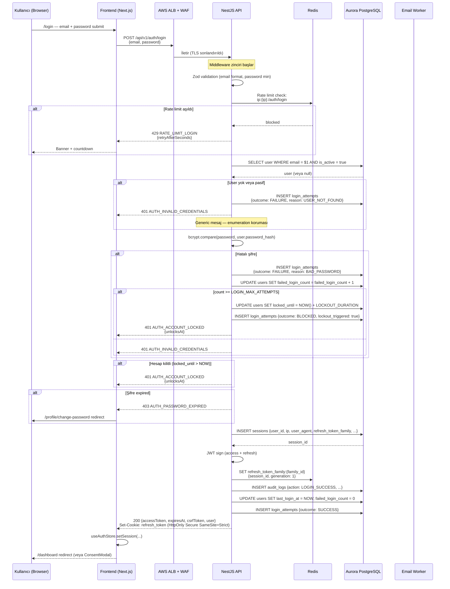
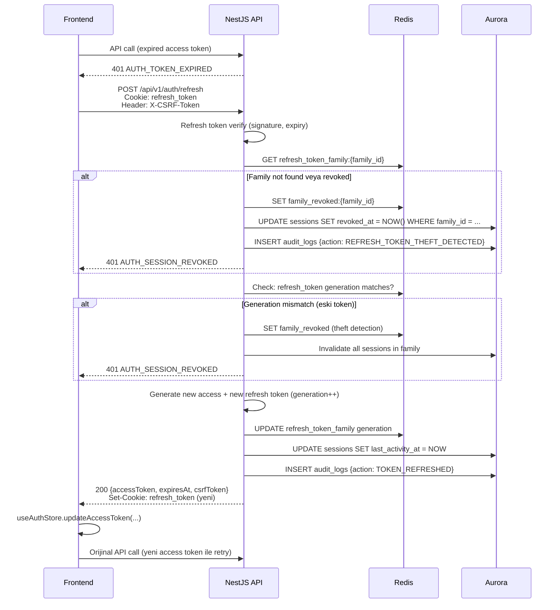
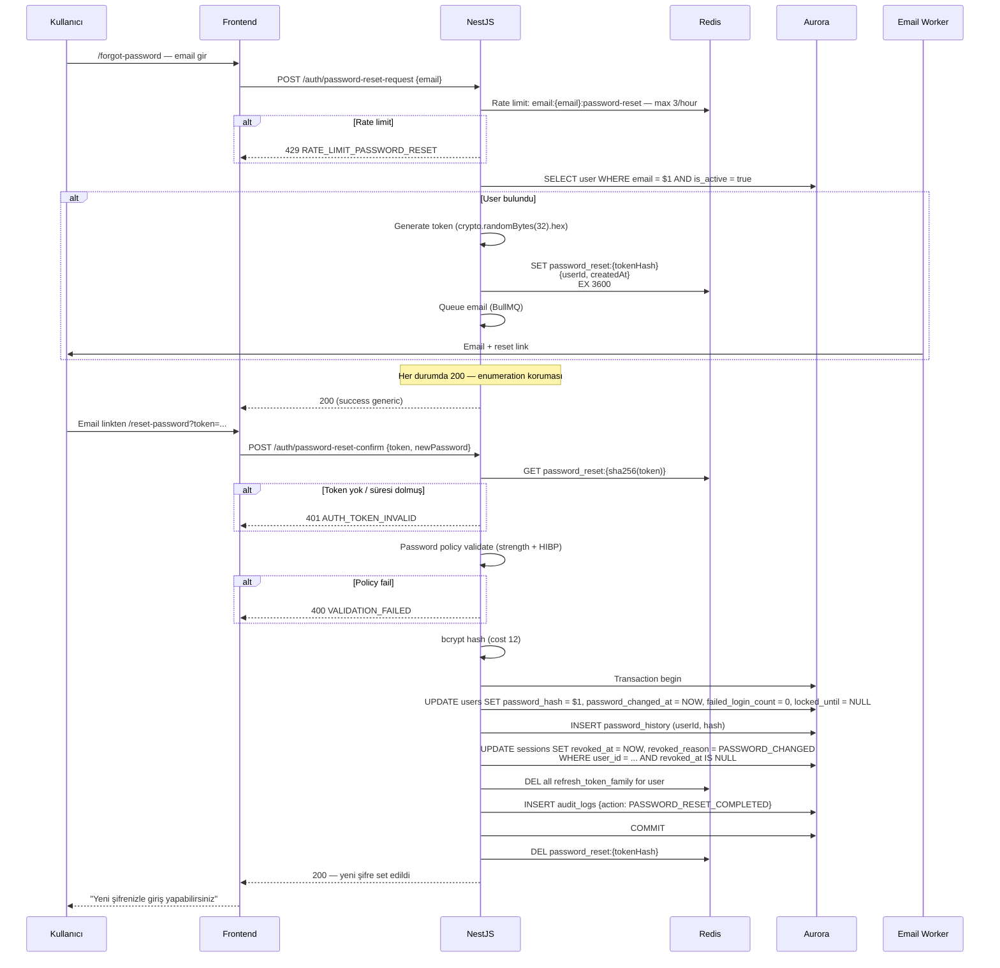

# Lean Management Platformu — Güvenlik Uygulaması

> Bu doküman güvenliğin koda ve altyapıya nasıl yansıdığını anlatır. Politika veya uyum felsefesi değil — uygulama mekaniği. Güvenlik-bilinçli bir agent burada yazılanı birebir uygular: aynı JWT algoritmasını, aynı rate limit değerlerini, aynı permission cache anahtarlarını kullanır. Şüpheye yer bırakmayan imperative tone.

---

## 1. Kapsam ve Katmanlama

Güvenlik tek bir yerde uygulanmaz — beş katmanda birbirini destekleyen kontroller vardır. Hiçbir katman yalnız başına yeterli değildir; derinlemesine savunma prensibi:

| Katman                             | Örnek kontroller                                                                                                  |
| ---------------------------------- | ----------------------------------------------------------------------------------------------------------------- |
| **Ağ (Network)**                   | ALB + Security Group + WAF kuralları; AWS Shield Standard; VPC private subnet                                     |
| **Uygulama boundary (Middleware)** | JWT doğrulama, CSRF, rate limit, CORS, input Zod validation                                                       |
| **Domain/business logic**          | Resource ownership, permission check (`@RequirePermission`), state machine transition kuralları                   |
| **Veritabanı**                     | Encryption-at-rest (AWS KMS), encrypted column'lar (AES-256-GCM deterministic/probabilistic), append-only trigger |
| **İzleme (Observability)**         | CloudWatch alerting, Sentry, audit log chain verify, anomaly detection                                            |

Her endpoint için en az üç katman aktif. Örneğin `POST /api/v1/users` (yeni kullanıcı oluşturma) çağrısında: WAF + TLS + JWT guard + CSRF + rate limit + `@RequirePermission(USER_CREATE)` + Zod validation + encrypted persist + audit trigger. Bir katman atlansa bile diğerleri koruyucu olur.

**Bu doküman vs diğerleri:**

Tam implementasyon detayı birden fazla dokümana yayılır. Bu doküman güvenlik-özel mantığın merkezidir — cross-cutting sorular ("nasıl authenticate oluyor?", "yetki nasıl kontrol ediliyor?", "şifre policy nedir?") için **ilk başvuru kaynağı**. Teknik detaylar (örn. middleware'in Fastify adapter specifics'i veya frontend axios interceptor kodu) ilgili teknik dokümanlarda tekrarlanmaz; bu doküman davranışsal kontratı tanımlar, implementasyonu kısa kod parçaları ile örnekler.

---

## 2. Kimlik Doğrulama Akışı

### 2.0 Ortam profile göre birincil giriş (SSO)

**Karar kaynağı:** `docs/mimari-kararlar.md` [A-007], [A-009], `docs/adr/0008-dev-google-oidc-prod-redhat-sso.md`.

| Ortam                   | Birincil IdP                    | Not                                                                                      |
| ----------------------- | ------------------------------- | ---------------------------------------------------------------------------------------- |
| Geliştirme (lokal, dev) | **Google** OAuth 2.0 / OIDC     | Authorization Code + PKCE; Google Cloud OAuth istemci kimlikleri env/Secrets Manager’da. |
| Production (canlı)      | **Red Hat SSO** (Keycloak) OIDC | Holding kurumsal realm; Google IdP devre dışı veya kullanılmaz.                          |

Başarılı OIDC callback sonrası backend, mevcut **session + access JWT + refresh httpOnly cookie + CSRF** modelini (Bölüm 2.2 ve sonrası) **email+şifre login ile aynı şekilde** üretir; fark yalnızca kimlik kanıtının kaynağıdır (IdP `id_token` / userinfo doğrulaması → platform `users` satırı eşleme / JIT provisioning politikası).

**Kullanıcı eşleme:** Üretimde sicil veya kurumsal email ile DB kullanıcısı eşlenir; yalnız email’e dayalı otomatik hesap oluşturma güvenlik politikası ile sınırlıdır (holding onayı). Google `sub` ile Keycloak `sub` birbirinden farklıdır — harici konu **platform `user.id`** ve isteğe bağlı `external_subject` (veya eşdeğer) alanı ile soyutlanır.

### 2.1 Login — email ve şifre (bootstrap, CI, yardımcı yol)

Aşağıdaki sıra diyagramı **POST `/api/v1/auth/login`** yolunu anlatır (seed kullanıcılar, E2E, süperadmin dışı senaryolar). OIDC ile girişte aynı son adımlar (session insert, JWT, cookie set) tekrar kullanılır; ön koşul bcrypt doğrulaması yerine IdP token doğrulamasıdır.



### 2.2 Token Refresh Akışı

Access token 15 dakikada dolar. Frontend axios interceptor 401 `AUTH_TOKEN_EXPIRED` yakalar ve silent refresh başlatır:



Kritik nokta: **refresh token rotation her kullanımda uygulanır.** Eski refresh token'ın ikinci kullanımı "theft detection" sinyalidir → tüm family revoke edilir.

### 2.3 Logout

```
POST /api/v1/auth/logout
Header: Authorization: Bearer <access>
Cookie: refresh_token

Backend:
  1. Access token decode → sessionId al
  2. UPDATE sessions SET revoked_at = NOW, revoked_reason = USER_LOGOUT
  3. Redis: DEL refresh_token_family:{family_id}
  4. Audit log: LOGOUT
  5. Response: 204 + Set-Cookie: refresh_token=; Max-Age=0 (clear)

Frontend:
  1. useAuthStore.clear()
  2. queryClient.clear()  # tüm cache
  3. window.location.href = '/login'
```

### 2.4 Password Reset



Token tek kullanımlıktır (Redis key submit sonrası silinir), TTL 1 saat, SHA-256 hash olarak saklanır (raw token sadece emailde).

### 2.5 Consent Onay Akışı

Her authenticated request backend middleware'ında consent check geçer:

```
API Request (authenticated endpoint)
  └─ AuthGuard pass (JWT valid)
      └─ ConsentGuard
          ├─ GET user.consent_accepted_version_id
          ├─ GET active_consent_version_id (Redis cache 5 dk)
          ├─ Match?
          │   └─ PASS
          └─ Mismatch?
              └─ FAIL: 403 AUTH_CONSENT_REQUIRED

Frontend ConsentModal yakalamaları:
  - Initial layout mount: /auth/me response'unda consentAccepted:false
  - Runtime: herhangi bir endpoint 403 AUTH_CONSENT_REQUIRED döner

Kullanıcı onay aksiyonu:
  POST /api/v1/auth/consent/accept {consentVersionId}
  → UPDATE users SET consent_accepted_version_id = $1, consent_accepted_at = NOW
  → INSERT consent_acceptance_history
  → Audit log
  → 204
  → Frontend window.location.reload()
```

---

## 3. Token Yönetimi

### 3.1 Access Token

**Algoritma:** HS256 (HMAC-SHA256). RS256 değil — operasyonel basitlik önceliklidir:

- Tek backend deployment (monolith NestJS); key sharing yok
- Key rotation tek Redis update (signing secret version bump)
- RS256 public/private key management ve JWK endpoint complexity MVP için gereksiz
- Gelecekte federated auth (Keycloak, Auth0) eklenirse RS256'ya geçiş tek migration

Signing secret AWS Secrets Manager'da tutulur: `lean-mgmt/prod/jwt-access-secret`. 256-bit random (base64).

**Claims:**

```json
{
  "sub": "user_uuid",
  "sessionId": "session_uuid",
  "iat": 1714000000,
  "exp": 1714000900,
  "jti": "unique_token_id",
  "iss": "lean-mgmt",
  "aud": "lean-mgmt-api"
}
```

Roller ve permission'lar **token'a kodlanmaz**. Nedeni: runtime'da rol değişirse token expire olana kadar eski yetki geçerli olurdu. Bunun yerine permission set request başına Redis'ten çekilir (aşağıda).

**TTL:** 15 dakika. Kısa TTL + rotation stratejisi: access token leak window'u minimize edilir.

**Frontend storage:** Zustand memory store (`useAuthStore`). **localStorage / sessionStorage yasak** — XSS ile çalınabilir. Browser refresh'te access token kaybolur, frontend refresh endpoint'i ile yeniler (refresh token httpOnly cookie'den alınır).

**Transport:** `Authorization: Bearer <token>` header.

### 3.2 Refresh Token

**Format:** JWT (aynı HS256 algoritma), farklı signing secret: `lean-mgmt/prod/jwt-refresh-secret`.

**Claims:**

```json
{
  "sub": "user_uuid",
  "sessionId": "session_uuid",
  "familyId": "family_uuid",
  "generation": 3,
  "iat": 1714000000,
  "exp": 1715209600,
  "jti": "unique_token_id",
  "type": "refresh"
}
```

**TTL:** 14 gün. Inactivity'de 30 dakika (`SESSION_INACTIVITY_TIMEOUT_MINUTES`) içinde kullanılmazsa session revoke edilir (last_activity_at timestamp'e göre).

**Storage:** HttpOnly + Secure + SameSite=Strict cookie:

```
Set-Cookie: refresh_token=<jwt>;
  Path=/api/v1/auth;
  HttpOnly;
  Secure;
  SameSite=Strict;
  Max-Age=1209600;
  Domain=api.lean-mgmt.holding.com
```

Path `/api/v1/auth` ile sınırlı — diğer endpoint'lere gönderilmez, bandwidth tasarrufu + exposure minimizasyonu.

**SameSite=Strict** kararı: Cross-site GET navigasyonda bile cookie gönderilmez. Trade-off: kullanıcı harici bir linkten platform'a gelirse cookie gönderilmez, login istenir. Bu kullanıcı deneyimi sakınca değil — platform iç kurumsal sistem, cross-site gelme senaryosu nadir.

### 3.3 Rotation ve Family Tracking

Her refresh çağrısında:

1. Mevcut refresh token verify
2. Redis'te `refresh_token_family:{familyId}` kaydı bul
3. Token'ın `generation` field'ı kayıttaki generation ile match ediyor mu?
   - **Match:** Yeni token üret (generation++), Redis'te güncelle
   - **Mismatch:** THEFT DETECTED → family revoke (tüm session'lar) → audit log + alert

Family = aynı login session'ın tüm refresh token rotasyonları. Bir saldırgan eski token'ı ele geçirip kullanırsa: mismatch → family revoke → legitimate kullanıcı bile logout olur (güvenlik tercihi). Kullanıcıya email ile bildirim gönderilir.

**Redis schema:**

```
Key: refresh_token_family:{familyId}
Value: { userId, sessionId, generation: 5, createdAt, lastRotatedAt }
TTL: 14 gün (refresh token TTL)

Key: family_revoked:{familyId}
Value: { revokedAt, reason: "THEFT_DETECTED" | "USER_LOGOUT" | "PASSWORD_CHANGED" }
TTL: 30 gün (forensic log)
```

### 3.4 CSRF Token

Refresh cookie `SameSite=Strict` olsa bile double-submit pattern uygulanır (defense in depth):

**Oluşturma:** Login response'unda backend `csrfToken` döner. Frontend store'da tutar.

**Cookie:** Aynı değer `csrf_token` cookie'sine de yazılır (HttpOnly **değil**, JS okuyabilmeli — **Secure** + **SameSite=Strict**).

**Header:** Mutating request'lerde (POST/PATCH/PUT/DELETE) `X-CSRF-Token: <token>` header zorunlu. Backend cookie ile header'ı karşılaştırır; eşleşmezse 403 `CSRF_TOKEN_INVALID`.

**Rotation:** Her `/auth/refresh` çağrısında yeni CSRF token üretilir.

```typescript
// Backend CSRF guard (NestJS)
@Injectable()
export class CsrfGuard implements CanActivate {
  canActivate(context: ExecutionContext): boolean {
    const request = context.switchToHttp().getRequest<FastifyRequest>();
    const method = request.method;
    if (['GET', 'HEAD', 'OPTIONS'].includes(method)) return true;

    const headerToken = request.headers['x-csrf-token'];
    const cookieToken = request.cookies?.csrf_token;
    if (!headerToken || !cookieToken || headerToken !== cookieToken) {
      throw new ForbiddenException({ code: 'CSRF_TOKEN_INVALID', message: 'CSRF token mismatch' });
    }
    return true;
  }
}
```

### 3.5 Token Blacklist

Revoke edilen access token'lar Redis blacklist'te:

```
Key: token_revoked:{jti}
Value: { revokedAt, reason }
TTL: token kalan ömrü (max 15 dk)
```

Auth guard her request'te Redis GET yapar. 15 dakikadan sonra key otomatik expire olur (TTL ile).

**Revoke tetikleyicileri:**

- Logout
- Password change (diğer session'ların token'ları)
- Admin manual session revoke
- Security incident response

### 3.6 Signing Key Rotation

Signing secret 180 günde bir rotate edilir. Dual-key validity window:

```typescript
// Backend JWT verify
const KEYS = {
  current: process.env.JWT_ACCESS_SECRET_CURRENT,
  previous: process.env.JWT_ACCESS_SECRET_PREVIOUS, // Rotation sonrası 15 dk geçerli
};

try {
  return jwt.verify(token, KEYS.current);
} catch {
  if (KEYS.previous) {
    try {
      return jwt.verify(token, KEYS.previous);
    } catch {
      throw new AuthTokenInvalidException();
    }
  }
  throw new AuthTokenInvalidException();
}
```

Rotation playbook:

1. AWS Secrets Manager'da yeni secret oluştur
2. Backend env var'a `JWT_ACCESS_SECRET_PREVIOUS` = eski, `JWT_ACCESS_SECRET_CURRENT` = yeni
3. Deploy (rolling)
4. 15 dakika bekle (access token max TTL)
5. `PREVIOUS` environment variable'ı kaldır (deploy)
6. Eski secret Secrets Manager'dan sil

Refresh token için aynı pattern ama 14+1 gün window.

---

## 4. Yetkilendirme — RBAC + ABAC Hybrid

Platform saf RBAC ile başlasa bile, gerçek kurumsal ihtiyaçlar attribute-based (şirket, lokasyon, rol) filtrelemeyi zorunlu kılar. Bu yüzden hybrid model seçildi:

- **RBAC (Role-Based):** Kullanıcı → rol → permission set. "Kullanıcı Yöneticisi rolü USER_CREATE permission'ına sahiptir."
- **ABAC (Attribute-Based):** Kullanıcıya rol atama attribute kuralı ile. "companyId=ACME AND departmentId=IT olan kullanıcılara USER_MANAGER rolü otomatik atansın."

### 4.1 Dört Enforcement Katmanı

Her authenticated endpoint çağrısında dört katman sırayla çalışır. Bir katman fail ederse alttaki katmanlar atlanır.

#### Katman 1 — Route Auth Guard

JWT'nin var olması, imzalanması, expired olmaması, revoked olmaması.

```typescript
@Injectable()
export class JwtAuthGuard implements CanActivate {
  async canActivate(context: ExecutionContext): Promise<boolean> {
    const request = context.switchToHttp().getRequest();
    const token = this.extractBearer(request.headers.authorization);
    if (!token) throw new AuthTokenMissingException();

    const payload = this.jwtService.verify(token); // imza + expiry
    const isRevoked = await this.redis.get(`token_revoked:${payload.jti}`);
    if (isRevoked) throw new AuthTokenRevokedException();

    request.user = payload;
    return true;
  }
}
```

Public endpoint'ler (login, forgot-password, reset-password) bu guard'dan muaf — `@Public()` decorator ile.

#### Katman 2 — Permission Guard (RBAC)

Kullanıcının permission set'i Redis cache'ten çekilir; endpoint'in gerektirdiği permission var mı kontrol edilir.

```typescript
// Decorator kullanımı
@Post('/users')
@RequirePermission(Permission.USER_CREATE)
async create(@Body() dto: CreateUserDto) { ... }

// Guard
@Injectable()
export class PermissionGuard implements CanActivate {
  constructor(
    private reflector: Reflector,
    private permissionResolver: PermissionResolverService,
  ) {}

  async canActivate(context: ExecutionContext): Promise<boolean> {
    const required = this.reflector.get<Permission[]>('permissions', context.getHandler());
    if (!required?.length) return true;  // Decorator yoksa RBAC bypass

    const { user } = context.switchToHttp().getRequest();
    const userPermissions = await this.permissionResolver.getUserPermissions(user.sub);

    const hasAll = required.every((p) => userPermissions.has(p));
    if (!hasAll) {
      throw new ForbiddenException({
        code: 'PERMISSION_DENIED',
        message: 'Bu işlem için gerekli yetki yok',
        details: { required, missing: required.filter((p) => !userPermissions.has(p)) },
      });
    }
    return true;
  }
}
```

#### Katman 3 — Resource Ownership

Permission'a sahip olmak bir kaynağa ait olmaktan farklı. Örneğin kullanıcı `PROCESS_VIEW` permission'ı ile başkasının sürecini görmez — yalnız kendi başlattığı veya atanmış olduğu. Bu query seviyesinde enforce edilir:

```typescript
// ProcessService
async findByDisplayId(displayId: string, currentUser: AuthenticatedUser): Promise<Process> {
  const process = await this.prisma.processes.findUnique({
    where: { display_id: displayId },
    include: { tasks: { include: { assignees: true } } },
  });

  if (!process) throw new ProcessNotFoundException();

  // Resource ownership check
  const isOwner = process.started_by_user_id === currentUser.id;
  const isAssignee = process.tasks.some((t) => t.assignees.some((a) => a.user_id === currentUser.id));
  const hasViewAll = await this.permissionResolver.hasPermission(currentUser.id, Permission.PROCESS_VIEW_ALL);

  if (!isOwner && !isAssignee && !hasViewAll) {
    throw new ForbiddenException({ code: 'PROCESS_ACCESS_DENIED' });
  }

  return process;
}
```

Ownership kuralı her domain entity için farklı:

| Entity       | Ownership kuralı                                                           |
| ------------ | -------------------------------------------------------------------------- |
| Process      | `started_by_user_id === userId` OR task assignee OR `PROCESS_VIEW_ALL`     |
| Task         | Task'a atanmış OR parent process'in başlatıcısı OR `PROCESS_VIEW_ALL`      |
| Document     | Upload eden OR parent task/process'in erişilebilirliği OR admin permission |
| User (read)  | Self OR `USER_LIST_VIEW`                                                   |
| User (edit)  | `USER_UPDATE_ATTRIBUTE` AND NOT self                                       |
| Notification | `recipient_user_id === userId` (daima self)                                |
| Audit log    | `AUDIT_LOG_VIEW` (Superadmin only)                                         |

#### Katman 4 — Field-Level Filter

Bir entity'yi görebilmek tüm field'larını görmek değil. Örneğin task'a atanmış kullanıcı (başlatıcı değil) önceki task'ın form_data'sını ve dokümanlarını **görmez**. Response serializer field filter uygular:

```typescript
// ProcessSerializer
serializeForUser(process: Process, currentUser: AuthenticatedUser, userPermissions: Set<Permission>): SerializedProcess {
  const isOwner = process.started_by_user_id === currentUser.id;
  const hasViewAll = userPermissions.has(Permission.PROCESS_VIEW_ALL);
  const isFullAccess = isOwner || hasViewAll;

  return {
    id: process.id,
    displayId: process.display_id,
    status: process.status,
    startedAt: process.started_at,
    // ...
    tasks: process.tasks.map((task) => {
      const isAssignee = task.assignees.some((a) => a.user_id === currentUser.id);
      const taskFullAccess = isFullAccess || isAssignee;

      return {
        id: task.id,
        stepLabel: task.step_label,
        status: task.status,
        completedAt: task.completed_at,
        completionAction: task.completion_action,
        // Full access field'lar
        formData: taskFullAccess ? task.form_data : null,
        documents: taskFullAccess ? task.documents : [],
        reason: taskFullAccess ? task.reason : null,
      };
    }),
  };
}
```

Kritik prensip: **Field gizlemek null/undefined yapmak, silmek değil.** Frontend "Bu bilgi sizinle paylaşılmamıştır" placeholder'ı gösterir — sessiz eksiklik değil.

### 4.2 Permission Cache

Her request'te DB'den rol → permission resolve etmek pahalı. Redis cache:

```
Key: user_permissions:{userId}
Value: JSON array of permission keys — e.g. ["USER_CREATE", "USER_LIST_VIEW", "PROCESS_KTI_START", ...]
TTL: 5 dakika
```

**Cache populate logic:**

```typescript
async getUserPermissions(userId: string): Promise<Set<Permission>> {
  const cacheKey = `user_permissions:${userId}`;
  const cached = await this.redis.get(cacheKey);
  if (cached) return new Set(JSON.parse(cached));

  const permissions = await this.resolveFromDb(userId);
  await this.redis.setex(cacheKey, 300, JSON.stringify([...permissions]));
  return permissions;
}

async resolveFromDb(userId: string): Promise<Set<Permission>> {
  // 1. Direct role assignments
  const directRoles = await this.prisma.user_roles.findMany({
    where: { user_id: userId, source: 'DIRECT' },
    include: { role: { include: { role_permissions: true } } },
  });

  // 2. Attribute-rule-based role assignments
  const user = await this.prisma.users.findUnique({ where: { id: userId } });
  const matchingRules = await this.evaluateAttributeRules(user);
  const ruleRoleIds = matchingRules.map((r) => r.role_id);
  const ruleRoles = await this.prisma.roles.findMany({
    where: { id: { in: ruleRoleIds } },
    include: { role_permissions: true },
  });

  // 3. Union of permissions
  const allRoles = [...directRoles.map((ur) => ur.role), ...ruleRoles];
  const permissions = new Set<Permission>();
  for (const role of allRoles) {
    for (const rp of role.role_permissions) {
      permissions.add(rp.permission_key as Permission);
    }
  }
  return permissions;
}
```

**Invalidation tetikleyicileri:**

| Event                                              | Silinecek cache key'ler                                                                                                    |
| -------------------------------------------------- | -------------------------------------------------------------------------------------------------------------------------- |
| User'a direct rol ataması/çıkarımı                 | `user_permissions:{userId}`                                                                                                |
| Rol'e permission ekleme/kaldırma                   | Rolün atandığı **tüm** kullanıcılar için key'ler: `user_permissions:*` `DEL` by pattern (production'da `SCAN` + batch DEL) |
| Kullanıcı attribute değişimi (şirket, pozisyon vs) | `user_permissions:{userId}` (attribute-rule matching değişebilir)                                                          |
| Attribute rule ekleme/güncelleme/silme             | Rolün atandığı **tüm** kullanıcılar                                                                                        |
| Kullanıcı deactivate                               | `user_permissions:{userId}` + session revoke                                                                               |

Cache-wide invalidation pahalı — rol permission değişimi gibi bulk operation sonrası. Bunu azaltmak için: rolün affected user'larını DB'den çek, her biri için key sil:

```typescript
async invalidateRolePermissionCache(roleId: string): Promise<void> {
  const affectedUsers = await this.prisma.user_roles.findMany({
    where: { role_id: roleId },
    select: { user_id: true },
  });
  // Attribute-rule ile gelenler de dahil — union
  const ruleMatches = await this.findUsersMatchingRole(roleId);
  const allUserIds = new Set([
    ...affectedUsers.map((ur) => ur.user_id),
    ...ruleMatches.map((u) => u.id),
  ]);

  if (allUserIds.size === 0) return;

  const pipeline = this.redis.pipeline();
  for (const userId of allUserIds) {
    pipeline.del(`user_permissions:${userId}`);
  }
  await pipeline.exec();
}
```

### 4.3 Rol Tanımları ve Tipik Yetki Setleri

Sistem rolleri (seed data):

**SUPERADMIN** — Tüm permission'lara sahip. Tek kısıtı: `USER_SELF_EDIT_FORBIDDEN` (kendi kullanıcı bilgisini düzenlemek için bile S-PROFILE kullanılmalı). MVP'de teknik olarak **tek Superadmin kullanıcı** zorunluluğu yok ama operasyonel olarak 2-3 kişi önerilir.

**USER_MANAGER** — Kullanıcı yaşam döngüsünü yönetir:

- `USER_LIST_VIEW`, `USER_CREATE`, `USER_UPDATE_ATTRIBUTE`, `USER_DEACTIVATE`, `USER_REACTIVATE`
- `MASTER_DATA_MANAGE` (şirket, lokasyon, pozisyon vs — kullanıcı oluştururken master data ekleme gerekebilir)
- `USER_SESSION_VIEW` yok (şüpheli activity inceleme Superadmin yetkisi)

**ROLE_MANAGER** — Rol ve yetki yapısını yönetir:

- `ROLE_VIEW`, `ROLE_CREATE`, `ROLE_UPDATE`, `ROLE_DELETE`, `ROLE_ASSIGN`
- `ROLE_PERMISSION_MANAGE` (hassas — rol-yetki tablosu)
- `ROLE_RULE_MANAGE` (hassas — attribute rule builder)
- `ROLE_SELF_EDIT_FORBIDDEN`: Kendi rolünün permission'ını düşüremez

**PROCESS_ADMIN** — Tüm süreçleri yönetir:

- `PROCESS_VIEW_ALL`, `PROCESS_CANCEL`, `PROCESS_ROLLBACK`
- KTİ başlatabilir (`PROCESS_KTI_START`) ama bu default yetki, rolden bağımsız

**BASIC_USER** — Her authenticated user default davranışı (role atanmasa bile):

- Kendi profilini görme (`/profile`)
- Kendisine atanmış görevleri görme (`/tasks`)
- Kendi başlattığı süreçleri görme (`/processes?scope=my-started`)
- KTİ başlatma (`PROCESS_KTI_START` — default hakkı, rol gerektirmez; gerekirse settings ile devre dışı bırakılabilir)

### 4.4 Hassas Permission'lar — Örnek Yetki Matrisi

MVP’de `Permission` enum’undaki tüm değerleri × 4 tablo satırı burada listemek yerine yalnız **hassas** veya **kritik karar noktası** permission'ları aşağıda verilir. Tam liste `packages/shared-types/src/permission.ts` metadata'sından ve database seed’inden (`prisma/seed.ts`) türetilir — tek doğruluk kaynağı kod.

| Permission             | `isSensitive` | Superadmin | User Mgr | Role Mgr | Process Admin |
| ---------------------- | ------------- | ---------- | -------- | -------- | ------------- |
| USER_CREATE            | ✓             | ✓          | ✓        | ✗        | ✗             |
| USER_DEACTIVATE        | ✓             | ✓          | ✓        | ✗        | ✗             |
| USER_SESSION_VIEW      | ✓             | ✓          | ✗        | ✗        | ✗             |
| ROLE_PERMISSION_MANAGE | ✓             | ✓          | ✗        | ✓        | ✗             |
| ROLE_RULE_MANAGE       | ✓             | ✓          | ✗        | ✓        | ✗             |
| PROCESS_VIEW_ALL       | ✓             | ✓          | ✗        | ✗        | ✓             |
| PROCESS_CANCEL         | ✓             | ✓          | ✗        | ✗        | ✓             |
| PROCESS_ROLLBACK       | ✓             | ✓          | ✗        | ✗        | ✓             |
| AUDIT_LOG_VIEW         | ✓             | ✓          | ✗        | ✗        | ✗             |
| SYSTEM_SETTINGS_EDIT   | ✓             | ✓          | ✗        | ✗        | ✗             |
| EMAIL_TEMPLATE_EDIT    | ✓             | ✓          | ✗        | ✗        | ✗             |
| CONSENT_VERSION_EDIT   | ✓             | ✓          | ✗        | ✗        | ✗             |
| MASTER_DATA_MANAGE     | —             | ✓          | ✓        | ✗        | ✗             |

`isSensitive: true` olan permission'lar rol-yetki tablosu UI'da kırmızı "Hassas" rozeti ile işaretlenir ve atama sırasında ek onay gerekir (`06_SCREEN_CATALOG` S-ROLE-PERMISSIONS).

---

## 5. Şifre Politikası

### 5.1 Hash Algoritması

**bcrypt cost 12.** AWS c5.2xlarge'da ~250ms hash süresi. argon2id daha güçlü teoride ama Node.js ecosystem desteği + operasyonel tecrübe bcrypt lehine.

```typescript
import { hash, compare } from 'bcryptjs';

const BCRYPT_COST = 12;

async function hashPassword(plain: string): Promise<string> {
  return hash(plain, BCRYPT_COST);
}

async function verifyPassword(plain: string, hashed: string): Promise<boolean> {
  return compare(plain, hashed);
}
```

Cost factor 180 günde bir revize edilir. Donanım hızlandığında 13'e yükselir (aşamalı — yeni hash'ler 13 ile, eski 12 hash'ler user login'de rehash).

**Timing attack koruması:** Kullanıcı yokken bile bcrypt çalıştırılır (dummy hash karşılaştırma) — response süresi bilgi sızdırmaz:

```typescript
const DUMMY_HASH = '$2a$12$DummyHashForTimingAttackProtection_aaaaaaaaaaaaaaaaaaaaaa';

async login(email: string, password: string) {
  const user = await this.prisma.users.findUnique({ where: { email, is_active: true } });
  const hashToCompare = user?.password_hash ?? DUMMY_HASH;
  const valid = await verifyPassword(password, hashToCompare);

  if (!user || !valid) throw new AuthInvalidCredentialsException();
  // ...
}
```

### 5.2 Complexity Policy

| Kural                           | Değer                                                      |
| ------------------------------- | ---------------------------------------------------------- |
| Minimum uzunluk                 | 12 karakter                                                |
| Maksimum uzunluk                | 128 karakter (bcrypt 72-byte limit için utf-8 buffer)      |
| Uppercase                       | En az 1                                                    |
| Lowercase                       | En az 1                                                    |
| Digit                           | En az 1                                                    |
| Special                         | En az 1 (`!@#$%^&*()_+-=[]{};:'"\,.<>/?`)                  |
| Boşluk                          | Yasak                                                      |
| Kullanıcı bilgisi ile benzerlik | Username/email/sicil ile >4 karakter ortak substring yasak |
| HIBP (Have I Been Pwned) check  | k-anonymity API ile; dictionary'de varsa reject            |
| Son 5 şifre                     | Rehash ile compare (`password_history` tablosundan)        |

```typescript
// Password policy validation
export const PasswordSchema = z
  .string()
  .min(12, 'En az 12 karakter olmalı')
  .max(128)
  .regex(/[A-Z]/, 'En az 1 büyük harf olmalı')
  .regex(/[a-z]/, 'En az 1 küçük harf olmalı')
  .regex(/\d/, 'En az 1 rakam olmalı')
  .regex(/[!@#$%^&*()_+\-=\[\]{};:'"\\,.<>/?]/, 'En az 1 özel karakter olmalı')
  .refine((v) => !/\s/.test(v), 'Boşluk içeremez');

// HIBP check (service)
async checkHibp(password: string): Promise<boolean> {
  const sha1 = crypto.createHash('sha1').update(password).digest('hex').toUpperCase();
  const prefix = sha1.slice(0, 5);
  const suffix = sha1.slice(5);
  const res = await fetch(`https://api.pwnedpasswords.com/range/${prefix}`);
  const text = await res.text();
  return text.split('\n').some((line) => line.split(':')[0] === suffix);
}
```

### 5.3 Expiry

`PASSWORD_EXPIRY_DAYS` setting (default 90). User'ın `password_changed_at` + 90 gün > şu an ise:

- 14 gün kala: frontend banner "Şifreniz X gün içinde dolacak"
- 3 gün kala: kırmızı banner
- 0 gün: 403 `AUTH_PASSWORD_EXPIRED` → zorunlu şifre değiştirme

Setting değişikliği retroactive değil: 90 → 30 gün değişimi mevcut kullanıcıların şifresini aniden expire etmez; password_changed_at + yeni 30 gün değerlendirilir.

### 5.4 History

Son 5 şifre (`PASSWORD_HISTORY_COUNT`) rehash ile tutulur. Yeni şifre değişiminde:

```typescript
async changePassword(userId: string, currentPassword: string, newPassword: string) {
  const user = await this.prisma.users.findUnique({ where: { id: userId } });

  // Current verify
  const validCurrent = await verifyPassword(currentPassword, user.password_hash);
  if (!validCurrent) throw new AuthInvalidCredentialsException();

  // History check
  const history = await this.prisma.password_history.findMany({
    where: { user_id: userId },
    orderBy: { created_at: 'desc' },
    take: PASSWORD_HISTORY_COUNT,
  });

  for (const h of history) {
    if (await verifyPassword(newPassword, h.password_hash)) {
      throw new ValidationFailedException({
        reason: 'PASSWORD_REUSED',
        message: 'Son 5 şifreden birini kullanamazsınız',
      });
    }
  }

  // Update
  const newHash = await hashPassword(newPassword);
  await this.prisma.$transaction([
    this.prisma.users.update({
      where: { id: userId },
      data: { password_hash: newHash, password_changed_at: new Date() },
    }),
    this.prisma.password_history.create({
      data: { user_id: userId, password_hash: newHash },
    }),
    // Eski history trim
    this.prisma.$executeRaw`
      DELETE FROM password_history
      WHERE user_id = ${userId}
      AND id NOT IN (
        SELECT id FROM password_history
        WHERE user_id = ${userId}
        ORDER BY created_at DESC
        LIMIT ${PASSWORD_HISTORY_COUNT}
      )
    `,
    // Diğer session'ları revoke
    this.prisma.sessions.updateMany({
      where: { user_id: userId, revoked_at: null, id: { not: currentSessionId } },
      data: { revoked_at: new Date(), revoked_reason: 'PASSWORD_CHANGED' },
    }),
  ]);
}
```

### 5.5 Lockout

`LOGIN_MAX_ATTEMPTS` (5) başarısız denemeden sonra `LOGIN_LOCKOUT_DURATION_MINUTES` (15) dk kilit.

Tetiklenme her yanlış şifre denemede `failed_login_count++`. Eşiğe ulaşınca `locked_until = NOW + 15 dk`. Başarılı login'de counter sıfırlanır.

**Progressive delay:** Ardışık başarısız denemelerde response süresi artar (1 sn, 2 sn, 4 sn, 8 sn), brute force yavaşlatılır. Bu kilit ile birleşik — kilit öncesinde bile hızla deneme engellenir.

```typescript
async login(email: string, password: string, ip: string, userAgent: string) {
  const recentFailures = await this.prisma.login_attempts.count({
    where: {
      email,
      outcome: 'FAILURE',
      created_at: { gte: new Date(Date.now() - 5 * 60 * 1000) },  // son 5 dk
    },
  });

  if (recentFailures >= 3) {
    const delay = Math.min(8000, 1000 * Math.pow(2, recentFailures - 3));
    await sleep(delay);
  }

  // ... normal login flow
}
```

### 5.6 login_attempts Tablosu

Forensic analysis ve lockout logic için her login denemesi kaydedilir (success/failure/blocked):

```sql
INSERT INTO login_attempts (
  email, user_id, ip, user_agent,
  outcome,  -- SUCCESS | FAILURE | BLOCKED
  failure_reason,  -- USER_NOT_FOUND | BAD_PASSWORD | ACCOUNT_LOCKED | ACCOUNT_PASSIVE | PASSWORD_EXPIRED
  blocked_by,  -- RATE_LIMIT | LOCKOUT | IP_WHITELIST_MISMATCH
  lockout_triggered,  -- bool
  created_at
);
```

Bu tablo append-only değil ama retention 90 gün (`03_API_CONTRACTS` retention matrisi). Forensic sonrası temizlenir.

---

## 6. Session Yönetimi

### 6.1 Session Tablosu

```
sessions:
  id uuid PK
  user_id uuid FK
  refresh_token_family_id uuid
  ip inet
  user_agent text
  created_at timestamptz
  last_activity_at timestamptz  -- refresh her kullanımda update
  revoked_at timestamptz NULL
  revoked_reason enum ('USER_LOGOUT', 'PASSWORD_CHANGED', 'ADMIN_REVOKE', 'INACTIVITY_TIMEOUT', 'THEFT_DETECTED', 'ACCOUNT_DEACTIVATED')
```

Aktif session: `revoked_at IS NULL AND last_activity_at > NOW - inactivity_timeout`.

### 6.2 Inactivity Timeout

`SESSION_INACTIVITY_TIMEOUT_MINUTES` (default 30).

**Enforcement:** Cron job (her 5 dk) inactive session'ları revoke eder:

```sql
UPDATE sessions
SET revoked_at = NOW(), revoked_reason = 'INACTIVITY_TIMEOUT'
WHERE revoked_at IS NULL
AND last_activity_at < NOW() - INTERVAL '30 minutes';
```

Kullanıcı bu window'da refresh yapmazsa session kapalı; sonraki refresh attempt → 401 `AUTH_SESSION_REVOKED`.

### 6.3 Concurrent Session Limit

MVP'de limit yok — kullanıcı birden fazla cihazdan eşzamanlı oturum açabilir. S-PROFILE "Güvenlik" sekmesinde aktif oturumları görür + kapatabilir.

İleride limit eklenirse (örn. max 5 aktif session): yeni login'de en eski session revoke edilir ("Yeni cihazdan giriş yapıldı, eski cihaz çıkartıldı" email).

### 6.4 "Beni Hatırla" Davranışı

**Kasıtlı olarak yok.** Refresh token 14 gün zaten uzun. "Remember me" genelde 30 gün+ refresh token'ı imply eder; kurumsal güvenlik için kabul edilmez.

### 6.5 Session Revoke Tetikleyicileri

| Tetikleyici             | Revoke edilen session'lar                                |
| ----------------------- | -------------------------------------------------------- |
| Kullanıcı logout        | Yalnız mevcut session                                    |
| Password change         | Kullanıcının **diğer** tüm session'ları (mevcut korunur) |
| Admin manual revoke     | Belirtilen session(lar)                                  |
| Account deactivate      | Kullanıcının **tüm** session'ları                        |
| Rol değişimi (critical) | Hayır — cache invalidation yeterli, session kapatılmaz   |
| Theft detection         | Refresh token family'deki tüm session'lar                |
| Inactivity timeout      | Tetiklenen session (cron)                                |

---

## 7. Input Güvenliği

### 7.1 Validation Layer

**Zod** runtime validator. Her endpoint request DTO'su Zod schema ile eşleşir; NestJS `ZodValidationPipe` (custom) şemayı otomatik uygular.

```typescript
@Post('/users')
@RequirePermission(Permission.USER_CREATE)
async create(@Body(new ZodValidationPipe(CreateUserSchema)) dto: CreateUserInput) {
  return this.userService.create(dto);
}
```

Schema Zod'un `strict()` mode'unda — bilinmeyen field reddedilir:

```typescript
export const CreateUserSchema = z
  .object({
    sicil: z.string().regex(/^\d{8}$/),
    firstName: z.string().min(1).max(100),
    lastName: z.string().min(1).max(100),
    email: z.string().email().toLowerCase().max(254),
    // ...
  })
  .strict(); // ← ek field yasak
```

Frontend aynı şemaları `packages/shared-schemas` paketinden import eder — single source of truth.

### 7.2 Sanitization

**Input-time sanitize yok.** Raw değerler DB'de saklanır (örn. rıza metni markdown). Render-time sanitize:

- **HTML render (email body, consent content):** Backend Handlebars render sonrası DOMPurify server-side (`isomorphic-dompurify`). Whitelist: `<p>, <br>, <strong>, <em>, <ul>, <ol>, <li>, <a>, <h1-h6>, <blockquote>, <code>`. Attribute whitelist: `href` (yalnız `https://*` ve `mailto:`), `class`.
- **Frontend render (consent preview, notification body):** React autoescape by default. `dangerouslySetInnerHTML` kullanımı yasak (ESLint rule); zorunlu yerlerde DOMPurify önce.
- **User-generated content (process description, task reason, revision note):** DB'de raw, render-time autoescape. HTML yok.

### 7.3 File Upload Güvenliği

`DocumentUploader` + CloudFront Signed URL akışı (`06_SCREEN_CATALOG` Section 7.8). Güvenlik katmanları:

1. **Frontend MIME + size check** — soft UX
2. **Backend upload-initiate aşamasında MIME whitelist:**
   ```
   Görseller: image/jpeg, image/png, image/webp
   Dokümanlar: application/pdf, application/vnd.openxmlformats-officedocument.wordprocessingml.document (docx), application/vnd.openxmlformats-officedocument.spreadsheetml.sheet (xlsx)
   ```
3. **File size 10 MB hard limit** — S3 pre-signed PUT policy'de enforce
4. **CloudFront Signed URL 5 dakika TTL** — leak window'u kısıtlı
5. **S3 bucket upload-trigger → ClamAV Lambda:**
   - File'ı stream olarak scan et
   - Sonuç: CLEAN | INFECTED
   - INFECTED → file'ı S3'te işaretle (`scan_status_result=INFECTED`), erişime kapat
   - Timeout: 60 sn (büyük dosyalar)
6. **Extension double-check:** MIME header + file magic number + extension üçü de aynı olmalı (magic number MIME ile uyuşmazsa reject)
7. **Response MIME override:** Download sırasında S3 `Content-Type` MIME whitelist'ten geliyor, user-provided değer reject edilir
8. **Document'ın process/task ile bağı:** Backend upload-complete endpoint'i context ID ile kontrol eder (kullanıcı bu context'e doküman ekleyebilir mi?)

ClamAV Lambda konfigürasyonu:

```yaml
# Lambda function
Runtime: nodejs20.x
MemorySize: 2048 MB
Timeout: 60 sn
Environment:
  CLAMAV_DB_S3_BUCKET: lean-mgmt-clamav-db
EventSource:
  S3: lean-mgmt-documents (ObjectCreated:*)
```

Lambda pseudo-code:

```typescript
export const handler = async (event: S3Event) => {
  for (const record of event.Records) {
    const s3Key = record.s3.object.key;
    const documentId = extractDocumentId(s3Key);

    // Update scan status to scanning
    await updateScanStatus(documentId, 'SCANNING');

    try {
      const fileStream = await s3.getObject({ Bucket, Key: s3Key }).createReadStream();
      const scanResult = await clamavScan(fileStream);

      if (scanResult.infected) {
        await updateScanStatus(documentId, 'INFECTED', { threat: scanResult.threatName });
        await s3.putObjectTagging({
          Bucket,
          Key: s3Key,
          Tagging: { TagSet: [{ Key: 'scan', Value: 'INFECTED' }] },
        });
        await notifyAdmin({ documentId, threat: scanResult.threatName });
      } else {
        await updateScanStatus(documentId, 'CLEAN');
      }
    } catch (err) {
      await updateScanStatus(documentId, 'SCAN_FAILED');
      await notifyAdmin({ documentId, error: err.message });
    }
  }
};
```

### 7.4 SQL Injection

**Prisma ORM parametrized queries.** Raw SQL (`$queryRaw`, `$executeRaw`) kullanımı:

- Code review'da flag
- ESLint custom rule — `$queryRaw` daima template literal olmalı (string concat yasak)
- Unavoidable cases: parametrized version (`$queryRawUnsafe` yasak)

```typescript
// ✓ Safe
await prisma.$queryRaw`SELECT * FROM users WHERE email = ${email}`;

// ✗ UNSAFE — Yasak
await prisma.$queryRawUnsafe(`SELECT * FROM users WHERE email = '${email}'`);
```

### 7.5 XSS

React default autoescape. Yasak kullanımlar:

- `dangerouslySetInnerHTML` — ESLint rule ile disallow; zorunluluk varsa DOMPurify sonrası
- `eval`, `Function()` constructor — disallow
- Inline event handler string'leri (`onClick="..."`) — JSX zaten engelliyor, HTML template'lerde de yok

**CSP header (backend response):**

```
Content-Security-Policy:
  default-src 'self';
  script-src 'self' 'nonce-{request_nonce}' 'strict-dynamic';
  style-src 'self' 'unsafe-inline';  -- Tailwind inline style zorunluluğu
  img-src 'self' data: https://cdn.lean-mgmt.holding.com;
  font-src 'self';
  connect-src 'self' https://api.lean-mgmt.holding.com;
  frame-ancestors 'none';
  base-uri 'self';
  form-action 'self';
  upgrade-insecure-requests;
```

Next.js `middleware.ts` nonce injection:

```typescript
export function middleware(request: NextRequest) {
  const nonce = crypto.randomBytes(16).toString('base64');
  const cspHeader = buildCSP(nonce);

  const response = NextResponse.next({
    request: { headers: new Headers(request.headers) },
  });
  response.headers.set('Content-Security-Policy', cspHeader);
  response.headers.set('x-nonce', nonce);
  return response;
}
```

### 7.6 SSRF

External URL fetch **yok** MVP'de. Gelecekte webhooks, external API integrations eklenirse:

- Whitelist ile çalış
- Private IP range'leri block (10.0.0.0/8, 172.16.0.0/12, 192.168.0.0/16, 127.0.0.0/8, AWS metadata 169.254.169.254)
- DNS rebinding koruması (URL resolve + validate + separate fetch)
- Timeout ve max payload size

---

## 8. Transport Security

### 8.1 TLS Konfigürasyonu

**Minimum TLS 1.2** — TLS 1.3 tercih. TLS 1.0 / 1.1 disable.

AWS ALB SSL policy: `ELBSecurityPolicy-TLS13-1-2-2021-06` (ALB current best).

Cipher suites (öncelik sırası):

```
TLS_AES_128_GCM_SHA256
TLS_AES_256_GCM_SHA384
TLS_CHACHA20_POLY1305_SHA256
ECDHE-ECDSA-AES128-GCM-SHA256
ECDHE-RSA-AES128-GCM-SHA256
ECDHE-ECDSA-AES256-GCM-SHA384
ECDHE-RSA-AES256-GCM-SHA384
```

### 8.2 HTTPS Enforcement

ALB listener 80 → redirect 301 → 443. HTTP traffic asla uygulamaya ulaşmaz.

### 8.3 HSTS

```
Strict-Transport-Security: max-age=31536000; includeSubDomains; preload
```

Domain Chrome HSTS preload list'e submit edilir (https://hstspreload.org).

### 8.4 Cookie Flags

Tüm cookie'ler: `Secure` (HTTPS-only), `HttpOnly` (JS erişimi engel — CSRF token hariç), `SameSite=Strict`.

| Cookie        | HttpOnly | Secure | SameSite | Path         | Max-Age |
| ------------- | -------- | ------ | -------- | ------------ | ------- |
| refresh_token | ✓        | ✓      | Strict   | /api/v1/auth | 14 gün  |
| csrf_token    | ✗        | ✓      | Strict   | /            | 14 gün  |

---

## 9. Güvenlik Header'ları

Backend (NestJS — `@fastify/helmet`) ve frontend (Next.js middleware) her response'ta:

```
Content-Security-Policy: <yukarıdaki CSP>
Strict-Transport-Security: max-age=31536000; includeSubDomains; preload
X-Content-Type-Options: nosniff
X-Frame-Options: DENY
Referrer-Policy: strict-origin-when-cross-origin
Permissions-Policy: camera=(), microphone=(), geolocation=(), payment=(), usb=()
Cross-Origin-Opener-Policy: same-origin
Cross-Origin-Resource-Policy: same-site
Cross-Origin-Embedder-Policy: require-corp
```

**Server header gizlenir** — Fastify default olarak `server: fastify` header göndermez. NestJS header'ı da suppress edilir.

---

## 10. KVKK Uygulaması

### 10.1 Veri İkameti

Tüm production veri AWS eu-central-1 (Frankfurt). Yasal zorunluluk yok (veri Türkiye'de tutulmak zorunda değil) — operasyonel tercih:

- AB GDPR zorunlulukları platforma otomatik uygulanır (KVKK ile uyum yüksek)
- Düşük latency (Türkiye'den ~25ms)
- AWS eu-central-1 mature services

### 10.2 Veri Minimizasyonu

Kullanıcıdan toplanan PII minimum: sicil, ad, soyad, email, telefon (opsiyonel), işe başlama tarihi (opsiyonel). Collected PII için amaç kaydı ("KVKK amacı: personel kimlik tanıma"):

- Email: login identifier + bildirim gönderimi
- Sicil: birincil kurumsal kimlik
- Telefon: opsiyonel, audit/iletişim fallback
- IP adresi: güvenlik denetim kaydı

**Toplanmayan veriler (ihtiyaç yok):** TC kimlik no, doğum tarihi, doğum yeri, adres, aile bilgileri, sağlık bilgileri, biometrik veri.

### 10.3 Encryption

**At-rest:**

- Aurora PostgreSQL storage encryption AWS KMS (AES-256)
- S3 documents bucket SSE-S3 + bucket policy encryption zorunlu
- PII columns (email, phone) `pgcrypto` extension ile AES-256-GCM
  - Deterministic (email — lookup için): aynı input aynı ciphertext (HMAC-based IV)
  - Probabilistic (phone — lookup yok): random IV

**In-transit:**

- Her network hop'ta TLS 1.2+
- VPC içi traffic (API → RDS, API → Redis) TLS zorunlu (Redis TLS port 6380, RDS SSL connection)

### 10.4 Veri Sahibi Hakları

KVKK Madde 11 hakları ve bu platformda uygulanımı:

| Hak                                                                                     | Uygulama                                                                    |
| --------------------------------------------------------------------------------------- | --------------------------------------------------------------------------- |
| (a) Kişisel veri işlenip işlenmediğini öğrenme                                          | S-PROFILE "Bilgilerim" + "Verilerim"                                        |
| (b) İşlenmişse buna ilişkin bilgi talep etme                                            | Aynı — "Verilerim" sekmesinde kapsamlı görüntü                              |
| (c) İşlenme amacı + amacına uygun kullanıldığını öğrenme                                | `privacy@holding.com` email — statik cevap şablonu                          |
| (d) Yurtiçinde veya yurtdışında aktarılan üçüncü kişileri bilme                         | "Verilerim" sayfasında statik not: "Verileriniz üçüncü tarafla paylaşılmaz" |
| (e) Eksik/yanlış işlenmişse düzeltilmesini isteme                                       | Yönetici başvurusu — S-USER-EDIT üzerinden; KVKK email kanalı ikincil       |
| (f) Silinme / yok edilmesini isteme                                                     | Anonimleştirme — aşağıda 10.5                                               |
| (g) (e) ve (f) çerçevesinde yapılan işlemlerin aktarıldığı üçüncü kişilere bildirilmesi | Üçüncü taraf yok; uygulanmaz                                                |
| (h) Otomatik sistemler marifetiyle analiz edilen sonuçlara itiraz                       | Otomatik karar verme yok (MVP); uygulanmaz                                  |
| (i) Zarar halinde tazminat talep etme                                                   | Yasal kanal — KVKK email                                                    |

**"Verilerimi İndir" MVP dışı.** JSON/CSV export özelliği kapsam dışı; yasal talepler `kvkk@holding.com` email kanalı üzerinden manuel karşılanır. Bu kapsam dışı karar kullanıcı deneyimi alt seviye ama yasal uyumluluk seviyesi aynı (10 gün içinde cevap yükümlülüğü email ile yönetilebilir).

### 10.5 Silme ve Anonimleştirme

Audit log retention gereksinimi (10 yıl yasal minimum — SPK, vergi, iş hukuku cross-referansı) gerçek silmeyi engeller. Bu yüzden **anonimleştirme** modeli:

```typescript
async anonymizeUser(userId: string) {
  await this.prisma.$transaction([
    this.prisma.users.update({
      where: { id: userId },
      data: {
        sicil: `ANON-${userId.slice(0, 8)}`,
        first_name: 'Anonimleştirilmiş',
        last_name: 'Kullanıcı',
        email: `anon-${userId}@anonymized.local`,
        phone: null,
        is_active: false,
        anonymized_at: new Date(),
        anonymization_reason: 'KVKK request #12345',
      },
    }),
    this.prisma.audit_logs.create({
      data: {
        action: 'USER_ANONYMIZED',
        entity_type: 'USER',
        entity_id: userId,
        details: { reason: 'KVKK erasure request' },
      },
    }),
    this.prisma.sessions.updateMany({
      where: { user_id: userId, revoked_at: null },
      data: { revoked_at: new Date(), revoked_reason: 'ACCOUNT_DEACTIVATED' },
    }),
  ]);
}
```

Anonymized user'ların:

- İsim/email/telefon maskelenir
- Audit log'ları anonim kullanıcı olarak kalır (entity_id üzerinden)
- Başlattığı süreçler COMPLETED/REJECTED/CANCELLED statüsünde ise değişmez; IN_PROGRESS/INITIATED ise CANCELLED'a çevrilir
- Password history silinir (hash'ler bile kimliklenebilir)
- login_attempts kayıtları silinir
- password_reset tokens Redis'ten silinir

Anonymization tetikleyicileri:

- KVKK erasure request (manuel — Superadmin tarafından)
- İşten ayrılış + 2 yıl retention sonunda (otomatik cron — opsiyonel, MVP'de manuel)

### 10.6 Retention Tablosu

| Data türü                  | Retention                                       | Temizleme mekanizması               |
| -------------------------- | ----------------------------------------------- | ----------------------------------- |
| Users (aktif)              | Unlimited (iş süresi)                           | Anonimleştirme manuel               |
| Users (pasif)              | 2 yıl                                           | Otomatik anonymize cron (opsiyonel) |
| Sessions                   | 14 gün (revoke sonrası)                         | Daily cron DELETE                   |
| login_attempts             | 90 gün                                          | Daily cron DELETE                   |
| Password history           | Unlimited (user lifetime); anonymize'da silinir | Anonymize trigger                   |
| Audit logs                 | 10 yıl                                          | S3 archive (yıllık) + DB purge      |
| Notifications              | 90 gün                                          | Daily cron DELETE                   |
| Documents                  | 5 yıl (iş süresi)                               | Manuel admin aksiyon                |
| Consent acceptance history | Unlimited                                       | Anonymize'da silinir                |
| Process (terminal)         | 5 yıl                                           | Manuel archive (opsiyonel)          |

---

## 11. Rate Limiting

### 11.1 Backend Implementation

NestJS `@nestjs/throttler` + Redis backend (`@nestjs-modules/ioredis-throttler-storage` veya custom). Her rate limit kuralı:

```typescript
// Controller seviyesi
@Throttle({ default: { limit: 10, ttl: 60_000 } })  // 10 req / dk default

// Endpoint spesifik
@Throttle({ default: { limit: 5, ttl: 60_000 } })
@Post('/auth/login')
async login(...) { ... }
```

### 11.2 Rate Limit Tablosu

Identifier: IP (authenticated olmayan endpoint'ler için) veya userId (authenticated için).

| Endpoint                                    | Identifier    | Limit | Window | Hata kodu                 |
| ------------------------------------------- | ------------- | ----- | ------ | ------------------------- |
| `POST /auth/login`                          | IP            | 10    | 1 dk   | RATE_LIMIT_LOGIN          |
| `POST /auth/login`                          | email (burst) | 5     | 15 dk  | RATE_LIMIT_LOGIN          |
| `POST /auth/password-reset-request`         | IP            | 5     | 1 saat | RATE_LIMIT_IP             |
| `POST /auth/password-reset-request`         | email         | 3     | 1 saat | RATE_LIMIT_PASSWORD_RESET |
| `POST /auth/password-reset-confirm`         | IP            | 10    | 1 saat | RATE_LIMIT_IP             |
| `POST /auth/refresh`                        | userId        | 30    | 1 dk   | RATE_LIMIT_USER           |
| Tüm API (authenticated — default)           | userId        | 600   | 1 dk   | RATE_LIMIT_USER           |
| Tüm API (unauth — default)                  | IP            | 60    | 1 dk   | RATE_LIMIT_IP             |
| `POST /documents/upload-initiate`           | userId        | 20    | 1 dk   | RATE_LIMIT_UPLOAD         |
| `POST /admin/audit-logs/export`             | userId        | 5     | 1 saat | RATE_LIMIT_USER           |
| `POST /admin/email-templates/:id/send-test` | userId        | 10    | 1 saat | RATE_LIMIT_USER           |

### 11.3 Redis Key Şeması

```
Key: throttle:{endpoint}:{identifier_type}:{identifier_value}
Value: counter
TTL: window süresi

Örnek:
throttle:auth-login:ip:193.140.112.22
throttle:auth-login:email:ali@holding.com
throttle:default:user:550e8400-e29b-41d4-a716-446655440000
```

### 11.4 Error Response

```json
{
  "success": false,
  "error": {
    "code": "RATE_LIMIT_LOGIN",
    "message": "Çok fazla giriş denemesi. Lütfen sonra tekrar deneyin.",
    "details": {
      "retryAfterSeconds": 45,
      "limitType": "ip"
    }
  }
}
```

HTTP status 429. Response header:

```
Retry-After: 45
X-RateLimit-Limit: 10
X-RateLimit-Remaining: 0
X-RateLimit-Reset: 1714000060
```

### 11.5 WAF Rate Limiting (Extra Katman)

AWS WAF application seviyesinin üstünde DDoS koruması:

- IP başına 2000 req / 5 dk → IP temporary block
- Suspicious pattern (SQL injection, XSS patterns) → immediate block
- AWS Managed Rules — Core Rule Set + Known Bad Inputs

WAF IP'yi 10 dakika blokladıktan sonra reset. Application rate limit WAF'tan daha düşük eşiklerde (WAF genel kaba koruma, application ince-ayar).

---

## 12. Audit Log Zinciri

### 12.1 Append-Only Garanti

`audit_logs` tablosu üç mekanizma ile append-only:

**1. PostgreSQL trigger — UPDATE/DELETE engelleme:**

```sql
CREATE OR REPLACE FUNCTION audit_logs_prevent_modification()
RETURNS TRIGGER AS $$
BEGIN
  RAISE EXCEPTION 'audit_logs tablosu append-only — UPDATE/DELETE yasak';
END;
$$ LANGUAGE plpgsql;

CREATE TRIGGER trigger_audit_logs_prevent_update
BEFORE UPDATE OR DELETE ON audit_logs
FOR EACH ROW EXECUTE FUNCTION audit_logs_prevent_modification();
```

**2. DB role/grant — application user UPDATE/DELETE yetkisi yok:**

```sql
-- Migration
REVOKE UPDATE, DELETE ON audit_logs FROM leanmgmt_app;
GRANT SELECT, INSERT ON audit_logs TO leanmgmt_app;
```

**3. Chain hash — tampering detection:**

Her kayıt kendinden önceki kaydın hash'ini referans alır:

```
audit_logs:
  id                 uuid PK
  sequence_number    bigint (monotonically increasing)
  timestamp          timestamptz
  user_id            uuid
  action             text
  entity_type        text
  entity_id          text
  details            jsonb
  ip                 inet
  user_agent         text
  outcome            text
  prev_hash          text (SHA-256 hex — önceki kaydın current_hash'i)
  current_hash       text (SHA-256 hex — bu kaydın kendi hash'i)
```

**Current hash formülü:**

```
current_hash = SHA-256(
  prev_hash ||
  sequence_number ||
  timestamp_iso ||
  user_id ||
  action ||
  entity_type ||
  entity_id ||
  details_json_sorted ||
  ip ||
  outcome
)
```

**Trigger ile otomatik hash compute:**

```sql
CREATE OR REPLACE FUNCTION audit_logs_compute_hash()
RETURNS TRIGGER AS $$
DECLARE
  prev_record audit_logs%ROWTYPE;
BEGIN
  SELECT * INTO prev_record FROM audit_logs
  ORDER BY sequence_number DESC LIMIT 1;

  NEW.prev_hash := COALESCE(prev_record.current_hash, '0000000000000000000000000000000000000000000000000000000000000000');
  NEW.sequence_number := COALESCE(prev_record.sequence_number, 0) + 1;

  NEW.current_hash := encode(
    digest(
      NEW.prev_hash ||
      NEW.sequence_number::text ||
      NEW.timestamp::text ||
      COALESCE(NEW.user_id::text, '') ||
      NEW.action ||
      COALESCE(NEW.entity_type, '') ||
      COALESCE(NEW.entity_id, '') ||
      COALESCE(NEW.details::text, '') ||
      COALESCE(NEW.ip::text, '') ||
      NEW.outcome,
      'sha256'
    ),
    'hex'
  );

  RETURN NEW;
END;
$$ LANGUAGE plpgsql;

CREATE TRIGGER trigger_audit_logs_before_insert
BEFORE INSERT ON audit_logs
FOR EACH ROW EXECUTE FUNCTION audit_logs_compute_hash();
```

Concurrency: `SELECT ... FOR UPDATE` ile lock alınmaz — concurrent insert'ler farklı sequence number alır, chain doğru sıralanır. PostgreSQL transaction isolation READ COMMITTED yeterli.

### 12.2 Chain Verification

Nightly cron (03:00):

```sql
CREATE OR REPLACE FUNCTION verify_audit_chain()
RETURNS TABLE(is_valid boolean, broken_at_id uuid, total_checked bigint) AS $$
DECLARE
  expected_prev_hash text := '0000000000000000000000000000000000000000000000000000000000000000';
  rec RECORD;
  total bigint := 0;
  computed_hash text;
BEGIN
  FOR rec IN SELECT * FROM audit_logs ORDER BY sequence_number ASC LOOP
    total := total + 1;

    IF rec.prev_hash != expected_prev_hash THEN
      RETURN QUERY SELECT false, rec.id, total;
      RETURN;
    END IF;

    computed_hash := encode(
      digest(
        rec.prev_hash || rec.sequence_number::text || rec.timestamp::text ||
        COALESCE(rec.user_id::text, '') || rec.action ||
        COALESCE(rec.entity_type, '') || COALESCE(rec.entity_id, '') ||
        COALESCE(rec.details::text, '') || COALESCE(rec.ip::text, '') || rec.outcome,
        'sha256'
      ),
      'hex'
    );

    IF computed_hash != rec.current_hash THEN
      RETURN QUERY SELECT false, rec.id, total;
      RETURN;
    END IF;

    expected_prev_hash := rec.current_hash;
  END LOOP;

  RETURN QUERY SELECT true, null::uuid, total;
END;
$$ LANGUAGE plpgsql;
```

Sonuç `audit_chain_integrity_checks` tablosuna yazılır:

```
audit_chain_integrity_checks:
  id                 uuid PK
  checked_at         timestamptz
  is_valid           boolean
  broken_at_id       uuid NULL
  total_records      bigint
  duration_ms        int
```

Broken chain tespit edilirse:

- S-ADMIN-AUDIT sayfası üstünde kırmızı banner
- Superadmin'lere email alert
- Slack #security-alerts kanalına webhook
- Incident response playbook tetiklenir (manuel forensic)

### 12.3 Neden Auto-Repair Yok

Chain kırılmışsa (tampering şüphesi), otomatik onarım kanıtları bozar. Doğru response: forensic analiz + incident report. MVP'de:

1. Zincir broken → son N kaydın backup'tan restore'u (WAL + snapshots)
2. Hangi kayıt modified tespit et (hash mismatch)
3. Olay raporu
4. Zincir yeni baseline'la yeniden başlar (0x00... prev_hash)

Production'da bu senaryo oluşmamalı — DB role izolasyonu ve trigger yeterince sıkı.

---

## 13. CloudFront 8-Katmanlı Doküman Güvenliği

Doküman download akışı (`/api/v1/documents/:id/download-url`) CloudFront Signed URL döner. 8 katman koruma:

### Katman 1 — Signed URL (Short TTL)

```typescript
import { getSignedUrl } from '@aws-sdk/cloudfront-signer';

const signedUrl = getSignedUrl({
  url: `https://cdn.lean-mgmt.holding.com/docs/${documentId}/${filename}`,
  keyPairId: process.env.CLOUDFRONT_KEY_PAIR_ID,
  privateKey: process.env.CLOUDFRONT_PRIVATE_KEY, // AWS Secrets Manager
  dateLessThan: new Date(Date.now() + 5 * 60 * 1000).toISOString(), // 5 dakika
  ipAddress: `${request.ip}/32`, // Katman 2
});
```

### Katman 2 — IP Binding

Signed URL sadece signer'ın IP'sinden kullanılır. `ipAddress` policy field'ı → CloudFront IP whitelist.

**Trade-off:** Mobile cihazda IP değişirse (WiFi → cellular) URL invalidate olur. 5 dk TTL içinde bu nadir ama olası; kullanıcı "link süresi doldu, tekrar deneyin" mesajı görür ve yeni URL ister.

### Katman 3 — Referer Kontrol (CloudFront Function)

CloudFront Function viewer-request hook'u:

```javascript
function handler(event) {
  const request = event.request;
  const referer = request.headers.referer?.value;
  const allowedReferers = [
    'https://app.lean-mgmt.holding.com/',
    'https://staging.lean-mgmt.holding.com/',
  ];

  if (!referer || !allowedReferers.some((r) => referer.startsWith(r))) {
    return {
      statusCode: 403,
      statusDescription: 'Forbidden',
      body: { encoding: 'text', data: 'Invalid referer' },
    };
  }

  return request;
}
```

**Trade-off:** Browser privacy mode'unda referer gönderilmeyebilir. Private mode kurumsal kullanıcı nadir; gerektiğinde whitelist'ten bypass desteği (opsiyonel header).

### Katman 4 — WAF Rules

CloudFront'un önündeki AWS WAF (WebACL):

- SQL injection / XSS pattern detection (AWS Managed Rules)
- Rate limit IP başına 100 req / 5 dk
- Geo blocking (opsiyonel — MVP'de yok; tüm dünyaya açık)
- User-Agent blocklist (bot pattern'leri, curl/wget — exception: monitoring)

### Katman 5 — CloudFront Rate Limiting

CloudFront'un kendi rate limit özelliği (AWS Shield Standard dahil). Spike detection → automatic throttle.

### Katman 6 — Cache Behavior Restriction

CloudFront distribution cache behavior:

- Path pattern: `/docs/*`
- Allowed methods: GET, HEAD only (POST/PUT/DELETE yasak)
- TTL: 0 (cache yok — her request origin'e gider, signed URL doğrulama daima tetiklenir)
- Compress: false (binary data)

### Katman 7 — Edge Auth Lambda (Lambda@Edge)

Origin-request hook'unda pre-flight check:

```javascript
exports.handler = async (event) => {
  const request = event.Records[0].cf.request;
  const documentId = extractDocumentIdFromPath(request.uri);

  // Döküman scan status check (API call)
  const scanStatus = await fetchScanStatus(documentId);

  if (scanStatus === 'INFECTED') {
    return {
      status: '403',
      statusDescription: 'Document blocked due to security scan',
      body: 'This document has been blocked due to a security issue.',
    };
  }
  if (scanStatus === 'PENDING' || scanStatus === 'SCANNING') {
    return {
      status: '425', // Too Early
      statusDescription: 'Document scan in progress',
    };
  }

  return request;
};
```

**Trade-off:** Lambda@Edge latency ekler (~30-50ms). MVP'de opsiyonel — CloudFront Function ile kısmi replace (Lambda@Edge'e göre daha kısıtlı API).

### Katman 8 — CloudWatch Monitoring

CloudFront access log → S3 → Athena query:

- Anomal download pattern (tek IP'den yüksek sayı)
- 403/404 spike
- Signed URL expiration errors spike → signer bug veya clock skew

Alert: > 100 auth error / 5 dk → PagerDuty + Slack.

### 13.1 Karanlık Köşeler

**Download URL leak senaryosu:** Kullanıcı ekran görüntüsü alıp URL'yi paylaştı. 5 dk TTL sonra URL artık çalışmaz. Paylaşılan kullanıcı IP'si farklıysa (katman 2) zaten çalışmayacak. Pratikte leak riski düşük.

**VPN / IP değişim:** Kullanıcı VPN on/off toggle ederse URL invalid olur. Küçük UX sürtünme; kullanıcı refresh/retry yapar.

**Multi-tab:** Aynı kullanıcının iki tab'ında aynı dokümana erişim → her tab farklı URL ister (her biri 5 dk geçerli). Problem yok.

---

## 14. AWS 3-Hesap İzolasyonu

### 14.1 Hesap Topolojisi

**AWS Organizations** altında üç ayrı AWS hesap:

| Hesap               | Amaç                        | Erişim                                                       |
| ------------------- | --------------------------- | ------------------------------------------------------------ |
| `lean-mgmt-dev`     | Geliştirme, özellik dalları | Developer IAM users + CI/CD role                             |
| `lean-mgmt-staging` | Pre-production, QA, UAT     | Developer + QA IAM users + CI/CD role                        |
| `lean-mgmt-prod`    | Production                  | Superadmin IAM users + CI/CD role (restricted) + Oncall role |

Her hesap kendi VPC, kendi RDS instance, kendi S3 bucket'ları, kendi CloudFront distribution, kendi Secrets Manager secret'ları. **Cross-hesap data flow yasak** — staging'den prod'a DB dump kopyalama yasak; anonymized subset kopyalanabilir (manuel süreç).

### 14.2 Cross-Account IAM (CI/CD)

GitHub Actions OIDC provider her hesap IAM role'üne assume eder:

```yaml
# .github/workflows/deploy-prod.yml
permissions:
  id-token: write # OIDC
  contents: read

jobs:
  deploy:
    runs-on: ubuntu-latest
    environment: production # Manual approval gate
    steps:
      - uses: aws-actions/configure-aws-credentials@v4
        with:
          role-to-assume: arn:aws:iam::PROD_ACCOUNT_ID:role/GitHubActionsDeployRole
          aws-region: eu-central-1
      # ... deploy steps
```

Role permission'ları minimal — sadece deploy için gereken (ECR push, ECS update, Lambda update). IAM user uzun ömürlü access key yok.

### 14.3 Secret Isolation

Her hesap AWS Secrets Manager:

```
lean-mgmt-prod:
  /lean-mgmt/prod/db-master-password
  /lean-mgmt/prod/jwt-access-secret-current
  /lean-mgmt/prod/jwt-access-secret-previous
  /lean-mgmt/prod/jwt-refresh-secret-current
  /lean-mgmt/prod/jwt-refresh-secret-previous
  /lean-mgmt/prod/cloudfront-private-key
  /lean-mgmt/prod/redis-auth-token
  /lean-mgmt/prod/smtp-credentials
  /lean-mgmt/prod/sentry-dsn
  /lean-mgmt/prod/clamav-s3-access-key

lean-mgmt-staging:
  /lean-mgmt/staging/... (aynı set, farklı değerler)

lean-mgmt-dev:
  /lean-mgmt/dev/... (aynı set)
```

Cross-account erişim IAM policy ile blocked. CI/CD her hesaba kendi role'ü ile erişir.

### 14.4 Network Isolation

Her hesap kendi VPC:

- CIDR block farklı (`10.0.0.0/16` dev, `10.1.0.0/16` staging, `10.2.0.0/16` prod)
- VPC peering **yok** (dev→prod connectivity engeli)
- Private subnet'ler outbound-only NAT Gateway
- Public subnet yalnız ALB

### 14.5 Data Residency ve Backup

Her hesabın RDS snapshot'ları aynı hesap/region'da:

- Prod snapshots `lean-mgmt-prod` hesabında
- Staging/dev'e snapshot restore edilmez (manuel subset export pattern)

Disaster recovery: aynı region multi-AZ, region-level failure için RDS cross-region automated backup (eu-west-1'e kopya, disaster recovery).

---

## 15. Secret Management

### 15.1 AWS Secrets Manager

Production uygulama hiçbir credential env var'da tutmaz (Kubernetes/ECS başlatıcı secret'ları çeker). Secrets Manager integration:

```typescript
// Application boot
import { SecretsManagerClient, GetSecretValueCommand } from '@aws-sdk/client-secrets-manager';

const client = new SecretsManagerClient({ region: 'eu-central-1' });

async function getSecret(secretId: string): Promise<string> {
  const response = await client.send(new GetSecretValueCommand({ SecretId: secretId }));
  return response.SecretString!;
}

async function bootstrapConfig() {
  return {
    dbUrl: await getSecret('/lean-mgmt/prod/db-master-password'),
    jwtAccessSecret: await getSecret('/lean-mgmt/prod/jwt-access-secret-current'),
    // ...
  };
}
```

IAM role (ECS task role) `secretsmanager:GetSecretValue` yetkisine sahip — sadece ilgili hesabın secret'larına. Cross-account access yasak.

### 15.2 Rotation Schedule

| Secret                 | Rotation period                                   | Mekanizma                                       |
| ---------------------- | ------------------------------------------------- | ----------------------------------------------- |
| DB master password     | 90 gün                                            | AWS Secrets Manager automatic rotation (Lambda) |
| JWT access signing     | 180 gün                                           | Manual (playbook) — dual-key window             |
| JWT refresh signing    | 180 gün                                           | Manual — dual-key window                        |
| CloudFront private key | 365 gün                                           | Manual — key pair regeneration                  |
| Redis auth token       | 180 gün                                           | Manual — application restart ile                |
| SMTP credentials       | 365 gün                                           | Provider'a bağlı                                |
| Sentry DSN             | Rotation yok (okuma amaçlı, sızıntısı low-impact) | —                                               |

### 15.3 Development Environment

Dev ortamında `.env.local` dosyası (git ignore). Dev secret'lar production ile aynı değil (farklı DB, farklı JWT secret vs).

`.env.example` template'i gerekli key'leri listeler ama değer yok — onboarding'de Superadmin dev hesabın Secrets Manager değerlerini paylaşır.

### 15.4 CI/CD Secrets

GitHub Actions secrets'ta yalnız OIDC için role ARN'ları:

```
AWS_DEPLOY_ROLE_DEV
AWS_DEPLOY_ROLE_STAGING
AWS_DEPLOY_ROLE_PROD
```

Uygulama secret'ları AWS Secrets Manager'dan deploy sırasında task definition'a injection olur — GitHub'a nothing sensitive.

---

## 16. Monitoring ve Alerting

### 16.1 CloudWatch

**Log groups:**

- `/lean-mgmt/prod/api` — NestJS Pino output
- `/lean-mgmt/prod/worker` — BullMQ workers
- `/lean-mgmt/prod/web` — Next.js
- `/lean-mgmt/prod/lambda/clamav-scanner`

**Retention:** 90 gün CloudWatch, sonra S3 archive (1 yıl).

**Structured logging:** Pino JSON output → CloudWatch Logs Insights queryable:

```
fields @timestamp, level, action, userId, ip
| filter level = "ERROR"
| sort @timestamp desc
| limit 100
```

### 16.2 Metrics

Custom CloudWatch metrics:

- `AuthLoginSuccessCount` / `AuthLoginFailureCount` — per minute
- `AuthLockoutCount` — per minute
- `ProcessStartedCount` (per process type)
- `TaskCompletionLatency` (seconds — SLA tracking)
- `ApiResponseTimeP50/P95/P99` (per endpoint)
- `ApiErrorRate5xx` / `ApiErrorRate4xx`
- `DocumentScanQueueDepth`
- `RateLimitHitCount` (per endpoint)

### 16.3 Sentry

Frontend + backend her exception Sentry'ye. User context (userId, session, user agent) + request context (endpoint, method, request body redacted).

**Sensitive data filtering** (Sentry beforeSend hook):

```typescript
Sentry.init({
  dsn: process.env.SENTRY_DSN,
  environment: 'production',
  beforeSend(event) {
    // Password, token, PII redaction
    if (event.request?.data) {
      event.request.data = redactSensitiveFields(event.request.data);
    }
    return event;
  },
});
```

Redacted fields: `password`, `newPassword`, `currentPassword`, `token`, `accessToken`, `refreshToken`, `csrfToken`, `authorization` header, `cookie` header.

### 16.4 Alert Eşikleri

Alerting channels:

- **Email** — Superadmin grup (`security@holding.com`, `devops@holding.com`)
- **Slack** — `#lean-mgmt-alerts` channel (webhook)
- **Mobile push** — Opsiyonel (OpsGenie/PagerDuty — MVP'de yok)

| Metric                       | Threshold       | Channel          | Severity |
| ---------------------------- | --------------- | ---------------- | -------- |
| 5xx error rate               | > 1% / 5 dk     | Email + Slack    | HIGH     |
| Login failure spike          | > 100 / dk      | Email + Slack    | MEDIUM   |
| Lockout spike                | > 20 / dk       | Email + Slack    | MEDIUM   |
| Audit chain broken           | Instant         | Email + Slack    | CRITICAL |
| ClamAV Lambda failure        | > 3 consecutive | Email            | MEDIUM   |
| RDS CPU                      | > 80% / 10 dk   | Email            | MEDIUM   |
| RDS storage                  | > 85%           | Email            | HIGH     |
| Redis memory                 | > 85%           | Email            | HIGH     |
| SSL certificate expiry       | < 30 gün        | Email            | MEDIUM   |
| Health check /health failing | > 2 dk          | Email + Slack    | HIGH     |
| API response P95             | > 2 sn / 5 dk   | Slack            | MEDIUM   |
| Theft detection event        | Instant         | Email + Slack    | HIGH     |
| Admin login success          | Instant         | Slack (`#audit`) | INFO     |
| SYSTEM_SETTINGS_EDIT         | Instant         | Slack (`#audit`) | INFO     |

### 16.5 Incident Response

**Severity CRITICAL:**

1. Detect (automated alert < 5 dk)
2. Triage — on-call engineer (15 dk response SLA)
3. Containment — service isolate, maintenance mode, rollback if deployed recently
4. Eradication — root cause, fix deployed
5. Recovery — service normalize, customer communication
6. Post-mortem — blameless retrospective 7 gün içinde

**Playbooks (docs/runbooks/ dizini):**

- `runbook-audit-chain-broken.md`
- `runbook-db-failover.md`
- `runbook-secret-rotation.md`
- `runbook-5xx-spike.md`
- `runbook-theft-detection.md`

---

## 17. Tehdit Modeli — STRIDE

| Tehdit                     | Örnek                                                 | Mitigation                                                                                             |
| -------------------------- | ----------------------------------------------------- | ------------------------------------------------------------------------------------------------------ |
| **Spoofing**               | Saldırgan başka kullanıcı olarak login                | Password policy + bcrypt + lockout + MFA (MVP dışı, roadmap)                                           |
| **Spoofing**               | Session hijacking                                     | httpOnly cookie + SameSite=Strict + CSRF token + IP binding (opt)                                      |
| **Tampering**              | Request body modify (örn. başka user'ın süreci iptal) | Server-side resource ownership check (Katman 3)                                                        |
| **Tampering**              | Audit log modify                                      | Append-only trigger + DB role + chain hash                                                             |
| **Tampering**              | JWT claim modify                                      | HMAC imza; secret unknown to attacker                                                                  |
| **Repudiation**            | Kullanıcı "ben yapmadım"                              | Append-only audit log + chain + session binding                                                        |
| **Information Disclosure** | PII leak (email, telefon)                             | Encryption at rest + TLS in transit + field-level auth                                                 |
| **Information Disclosure** | SQL error → schema leak                               | Generic error message + Sentry internal detail                                                         |
| **Information Disclosure** | Enumeration (user exists?)                            | Generic error "Invalid credentials"; timing protection                                                 |
| **Denial of Service**      | Brute force login                                     | Rate limit (IP + email) + progressive delay + lockout                                                  |
| **Denial of Service**      | Large payload                                         | Body size limit (1 MB JSON, 10 MB document); Fastify limits                                            |
| **Denial of Service**      | DB slow query                                         | Query timeout (30 sn); connection pool limit; rate limit on expensive endpoints                        |
| **Denial of Service**      | WAF bypass                                            | AWS Shield Standard + CloudFront rate limit + ALB throttle                                             |
| **Elevation of Privilege** | Rol permission değişimi cached                        | Cache invalidation on role change; TTL 5 dk max                                                        |
| **Elevation of Privilege** | Direct object reference (IDOR)                        | Resource ownership check (Katman 3); UUID'ler unguessable                                              |
| **Elevation of Privilege** | Path traversal (file upload)                          | Filename sanitize; S3 key validation; no user-controlled path                                          |
| **Elevation of Privilege** | Admin endpoint discovery                              | Same response behavior (401 if not authenticated, regardless of path); admin routes permission guarded |

### 17.1 Known Acceptable Risks

Bazı riskler MVP kapsamında kabul edildi (backlog'a taşındı):

| Risk                                   | Gerekçe                                                                   | Future mitigation                              |
| -------------------------------------- | ------------------------------------------------------------------------- | ---------------------------------------------- |
| MFA yok                                | Kurum içi VPN ile erişim; 20K kullanıcı MFA rollout complexity            | Roadmap Q3 — TOTP (app-based)                  |
| IP whitelist Superadmin için yok (MVP) | Iç kurumsal network; VPN zorunlu                                          | Roadmap — dedicated admin subnet + IP restrict |
| Hardware Security Module (HSM) yok     | JWT signing AWS Secrets Manager; cost + complexity tradeoff               | Roadmap — financial-grade operations için      |
| WebSocket real-time yok                | Polling yeterli (30 sn); WS security eklemesi (auth, rate limit) gereksiz | Future — push notifications için               |
| Anomaly detection (ML-based) yok       | Rule-based alerts yeterli                                                 | Future — AWS GuardDuty integration             |
| SIEM entegrasyonu yok (Splunk/ELK)     | CloudWatch + Sentry yeterli                                               | Future — compliance audit için                 |

### 17.2 Güvenlik Audit Takvimi

| Aktivite                                        | Frequency            | Sorumlu    |
| ----------------------------------------------- | -------------------- | ---------- |
| Dependency vulnerability scan (Snyk/Dependabot) | Haftalık (CI/CD)     | Dev        |
| DAST (OWASP ZAP baseline)                       | Ayda 1               | Dev        |
| Secret scan (gitleaks, trufflehog)              | Her PR (CI)          | Dev        |
| Penetration test (external)                     | Yılda 1              | Dış firma  |
| Audit log review (random sample)                | Haftalık             | Superadmin |
| Permission assignments review                   | Ayda 1               | Superadmin |
| Certificate expiry check                        | Haftalık (automated) | DevOps     |
| Backup restore test                             | Ayda 1               | DevOps     |
| Secret rotation checklist review                | Çeyrek               | DevOps     |

---

## 18. Özet — Güvenlik Checklist

Yeni bir endpoint eklerken:

- [ ] Route authenticated mi? (`@UseGuards(JwtAuthGuard)`)
- [ ] Permission decorator var mı? (`@RequirePermission(...)`)
- [ ] Resource ownership check var mı? (service'te explicit kontrol)
- [ ] Field-level serialization uygulanıyor mu?
- [ ] Request body Zod validate ediliyor mu?
- [ ] Mutating endpoint ise CSRF guard aktif mi?
- [ ] Rate limit aşağıda tanımlı değerlerden uygun mu?
- [ ] Audit log tetikleniyor mu? (`@Audit(action, entityType)`)
- [ ] PII response'ta minimize edilmiş mi?
- [ ] Error response generic mesaj + error code mu (sensitive info yok)?

Yeni bir UI bileşeni eklerken:

- [ ] `<PermissionGate>` ile wrapping uygun mu?
- [ ] Server-side auth check'e ek olarak UX gizleme var mı?
- [ ] Form field'larda XSS risk (dangerouslySetInnerHTML yok) mu?
- [ ] File upload ise DocumentUploader component kullanılıyor mu (scan flow)?
- [ ] Sensitive data display'de masking var mı (IP kısmi, email partial)?
- [ ] ConfirmDialog destructive aksiyonda "ONAYLIYORUM" pattern mi?

Yeni bir AWS kaynağı eklerken:

- [ ] Encryption at-rest aktif mi?
- [ ] TLS transit zorunlu mu?
- [ ] IAM principle of least privilege uygulanıyor mu?
- [ ] CloudWatch monitoring + alert yapılandırılmış mı?
- [ ] Tag'leme standardı uygulanmış mı (Environment, Project, Owner)?
- [ ] Backup ve retention stratejisi tanımlı mı?
- [ ] Cross-account erişim engellenmiş mi?

Bu checklist her PR review'unda kontrol edilir. Yeni feature eklenirken bu bölüm de güncel tutulur.
