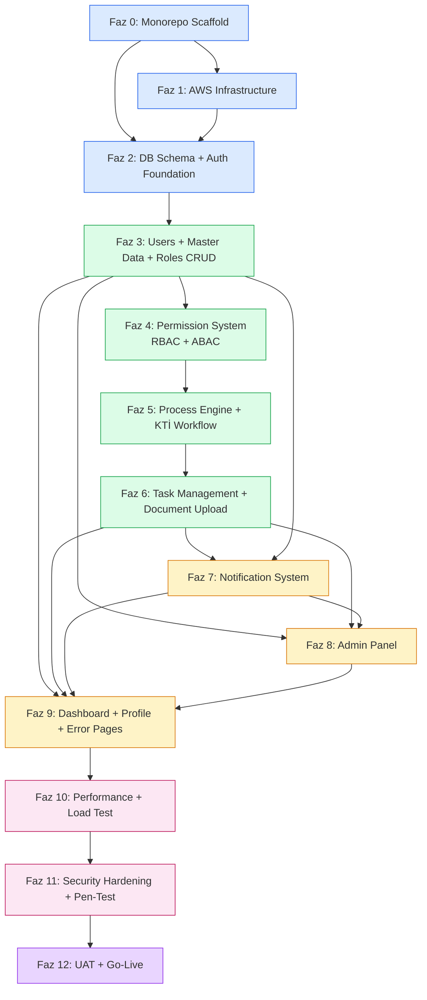

# Lean Management Platformu — Uygulama Yol Haritası

> Bu platform **vibe coding** ile geliştirilir: Cursor (veya benzer AI coding agent) kullanan tek developer iteratif olarak inşa eder. Geleneksel sprint-retro-standup ritmi değil, **faz-bazlı dikey dilim** modeli uygulanır. Her faz agent session'larına bölünür; her session sonrası human gate ile ilerlenir. Bu doküman fazların sırasını, bağımlılıklarını, her faz için agent'a verilecek context materyalini ve vibe-coding'e özel risk yönetimini tanımlar.

---

## 1. Vibe Coding Çalışma Modeli

### 1.1 Kim Ne Yapar

| Aktör                 | Sorumluluk                                                                                                                                       |
| --------------------- | ------------------------------------------------------------------------------------------------------------------------------------------------ |
| **Developer (Semih)** | Yön belirleme, karar verme, her faz sonunda human gate review, test doğrulama, production deploy onayı, ADR yazımı (agent drafts, insan onaylar) |
| **Cursor Agent**      | Kod yazımı, test yazımı, refactor, dokümantasyon draft, CI hataları diagnose + fix, consistency audit                                            |
| **11 Doküman**        | Agent'ın bilgi tabanı. Her session başında ilgili doküman context'e yüklenir                                                                     |
| **.mdc Cursor Rules** | Agent'ın kural kitabı — nasıl kod yazar, hangi pattern'leri izler (ayrı skill ile üretilecek)                                                    |

Developer'ın **kod yazmadığı** varsayımı. Developer'ın zihinsel yükü: "doğru soruyu sor, doğru context ver, output'u doğrula". Agent'ın zihinsel yükü: "kuralı uygula, test yaz, refactor, consistency koru".

### 1.2 Agent Session Akışı

Her bir geliştirme session'ı tek döngü:

```
1. Developer: intent belirler (örn. "KTİ manager approval form'unu ekle")
2. Developer: ilgili dokümanları agent context'ine koyar
   - 01_DOMAIN_MODEL (KTİ state machine için)
   - 03_API_CONTRACTS (endpoint referansı)
   - 05_FRONTEND_SPEC (form pattern)
   - 06_SCREEN_CATALOG (S-TASK-DETAIL tam şablonu)
   - 08_TESTING_STRATEGY (test coverage hedefleri)
3. Developer: prompt yazar — net hedef + constraint
4. Agent: kod yazar (file create/modify)
5. Agent: test yazar
6. Agent: `pnpm test` + `pnpm lint` çalıştırır, hatası varsa fix eder
7. Developer: output'u review eder — doğru mu, consistent mi, edge case'ler kapsanmış mı?
8. Developer: kabul → commit; reject → agent'a iterate
9. Developer: PR aç → CI → squash merge
```

Tipik session süresi 30-90 dakika. Büyük feature birden fazla session gerektirir.

### 1.3 Faz Kavramı

**Sprint yerine faz.** Farklar:

| Sprint (geleneksel)             | Faz (vibe coding)                         |
| ------------------------------- | ----------------------------------------- |
| Zamanla bağlı (2 hafta)         | İşle bağlı (feature-complete olana kadar) |
| Velocity ölçümü (story points)  | İterasyon sayısı ölçümü                   |
| Retrospective + planning rituel | Her faz sonrası human gate checklist      |
| Pair programming, standup       | Solo + agent, async context handoff       |
| Team estimation                 | Developer kendi kapasitesine göre         |

Faz süresi tahmini yapılır ama katı değil — "3-5 agent session" gibi approximate.

### 1.4 Human Gate

Her faz sonunda developer'ın manuel kontrol listesi:

- Feature çalışıyor mu (lokal end-to-end)?
- Test coverage threshold'unu karşılıyor mu?
- Lint + type-check green mi?
- Dokümantasyon güncellendi mi (yeni ADR gerekliyse yazıldı mı)?
- Consistency: önceki fazlardaki pattern'ler doğru uygulandı mı?
- Staging'e deploy edildi, smoke test yapıldı mı?

Gate fail → sonraki faza geçilmez. Agent ile iterate edilir.

### 1.5 Hallucination ve Drift'e Karşı Kalkanlar

Vibe coding'in doğal riski agent'ın yanlış yapması:

- **Hallucination** — var olmayan library import, yanlış API signature
- **Context drift** — session uzadıkça önceki kararlardan sapma
- **Over-abstraction** — MVP'de basit olması gereken şeyi premature generalize
- **Under-specification** — edge case'i atlama
- **Consistency drift** — aynı pattern iki yerde iki farklı uygulanır

Kalkanlar:

1. **TypeScript strict + Zod** — yanlış tipler compile'da yakalanır
2. **Test coverage gate** — agent test yazmayı atlasa bile CI block eder
3. **11 doküman** — doğru pattern referansı (agent hatırlamadığında okur)
4. **`.mdc` cursor rules** — pattern reinforcement
5. **ESLint custom rules** — proje-özel constraint'ler (permission decorator zorunlu, dangerouslySetInnerHTML yasak vs.)
6. **Human gate** — son savunma

---

## 2. Bağımlılık Grafiği

Fazlar arası ilişki:



**Kritik path:** F0 → F2 → F3 → F4 → F5 → F6 → F8 → F9 → F10 → F11 → F12.

**Paralelleştirilebilir:** F7 (notification) F6'dan sonra ama F8'den bağımsız başlayabilir. F9 (dashboard) F3+F6+F7+F8 birlikte olduğunda başlar.

Solo developer + agent olduğu için paralelleştirme avantajı sınırlı. Ancak düşük-bağımlılık fazları (örn. email template seed, master data seed) blocking task beklerken arada yapılabilir.

---

## 3. Faz Detayları

Her faz için sabit yapı:

- **Kapsam**
- **Agent kick-off materyali**
- **Deliverable**
- **Human gate kontrol listesi**
- **Risk uyarıları (vibe-coding-özel)**
- **Tahmini agent iteration sayısı**

---

### Faz 0 — Monorepo Scaffold

#### Kapsam

- Turborepo + pnpm workspace kurulumu
- `apps/{api, web, worker}` + `packages/{shared-types, shared-schemas, config, shared-utils}` iskeleti
- Root-level config dosyaları: `.nvmrc`, `.editorconfig`, `.gitignore`, `turbo.json`, `pnpm-workspace.yaml`, `package.json`
- `packages/config` içinde shared tsconfig, ESLint, Prettier, Vitest base config'leri
- `docker-compose.yml` — postgres, redis, mailpit
- Husky + commitlint setup
- İlk PR pipeline (`.github/workflows/pr-check.yml` — minimal lint + build)
- `README.md` + onboarding section

#### Agent Kick-off Materyali

- `09_DEV_WORKFLOW` — monorepo yapısı, tool versions, commit convention
- Örnek: "Bu dokümana uygun monorepo iskeleti kur. Apps ve packages yapısını oluştur. Her app'te boş `index.ts` placeholder; her package'te Readme + package.json."

#### Deliverable

- `pnpm install` başarılı çalışır
- `pnpm dev` — henüz bir şey başlatmıyor ama command exists
- `pnpm lint` + `pnpm typecheck` green (boş projelerde)
- `docker compose up` — PostgreSQL, Redis, Mailpit ayağa kalkar
- İlk commit + PR + CI green

#### Human Gate

> **Scaffold (2026-04):** Repo iskeleti tamamlandı. `docker compose up` ve örnek conventional commit ile commitlint doğrulaması merge öncesi developer tarafından yapılmalıdır.

- [x] Klasör yapısı `09_DEV_WORKFLOW` ile birebir eşleşiyor
- [x] Her internal package `@leanmgmt/*` scope'unda
- [x] `turbo.json` pipeline tanımlı (build, lint, typecheck, test, dev)
- [x] Husky hooks aktif — commitlint + lint-staged (`pnpm prepare` / `.husky/*`)
- [x] `.env.example` kök + her app altında placeholder
- [x] Docker compose servisleri tanımlı (PostgreSQL 16, Redis 7, Mailpit) — sağlık kontrolü `docker compose ps`

#### Vibe Coding Risk Uyarıları

- **Agent başka monorepo tool'u seçebilir** (nx, lerna). Açıkça Turborepo + pnpm belirtilmeli.
- **Agent package scope'larını tutarsız yapabilir** (bir yerde `@leanmgmt`, diğerinde `@lean-management`). Prompt'ta name convention belirt.
- **Agent gereksiz boilerplate ekler** (CI for 6 environments, 3 dummy packages). Minimal kurulum iste.

#### Tahmini İterasyon

2-3 agent session (~2-4 saat toplam developer time).

---

### Faz 1 — AWS Infrastructure as Code

#### Kapsam

- Terraform setup: remote state (S3 + DynamoDB lock)
- 3 AWS hesap konfigürasyonu (dev/staging/prod) — IAM Identity Center SSO
- Dev hesabı için temel kaynaklar:
  - VPC + subnet'ler (public + private)
  - NAT Gateway
  - Security Group'lar
  - RDS Aurora PostgreSQL 16 (single AZ dev, multi-AZ staging/prod)
  - ElastiCache Redis
  - S3 bucket: documents + logs
  - CloudFront distribution (doküman serving)
  - ECR repositories
  - ECS cluster + task definitions (placeholder — henüz deploy edilecek image yok)
  - ALB + target groups
  - Route53 hosted zone + certificate (ACM)
  - CloudWatch log groups + alarms
  - Secrets Manager secrets (placeholder)
  - IAM roles (ECS task role, GitHub OIDC deploy role)
- `.github/workflows/main.yml` — staging deploy pipeline (henüz test kısımları yok)

#### Agent Kick-off Materyali

- `07_SECURITY_IMPLEMENTATION` — AWS 3-hesap izolasyonu, encryption, CloudFront 8-katman
- `09_DEV_WORKFLOW` — OIDC IAM role Terraform örneği, environment topology
- `00_PROJECT_OVERVIEW` — AWS region (eu-central-1), ölçek hedefleri

#### Deliverable

- `terraform apply` dev hesabında başarılı
- RDS endpoint, Redis endpoint, S3 bucket isimleri output'ta görünür
- GitHub Actions dev hesabına OIDC ile assume role yapabilir
- ECR repo'ları hazır
- CloudFront distribution UP (henüz origin'e yönlendirilmiyor — dummy S3)

#### Human Gate

- [ ] 3 hesap SSO'dan erişilebilir
- [ ] Terraform state remote'da (S3) — lock çalışıyor (DynamoDB)
- [ ] IAM role permission'ları minimal (dev için wide, staging/prod için restricted)
- [ ] RDS encryption-at-rest aktif (AWS KMS)
- [ ] S3 bucket'lar public access blocked
- [ ] CloudFront HTTPS only
- [ ] Security Group'lar principle of least privilege (DB port sadece ECS SG'den)
- [ ] Staging ve prod hesaplar için Terraform module reuse hazır (copy-paste değil)

#### Vibe Coding Risk Uyarıları

- **Agent Terraform yerine CDK önerebilir.** IaC tool seçimi Terraform — prompt'ta belirt.
- **Agent AWS managed service'leri default parametrelerle oluşturur** — güvenlik konfigürasyonu (encryption, IAM) eksik kalabilir. `07_SECURITY_IMPLEMENTATION` context'e zorunlu.
- **Agent her service için verbose resource** (40 farklı CloudWatch alarm) oluşturabilir. Minimal başla, ihtiyaç duyulanı ekle.
- **Agent prod ve staging'i "later" bırakabilir.** Module yapısı iki hesap için de hazır olmalı — sadece apply dev'de yapılır, staging/prod için Faz 12'de.
- **Agent IP adreslerini, account ID'leri hardcode edebilir.** Variables file (`tfvars`) kullan.

#### Tahmini İterasyon

5-8 agent session (~3-5 gün developer time). Terraform IaC iterasyon yoğun — her `apply` sonrası test + fix döngüsü.

---

### Faz 2 — Database Schema + Auth Foundation

#### Kapsam

**Backend:**

- NestJS 10 + Fastify + Prisma boilerplate
- `packages/shared-schemas` ilk Zod schema'ları (auth DTO'ları)
- `packages/shared-types` ilk type'lar (Permission enum boş placeholder, PERMISSION_METADATA dict)
- Prisma schema v1:
  - `users`, `sessions`, `password_history`, `login_attempts`
  - `audit_logs` (append-only trigger + chain hash fonksiyonları)
  - `consent_versions`, `consent_acceptance_history`
  - `roles`, `role_permissions` (henüz empty data)
  - `system_settings`
- İlk migration + seed script (Superadmin user + v1 consent version)
- Auth modülü tam:
  - `AuthService` — login, logout, refresh, password-reset-request, password-reset-confirm, change-password, consent/accept
  - `AuthController` — 8 endpoint
  - `JwtAuthGuard`, `CsrfGuard`, `ConsentGuard`
  - JWT HS256 + refresh token rotation + family tracking
  - bcrypt cost 12 + password policy validation
  - Rate limit (login 10/dk IP, 5/15dk email; password-reset 3/saat)
  - `login_attempts` logging
- Pino logging + Sentry integration
- Health endpoint + readiness probe

**Frontend:**

- Next.js 15 + App Router boilerplate
- Tailwind + shadcn/ui base setup
- Auth route grubu: `/login`, `/forgot-password`, `/reset-password`
- `AuthLayout`, `<Card>`, `<Form>`, `<Button>`, `<Input>` shadcn bileşenleri
- Axios client + interceptor (auth + refresh rotation + error handling)
- Zustand `useAuthStore`
- TanStack Query setup
- S-AUTH-LOGIN, S-AUTH-FORGOT, S-AUTH-RESET, S-AUTH-CONSENT, S-AUTH-CHANGE-PWD ekranları
- `middleware.ts` cookie guard
- Sentry integration

**Integration:**

- `.github/workflows/pr-check.yml` — unit + integration test (testcontainers)
- İlk end-to-end: Docker compose ile lokal çalıştır → login → dashboard placeholder (boş sayfa)

#### Agent Kick-off Materyali

**Session'lara bölünmeli** — tek session'da yazılamaz. Her session için farklı context.

Session sequence önerisi:

- **Session 2.1 — Prisma schema + migrations:** `02_DATABASE_SCHEMA` (users + audit_logs + sessions + roles + master data iskeleti), `07_SECURITY_IMPLEMENTATION` (audit chain function)
- **Session 2.2 — Auth service:** `03_API_CONTRACTS` (auth endpoint'leri), `07_SECURITY_IMPLEMENTATION` (bcrypt, JWT, refresh rotation)
- **Session 2.3 — Auth controller + guards:** `04_BACKEND_SPEC` (middleware zinciri), `03_API_CONTRACTS` (error taxonomy)
- **Session 2.4 — Frontend scaffold + axios:** `05_FRONTEND_SPEC` (route groups, state boundaries, axios interceptor)
- **Session 2.5 — Auth ekranları:** `06_SCREEN_CATALOG` (S-AUTH-\* tam şablonları)
- **Session 2.6 — Testing:** `08_TESTING_STRATEGY` (auth test senaryoları, integration testcontainers)

#### Deliverable

- Lokal: docker compose up → `pnpm dev` → `/login`'e git → email+password ile giriş → `/dashboard` (boş placeholder) yönlendirilir
- Logout çalışır → login'e döner
- Yanlış şifre 5 kez → lockout
- Şifre expired senaryosu (password_changed_at manuel geçmişe al) → zorunlu değiştirme yönlendirmesi
- Consent modal blocking (test user'ı consent_accepted null)
- Audit log kayıtları veritabanında görülüyor
- Testler: auth için unit + integration, coverage ≥ 90%
- CI green

#### Human Gate

- [ ] Prisma schema `02_DATABASE_SCHEMA` ile birebir (table + column + index)
- [ ] audit_logs chain hash trigger + append-only trigger çalışıyor (TRUNCATE denemesi fail)
- [ ] Auth error kodları `03_API_CONTRACTS` ile eşleşiyor (AUTH_INVALID_CREDENTIALS, AUTH_ACCOUNT_LOCKED, vs.)
- [ ] JWT HS256 + rotation + family tracking test edildi (theft detection senaryosu)
- [ ] Frontend axios interceptor 401 AUTH_TOKEN_EXPIRED → silent refresh pattern
- [ ] S-AUTH-LOGIN error state'leri (lockout countdown, invalid creds, password expired)
- [ ] Consent modal blocking: ESC disabled, outside click disabled, X butonu yok
- [ ] Rate limit senaryosu: 11. login request → 429
- [ ] Test coverage: auth module %90+
- [ ] Sentry + CloudWatch log integration test edildi

#### Vibe Coding Risk Uyarıları

- **Agent JWT logic'i kendi yapar** — refresh rotation, family tracking unutabilir. Açık prompt: "refresh token family ile theft detection uygula (`07_SECURITY_IMPLEMENTATION` Bölüm 3.3)".
- **Agent bcrypt compare için short-circuit yapar** (user yoksa compare atlar) → timing attack. Prompt'ta timing protection vurgulanır.
- **Agent audit log chain hash'i application code'da compute edebilir** — DB trigger kullanılmalı (tampering yüzeyini küçültmek için). `07_SECURITY_IMPLEMENTATION` Bölüm 12'yi zorunlu oku.
- **Agent consent modal'ın ESC disable'ını unutur** — S-AUTH-CONSENT şablonunu dikkatli reçete.
- **Agent frontend'te access token'ı localStorage'a koyar** — kesinlikle memory only. Prompt'ta XSS risk'i belirt.
- **Agent rate limit'i opsiyonel görür** — MVP foundation'ın parçası. Zorunlu.

#### Tahmini İterasyon

12-18 agent session (~7-10 gün developer time). En yoğun faz.

---

### Faz 3 — Users + Master Data + Roles CRUD

#### Kapsam

**Backend:**

- Users modülü: CRUD + anonymize + session yönetimi (admin)
- `packages/shared-schemas`: users + master-data + roles Zod şemaları
- `packages/shared-types`: Permission enum + PERMISSION_METADATA dolduruldu (tüm MVP permission'lar)
- Master data modülü: generic CRUD (8 type)
- Roles modülü: CRUD + role permissions (henüz attribute rules yok → Faz 4)
- Encryption middleware (email deterministic, phone probabilistic)
- Manager cycle detection
- Audit log decorator `@Audit()` tüm mutation'larda

**Frontend:**

- `/dashboard` route (boş placeholder — Faz 9'da dolacak)
- `/users` liste + new + detail + edit
- `/users/:id/roles`, `/users/:id/sessions`
- `/roles` liste + new + detail
- `/master-data/:type` generic CRUD
- Reusable components: `<DataTable>`, `<FormLayout>`, `<MasterDataSelect>`, `<UserSelect>`, `<EmptyState>`, `<ConfirmDialog>`
- UserForm tam implementasyon (16 field, multiple section)
- Role-yetki tablosu **henüz yok** (Faz 4)

**Integration:**

- E2E test: Superadmin login → user create → user detail → edit → deactivate
- Integration test: encryption roundtrip, manager cycle detection

#### Agent Kick-off Materyali

Session'lar:

- **Session 3.1 — Prisma schema genişletme:** `02_DATABASE_SCHEMA` (users + master data + roles tabloları)
- **Session 3.2 — Permission enum dolduruldu:** `04_BACKEND_SPEC` (Permission metadata pattern), `07_SECURITY_IMPLEMENTATION` (hassas permission örnekleri)
- **Session 3.3 — Users service + controller:** `03_API_CONTRACTS` (9.2 Users endpoint'leri), `04_BACKEND_SPEC` (encryption middleware, manager cycle)
- **Session 3.4 — Master data generic CRUD:** `03_API_CONTRACTS` (9.3 Master Data), `06_SCREEN_CATALOG` (S-MD-LIST generic pattern)
- **Session 3.5 — Roles CRUD (permission'lar hariç):** `03_API_CONTRACTS` (9.4 Roles), `02_DATABASE_SCHEMA` (roles tabloları)
- **Session 3.6 — Frontend user ekranları:** `06_SCREEN_CATALOG` (S-USER-\*), `05_FRONTEND_SPEC` (form pattern + UserForm reference)
- **Session 3.7 — Frontend master data + roles ekranları:** `06_SCREEN_CATALOG` (S-MD-LIST, S-ROLE-LIST, S-ROLE-DETAIL)
- **Session 3.8 — Testing + polish:** `08_TESTING_STRATEGY` (integration testler)

#### Deliverable

- Superadmin tüm kullanıcıları listeler, filtreler, yeni ekler, düzenler, pasifleştirir
- Master data 8 tip için aynı pattern çalışır
- Rol oluşturulur (permission atama Faz 4'te)
- Encryption: email ve phone DB'de encrypted, okurken decrypt
- Manager cycle: cyclic atama 409 döner
- Kullanıcı detay sayfasında "Sicil disabled" (edit)
- Anonymize: user pasifleştir + reason + audit log kayıtları
- CI: integration test ile full user CRUD flow

#### Human Gate

- [ ] Permission enum tüm MVP permission'ları içeriyor (42 adet)
- [ ] PERMISSION_METADATA category bazında gruplama doğru
- [ ] Users endpoint'leri `03_API_CONTRACTS` ile birebir (request/response format, error codes)
- [ ] Encryption: DB'de `SELECT email FROM users` → ciphertext, uygulama katmanında plaintext
- [ ] `<MasterDataSelect>` work-sub-area için parent filter çalışıyor
- [ ] UserForm: 16 field tam, dirty warning, server-side error mapping
- [ ] DataTable cursor-based pagination doğru (offset değil)
- [ ] E2E: user CRUD happy path
- [ ] Audit log her mutation için oluşuyor

#### Vibe Coding Risk Uyarıları

- **Agent permission enum'u incomplete bırakabilir** — placeholder'lar kalır. Faz başında full liste çıkar, agent metadata'yı toplu doldursun.
- **Agent master data için 8 ayrı endpoint yazar** (generic değil) — repetitive, maintenance zor. Generic endpoint + `:type` param pattern'i zorunlu tutmak için prompt'ta vurgula.
- **Agent manager cycle check'i client-side yapar** — backend zorunlu, iki katman da değil. Cycle detection algoritması: recursive walk up hierarchy, max depth 20.
- **Agent `<UserForm>` component'ini re-create eder** (new vs edit için ayrı) — DRY ihlali. Tek component, `mode` prop ile.
- **Agent encryption'ı "later" bırakır** — hemen MVP'de uygulanmalı, yoksa retroactive encryption zor.
- **Agent `@Audit()` decorator'ı unutur** bazı mutation'larda. Consistency audit zorunlu.

#### Tahmini İterasyon

10-15 agent session.

---

### Faz 4 — Permission System (RBAC + ABAC)

#### Kapsam

**Backend:**

- `PermissionResolverService` — direct roles + attribute rules union, Redis cache
- `@RequirePermission(X)` decorator + `PermissionGuard`
- `role_permissions` CRUD (bulk replace)
- `attribute_rules` tablosu + CRUD
- Attribute rule evaluator (OR groups + AND conditions)
- Cache invalidation triggers (user role change, rule change, attribute change)
- `/roles/:id/rules/test` endpoint — canlı matching user preview
- Permission metadata endpoint (`GET /api/v1/permissions`)
- Tüm diğer modüllerde `@RequirePermission` eklenir (users, master-data, roles, processes placeholder)

**Frontend:**

- S-ROLE-PERMISSIONS — kategori sekmeleri + diff UI + destructive confirmation
- S-ROLE-RULES — condition set builder + operator + polymorphic value + "Test Et" modal
- S-ROLE-USERS — source filter (direct / rule)
- `<PermissionGate>` component
- `useAuthStore` permission set management
- Rol ataması — S-USER-ROLES "Yeni Rol Ata" modal

#### Agent Kick-off Materyali

Session'lar:

- **Session 4.1 — Permission resolver + cache:** `07_SECURITY_IMPLEMENTATION` (Bölüm 4.2 Permission Cache), `04_BACKEND_SPEC` (PermissionResolverService pattern)
- **Session 4.2 — `@RequirePermission` decorator + guard:** `07_SECURITY_IMPLEMENTATION` (Bölüm 4.1 Katman 2), `03_API_CONTRACTS` (PERMISSION_DENIED error)
- **Session 4.3 — Attribute rule evaluator:** `02_DATABASE_SCHEMA` (attribute_rules schema), `01_DOMAIN_MODEL` (rule semantics)
- **Session 4.4 — Rule test endpoint:** `03_API_CONTRACTS` (9.4.5 endpoint), `06_SCREEN_CATALOG` (S-ROLE-RULES test modal)
- **Session 4.5 — Frontend PermissionGate + auth store:** `05_FRONTEND_SPEC` (Bölüm 15 PermissionGate), `05_FRONTEND_SPEC` (Bölüm 4 state boundaries)
- **Session 4.6 — S-ROLE-PERMISSIONS:** `06_SCREEN_CATALOG` + `05_FRONTEND_SPEC` (Bölüm 13 Rol-Yetki Tablosu UX)
- **Session 4.7 — S-ROLE-RULES:** `06_SCREEN_CATALOG` (S-ROLE-RULES tam şablonu)
- **Session 4.8 — Cache invalidation + integration test:** `07_SECURITY_IMPLEMENTATION` (Bölüm 4.2 invalidation triggers), `08_TESTING_STRATEGY` (permission cache test)

#### Deliverable

- Rol-Yetki tablosu: Superadmin rol permission'ı değiştirir, 5 dk cache sonrası user permission değişiyor (instant cache invalidation ile anlık)
- Attribute rule: "departmentId=IT" koşulu ile user'lara otomatik rol atanır
- Rule test modal: "42 kullanıcı eşleşiyor" preview
- `<PermissionGate>` sidebar menu item'larını gizliyor
- Backend: `@RequirePermission(USER_CREATE)` yetkisi olmayan user → 403
- Integration test: role permission update → affected users cache silindi

#### Human Gate

- [ ] Permission cache TTL 5 dk, invalidation tüm triggers'te aktif
- [ ] Attribute rule evaluator OR groups + AND conditions doğru (unit test 10+ senaryo)
- [ ] Rule test endpoint preview doğru (actual match sayısı)
- [ ] Rol-yetki tablosu: isSensitive permission'lar rozeti + destructive confirmation
- [ ] S-ROLE-RULES: attribute key change → value input tipi değişir
- [ ] `<PermissionGate>` hem sidebar hem action button'larda
- [ ] Backend @RequirePermission tüm mutation endpoint'lerinde (spot check — 5 endpoint random seç)
- [ ] Frontend PermissionGate **güvenlik katmanı değil** — UX gizleme. Backend enforcement zorunlu.

#### Vibe Coding Risk Uyarıları

- **Agent permission check'i yalnızca frontend'te yapabilir** — backend'te unutabilir. Her endpoint için guard zorunlu.
- **Agent attribute rule evaluator'ı polymorphic value için case-by-case yapar** — generic handler + operator × value type matrix daha temiz.
- **Agent cache invalidation'ı "synchronous value update" yapar** (cache'i yeni değerle günceller) — invalidation (delete) daha güvenli. Prompt'ta `DEL` vurgulanır.
- **Agent rule evaluator'ı DB query ile yapabilir** (her resolve'da rules fetch) — in-memory evaluation + cached result doğru pattern.
- **Agent Rol-Yetki Tablosu'nda diff özeti atlar** — UX kritik, kullanıcı ne değişiyor görmeli.

#### Tahmini İterasyon

8-12 agent session.

---

### Faz 5 — Process Engine + KTİ Workflow

#### Kapsam

**Backend:**

- `processes` tablosu (display_id per-type sequence)
- `tasks` + `task_assignees` tabloları
- `ProcessTypeRegistry` pattern (`packages/shared-types`'te)
- KTİ workflow tanımı: `BEFORE_AFTER_KAIZEN`
  - Step 1: KTİ_INITIATION (başlatıcı task)
  - Step 2: KTİ_MANAGER_APPROVAL (72 saat SLA, 3 action: APPROVE/REJECT/REQUEST_REVISION)
  - Step 3 (conditional): KTİ_REVISION (başlatıcıya revize)
  - Back to Step 2 after revision
- State machine transition kuralları
- `POST /processes/kti/start` endpoint (embedded başlatma — task + process aynı anda)
- Documents modülü: upload-initiate (CloudFront Signed URL), upload-complete, scan-status polling
- ClamAV Lambda placeholder (dev'de scan PENDING → CLEAN auto-mock; staging'de real ClamAV)

**Frontend:**

- S-KTI-START form (6 field + multi-upload)
- `<DocumentUploader>` component (Signed URL + progress + scan polling)
- S-PROC-LIST-MY (başlatıcı için süreç listesi)

**Integration:**

- E2E: KTİ başlat → süreç detay gör (henüz task detay ekranı yok, Faz 6)
- Integration test: document scan polling, display_id sequence per-type

#### Agent Kick-off Materyali

- **Session 5.1 — Prisma schema: processes + tasks:** `02_DATABASE_SCHEMA`, `01_DOMAIN_MODEL` (state machines)
- **Session 5.2 — ProcessTypeRegistry pattern:** `04_BACKEND_SPEC` (Bölüm ProcessTypeRegistry), `01_DOMAIN_MODEL`
- **Session 5.3 — KTİ workflow tanımı:** `01_DOMAIN_MODEL` (KTİ state machine), process workflow
- **Session 5.4 — /processes/kti/start endpoint:** `03_API_CONTRACTS` (9.5 Processes)
- **Session 5.5 — Documents modülü:** `03_API_CONTRACTS` (9.7 Documents), `07_SECURITY_IMPLEMENTATION` (Bölüm 13 CloudFront 8-katman)
- **Session 5.6 — `<DocumentUploader>`:** `05_FRONTEND_SPEC` (Bölüm 7.8), `06_SCREEN_CATALOG` (S-KTI-START)
- **Session 5.7 — S-KTI-START:** `06_SCREEN_CATALOG` (tam şablon)
- **Session 5.8 — S-PROC-LIST-MY:** `06_SCREEN_CATALOG`
- **Session 5.9 — Testing:** `08_TESTING_STRATEGY` (KTİ workflow senaryoları)

#### Deliverable

- Kullanıcı `/processes/kti/start`'a gider → formu doldurur → fotoğraflar yüklenir (CLEAN scan) → submit → KTI-000001 oluşur
- Manager'a task atanır (DB'de görülür — henüz UI'da görünmüyor)
- Süreç detay sayfası henüz yok (sadece liste var — Faz 6'da)
- Integration test: full KTİ start flow

#### Human Gate

- [ ] `display_id` format `KTI-000001` (6 haneli padding, process_type başına ayrı sequence)
- [ ] `processes.state`, `tasks.state` enum'ları `01_DOMAIN_MODEL` ile birebir
- [ ] State machine transition: sadece allowed transition'lar backend'te accept (invalid → 409)
- [ ] ProcessTypeRegistry pattern: yeni süreç tipi eklemek kolay (kod örneği ADR)
- [ ] KTİ başlatıcı manager'ı yoksa → 422 USER_NOT_FOUND uygun error
- [ ] `<DocumentUploader>` scan status polling 5 sn interval, max 60 sn timeout
- [ ] CloudFront Signed URL 5 dk TTL
- [ ] Integration test: before/after photos zorunlu, 1-10 arası

#### Vibe Coding Risk Uyarıları

- **Agent ProcessTypeRegistry pattern'i atlayabilir**, KTİ'yi hard-code yazabilir. Uzun vadede her yeni süreç tipi için tekrar yazım → pattern zorunlu.
- **Agent state machine transition'ları enforce etmez** — herhangi bir state → herhangi bir state geçişi yapar. Explicit allowed-transitions matrisi.
- **Agent display_id için sequence yerine UUID veya counter kullanır** — `02_DATABASE_SCHEMA`'daki per-type PostgreSQL sequence zorunlu.
- **Agent document upload'ı tek endpoint olarak tasarlar** (client → backend → S3 relay) — scalability engeli. Pre-signed URL pattern zorunlu.
- **Agent ClamAV'i mock ile değiştirir** (dev için ok) ama staging/prod için real Lambda hazırlığı unutulur. Infrastructure placeholder'ı Faz 1'de hazırlanmış olmalı, Faz 5'te aktive edilir.
- **Agent `<DocumentUploader>` scan polling'ini browser'da interval ile yapar** ama component unmount olursa interval leak. Cleanup zorunlu.

#### Tahmini İterasyon

10-14 agent session.

---

### Faz 6 — Task Management + Document Upload Integration

#### Kapsam

**Backend:**

- Task endpoints: list, detail, claim, complete
- Claim mode handling (CLAIM tip task'larda peer eviction)
- Complete action-based handler (completion_action + reason validation)
- Task visibility (başlatıcı vs assignee vs PROCESS_VIEW_ALL)
- Process cancel + rollback endpoints
- Integration with KTİ workflow (manager approval transitions)
- SLA hesaplama (task.sla_due_at assignment-time)

**Frontend:**

- S-TASK-LIST (3 tab: pending/started/completed)
- S-TASK-DETAIL (süreç bağlamı + önceki task'lar collapsible + action paneli)
- S-PROC-DETAIL (task zinciri timeline + documents + cancel/rollback aksiyonları)
- S-PROC-LIST-ADMIN (genişletilmiş filtre)
- S-PROC-CANCEL + S-PROC-ROLLBACK modal'lar (destructive confirmation "ONAYLIYORUM" pattern)
- `<SlaBadge>` component

**Integration:**

- E2E: KTİ full happy path (login → kti start → manager login → task detail → approve → process completed)
- E2E: revision loop
- E2E: cancel flow

#### Agent Kick-off Materyali

- **Session 6.1 — Task endpoints:** `03_API_CONTRACTS` (9.6 Tasks)
- **Session 6.2 — Claim + complete action handler:** `01_DOMAIN_MODEL` (task semantics), `04_BACKEND_SPEC` (workflow engine)
- **Session 6.3 — Visibility rules:** `07_SECURITY_IMPLEMENTATION` (Bölüm 4.1 Katman 3+4)
- **Session 6.4 — Process cancel + rollback:** `03_API_CONTRACTS`, `01_DOMAIN_MODEL` (rollback semantics)
- **Session 6.5 — S-TASK-LIST:** `06_SCREEN_CATALOG`
- **Session 6.6 — S-TASK-DETAIL (en kompleks ekran):** `06_SCREEN_CATALOG` (tam şablon)
- **Session 6.7 — S-PROC-DETAIL:** `06_SCREEN_CATALOG`
- **Session 6.8 — Cancel + rollback modals:** `06_SCREEN_CATALOG` (S-PROC-CANCEL, S-PROC-ROLLBACK)
- **Session 6.9 — E2E test:** `08_TESTING_STRATEGY` (KTİ happy path Playwright)

#### Deliverable

- İlk KTİ full cycle: başlatıcı KTİ başlatır → manager task listesinde görür → detay açar → onaylar/reddeder/revize ister → başlatıcı revize eder → manager yeniden onaylar → süreç COMPLETED
- Cancel: admin süreci iptal eder (reason + ONAYLIYORUM)
- Rollback: admin önceki step'e döner
- SLA badge task list'te doğru renkte

#### Human Gate

- [ ] Claim race condition: iki user eşzamanlı claim → biri success, diğeri 409 TASK_CLAIM_LOST (integration test)
- [ ] Completion action + reason validation: REJECT/REQUEST_REVISION'da reason zorunlu, APPROVE'da opsiyonel
- [ ] Task visibility: assignee önceki task'ın form_data'sını görmez (null), başlatıcı görür
- [ ] S-TASK-DETAIL: action select değişimi → form field'lar dinamik güncellenir
- [ ] S-PROC-DETAIL: task zinciri görsel (timeline) — rollback ile SKIPPED task'lar işaretli
- [ ] Rollback: yeni task instance (eski task SKIPPED_BY_ROLLBACK)
- [ ] E2E full cycle green

#### Vibe Coding Risk Uyarıları

- **Agent claim mode için optimistic update yapabilir** frontend'te — race condition'da kullanıcı hata görmez. Pessimistic (server response bekle) pattern zorunlu.
- **Agent visibility rule'larını service içinde inline yapar** (if-else yığını) — response serializer pattern (`04_BACKEND_SPEC` User/ProcessSerializer) zorunlu.
- **Agent task detail'ında form schema'yı hard-code yapar** — backend'ten `formSchema` gelmeli, frontend dynamic render.
- **Agent "önceki task'ların form_data'sını göster" kısmını atlar** — S-TASK-DETAIL en yoğun ekran, collapse/expand + visibility rules karmaşık.
- **Agent rollback'i "cancel + restart" şeklinde implementation yapar** — yanlış semantic. New task for previous step + old task SKIPPED pattern zorunlu.
- **Agent destructive confirmation ONAYLIYORUM pattern'ini atlar** — cancel/rollback'te zorunlu.

#### Tahmini İterasyon

12-16 agent session.

---

### Faz 7 — Notification System

#### Kapsam

**Backend:**

- Notifications tablosu
- `NotificationDispatchService` — event → in-app notification + email queue
- BullMQ worker setup (`apps/worker`)
- Email sender (Mailpit dev, SES staging/prod)
- Handlebars render + DOMPurify sanitize
- Event triggers:
  - `TASK_ASSIGNED` (task oluşunca assignee'lere)
  - `TASK_CLAIMED_BY_PEER` (peer adayları için — CLAIM mode)
  - `PROCESS_COMPLETED` (başlatıcıya)
  - `PROCESS_REJECTED` (başlatıcıya)
  - `SLA_WARNING` (task SLA %80 geçince)
  - `SLA_BREACH` (SLA aşıldığında)
  - `PASSWORD_EXPIRY_WARNING` (14 gün kala, 3 gün kala, 0 gün)
  - `CONSENT_VERSION_PUBLISHED` (tüm aktif user'lara)
- Cron jobs: SLA checker (her 10 dk), password expiry (günlük), audit chain verify (nightly)
- Notification endpoints: list, mark-read, mark-all-read, unread-count

**Frontend:**

- `<NotificationBell>` topbar (30 sn polling)
- S-NOTIF-LIST full page
- Optimistic mark-read
- Navigation: bildirim tıkla → linkUrl'e git

#### Agent Kick-off Materyali

- **Session 7.1 — Notifications schema + service:** `02_DATABASE_SCHEMA` (notifications tablo), `03_API_CONTRACTS` (9.8)
- **Session 7.2 — BullMQ worker + email sender:** `04_BACKEND_SPEC` (worker pattern)
- **Session 7.3 — Event triggers:** her event için `01_DOMAIN_MODEL` (hangi state'te tetiklenir)
- **Session 7.4 — Handlebars render + sanitize:** `07_SECURITY_IMPLEMENTATION` (Bölüm 7.2 sanitization)
- **Session 7.5 — Cron jobs (SLA, password expiry):** `04_BACKEND_SPEC` (scheduled tasks)
- **Session 7.6 — `<NotificationBell>` + S-NOTIF-LIST:** `05_FRONTEND_SPEC` (Bölüm 14), `06_SCREEN_CATALOG`

#### Deliverable

- KTİ başlatma → manager email alır (Mailpit UI'da görünür) + in-app notification
- Task claim → peer adayları "başka kullanıcı üstlendi" notification
- SLA warning → task detail'daki SLA badge sarıya döner + notification
- Notification bell unread count live (polling)
- S-NOTIF-LIST: bulk mark-all-read, filter, pagination

#### Human Gate

- [ ] Email template her event için var (seed data)
- [ ] Handlebars render sonrası DOMPurify sanitize aktif (XSS test)
- [ ] BullMQ dead letter queue konfigürasyonu (failed jobs isolate)
- [ ] SLA cron: %80 threshold'ta WARNING, aşıldığında BREACH
- [ ] Notification linkUrl tıklama → doğru ekrana gider
- [ ] Optimistic mark-read: tıklama anında sayaç azalır, failure'da rollback
- [ ] Password expiry banner: 14 gün sarı, 3 gün kırmızı

#### Vibe Coding Risk Uyarıları

- **Agent event trigger'ları service içinde inline atar** — decoupled event bus (EventEmitter2 veya NestJS events) pattern zorunlu. Test edilebilirlik + cross-cutting concern.
- **Agent BullMQ retry config'ini default bırakır** — exponential backoff + max retry explicit. Failed jobs dead letter queue.
- **Agent email template'leri hardcode'lar code içinde** — DB'de `email_templates` tablosundan gelir, runtime render. Seed data'da default template'ler.
- **Agent cron job'ları Node.js setInterval ile yapar** — process restart'ta interval kaybı. BullMQ repeatable jobs kullanılmalı.
- **Agent notification polling'ini 5 sn yapar** — 30 sn yeterli, 5 sn gereksiz API load.
- **Agent mark-read optimistic'i eksik implement eder** (onError rollback atlar) — UX bozulur.

#### Tahmini İterasyon

8-12 agent session.

---

### Faz 8 — Admin Panel

#### Kapsam

**Backend:**

- Audit log list endpoint + filter + CSV export (async job)
- Audit chain integrity verify endpoint
- System settings endpoints (get list, bulk update)
- Email template editor endpoints (get/update/preview/send-test)
- Consent version endpoints (list/create/update/publish)

**Frontend:**

- AdminLayout (AppLayout variant, kısıtlı sidebar)
- S-ADMIN-AUDIT (gelişmiş filtre + diff viewer + CSV export)
- S-ADMIN-AUDIT-CHAIN (integrity check sayfası)
- S-ADMIN-SETTINGS (kategori sekmeleri + dirty diff)
- S-ADMIN-EMAIL-LIST + S-ADMIN-EMAIL-EDIT (editor + preview + test send)
- S-ADMIN-CONSENT-LIST + S-ADMIN-CONSENT-EDIT (markdown + publish flow)

#### Agent Kick-off Materyali

- **Session 8.1 — Audit log endpoints + chain verify:** `03_API_CONTRACTS` (9.9), `07_SECURITY_IMPLEMENTATION` (Bölüm 12)
- **Session 8.2 — System settings:** `03_API_CONTRACTS` (9.10), `02_DATABASE_SCHEMA` (system_settings)
- **Session 8.3 — Email templates + consent versions:** `03_API_CONTRACTS` (9.10 devam), `07_SECURITY_IMPLEMENTATION` (rıza yönetimi)
- **Session 8.4 — AdminLayout + S-ADMIN-AUDIT:** `06_SCREEN_CATALOG`
- **Session 8.5 — S-ADMIN-SETTINGS:** `06_SCREEN_CATALOG` (dinamik type render)
- **Session 8.6 — S-ADMIN-EMAIL-EDIT (Handlebars editor):** `06_SCREEN_CATALOG`
- **Session 8.7 — S-ADMIN-CONSENT-EDIT:** `06_SCREEN_CATALOG` (publish flow)

#### Deliverable

- Superadmin audit log sayfasında filter + CSV export çalışır
- Audit chain integrity: manuel trigger → sonuç
- System settings: maintenance mode toggle → real effect (non-admin user 503 görür)
- Email template editor: değişiklik → preview render → test send → Mailpit'te görünür
- Consent version publish: yeni version yayınlandığında tüm kullanıcılara blocking modal

#### Human Gate

- [ ] Audit log CSV export async job pattern (>10K kayıt için)
- [ ] Diff viewer: old_value vs new_value side-by-side JSON
- [ ] System settings bulk update atomic (tek transaction)
- [ ] Email template preview backend'te render (Handlebars + DOMPurify)
- [ ] Test email rate limit (10/saat/user)
- [ ] Consent version publish: effective_from min now+1h
- [ ] Publish sonrası mevcut PUBLISHED version otomatik ARCHIVED
- [ ] AdminLayout: normal kullanıcı URL ile girerse 403

#### Vibe Coding Risk Uyarıları

- **Agent audit log diff viewer'ı basit text diff yapar** — JSON structured diff (eklenen/silinen/değişen color-coded) daha değerli.
- **Agent system settings dynamic render'ı switch-case ile yapar** — `value_type` + `value_schema` (Zod) ile otomatik render pattern daha clean.
- **Agent Handlebars render'ı frontend'te yapar** — XSS + template injection riski. Backend-only render.
- **Agent consent publish'i destructive değil olarak işaretler** — YES, this IS destructive (geri alınamaz, tüm user'ları etkiler). "ONAYLIYORUM" pattern zorunlu.
- **Agent CSV export'u client-side generate eder** (tüm data browser'a) — büyük data memory sorunu. Backend async job + S3 pre-signed URL.

#### Tahmini İterasyon

8-12 agent session.

---

### Faz 9 — Dashboard + Profile + Error Pages

#### Kapsam

**Backend:**

- `/auth/me/data` — "Verilerim" endpoint (user özet)
- `/admin/organization-summary` — dashboard widget verileri
- Session list + revoke endpoints (kendi sessionlar için)

**Frontend:**

- S-DASH-HOME (6 widget: Bekleyen Görevler, Başlattığım Süreçler, SLA Uyarıları, Son Bildirimler, Org Özeti, Audit Chain Sağlığı)
- S-PROFILE (3 tab: Bilgilerim, Verilerim, Güvenlik)
- Password expiry banner
- S-ERROR-403, S-ERROR-404, S-ERROR-500, S-ERROR-MAINT
- Sidebar finalization (tüm menu items, PermissionGate)
- Topbar finalization (notification bell + user menu + breadcrumb)

#### Agent Kick-off Materyali

- **Session 9.1 — Dashboard widgets backend:** `03_API_CONTRACTS` (opsiyonel yeni endpoint'ler — widget query'leri)
- **Session 9.2 — S-DASH-HOME:** `06_SCREEN_CATALOG` (6 widget detay)
- **Session 9.3 — S-PROFILE (3 tab):** `06_SCREEN_CATALOG`, `07_SECURITY_IMPLEMENTATION` (Bölüm 10.4 KVKK rights)
- **Session 9.4 — Error pages:** `06_SCREEN_CATALOG` (secondary screens)
- **Session 9.5 — Sidebar + topbar finalizasyonu:** `05_FRONTEND_SPEC` (navigation), `06_SCREEN_CATALOG` (global navigation)

#### Deliverable

- Dashboard'da kullanıcıya uygun widget'lar (permission-gated)
- Profile "Verilerim" sekmesi: roller, süreç özeti, session history, consent history (**"Verilerimi İndir" yok**)
- Profile "Güvenlik": aktif session'lar + kapat
- Password expiry banner topbar'da (14 gün altında)
- Error page'ler UX polished
- Sidebar permission-gated menüler düzgün

#### Human Gate

- [ ] Dashboard widget'lar parallel lazy load (her biri bağımsız)
- [ ] Widget'lar permission-gated (PROCESS_VIEW_ALL yoksa "Org Özeti" görünmez)
- [ ] Widget error isolation: tek widget fail → diğerleri render
- [ ] S-PROFILE: kendi bilgilerini edit edemez (info banner "Yönetici ile iletişime geçin")
- [ ] "Verilerimi İndir" butonu **yok** — yalnız email channel linki
- [ ] Aktif session'lar: current session rozeti görünür, "Bu Oturumu Kapat" gizli
- [ ] "Tüm Diğer Oturumları Kapat" → mevcut korunur, diğerleri REVOKED
- [ ] Error page'lerde technical detail yok (user-friendly)

#### Vibe Coding Risk Uyarıları

- **Agent dashboard widget'ları single big query ile getirmeye çalışır** — widget-level isolation + parallel fetch daha iyi.
- **Agent S-PROFILE "Verilerim"e "İndir" butonu ekler** — KVKK MVP scope'unda yok. Açık not olmadan eklemesin.
- **Agent error page'lerde stack trace gösterebilir** (dev'de fine, prod'da kritik bilgi sızıntısı). Env-based render.
- **Agent session revoke'ta "mevcut session da revoke et" semantic uygular** — self-session revoke backend'te korunur.

#### Tahmini İterasyon

6-10 agent session.

---

### Faz 10 — Performance + Load Test

#### Kapsam

- Lighthouse CI integration
- Bundle size analysis + optimization (lazy import, route splitting)
- Database query review (`EXPLAIN ANALYZE`, missing indexes)
- Redis cache hit rate optimization
- k6 load test senaryoları (login storm, dashboard, process list)
- Capacity planning: ECS task count, RDS instance class, Redis memory

#### Agent Kick-off Materyali

- `08_TESTING_STRATEGY` (Bölüm 11 Load Test + Bölüm 12 Performance Test)
- `05_FRONTEND_SPEC` (Bölüm 10 Web Vitals)

#### Deliverable

- Lighthouse scores: performance ≥ 80, accessibility ≥ 90, best practices ≥ 90
- Bundle size < 200 KB gzipped initial
- P95 API response < 500ms (1000 concurrent user)
- 0 kritik error rate (load test sırasında)
- Bottleneck report + fix

#### Human Gate

- [ ] Lighthouse CI PR'da çalışıyor, eşikler block ediyor
- [ ] Bundle analyzer: lazy-loaded route'lar doğru split edilmiş
- [ ] DB slow query log → indexed queries
- [ ] Redis cache hit rate > 80% (permissions, consent version, email templates)
- [ ] k6 senaryoları staging'de green

#### Vibe Coding Risk Uyarıları

- **Agent optimization için her şeyi memoize eder** — premature optimization. Bottleneck tespit + fokuslu fix.
- **Agent "fix bundle size" deyince her şeyi dynamic import yapar** — critical path dynamic import performance regression yaratır. Strategic splitting.
- **Agent load test sonuçlarını yanlış yorumlar** — P95 P99 farkını anlar mı? Histogram'a bak.

#### Tahmini İterasyon

5-8 session. Iterasyon yoğun — her fix sonrası load test yeniden çalıştır.

---

### Faz 11 — Security Hardening + Penetration Test

#### Kapsam

- OWASP ZAP full scan (staging'de)
- Dependency vulnerability cleanup (Snyk full)
- Penetration test (dış firma veya internal kapsamlı review)
- Remediation items
- CSP policy tighten (nonce-based scripts)
- Secret rotation drill (JWT, DB password)
- Backup restore drill
- Incident response runbook complete

#### Agent Kick-off Materyali

- `07_SECURITY_IMPLEMENTATION` tüm bölümler
- `08_TESTING_STRATEGY` (Bölüm 13 Security Test)
- `09_DEV_WORKFLOW` (runbook templates)

#### Deliverable

- ZAP baseline passed (false positive ignored list minimal)
- Snyk: 0 HIGH/CRITICAL vulnerabilities
- Pen-test report: 0 critical, findings remediated
- CSP strict policy — inline script yok
- Secret rotation playbook çalışır (staging'de test)
- Runbook dizini 15+ runbook

#### Human Gate

- [ ] Pen-test raporu review edildi
- [ ] All critical/high findings remediated
- [ ] CSP'de inline script sadece nonce'lu
- [ ] Secret rotation drill success
- [ ] Backup restore drill: staging'de snapshot restore → test query başarılı
- [ ] Runbook'lar end-to-end okunmuş (Superadmin bilgi sahibi)

#### Vibe Coding Risk Uyarıları

- **Agent security findings'i "quick fix" yapabilir** (sadece symptom'u düzeltir, root cause'u atlar). Her finding için root cause analysis.
- **Agent CSP'yi "unsafe-inline" ile esnetir** fix için — yasak. Nonce pattern zorunlu.
- **Agent pen-test raporundaki finding'leri "out of scope" olarak marking eder** — Superadmin review, karar insanın.

#### Tahmini İterasyon

8-15 session (pen-test raporuna bağlı).

---

### Faz 12 — UAT + Go-Live

#### Kapsam

- Staging → prod-ready clone (anonymized prod subset)
- QA team UAT (manuel test scenario execution)
- Bug fixes from UAT
- Production Terraform apply (Faz 1'deki module'leri prod hesaba)
- Production seed (sistem rolleri + ilk Superadmin)
- Email/SMTP production konfigürasyonu (SES)
- Monitoring dashboard finalize
- Runbook review
- Soft launch: pilot user grubu (50-100 kullanıcı)
- Full rollout (tüm holding kullanıcıları)

#### Agent Kick-off Materyali

- Tüm dokümanlar (mature state)
- Pen-test remediation report
- UAT bug list

#### Deliverable

- Production URL açık: `app.lean-mgmt.holding.com`
- İlk Superadmin login
- Pilot user grubu KTİ süreçleri başlatıyor
- CloudWatch + Sentry monitoring aktif
- On-call rotation başladı

#### Human Gate

- [ ] Prod Terraform apply success (dev/staging module parity)
- [ ] Prod RDS snapshot taken before go-live
- [ ] Prod secrets AWS Secrets Manager'da (JWT keys, DB creds, CloudFront key pair)
- [ ] DNS + TLS certificate active
- [ ] Email deliverability test (production SES)
- [ ] Monitoring dashboard: CPU, memory, error rate, 5xx rate, login rate
- [ ] Runbook'lar `docs/runbooks/` dizininde complete
- [ ] UAT sign-off (QA team)
- [ ] Superadmin training completed (platform kullanımı + incident response)
- [ ] Communication plan: kullanıcılara email duyurusu

#### Vibe Coding Risk Uyarıları

- **Agent prod deploy'u "just run it" yaklaşımı** — checklist (release öncesi, Bölüm 12 `09_DEV_WORKFLOW`) zorunlu.
- **Agent staging → prod'a config farkını unutur** (farklı SES config, farklı CloudFront, farklı secret'lar). Environment-specific değişkenler explicit.
- **Agent go-live'da seed data run edebilir** (dev seed script'i yanlışlıkla prod'da çalıştırılırsa test user'lar eklenir). Prod-specific seed script ayrı.

#### Tahmini İterasyon

10-20 session (UAT bug count'a bağlı).

---

## 4. Vibe Coding Risk Kaydı

| Risk ID | Kategori                                                        | Olasılık | Etki       | Mitigasyon                                                                         |
| ------- | --------------------------------------------------------------- | -------- | ---------- | ---------------------------------------------------------------------------------- |
| VR-01   | Agent hallucinates non-existent library                         | Yüksek   | Orta       | `pnpm install` immediately — hata fail-fast                                        |
| VR-02   | Context drift (uzun session'da eski karar unutulur)             | Yüksek   | Yüksek     | Session başına ilgili doc'u context'e zorunlu ekle; 1-2 saatten uzun session'ı böl |
| VR-03   | Over-abstraction (MVP için complex pattern)                     | Orta     | Orta       | Her faz sonunda "can bu complexity'yi azaltabilir miyim?" code review              |
| VR-04   | Security shortcut (permission decorator unutma)                 | Orta     | **Kritik** | ESLint custom rule: controller method'lara decorator zorunlu check                 |
| VR-05   | Test kaçırma (happy path only)                                  | Yüksek   | Orta       | Coverage gate + edge case checklist prompt'ta explicit                             |
| VR-06   | Consistency drift (aynı pattern iki farklı implementation)      | Yüksek   | Orta       | `.mdc` cursor rules + faz sonunda consistency audit (agent yapabilir)              |
| VR-07   | Breaking change yanlışlıkla (backward compat kırma)             | Orta     | Yüksek     | Expand-contract migration pattern reinforce, integration test suite                |
| VR-08   | Doküman güncelleme unutma (kod doc ile sync değil)              | Yüksek   | Orta       | Her PR'da "ilgili doküman güncel mi?" checklist sorusu                             |
| VR-09   | Prompt spesifikasyonu eksik → agent tahmin eder                 | Yüksek   | Yüksek     | Net hedef + constraint + referans doc linki; "?" sorularını agent'a sor            |
| VR-10   | Agent kendini düzeltmez (CI failure'da farklı approach denemez) | Orta     | Orta       | CI green olana kadar iterate, developer intervention minimal                       |
| VR-11   | Kritik business logic eksik (edge case domain kuralı)           | Orta     | Yüksek     | Domain model (`01_DOMAIN_MODEL`) zorunlu reading, state machine tests              |
| VR-12   | Performance regression (N+1 query, bundle bloat)                | Yüksek   | Orta       | Faz 10 load test + bundle analyzer her PR                                          |
| VR-13   | Agent suggestion kabul baskısı (her şey OK gibi görünür)        | Yüksek   | Yüksek     | Human gate'ler, code review disiplini, "acele kabul etme" kuralı                   |
| VR-14   | 1 saatlik review görevini 5 dk'da onaylama                      | Orta     | Yüksek     | Checklist zorunluluk, tek oturum 100+ satır kod review limiti                      |
| VR-15   | Agent'ın iş bölümü: küçük bug'ları devasa refactor olarak görme | Orta     | Orta       | "Sadece bu dosya + bu method" scope kısıtlaması prompt'ta                          |

### 4.1 Global Mitigasyon Prensipleri

1. **Session başına odaklanmış context.** Tüm 11 dokümanı her session'a verme; ilgili 2-4 doc.
2. **Faz sonrası consistency audit.** Agent'a "son 5 commit'e bak, eski fazlardaki pattern ile uyumlu mu?" prompt.
3. **Human gate'ler atla yasak.** Fail olan gate → geri dön, iterate.
4. **Test-first mentality.** Her feature için test'i planda, test olmadan kod merge edilmez.
5. **ADR disiplinine uy.** Önemli karar alındığında agent draft yazsın, developer onaylasın.
6. **Eski karar değişiminde explicit acknowledgment.** "Artık X yerine Y kullanıyoruz" → ADR güncellemesi + ilgili doc update.

---

## 5. Teknik Borç Kaydı

MVP scope dışında bırakılan ama kaydı tutulan öğeler:

| Borç                              | Aciliyet | Tahmini çaba | Notlar                                        |
| --------------------------------- | -------- | ------------ | --------------------------------------------- |
| MFA (TOTP)                        | Orta     | 1-2 hafta    | Q3 roadmap, `07_SECURITY_IMPLEMENTATION` 17.1 |
| Verilerimi İndir (KVKK JSON/CSV)  | Düşük    | 3-5 gün      | Email kanalı ile manuel karşılanır            |
| WebSocket real-time               | Düşük    | 1 hafta      | Polling yeterli MVP'de                        |
| Advanced analytics dashboard      | Düşük    | 2-3 hafta    | BI tool entegrasyonu ayrı proje               |
| Mobile app (native)               | Düşük    | 2-3 ay       | Responsive web MVP'de                         |
| 2. süreç tipi (5S audit)          | Orta     | 1-2 hafta    | ProcessTypeRegistry pattern hazır             |
| IP whitelist Superadmin           | Orta     | 2-3 gün      | Kurumsal VPN'e bağlı                          |
| Advanced audit search (full-text) | Düşük    | 1 hafta      | OpenSearch integration                        |
| SIEM integration                  | Düşük    | 1-2 hafta    | Enterprise audit requirement                  |
| A/B testing framework             | Düşük    | 1-2 hafta    | Unleash/LaunchDarkly                          |
| Hardware Security Module (HSM)    | Düşük    | 1 hafta      | JWT signing production-grade                  |
| Cross-region DR                   | Düşük    | 1 hafta      | eu-west-1 read replica                        |

**Tech debt review:** 3 ay sonrası her sprint'te 1 tech debt item'ı addresse alınır. "Never clean" kararı → zamanla erodasyon.

### 5.1 Vibe Coding Side-Effects

Vibe coding'in doğal yan etkileri:

- **Abstraction inconsistency** — farklı zamanlarda agent farklı abstraction level tercih eder. 6 ay sonra "big consistency sprint" ile cleanup.
- **Over-engineered edge cases** — agent bazen gereksiz complexity ekler. Periodic simplification pass.
- **Naming inconsistency** — `getUserById` vs `findUserById` vs `fetchUser`. ESLint naming-convention rule ile minimize.
- **Test coverage "pass" ama düşük kalite** — mocks gerçek davranışı yansıtmıyor. Mutation testing (Stryker) opsiyonel yıllık audit.

Bu side-effect'ler MVP'de tolere edilir; post-MVP "hardening" fazında cleanup.

---

## 6. Post-MVP Vision

### Faz 13+ — Gelecek Yol Haritası

| Dalgalar                                           | Süre   | Odak                                                                                        |
| -------------------------------------------------- | ------ | ------------------------------------------------------------------------------------------- |
| **Wave 1 — Security Enhancements** (Q3-Q4 2026)    | 2-3 ay | MFA (TOTP), IP whitelist admin, HSM for JWT, SIEM integration                               |
| **Wave 2 — Process Expansion** (Q4 2026 - Q1 2027) | 3-4 ay | 5S audit süreci, TPM (Total Productive Maintenance) süreci, Özel form fields generic        |
| **Wave 3 — Analytics + Reporting** (Q2 2027)       | 2-3 ay | Dashboard analytics, executive reports, KPI tracking, CSV/PDF export, BI integration        |
| **Wave 4 — Mobile Experience** (Q3 2027)           | 3-4 ay | Responsive improvements → native app (React Native), push notifications, offline capability |
| **Wave 5 — Integration Ecosystem** (Q4 2027)       | 2-3 ay | Webhooks, REST API for third-party, ERP integration (SAP), SSO (SAML/OIDC federation)       |
| **Wave 6 — AI-Assisted Features** (2028+)          | —      | Auto-categorization, SLA prediction, anomaly detection in audit logs                        |

Her wave sonunda:

- Production metrics review
- Kullanıcı geri bildirim analizi
- Security posture audit
- Tech debt remediation

### 6.1 Architectural Evolution Expectations

MVP'nin ilk yılında beklenen değişimler:

- **DB:** Aurora Serverless v2 (auto-scaling) değerlendirmesi
- **Compute:** ECS Fargate → EKS migration (container orchestration maturity)
- **Caching:** Redis multi-AZ failover test + opsiyonel global replication
- **Search:** OpenSearch eklentisi (audit log full-text search için)
- **Observability:** CloudWatch → Datadog/New Relic migration (maturity + cost)
- **Auth:** Custom JWT → Keycloak (federated SSO)

Bu değişimler ADR ile dokümante edilir. Her biri major migration — expand-contract pattern zorunlu.

---

## 7. Success Metrics

### 7.1 MVP Release Sonrası 3 Ay

| Metric                      | Target                               |
| --------------------------- | ------------------------------------ |
| Aktif kullanıcı (monthly)   | 5,000+                               |
| Tamamlanan KTİ süreç sayısı | 500+                                 |
| P95 API response time       | < 500ms                              |
| Error rate (5xx)            | < 0.1%                               |
| Uptime                      | 99.5% (staging-measured before prod) |
| Critical security incident  | 0                                    |
| Data loss incident          | 0                                    |
| SLA breach rate (task)      | < 5%                                 |
| User NPS                    | > 50                                 |

### 7.2 Agent-Specific Metrics

Vibe coding delivery ölçüsü:

- **Faz completion rate:** 12 faz / 12 hedef (tam tamamlanma, kısmi yok)
- **Consistency score:** Rastgele seçilen 10 endpoint'te `@RequirePermission` + audit + validation oranı → %95+
- **Bug velocity:** Post-release ilk 30 günde tespit edilen kritik bug sayısı → < 5
- **Agent iteration efficiency:** Ortalama "feature → merge" iterasyon sayısı → 3-5 per feature
- **Documentation currency:** Random doc spot-check: kod ile uyumlu → %90+
- **Test coverage sürdürülebilirlik:** Faz sonunda overall %75+, hiçbir modülde < %60

### 7.3 Business Impact

MVP'nin iş sonuçları:

- Kurumsal Kaizen süreç takip edilebilirliği (önceden manuel/Excel)
- Yönetici onay akışı zaman tasarrufu (72 saat SLA enforce)
- Audit trail + KVKK uyum (yasal risk azaltma)
- Platform holding geneli kullanılırsa: kaizen önerilerinin arşivi → kurumsal hafıza

Soft measure ama kurumsal ROI hesabında: "yılda X önerinin takip edilebilir olması".

---

## 8. Agent Kick-off Prompt Şablonu

Her faz/session için developer şu pattern ile agent'a prompt verir:

```markdown
# [Faz N — Session X] <Session başlığı>

## Hedef

[Net, ölçülebilir hedef. Tek cümle.]

## Context (agent okuması zorunlu)

- docs/<xx>\_<doc-name>.md — [hangi bölümler]
- docs/<xx>\_<doc-name>.md — [hangi bölümler]

## Scope

Aşağıdaki file'ları oluştur/güncelle:

- apps/api/src/<module>/<file>.ts
- apps/web/src/<component>/<file>.tsx
- test file'ları (coverage threshold %<X>)

## Constraints

- [Pattern 1 — örn. "PermissionResolverService'i mevcut `apps/api/src/auth/permission-resolver.service.ts`'ten reuse et"]
- [Pattern 2 — örn. "Zod schema'ları `packages/shared-schemas`'tan import et, yenisini yazma"]
- [Kısıt 3 — örn. "Bundle delta 10 KB'yi aşmasın"]

## Deliverable

- [ ] `pnpm lint` green
- [ ] `pnpm typecheck` green
- [ ] `pnpm test` green, coverage <module> için %<X>+
- [ ] `pnpm test:integration` green (varsa)
- [ ] Manual smoke test: <user flow adımları>

## Explicit Don'ts

- <risk olarak bilinen anti-pattern'ler>

## Related ADR

<varsa — ADR-000X referansı>
```

Bu şablon `.mdc` cursor rules ile birleşir: cursor rules genel disiplin (kodlama stili, test yazım), prompt faz-özel hedef.

---

## 9. Doküman Yaşam Döngüsü

Bu 11 doküman **canlı** — MVP inşası sırasında sürekli güncellenir:

| Doküman                      | Ne zaman güncellenir                                                   |
| ---------------------------- | ---------------------------------------------------------------------- |
| `00_PROJECT_OVERVIEW`        | Kapsam değişimi (nadir)                                                |
| `01_DOMAIN_MODEL`            | Yeni entity, state machine değişikliği                                 |
| `02_DATABASE_SCHEMA`         | Her migration sonrası                                                  |
| `03_API_CONTRACTS`           | Her yeni endpoint veya endpoint değişikliği                            |
| `04_BACKEND_SPEC`            | Pattern ekleme/değişikliği, yeni middleware                            |
| `05_FRONTEND_SPEC`           | Yeni global pattern, library ekleme (ADR ile), state strategy değişimi |
| `06_SCREEN_CATALOG`          | Her yeni ekran, kritik ekranda önemli UX değişikliği                   |
| `07_SECURITY_IMPLEMENTATION` | Yeni security control, pen-test bulgusu remediation                    |
| `08_TESTING_STRATEGY`        | Coverage hedefi değişimi, yeni test tool                               |
| `09_DEV_WORKFLOW`            | Süreç değişikliği (CI/CD, release cadence, team topology)              |
| `10_IMPLEMENTATION_ROADMAP`  | Faz durum güncellemesi (her faz sonunda), risk kaydı yenileme          |

**Altın kural:** Kod doküman ile sync değilse, ya kod yanlış (fix), ya doküman eski (update). Uyumsuzluk tolere edilmez.

Her PR'da reviewer sorusu: "Bu değişiklik hangi dokümanı etkiliyor? Güncellendi mi?"

---

Bu yol haritası **öneri**, **değişmez kanun değil**. Vibe coding iteratif — öğrenme ile faz'lar yeniden düzenlenebilir. MVP sonrası retrospektif ile: "hangi sıra daha iyi olurdu?" → v2 roadmap.

Developer'ın sorumluluğu: her fazı **bitirdiğinden emin ol**, yarım bırakma. "Daha sonra döneriz" kararı tech debt üretir. MVP bitirme disiplini, perfect oluşturma disiplininden önce gelir.
